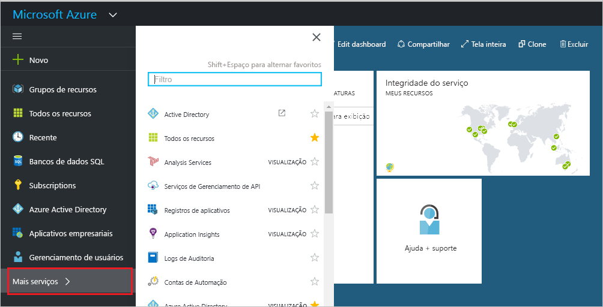
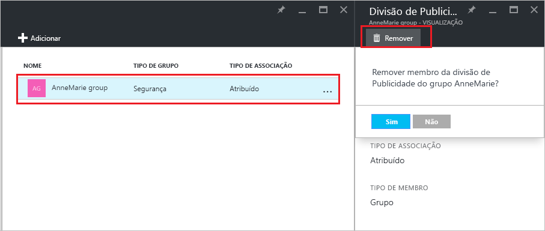

# Gerenciar a quais grupos um grupo pertence no seu locatário do Azure Active Directory
Os grupos podem conter outros grupos no Azure Active Directory. Veja como gerenciar essas associações.

## Como fazer para encontrar os grupos do qual meu grupo é um membro?
1. Entre no [centro de administração do Azure AD](https://aad.portal.azure.com) com uma conta que seja um administrador global para o diretório.
2. Selecione **Usuários e grupos**.

   
1. Selecione **Todos os grupos**.

   
1. Selecione um grupo.
2. Selecionar **Associações de grupo**.

   
1. Para adicionar seu grupo como membro de outro grupo, na folha **Grupo - Associações de grupo**, selecione o comando **Adicionar**.
2. Selecione um grupo na folha **Selecionar Grupo** e pressione o botão **Selecionar** na parte inferior da folha. Você só pode adicionar o grupo a um grupo por vez. A caixa **Usuário** filtra a exibição com base na correspondência de sua entrada com qualquer parte de um nome de usuário ou dispositivo. Caracteres curinga não são aceitos nessa caixa.

   
8. Para remover seu grupo como um membro de outro grupo, na folha **Grupo - Associações de grupo** , escolha um grupo.
9. Selecione o comando **Remover** e confirme sua escolha no prompt.

   
10. Quando terminar de alterar as associações de grupo para o grupo, escolha **Salvar**.

## Informações adicionais
Esses artigos fornecem mais informações sobre o Active Directory do Azure.

* [Ver grupos existentes](active-directory-groups-view-azure-portal.md)
* [Criar um novo grupo e adicionando membros](active-directory-groups-create-azure-portal.md)
* [Gerenciar configurações de um grupo](active-directory-groups-settings-azure-portal.md)
* [Gerenciar membros de um grupo](active-directory-groups-members-azure-portal.md)
* [Gerenciar regras dinâmicas para usuários em um grupo](../users-groups-roles/groups-dynamic-membership.md)
