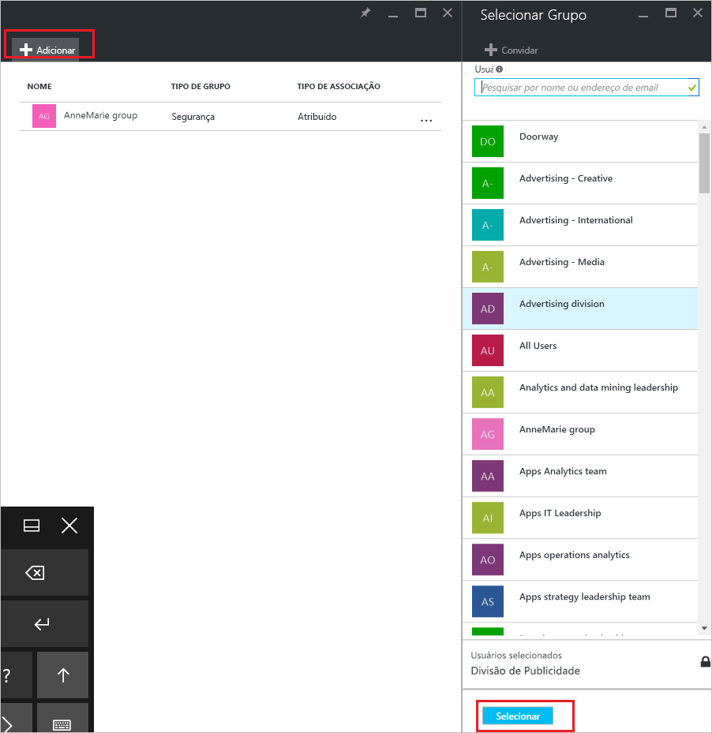
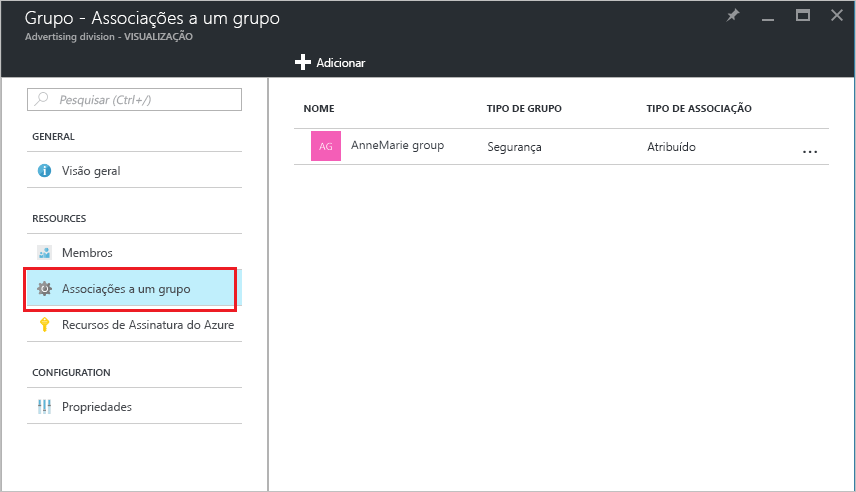

# Como adicionar ou remover um grupo de outro grupo usando o Azure Active Directory
Este artigo explica como adicionar e remover um grupo de outro grupo usando o Azure Active Directory.

>[!Note]
>Se você estiver tentando excluir o grupo pai, consulte [Como atualizar ou excluir um grupo e seus membros](active-directory-groups-delete-group.md).

## Adicionar um grupo como membro a outro grupo
É possível adicionar um grupo existente a outro grupo existente, criando um grupo de membros (subgrupo) e um grupo pai. O grupo de membros herda os atributos e propriedades do grupo pai, economizando tempo de configuração.

### Para adicionar um grupo como membro a outro grupo

1. Entre no [portal do Azure](https://portal.azure.com) usando uma conta de administrador Global para o diretório.

2. Selecione **Azure Active Directory** e, em seguida, selecione **Grupos**.

3. Na página **Grupos - Todos os grupos**, pesquise e selecione o grupo que se tornará membro de outro grupo. Para esse exercício estamos usando o grupo **Política de MDM - Oeste**.

    >[!Note]
    >Você pode adicionar seu grupo como membro a apenas um grupo de cada vez. Além disso, a caixa **Selecionar Grupo** filtra a exibição com base na correspondência de sua entrada para qualquer parte de um usuário ou nome do dispositivo. Porém, não há suporte para caracteres curinga.

    

4. Na página **Política de MDM - Oeste - Associações de grupo**, selecione **Associações de grupo**, selecione **Adicionar**, localize o grupo no qual você quer que seu grupo seja membro e, em seguida, escolha **Selecionar**. Para esse exercício, estamos usando o grupo **Política de MDM - Toda org**.

    O grupo **Política de MDM - Oeste** agora é membro da **Política de MDM - Toda org.**, herdando todas as propriedades e configurações do grupo Política de MDM - Toda org.

    

5. Revise a página **Política de MDM - Oeste - Associações de grupo** para ver o relacionamento entre o grupo e o membro.

    

6. Para uma exibição mais detalhada da relação de membro e grupo, selecione o nome do grupo (**Política de MDM - Toda org.**) e dê uma olhada nos detalhes da página **Política de MDM - Oeste**.

    

## Remover um grupo de membros de outro grupo
É possível remover um grupo de membros existente de outro grupo. No entanto, remover a associação também remove atributos e propriedades herdados de seus usuários.

### Para remover um grupo de membros de outro grupo
1. Na página **Grupos - Todos os grupos**, pesquise e selecione o grupo que será removido como membro de outro grupo. Para esse exercício, estamos novamente usando o grupo **Política de MDM - Oeste**.

2. Na página de **Visão geral da Política de MDM - Oeste**, selecione **Associações de grupo**.

    

3. Selecione o grupo **Política de MDM - Toda org.** na página **Política de MDM - Oeste - Associações de grupo** e, em seguida, selecione **Remover** dos detalhes da página **Política de MDM - Oeste**.

    

## Informações adicionais
Esses artigos fornecem mais informações sobre o Active Directory do Azure.

- [Exibir grupos e membros](active-directory-groups-view-azure-portal.md)

- [Criar um grupo básico e adicionar membros](active-directory-groups-create-azure-portal.md)

- [Adicionar ou remover membros de um grupo](active-directory-groups-members-azure-portal.md)

- [Editar as configurações de grupo](active-directory-groups-settings-azure-portal.md)

- [Atribuir licenças a usuários por grupo](../users-groups-roles/licensing-groups-assign.md)
