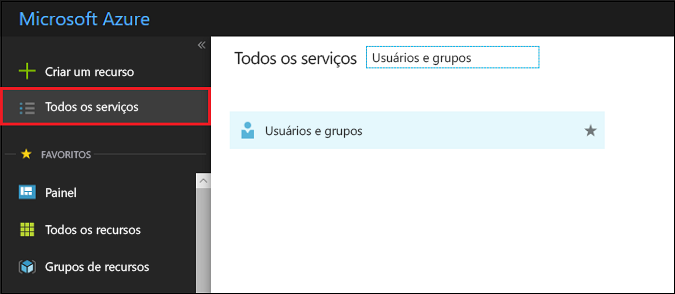
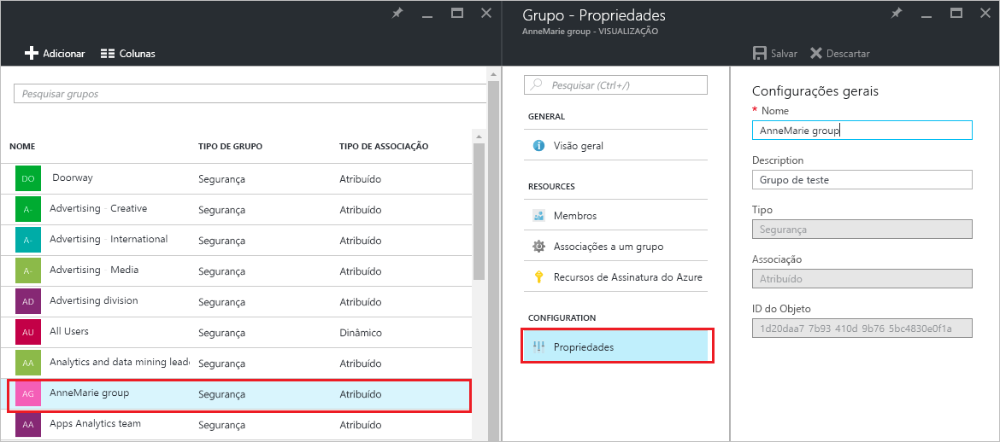
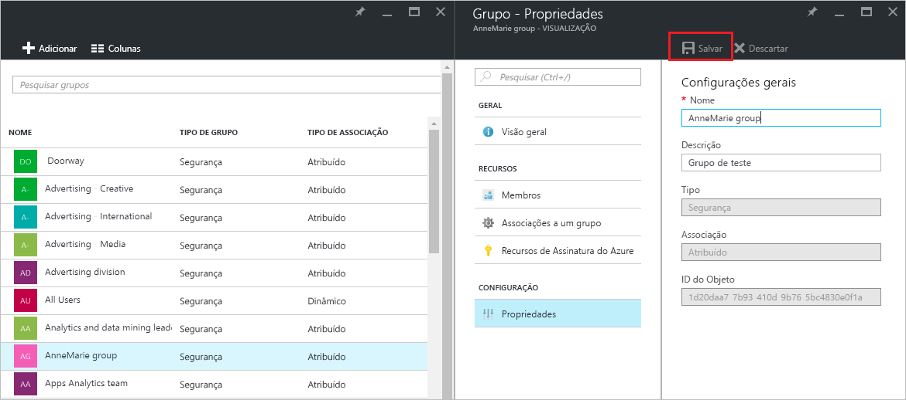

# Gerenciar as configurações para um grupo no Azure Active Directory
Este artigo explica como alterar as configurações de um grupo no Azure AD (Azure Active Directory).

## Como localizo e altero as configurações?
1. Entre no [centro de administração do Azure AD](https://aad.portal.azure.com) com uma conta que seja um administrador global para o diretório.
2. Selecione **Todos os serviços**, insira **Usuários e grupos** na caixa de texto e, em seguida, selecione **Enter**.

   
3. Na folha **Usuários e grupos**, escolha **Todos os grupos**.

   
4. Na folha **Usuários e grupos - Todos os grupos** , escolha um grupo.
5. Na folha **Grupo – *nomedogrupo*** , escolha **Propriedades**.

   
6. Quando terminar de alterar as propriedades do grupo, escolha **Salvar**.    

   

## Próximas etapas
Esses artigos fornecem mais informações sobre o Active Directory do Azure.

* [Ver grupos existentes](active-directory-groups-view-azure-portal.md)
* [Criar um novo grupo e adicionando membros](active-directory-groups-create-azure-portal.md)
* [Gerenciar membros de um grupo](active-directory-groups-members-azure-portal.md)
* [Gerenciar associações de um grupo](active-directory-groups-membership-azure-portal.md)
* [Gerenciar regras dinâmicas para usuários em um grupo](../users-groups-roles/groups-dynamic-membership.md)
