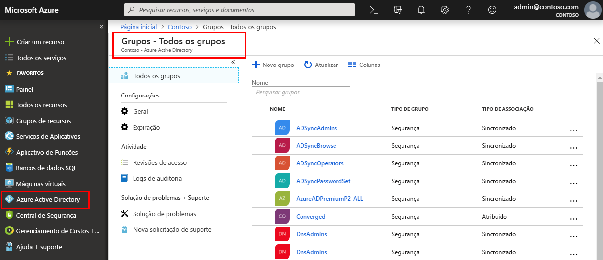

<!--As a brand-new Azure AD administrator, I need to view my organization’s groups along with the assigned members, so I can manage permissions to apps and services for people in my organization-->

# Início Rápido: Exibir os grupos e membros da sua organização no Azure Active Directory
Você pode exibir os grupos e membros do grupo existentes da sua organização usando o portal do Azure. Grupos são usados para gerenciar usuários (membros) que precisam ter todos o mesmo acesso e as mesmas permissões para aplicativos e serviços potencialmente restritos.

Neste início rápido, você vai exibir todos os grupos existentes de sua organização e os membros atribuídos.

Se você não tiver uma assinatura do Azure, crie uma [conta gratuita](https://azure.microsoft.com/free/) antes de começar. 

## Pré-requisitos
Antes de começar, você precisará:

- Criar um locatário do Azure Active Directory. Para obter mais informações, veja [Acessar o portal do Azure Active Directory e criar um novo locatário](active-directory-access-create-new-tenant.md).

## Entre no Portal do Azure
Você deve entrar no [portal do Azure](https://portal.azure.com/) usando uma conta de administrador global para o diretório.

## Criar um novo grupo 
Criar um novo grupo chamado _Política do MDM – Oeste_. Para obter mais informações sobre como criar um grupo, veja [Como criar um grupo básico e adicionar membros](active-directory-groups-create-azure-portal.md).

1. Selecione **Azure Active Directory**, **Grupos** e selecione **Novo grupo**.

2. Conclua a página **Grupo**:
    
    - **Tipo de grupo:** selecione **Segurança**
    
    - **Nome do grupo:** Digite _Política de MDM – Oeste_
    
    - **Tipo de associação:** Selecione **Atribuído**.

3. Selecione **Criar**.

## Criar um novo usuário
Criar um novo usuário denominado _Alain Charon_. Um usuário deve existir antes de ser adicionado como membro do grupo. Para obter mais informações sobre como criar um usuário, veja [Como adicionar ou excluir usuários](add-users-azure-active-directory.md).

1. Selecione **Azure Active Directory**, **Usuários** e selecione **Novo usuário**.

2. Conclua a página **usuário**:

    - **Nome:** Digite _Alain Charon_.

    - **Nome de usuário:** Digite *alain\@contoso.com*.

3. Copie a senha gerada automaticamente fornecida na caixa **Senha** e, em seguida, selecione **Criar**.

## Adicionar um membro do grupo
Agora que você tem um grupo e um usuário, pode adicionar _Alain Charon_ como um membro ao grupo _Política do MDM – Oeste_. Para obter mais informações sobre como adicionar membros do grupo, veja [Como adicionar ou remover membros do grupo](active-directory-groups-members-azure-portal.md).

1. Selecione **Azure Active Directory** > **Grupos**.

2. Na página **Grupos – Todos os grupos**, pesquise e selecione o grupo **Política do MDM – Oeste**.

3. Na página **Política do MDM – Visão geral do Oeste**, selecione **membros** na área **Gerenciar**.

4. Selecione **Adicionar membros** e pesquise e selecione **Alain Charon**.

5. Escolha **Selecionar**.

## Exibir todos os grupos
Você pode ver todos os grupos para a sua organização na página **Grupos – Todos os grupos** do portal do Azure.

- Selecionar Azure **Active Directory** > **Grupos**.

    A página **Grupos – Todos os grupos** é exibida mostrando todos os grupos do Active Directory.

    

## Pesquisar o grupo
Pesquise a página **Grupos – Todos os grupos** para encontrar o grupo **Política do MDM – Oeste**.

1. Na página **Grupos – Todos os grupos**, digite _MDM_ na caixa **Pesquisa**.

    Os resultados da pesquisa são exibidos na caixa **Pesquisa**, incluindo o grupo _Política do MDM – Oeste_.

    

3. Selecionar o grupo **Política do MDM – Oeste**.

4. Exiba as informações de grupo na página **Política do MDM – Visão Geral do Oeste**, incluindo o número de membros desse grupo.

    

## Exibir membros do grupo
Agora que você encontrou o grupo, pode exibir todos os membros atribuídos.

- Selecione **Membros** na área **Gerenciar** e, em seguida, examine a lista completa de nomes de membros atribuídos a esse grupo específico, incluindo _Alain Charon_.

    

## Limpar recursos
Esse grupo é usado em vários dos processos de instruções disponíveis na seção **Guias de instruções** desta documentação. No entanto, se você preferir não usar esse grupo, poderá excluir ele e seus membros atribuídos usando as seguintes etapas:

1. Na página **Grupos – todos os grupos**, pesquise o grupo **Política do MDM – Oeste**.

2.  Selecionar o grupo **Política do MDM – Oeste**.

    A página **Política do MDM – Visão Geral do Oeste** é exibida.

3. Selecione **Excluir**.

    O grupo e seus membros associados são excluídos.

    

    >[!Important]
    >Isso não exclui o usuário Alain Charon, apenas sua associação no grupo excluído.

## Próximas etapas
Avance para o próximo artigo para saber como associar uma assinatura do seu diretório do Azure AD.

> [!div class="nextstepaction"]
> [Associar uma assinatura do Azure](active-directory-how-subscriptions-associated-directory.md)
