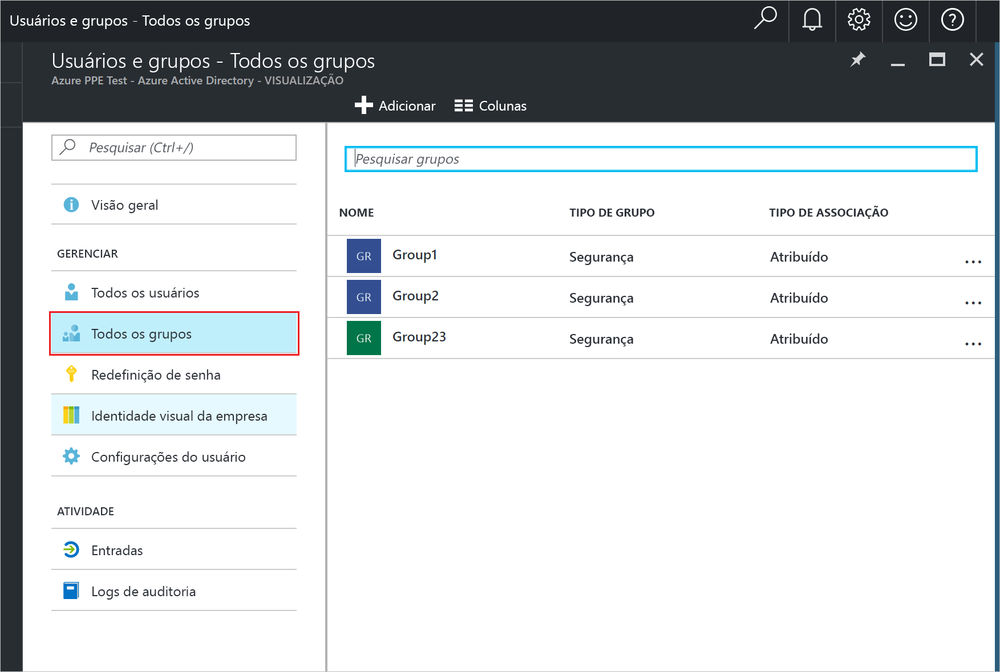

# Ver ou procurar seus grupos de usuários no Azure Active Directory
Este artigo explica como exibir os grupos no Azure AD (Azure Active Directory). Um dos recursos de gerenciamento de usuário do Azure AD é que você pode usar grupos para realizar tarefas de gerenciamento, como a atribuição de permissões ou licenças para um número de usuários de uma só vez.

## Como vejo todos os grupos?
1. Entre no [Portal do Azure](https://portal.azure.com) com uma conta que seja um administrador global do diretório.
2. Selecione **Todos os serviços**, insira **Usuários e grupos** na caixa de texto e, em seguida, selecione **Enter**.

   
3. Na folha **Usuários e grupos**, escolha **Todos os grupos**.

   
4. Na folha **Usuários e grupos - Todos os grupos** , é possível adicionar ou remover colunas de exibição, filtrar a lista para procurar um grupo ou fazer alterações em grupos para os quais você tem permissões suficientes para alterar.

## Próximas etapas
Esses artigos fornecem mais informações sobre o Active Directory do Azure.

* [Ver grupos existentes](active-directory-groups-view-azure-portal.md)
* [Criar um novo grupo e adicionando membros](active-directory-groups-create-azure-portal.md)
* [Gerenciar configurações de um grupo](active-directory-groups-settings-azure-portal.md)
* [Gerenciar membros de um grupo](active-directory-groups-members-azure-portal.md)
* [Gerenciar associações de um grupo](active-directory-groups-membership-azure-portal.md)
* [Gerenciar regras dinâmicas para usuários em um grupo](../users-groups-roles/groups-dynamic-membership.md)
