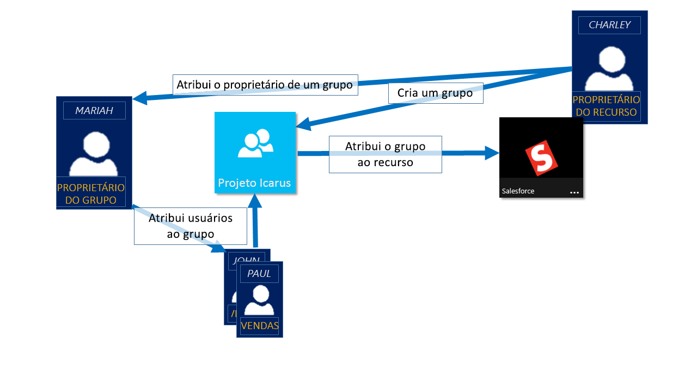
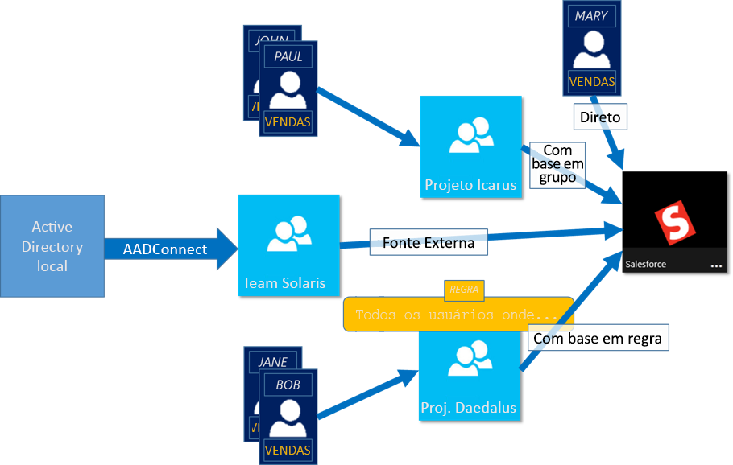

# Saiba mais sobre o gerenciamento de acesso usando grupos do Azure Active Directory
O Azure Active Directory (Azure AD) ajuda você a gerenciar aplicativos baseados em nuvem, aplicativos locais e recursos usando grupos da sua organização. Os recursos podem fazer parte do diretório, como permissões para gerenciar objetos por meio de funções no diretório, ou ser externos ao diretório, como aplicativos SaaS (Software como Serviço), serviços do Azure, sites do SharePoint, bem em recursos locais.

>[!NOTE]
>Para usar o Active Directory do Azure, você precisa de uma conta do Azure. Se você ainda não tem uma conta, você pode [inscrever-se para uma conta gratuita do Azure](https://azure.microsoft.com/free/).

## Como acessar o gerenciamento de trabalho do Azure AD?
O Azure AD ajuda a dar acesso aos recursos da sua organização fornecendo direitos de acesso a um único usuário ou a um grupo do Azure AD inteiro. Usar grupos permite que o recurso proprietário (ou proprietário de diretório do Azure AD), atribua um conjunto de permissões de acesso a todos os membros do grupo, em vez de precisar fornecer os direitos um por um. O proprietário do recurso ou diretório também pode conceder direitos de gerenciamento da lista de membros a outra pessoa, como um gerente de departamento ou um administrador de assistência técnica, permitindo à pessoa adicionar e remover membros, conforme necessário. Para obter mais informações sobre como gerenciar proprietários do grupo, veja [Gerenciar proprietários do grupo](active-directory-accessmanagement-managing-group-owners.md)

## Maneiras de atribuir direitos de acesso
Há quatro maneiras de atribuir direitos de acesso a recursos aos seus usuários:

- **Atribuição direta.** O proprietário do recurso atribui diretamente o usuário ao recurso.

- **Atribuição de grupo.** O proprietário do recurso atribui um grupo do Azure AD ao recurso, que fornece automaticamente a todos os membros do grupo acesso ao recurso. A associação de grupo é gerenciada pelo proprietário do grupo e pelo proprietário do recurso, permitindo que o proprietário adicione ou remova membros do grupo. Para obter mais informações sobre como adicionar ou remover a associação de grupo, veja [Como adicionar ou remover um grupo de outro grupo usando o portal do Azure Active Directory](active-directory-groups-membership-azure-portal.md). 

- **Atribuição baseada em regra.** O proprietário do recurso cria um grupo e usa uma regra para definir quais usuários são atribuídos a um recurso específico. A regra é baseada em atributos designados a usuários individuais. O proprietário do recurso gerencia a regra, determinando quais atributos e valores são necessários para permitir o acesso ao recurso. Para obter mais informações, consulte [Criar um grupo dinâmico e verificar o status](../users-groups-roles/groups-create-rule.md).

    Você também pode assistir a este breve vídeo para obter uma explicação rápida sobre como criar e usar grupos dinâmicos:

    >[!VIDEO https://channel9.msdn.com/Series/Azure-Active-Directory-Videos-Demos/Azure-AD--Introduction-to-Dynamic-Memberships-for-Groups/player]

- **Atribuição de autoridade externa.** Acesso proveniente de uma fonte externa, como um diretório local ou um aplicativo SaaS. Nessa situação, o proprietário do recurso atribui um grupo para fornecer acesso ao recurso e, em seguida, a fonte externa gerencia os membros do grupo.

   

## Os usuários podem ingressar em grupos sem serem atribuídos?
O proprietário do grupo pode permitir que os usuários localizem seus próprios grupos para ingressar, em vez de atribuí-los. O proprietário também pode configurar o grupo para aceitar automaticamente todos os usuários que entram ou exigir aprovação.

Depois que um usuário solicitar o ingresso em um grupo, a solicitação será encaminhada para o proprietário do grupo. Se ela for necessária, o proprietário poderá aprovar a solicitação e o usuário será notificado sobre a associação de grupo. No entanto, se você tiver vários proprietários e um deles não aprovar, o usuário será notificado, mas não será adicionado ao grupo. Para obter mais informações e instruções sobre como permitir que os usuários solicitem o ingresso em grupos, veja [Configurar o Azure AD para que os usuários possam solicitar o ingresso em grupos](../users-groups-roles/groups-self-service-management.md)

## Próximas etapas
Agora que você tem algum conhecimento de gerenciamento de acesso usando grupos, começará a gerenciar seus aplicativos e recursos.

- [Criar um novo grupo usando o Azure Active Directory](active-directory-groups-create-azure-portal.md) ou [Criar e gerenciar um novo grupo usando cmdlets do PowerShell](../users-groups-roles/groups-settings-v2-cmdlets.md)

- [Usar grupos para atribuir acesso a um aplicativo SaaS integrado](../users-groups-roles/groups-saasapps.md)

- [Sincronizar um grupo local ao Azure usando o Azure AD Connect](../hybrid/whatis-hybrid-identity.md)