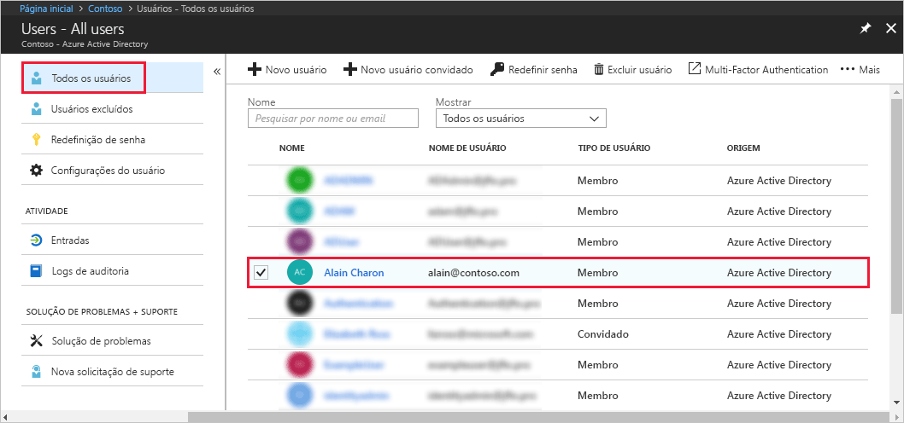
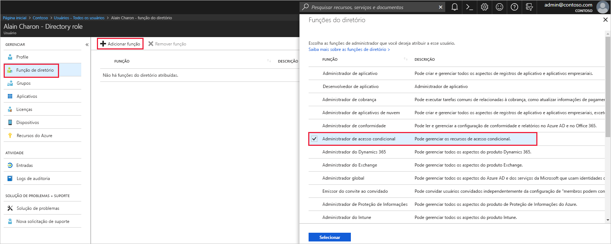

# Atribuir um usuário às funções de administrador no Azure Active Directory
Este artigo explica como atribuir uma função administrativa a um usuário no Azure AD (Azure Active Directory). Para obter informações sobre como adicionar novos usuários em sua organização, consulte [Adicionar novos usuários ao Azure Active Directory](../add-users-azure-active-directory.md). Os usuários adicionados não têm permissões de administrador, mas você pode atribuir funções a eles a qualquer momento.

## Atribuir uma função a um usuário
1. Entre no [portal do Azure](https://portal.azure.com) com uma conta que seja um administrador global ou um administrador de funções com privilégios do diretório.

2. Selecione **Azure Active Directory**, selecione **Usuários** e então selecione um usuário específico na lista.

    

3. Para o usuário selecionado, selecione **Função do diretório**, selecione **Adicionar função** e então selecione as funções de administrador apropriadas na lista **Funções de diretório**, como  **Administrador de acesso condicional**. Para saber mais sobre as funções de usuário e administrador, veja [Como atribuir funções de administrador no Azure AD](../users-groups-roles/directory-assign-admin-roles.md). 

    

1. Pressione **Selecionar** para salvar.

## Próximas etapas
* [Início rápido: Adicionar ou excluir usuários no Azure Active Directory](add-users-azure-active-directory.md)
* [Gerenciar perfis de usuário](active-directory-users-profile-azure-portal.md)
* [Adicionar usuários convidados de outro diretório](../b2b/what-is-b2b.md) 
* [Atribuir um usuário a uma função no Azure AD](active-directory-users-assign-role-azure-portal.md)
* [Restaurar um usuário excluído](active-directory-users-restore.md)
