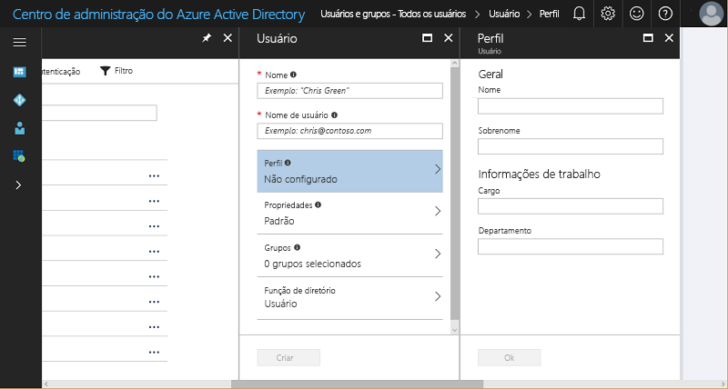
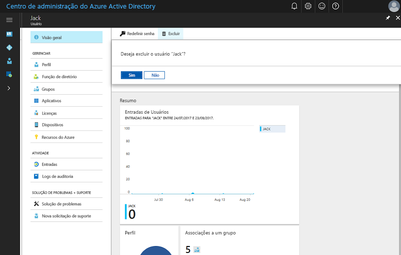

# Início rápido: adicionar novos usuários ao Azure Active Directory
Este artigo explica como usuários em sua organização podem ser excluídos do locatário do Azure AD (Azure Active Directory) dessa organização ou adicionados a ele, usando o Portal do Azure ou sincronizando os dados da conta de usuário do Windows Server AD local. 

## Adicionar usuários baseados em nuvem
1. Entre no [Centro de administração do Azure Active Directory](https://aad.portal.azure.com) com uma conta que seja um administrador global do diretório.
2. Selecione **Azure Active Directory** e, em seguida, **Usuários e grupos**.
3. Em **Usuários e grupos**, selecione **Todos os usuários** e, em seguida, selecione **Novo usuário**.
   
4. Insira os detalhes do usuário, como **Nome** e **Nome de usuário**. A parte de nome de domínio do nome de usuário deve ser o nome de domínio padrão inicial "[nome de domínio].onmicrosoft.com" ou um [nome de domínio personalizado](add-custom-domain.md) verificado e não federado, como "contoso.com".
5. Copie ou anote a senha de usuário gerada para que você possa fornecê-la ao usuário depois que esse processo estiver concluído.
6. Opcionalmente, você pode abrir e preencher as informações em **Perfil**, **Grupos** ou **Função do diretório** para o usuário. Para obter mais informações sobre funções de usuário e administrador, consulte [Atribuindo funções de administrador no Azure AD](../users-groups-roles/directory-assign-admin-roles.md).
7. Em **Usuário**, selecione **Criar**.
8. Distribua com segurança a senha gerada para o novo usuário para que ele possa entrar.

> [!TIP]
> Você também pode sincronizar dados de conta de usuário do Windows Server AD local. As soluções de identidade da Microsoft abrangem locais e recursos baseados em nuvem, criando uma identidade de usuário único para autenticação e autorização em todos os recursos, independentemente do local. Chamamos isso de Identidade Híbrida. O [Azure AD Connect](https://docs.microsoft.com/azure/active-directory/connect/active-directory-aadconnect) pode ser usado para integrar seus diretórios locais ao Azure Active Directory para cenários de identidade híbrida. Isso permite que você forneça uma identidade comum para os usuários dos aplicativos do Office 365, Azure e SaaS integrados ao AD do Azure. 

## Excluir usuários do Azure AD
1. Entre no [Centro de administração do Azure Active Directory](https://aad.portal.azure.com) com uma conta que seja um administrador global do diretório.
2. Selecione **Usuários e grupos**.
3. Na folha **Usuários e grupos**, selecione o usuário a ser excluído na lista. 
4. Na folha para o usuário selecionado, escolha **Visão geral** e, na barra de comandos, escolha **Excluir**.
   

### Saiba mais 
* [Adicionar usuários convidados de outro diretório](../b2b/what-is-b2b.md) 
* [Atribuir um usuário a uma função no Azure AD](active-directory-users-assign-role-azure-portal.md)
* [Gerenciar perfis de usuário](active-directory-users-profile-azure-portal.md)
* [Restaurar um usuário excluído](active-directory-users-restore.md)

## Próximas etapas
Neste guia de início rápido, você aprendeu como adicionar novos usuários ao Azure AD Premium. 

Você pode usar o link a seguir para criar um novo usuário no Azure AD usando o portal do Azure.

>[!div class="nextstepaction"]
>[Adicionar usuários ao Azure AD](https://aad.portal.azure.com/#blade/Microsoft_AAD_IAM/UserManagementMenuBlade/)