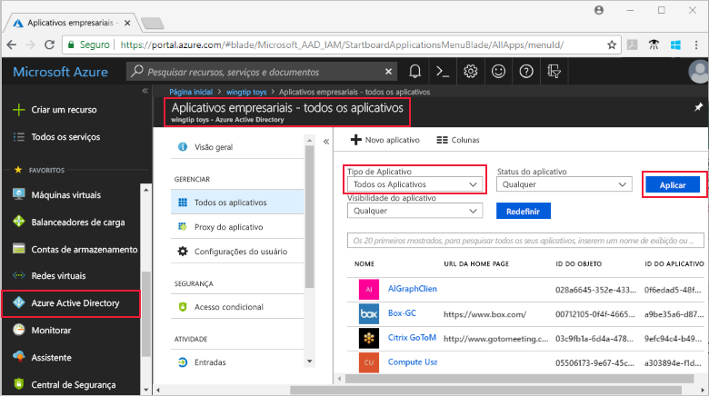
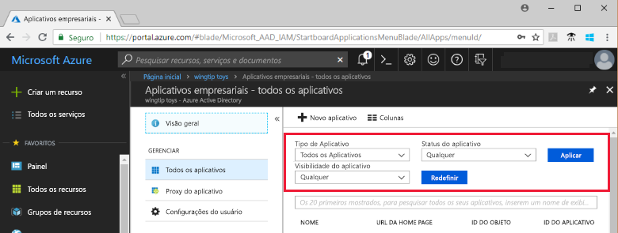
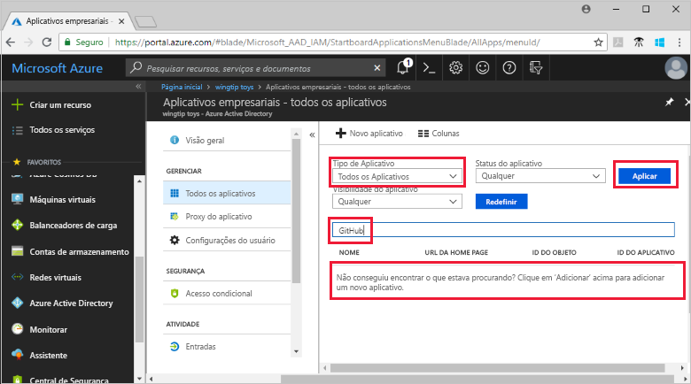

# Exibir seus aplicativos de locatário do Azure Active Directory

Este início rápido usa o portal do Azure para exibir os aplicativos em seu locatário do Azure AD (Azure Active Directory).

## Antes de começar

Para ver os resultados, você precisa ter pelo menos um aplicativo em seu locatário do Azure AD. Para adicionar um aplicativo, consulte o início rápido [Adicionar um aplicativo](add-application-portal.md).

Entre no [portal do Azure](https://portal.azure.com) como administrador global do locatário do Azure AD, administrador do aplicativo de nuvem ou administrador do aplicativo.

## Encontrar a lista de aplicativos de locatário

Seus aplicativos de locatário do Azure AD ficam visíveis na seção **Aplicativos empresariais** do portal do Azure.

Para localizar seus aplicativos de locatário:

1. No **[portal do Azure](https://portal.azure.com)**, no painel de navegação à esquerda, clique em **Azure Active Directory**. 

2. Na folha do Azure Active Directory, clique em **Aplicativos empresariais**. 

3. No menu suspenso **Tipo de Aplicativo**, selecione **Todos os Aplicativos**e clique em **Aplicar**. Uma amostra aleatória de seus aplicativos de locatário é exibida.

    
   
4. Para exibir mais aplicativos, clique em **Mostrar mais** na parte inferior da lista. Dependendo do número de aplicativos em seu locatário, poderá ser mais fácil [pesquisar determinado aplicativo](#search-for-a-tenant-application) em vez de percorrer a lista.

## Selecionar opções de exibição

Nesta seção, selecione as opções de acordo com o que você está procurando.

1. Você pode exibir os aplicativos de acordo com as opções de **Tipo de Aplicativo**, **Status do Aplicativo** e **Visibilidade do Aplicativo**. 

    

2. Em **Tipo de Aplicativo**, escolha uma destas opções:

    - **Aplicativos Empresariais** mostra os aplicativos que não são da Microsoft.
    - **Aplicativos da Microsoft** mostra aplicativos da Microsoft.
    - **Todos os aplicativos** mostra aplicativos da Microsoft e de outros.

3. Em **Status do Aplicativo**, escolha **Qualquer um**, **Desabilitado** ou **Habilitado**. A opção **Qualquer um** inclui aplicativos habilitados e desabilitados.

4. Em **Visibilidade do Aplicativo**, escolha **Qualquer um** ou **Oculto**. A opção **Oculto** mostra os aplicativos que estão no locatário, mas não estão visíveis para os usuários.

5. Depois de escolher as opções desejadas, clique em **Aplicar**.
 

## Pesquisar um aplicativo de locatário

Para procurar um aplicativo específico:

1. No menu **Tipo de Aplicativo**, selecione **Todos os aplicativos**e clique em **Aplicar**.

2. Insira o nome do aplicativo que você deseja encontrar. Se o aplicativo tiver sido adicionado ao locatário do Azure AD, ele será exibido nos resultados da pesquisa. Este exemplo mostra que o GitHub não foi adicionado aos aplicativos de locatário.

    

3. Tente inserir as primeiras letras do nome de um aplicativo.  Este exemplo mostra todos os aplicativos que começam com **Vendas**.

    

## Próximas etapas

Neste início rápido, você aprendeu a exibir os aplicativos em seu locatário do Azure AD e a filtrar a lista de aplicativos por tipo de aplicativo, status e visibilidade. Você também aprendeu a procurar determinado aplicativo.

Agora que você localizou o aplicativo que estava procurando, pode continuar a [Adicionar mais aplicativos a seu locatário](add-application-portal.md) ou clicar no aplicativo para exibir ou editar propriedades e opções de configuração. Por exemplo, você pode configurar o logon único. 

> [!div class="nextstepaction"]
> [Configurar Logon Único](configure-single-sign-on-portal.md)

