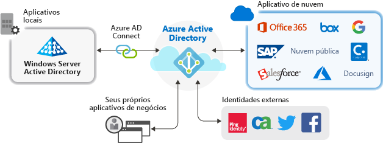

# Gerenciamento de aplicativo com o Azure Active Directory

O Azure AD (Azure Active Directory) oferece acesso seguro e simples à nuvem e a aplicativos locais. Os usuários podem entrar uma vez para acessar o Office 365 e outros aplicativos de negócios da Microsoft, aplicativos SaaS (software como serviço), aplicativos locais e aplicativos de LOB (linha de negócios). Reduza os custos administrativos automatizando o provisionamento de usuários. Use a autenticação multifator e as políticas de acesso condicional para oferecer acesso seguro aos aplicativos.

## Por que gerenciar aplicativos com uma solução de nuvem?

Geralmente, as organizações têm centenas de aplicativos que os usuários precisam para trabalhar. Os usuários acessam esses aplicativos em vários dispositivos e locais. Novos aplicativos são adicionados, desenvolvidos e publicados todos os dias. Com tantos aplicativos e pontos de acesso, é mais importante do que nunca usar uma solução baseada em nuvem para gerenciar o acesso dos usuários a todos os aplicativos.

## Gerenciar os riscos com as políticas de acesso condicional
Combinar o SSO (logon único) do Azure AD com as políticas de acesso condicional aumenta a segurança no acesso aos aplicativos. As funcionalidades de segurança incluem a proteção de identidade em escala de nuvem, o controle de acesso baseado em risco, a autenticação multifator nativa e as políticas de acesso condicional. Essas funcionalidades permitem ter um controle granular das políticas baseadas em aplicativos ou em grupos que precisam de mais segurança.

## Aumentar a produtividade com o logon único
Habilitar o SSO (logon único) em todos os aplicativos e no Office 365 aprimora a experiência de logon para os usuários atuais ao reduzir ou eliminar as solicitações de entrada. O ambiente do usuário parece mais coeso e há menos distração sem as várias solicitações ou a necessidade de gerenciar diversas senhas. O grupo de negócios pode gerenciar e aprovar o acesso por meio de uma associação dinâmica de autoatendimento. Permitir que as pessoas certas na empresa gerenciem o acesso a um aplicativo aumenta a segurança do sistema de identidade.

O SSO melhora a segurança. *Sem o logon único*, os administradores precisam criar e atualizar as contas de usuário para cada aplicativo individual, o que leva tempo. Além disso, os usuários precisam controlar várias credenciais para acessar seus aplicativos. Dessa maneira, os usuários tendem a anotar suas senhas ou usar outras soluções de gerenciamento de senhas que apresentam riscos de segurança de dados. 

## Abordar a governança e a conformidade
Com o Azure AD, é possível monitorar os acessos ao aplicativo por meio de relatórios que usam as ferramentas de SIEM (gerenciamento de eventos e informações de segurança). É possível acessar os relatórios no portal ou nas APIs. Programaticamente, é possível auditar quem tem acesso aos aplicativos e remover o acesso de usuários inativos nas revisões de acesso.

## Gerenciar os custos
Ao migrar para o Azure AD, você economiza custos e elimina a dificuldade de gerenciar uma infraestrutura local. O Azure AD também oferece acesso de autoatendimento para aplicativos, o que economiza tempo para administradores e usuários. O logon único elimina as senhas específicas de aplicativo. Essa capacidade de iniciar sessão uma vez economiza custos relacionados com a redefinição de senha para aplicativos e acaba com a perda de produtividade ao recuperar senhas.

