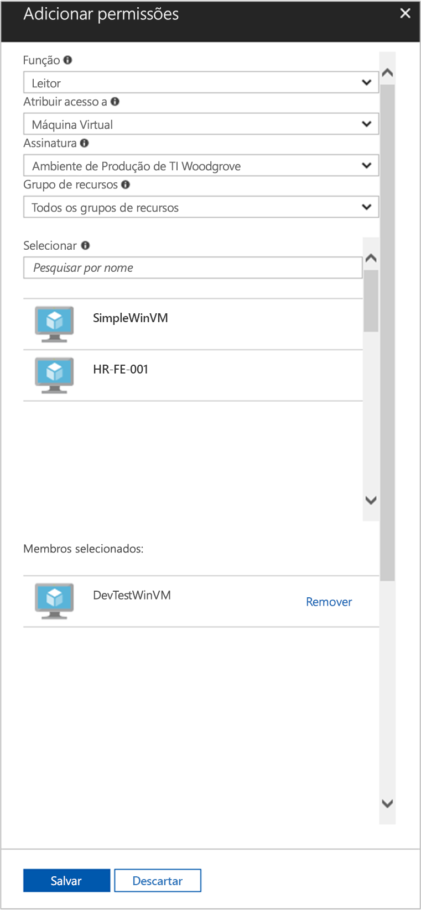

# <a name="use-a-windows-vm-system-assigned-managed-identity-to-access-resource-manager"></a>Usar uma identidade gerenciada atribuída pelo sistema da VM do Windows para acessar o Resource Manager

[!INCLUDE [preview-notice](../../../includes/active-directory-msi-preview-notice.md)]

Este início rápido mostra como acessar a API do Azure Resource Manager usando uma máquina virtual do Windows com a identidade gerenciada atribuída pelo sistema habilitada. As identidades gerenciadas para recursos do Azure são gerenciadas automaticamente pelo Azure e permitem a você autenticar os serviços que dão suporte à autenticação do Azure AD sem necessidade de inserir as credenciais em seu código. Você aprenderá como:

> [!div class="checklist"] 
> * Conceder o acesso da VM a um Grupo de Recursos no Azure Resource Manager 
> * Obter um token de acesso usando a identidade da máquina virtual e usá-la para chamar o Azure Resource Manager

## <a name="prerequisites"></a>Pré-requisitos

[!INCLUDE [msi-tut-prereqs](../../../includes/active-directory-msi-tut-prereqs.md)]

## <a name="grant-your-vm-access-to-a-resource-group-in-resource-manager"></a>Conceder acesso a um Grupo de Recursos no Azure Resource Manager para sua VM
Usando a identidades gerenciadas para recursos do Azure, seu código pode obter tokens de acesso para autenticar para recursos que oferecem suporte à autenticação do Azure AD.  O Azure Resource Manager oferece suporte à autenticação do Azure AD.  Primeiro, é preciso conceder à identidade gerenciada atribuída pelo sistema da VM acesso a um recurso no Resource Manager, neste caso, o Grupo de Recursos no qual a VM está contida.  

1.  Navegue até a guia para **Grupos de Recursos**. 
2.  Selecione o **Grupo de Recursos** específico criado para sua **VM do Windows**. 
3.  Acesse **Controle de acesso (IAM)** no painel esquerdo. 
4.  Em seguida, opte por **Adicionar atribuição de função** uma nova atribuição de função para a **VM do Windows**.  Escolha **Função** como **Leitor**. 
5.  No menu suspenso seguinte, **Atribuir acesso a** **Máquina Virtual** do recurso. 
6.  Em seguida, certifique-se de que a assinatura correta está listada na lista suspensa **Assinatura**. E para **Grupo de Recursos**, selecione **Todos os grupos de recursos**. 
7.  Por fim, em **Selecionar** escolha sua VM do Windows na lista suspensa e clique em **Salvar**.

    

## <a name="get-an-access-token-using-the-vms-system-assigned-managed-identity-and-use-it-to-call-azure-resource-manager"></a>Obter um token de acesso usando a identidade gerenciada atribuída pelo sistema da VM e usá-lo para chamar o Azure Resource Manager 

Você precisará usar o **PowerShell** nesta parte.  Se você não tiver o **PowerShell** instalado, baixe-o [aqui](https://docs.microsoft.com/powershell/azure/overview?view=azurermps-4.3.1). 

1.  No portal, navegue até **Máquinas Virtuais** e vá para a máquina virtual do Windows e em **Visão geral**, clique em **Conectar**. 
2.  Insira o seu **Nome de usuário** e **Senha** que você adicionou quando criou a VM do Windows. 
3.  Agora que você criou uma **Conexão de Área de Trabalho Remota** com a máquina virtual, abra o **PowerShell** na sessão remota. 
4.  Usando Invoke-WebRequest do Powershell, faça uma solicitação para a identidade gerenciada local para o ponto de extremidade de recursos do Azure para obter um token de acesso para o Azure Resource Manager.

    ```powershell
       $response = Invoke-WebRequest -Uri 'http://169.254.169.254/metadata/identity/oauth2/token?api-version=2018-02-01&resource=https%3A%2F%2Fmanagement.azure.com%2F' -Method GET -Headers @{Metadata="true"}
    ```
    
    > [!NOTE]
    > O valor do parâmetro "resource" deve ser uma correspondência exata para o que é esperado pelo Azure AD. Ao usar a ID de recurso do Azure Resource Manager, você deve incluir a barra à direita no URI.
    
    Em seguida, extraia a resposta completa, que é armazenada como uma cadeia de caracteres JSON (JavaScript Object Notation) formatada no objeto $response. 
    
    ```powershell
    $content = $response.Content | ConvertFrom-Json
    ```
    Em seguida, extraia o token de acesso da resposta.
    
    ```powershell
    $ArmToken = $content.access_token
    ```
    
    Por fim, chame o Azure Resource Manager usando o token de acesso. Neste exemplo, também estamos usando Invoke-WebRequest do PowerShell para fazer a chamada para o Azure Resource Manager e incluir o token de acesso no cabeçalho de Autorização.
    
    ```powershell
    (Invoke-WebRequest -Uri https://management.azure.com/subscriptions/<SUBSCRIPTION ID>/resourceGroups/<RESOURCE GROUP>?api-version=2016-06-01 -Method GET -ContentType "application/json" -Headers @{ Authorization ="Bearer $ArmToken"}).content
    ```
    > [!NOTE] 
    > A URL diferencia maiúsculas de minúsculas, portanto, verifique se você está usando letras maiúsculas e minúsculas exatamente da mesma forma que você usou anteriormente ao nomear o Grupo de Recursos e a letra maiúscula "G" em "resourceGroups".
        
    O comando a seguir retorna os detalhes do Grupo de Recursos:

    ```powershell
    {"id":"/subscriptions/98f51385-2edc-4b79-bed9-7718de4cb861/resourceGroups/DevTest","name":"DevTest","location":"westus","properties":{"provisioningState":"Succeeded"}}
    ```

## <a name="next-steps"></a>Próximas etapas

Neste início rápido, você aprendeu a usar uma identidade gerenciada atribuída pelo sistema para acessar a API do Azure Resource Manager.  Para saber mais sobre o Azure Resource Manager, confira:

> [!div class="nextstepaction"]
>[Azure Resource Manager](/azure/azure-resource-manager/resource-group-overview)

