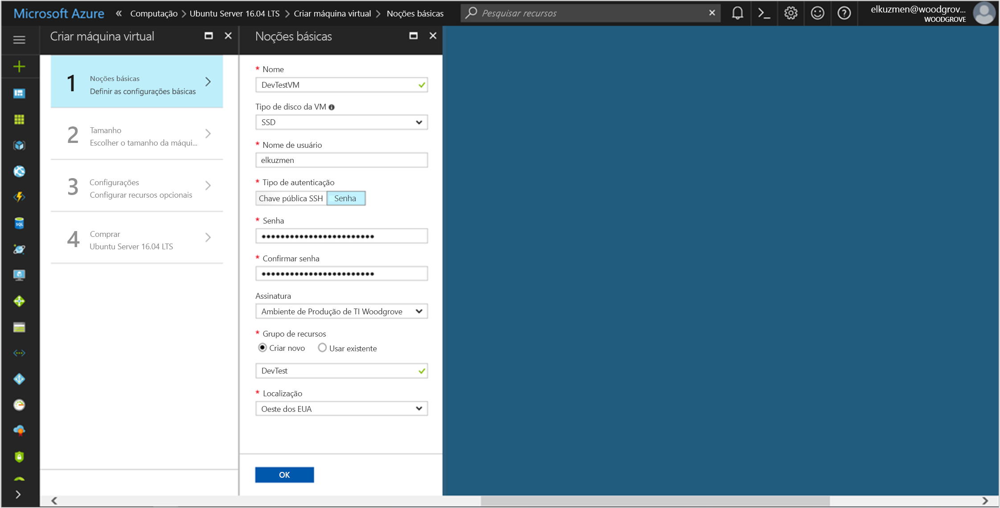

# <a name="tutorial-use-a-user-assigned-identity-on-a-linux-vm-to-access-azure-resource-manager"></a>Tutorial: Usar uma identidade atribuída pelo usuário em uma VM do Linux para acessar o Azure Resource Manager

[!INCLUDE[preview-notice](~/includes/active-directory-msi-preview-notice-ua.md)]

Este tutorial explica como criar uma identidade atribuída pelo usuário, atribuí-la a uma VM (Máquina Virtual) do Linux e, em seguida, usar essa identidade para acessar a API do Azure Resource Manager. Identidade do Serviço Gerenciado são gerenciadas automaticamente pelo Azure. Elas permitem que a autenticação para serviços compatíveis com a autenticação do Azure AD, sem a necessidade de inserir as credenciais em seu código. 

Identidade do Serviço Gerenciado são gerenciadas automaticamente pelo Azure. Elas permitem que a autenticação para serviços compatíveis com a autenticação do Azure AD, sem a necessidade de inserir as credenciais em seu código.

Você aprenderá como:

> [!div class="checklist"]
> * Criar uma identidade atribuída pelo usuário
> * Atribuir a identidade atribuída pelo usuário a uma VM do Linux 
> * Conceder o acesso atribuído pelo usuário a um grupo de recursos no Azure Resource Manager 
> * Obtenha um token de acesso usando a identidade atribuída pelo usuário e use-a para chamar o Azure Resource Manager 

## <a name="prerequisites"></a>Pré-requisitos

- Se você não estiver familiarizado com a Identidade de Serviço Gerenciada, consulte a seção de [visão geral](overview.md). **Lembre-se de analisar as [diferenças entre as identidades atribuídas pelo sistema e pelo usuário](overview.md#how-does-it-work)**.
- Se você ainda não tiver uma conta do Azure, [inscreva-se em uma conta gratuita](https://azure.microsoft.com/free/) antes de continuar.
- Para executar as etapas necessárias de criação de recursos e gerenciamento de funções neste tutorial, sua conta precisa das permissões de "Proprietário" no escopo apropriado (sua assinatura ou grupo de recursos). Caso você precise de ajuda com a atribuição de função, consulte [Usar o controle de acesso baseado em função para gerenciar o acesso aos recursos de assinatura do Azure](/azure/role-based-access-control/role-assignments-portal).

Se você optar por instalar e usar a CLI localmente, este guia de início rápido exigirá a execução da CLI do Azure versão 2.0.4 ou posterior. Execute `az --version` para encontrar a versão. Se você precisa instalar ou atualizar, consulte [Instalar a CLI 2.0 do Azure]( /cli/azure/install-azure-cli).

## <a name="sign-in-to-azure"></a>Entrar no Azure

Entre no Portal do Azure em [https://portal.azure.com](https://portal.azure.com).

## <a name="create-a-linux-virtual-machine-in-a-new-resource-group"></a>Criar uma Máquina Virtual do Linux em um novo Grupo de Recursos

Para este tutorial, você primeiro cria uma nova VM do Linux. Você também pode usar uma VM existente.

1. Clique em **Criar um recurso** no canto superior esquerdo do Portal do Azure.
2. Selecione **Computação** e, em seguida, selecione **Ubuntu Server 16.04 LTS**.
3. Insira as informações da máquina virtual. Para **Tipo de autenticação**, selecione **Chave pública SSH** ou **Senha**. As credenciais criadas permitirão que você faça logon na máquina virtual.

    

4. Escolha uma **Assinatura** para a máquina virtual na lista suspensa.
5. Para selecionar um novo **Grupo de Recursos** no qual você deseja criar a máquina virtual, escolha **Criar Novo**. Ao concluir, clique em **OK**.
6. Selecione o tamanho para a VM. Para ver mais tamanhos, selecione **Exibir todos** ou altere o filtro Tipo de disco com suporte. Na folha de configurações, mantenha os padrões e clique em **OK**.

## <a name="create-a-user-assigned-identity"></a>Criar uma identidade atribuída pelo usuário

1. Se você estiver usando o console da CLI (em vez de uma sessão do Azure Cloud Shell), comece entrando no Azure. Use uma conta que esteja associada à assinatura do Azure na qual você deseja criar a nova identidade atribuída pelo usuário:

    ```azurecli
    az login
    ```

2. Crie uma identidade atribuída pelo usuário usando [az identity create](/cli/azure/identity#az_identity_create). O parâmetro `-g` especifica o grupo de recursos no qual o MSI é criado, enquanto o parâmetro `-n` especifica seu nome. Substitua os valores de parâmetro `<RESOURCE GROUP>` e `<MSI NAME>` pelos seus próprios valores:
    
[!INCLUDE[ua-character-limit](~/includes/managed-identity-ua-character-limits.md)]


```azurecli-interactive
az identity create -g <RESOURCE GROUP> -n <MSI NAME>
```

A resposta contém detalhes para a identidade atribuída pelo usuário criada, semelhante ao exemplo a seguir. Tome nota do valor `id` para sua identidade atribuída pelo usuário, pois ela será usada na próxima etapa:

```json
{
"clientId": "73444643-8088-4d70-9532-c3a0fdc190fz",
"clientSecretUrl": "https://control-westcentralus.identity.azure.net/subscriptions/<SUBSCRIPTON ID>/resourcegroups/<RESOURCE GROUP>/providers/Microsoft.ManagedIdentity/userAssignedIdentities/<MSI NAME>/credentials?tid=5678&oid=9012&aid=12344643-8088-4d70-9532-c3a0fdc190fz",
"id": "/subscriptions/<SUBSCRIPTON ID>/resourcegroups/<RESOURCE GROUP>/providers/Microsoft.ManagedIdentity/userAssignedIdentities/<MSI NAME>",
"location": "westcentralus",
"name": "<MSI NAME>",
"principalId": "9012",
"resourceGroup": "<RESOURCE GROUP>",
"tags": {},
"tenantId": "733a8f0e-ec41-4e69-8ad8-971fc4b533bl",
"type": "Microsoft.ManagedIdentity/userAssignedIdentities"
}
```

## <a name="assign-a-user-assigned-identity-to-your-linux-vm"></a>Atribuir uma identidade atribuída pelo usuário a uma VM do Linux

Uma identidade atribuída pelo usuário pode ser usada por clientes em vários recursos do Azure. Use os comandos a seguir para atribuir a identidade atribuída pelo usuário a uma única VM. Use a propriedade `Id` retornada na etapa anterior para o valor do parâmetro `-IdentityID`.

Atribuir a MSI atribuída pelo usuário à VM do Linux usando [az vm assign-identity](/cli/azure/vm#az_vm_assign_identity). Substitua os valores de parâmetro `<RESOURCE GROUP>` e `<VM NAME>` pelos seus próprios valores. Use a propriedade `id` retornada na etapa anterior para o valor do parâmetro `--identities`.

```azurecli-interactive
az vm assign-identity -g <RESOURCE GROUP> -n <VM NAME> --identities "/subscriptions/<SUBSCRIPTION ID>/resourcegroups/<RESOURCE GROUP>/providers/Microsoft.ManagedIdentity/userAssignedIdentities/<MSI NAME>"
```

## <a name="grant-your-user-assigned-identity-access-to-a-resource-group-in-azure-resource-manager"></a>Conceder acesso à identidade atribuída pelo usuário a um grupo de recursos no Azure Resource Manager 

A MSI (Identidade de Serviço Gerenciada) fornece identidades que seu código pode usar para solicitar tokens de acesso para autenticação em APIs de recursos que dão suporte à autenticação do Microsoft Azure AD. Neste tutorial, seu código acessará a API do Azure Resource Manager.  

Antes que seu código possa acessar a API, você precisa conceder o acesso de identidade a um recurso no Azure Resource Manager. Nesse caso, o grupo de recursos no qual a VM está contida. Atualize o valor de `<SUBSCRIPTION ID>` e `<RESOURCE GROUP>` conforme apropriado para seu ambiente. Além disso, substitua `<MSI PRINCIPALID>` pela propriedade `principalId` retornada pelo comando `az identity create` em [Criar uma MSI atribuída pelo usuário](#create-a-user-assigned-msi):

```azurecli-interactive
az role assignment create --assignee <MSI PRINCIPALID> --role 'Reader' --scope "/subscriptions/<SUBSCRIPTION ID>/resourcegroups/<RESOURCE GROUP> "
```

A resposta contém detalhes para a atribuição de função criada, semelhante ao exemplo a seguir:

```json
{
  "id": "/subscriptions/<SUBSCRIPTION ID>/resourceGroups/<RESOURCE GROUP>/providers/Microsoft.Authorization/roleAssignments/b402bd74-157f-425c-bf7d-zed3a3a581ll",
  "name": "b402bd74-157f-425c-bf7d-zed3a3a581ll",
  "properties": {
    "principalId": "f5fdfdc1-ed84-4d48-8551-999fb9dedfbl",
    "roleDefinitionId": "/subscriptions/<SUBSCRIPTION ID>/providers/Microsoft.Authorization/roleDefinitions/acdd72a7-3385-48ef-bd42-f606fba81ae7",
    "scope": "/subscriptions/<SUBSCRIPTION ID>/resourceGroups/<RESOURCE GROUP>"
  },
  "resourceGroup": "<RESOURCE GROUP>",
  "type": "Microsoft.Authorization/roleAssignments"
}

```

## <a name="get-an-access-token-using-the-vms-identity-and-use-it-to-call-resource-manager"></a>Obter um token de acesso utilizando a identidade da VM e usá-la para chamar o Resource Manager 

Para o restante do tutorial, trabalharemos na VM criada anteriormente.

Para concluir essas etapas, você precisará do cliente SSH. Se você estiver usando o Windows, poderá usar o cliente SSH no [Subsistema do Windows para Linux](https://msdn.microsoft.com/commandline/wsl/about). 

1. Entre no [Portal](https://portal.azure.com) do Azure.
2. No portal, navegue até **Máquinas Virtuais** e vá para a máquina virtual do Linux e, em **Visão geral**, clique em **Conectar**. Copie a cadeia de caracteres para conectar-se à VM.
3. Conecte-se à VM com um cliente SSH de sua escolha. Se você estiver usando o Windows, poderá usar o cliente SSH no [Subsistema do Windows para Linux](https://msdn.microsoft.com/commandline/wsl/about). Se precisar de ajuda para configurar as chaves do cliente SSH, confira [Como usar chaves SSH com o Windows no Azure](~/articles/virtual-machines/linux/ssh-from-windows.md), ou [Como criar e usar um par de chaves SSH pública e privada para VMs Linux no Azure](~/articles/virtual-machines/linux/mac-create-ssh-keys.md).
4. Na janela de terminal, usando a CURL, faça uma solicitação para o ponto de extremidade do Serviço de Metadados de Instância (IMDS) do Azure para obter um token de acesso para o Azure Resource Manager.  

   A solicitação CURL para adquirir um token de acesso é mostrada no exemplo a seguir. Substitua `<CLIENT ID>` pela propriedade `clientId` retornada pelo comando `az identity create` em [Criar uma identidade atribuída pelo usuário](#create-a-user-assigned-msi): 
    
   ```bash
   curl -H Metadata:true "http://169.254.169.254/metadata/identity/oauth2/token?api-version=2018-02-01&resource=https%3A%2F%2Fmanagement.azure.com/&client_id=<MSI CLIENT ID>"   
   ```
    
    > [!NOTE]
    > O valor do parâmetro `resource` deve ser uma correspondência exata para o que é esperado pelo Azure AD. Ao usar a ID de recurso do Resource Manager, você deve incluir a barra à direita no URI. 
    
    A resposta inclui o token de acesso que você precisa para acessar o Azure Resource Manager. 
    
    Exemplo de resposta:  

    ```bash
    {
    "access_token":"eyJ0eXAiOi...",
    "refresh_token":"",
    "expires_in":"3599",
    "expires_on":"1504130527",
    "not_before":"1504126627",
    "resource":"https://management.azure.com",
    "token_type":"Bearer"
    } 
    ```

5. Use o token de acesso para acessar o Azure Resource Manager e leia as propriedades do grupo de recursos ao qual você concedeu anteriormente o acesso à identidade atribuída pelo usuário. Substitua `<SUBSCRIPTION ID>` e `<RESOURCE GROUP>` pelos valores que você especificou anteriormente e `<ACCESS TOKEN>` pelo token retornado na etapa anterior.

    > [!NOTE]
    > A URL diferencia maiúsculas de minúsculas, portanto, verifique se você usou letras maiúsculas e minúsculas exatamente da mesma forma que você usou anteriormente ao nomear o grupo de recursos, incluindo a letra maiúscula "G" em `resourceGroups`.  

    ```bash 
    curl https://management.azure.com/subscriptions/<SUBSCRIPTION ID>/resourceGroups/<RESOURCE GROUP>?api-version=2016-09-01 -H "Authorization: Bearer <ACCESS TOKEN>" 
    ```

    A resposta contém as informações de grupo de recursos específicas, semelhantes ao exemplo a seguir: 

    ```bash
    {
    "id":"/subscriptions/<SUBSCRIPTION ID>/resourceGroups/DevTest",
    "name":"DevTest",
    "location":"westus",
    "properties":{"provisioningState":"Succeeded"}
    } 
    ```
    
## <a name="next-steps"></a>Próximas etapas

Neste tutorial, você aprendeu a criar uma identidade atribuída pelo usuário e a anexá-la a uma máquina virtual do Linux para acessar a API do Azure Resource Manager.  Para saber mais sobre o Azure Resource Manager, confira:

> [!div class="nextstepaction"]
>[Azure Resource Manager](/azure/azure-resource-manager/resource-group-overview)

