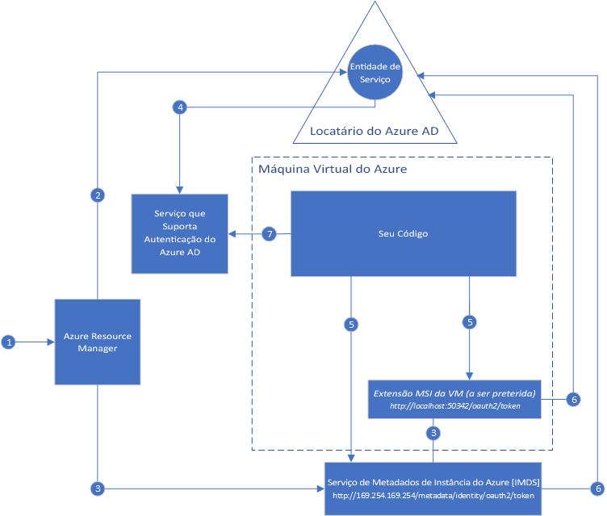

#  O que é a Identidade de Serviço Gerenciada para recursos do Azure?

[!INCLUDE[preview-notice](../../../includes/active-directory-msi-preview-notice.md)]

Um desafio comum ao criar aplicativos de nuvem é como gerenciar as credenciais que precisam estar em seu código para autenticar para serviços de nuvem. Manter essas credenciais seguras é uma tarefa importante. Idealmente, eles nunca aparecem em estações de trabalho do desenvolvedor ou são verificadas no controle do código-fonte. O Azure Key Vault fornece uma maneira de armazenar com segurança as credenciais e outras chaves e segredos, mas seu código precisa autenticar para o Key Vault para recuperá-los. A Identidade de Serviço Gerenciada torna a solução desse problema mais simples, fornecendo aos serviços do Azure uma identidade gerenciada automaticamente no Azure Active Directory (Azure AD). Você pode usar essa identidade para autenticar em qualquer serviço que dá suporte à autenticação do Azure AD, incluindo o Key Vault, sem ter que todas as credenciais no seu código.

A Identidade de Serviço Gerenciado vem com o Azure Active Directory Gratuito, que é o padrão para as assinaturas do Azure. Não há nenhum custo adicional para a Identidade de Serviço Gerenciado.

## Como ele funciona?

Há dois tipos de Identidades de Serviço Gerenciado: **Atribuída pelo Sistema** e **Atribuída pelo Usuário**.

- Uma **Identidade Atribuída pelo Sistema** é habilitada diretamente em uma instância de serviço do Microsoft Azure. Quando habilitado, o Mirosoft Azure cria uma identidade para a instância de serviço no locatário do Azure Active Directory confiado para a assinatura da instância do serviço. Depois que a identidade é criada, suas credenciais serão fornecidas para a instância do serviço. O ciclo de vida de uma identidade atribuída ao sistema está diretamente relacionado à instância de serviço do Microsoft Azure na qual está habilitado. Se a instância de serviço é excluída, o Azure limpa automaticamente as credenciais e a identidade no Azure AD.
- Uma **identidade atribuída pelo usuário** é criada como um recurso autônomo do Azure. Por meio de um processo de criação, o Microsoft Azure cria uma identidade no locatário do Azure Active Directory confiado para a assinatura sendo usada. Depois que a identidade é criada, ela pode ser atribuída a uma ou mais instâncias de serviço do Azure. O ciclo de vida de uma identidade atribuída pelo usuário é gerenciado separadamente do ciclo de vida de instâncias de serviço do Microsoft Azure a que é atribuído.

Como resultado, seu código pode usar uma identidade atribuída pelo sistema ou pelo usuário para solicitar os tokens de serviços que são compatíveis com a autenticação do Azure Active Direcotry. Enquanto isso, o Azure é responsável por reverter as credenciais usadas pela instância de serviço.

Aqui está um exemplo de como as Identidades Atribuídas pelo sistema funcionam com as Máquinas Virtuais do Azure:

1. O Azure Resource Manager recebe uma mensagem para habilitar a identidade atribuída pelo sistema em uma máquina virtual.
2. O Azure Resource Manager cria uma Entidade de Serviço no Azure AD para representar a identidade da máquina virtual. A Entidade de Serviço é criada no locatário do Azure AD que é confiável para essa assinatura.
3. O Azure Resource Manager configura a identidade na máquina virtual:
    - Atualiza o ponto de extremidade de identidade do Serviço de Metadados de Instância com a ID do cliente da Identidade de Serviço e certificado.
    - Provisiona a extensão da VM e adiciona a ID de entidade de serviço do cliente e o certificado. (será preterido)
4. Agora que a máquina virtual tem uma identidade, usamos as informações de Entidade de Serviço para conceder acesso à VM para recursos do Microsoft Azure. Por exemplo, se seu código precisa chamar o Azure Resource Manager, em seguida, você atribuiria à Entidade de Serviço da VM a função apropriada usando o controle de acesso baseado em função (RBAC) no Azure AD. Se seu código precisar chamar o Key Vault, então você concederia ao seu código o acesso ao segredo ou chave específica no Key Vault.
5. O código em execução na máquina virtual pode solicitar um token de dois pontos de extremidade que são acessíveis apenas de dentro da VM:

    - Ponto de extremidade de identidade do Serviço de Metadados de Instância (IMDS) do Microsoft Azure: http://169.254.169.254/metadata/identity/oauth2/token (recomendado)
        - O parâmetro de recurso especifica o serviço ao qual o token é enviado. Por exemplo, se você quiser que seu código autentique para o Azure Resource Manager, você usaria resource=https://management.azure.com/.
        - O parâmetro de versão de API Especifica a versão IMDS, use a versão da API = 2018-02-01 ou superior.
    - Ponto de extremidade de extensão de VM http://localhost:50342/oauth2/token(a ser preterido)
        - O parâmetro de recurso especifica o serviço ao qual o token é enviado. Por exemplo, se você quiser que seu código autentique para o Azure Resource Manager, você usaria resource=https://management.azure.com/.

6. A chamada é feita ao Azure Active Directory solicitando acesso ao token conforme especificado na etapa 5, usando a ID do cliente e o certificado configurado na etapa 3. O Azure AD retorna um token de acesso do JSON Web Token (JWT).
7. Seu código envia o token de acesso em uma chamada para um serviço que dá suporte à autenticação do Azure AD.

Usando o mesmo diagrama, aqui está um exemplo de como um usuário atribui trabalhos com as Máquinas Virtuais do Azure.

1. O Azure Resource Manager recebe uma mensagem para criar uma identidade atribuída pelo usuário.
2. O Azure Resource Manager cria uma entidade de serviço no Azure Active Directory para representar a identidade atribuída pelo usuário. A Entidade de Serviço é criada no locatário do Azure AD que é confiável para essa assinatura.
3. O Azure Resource Manager recebe uma solicitação para criar uma identidade atribuída pelo usuário em uma máquina virtual:
    - Atualiza o ponto de extremidade de identidade do Serviço de Metadados de Instância com a ID do cliente da Identidade do Serviço e certificado.
    - Provisiona a extensão de máquina virtual e adiciona a ID do cliente da Identidade do Serviço atribuído e certificado (a ser preterido).
4. Agora que a identidade atribuída pelo usuário foi criada, usamos as informações de Entidade de Serviço para conceder acesso aos recursos do Microsoft Azure. Por exemplo, se seu código precisa chamar o Azure Resource Manager, em seguida, você atribuiria à Entidade de Serviço da identidade atribuída pelo usuário, a função apropriada usando o controle de acesso baseado em função (RBAC) no Azure Active Directory. Se seu código precisar chamar o Key Vault, então você concederia ao seu código o acesso ao segredo ou chave específica no Key Vault. Observação: Esta etapa pode ser executada antes da etapa 3.
5. O código em execução na máquina virtual pode solicitar um token de dois pontos de extremidade que são acessíveis apenas de dentro da VM:

    - Ponto de extremidade de identidade do Serviço de Metadados de Instância (IMDS) do Microsoft Azure: http://169.254.169.254/metadata/identity/oauth2/token (recomendado)
        - O parâmetro de recurso especifica o serviço ao qual o token é enviado. Por exemplo, se você quiser que seu código autentique para o Azure Resource Manager, você usaria resource=https://management.azure.com/.
        - O parâmetro de ID de cliente especifica a identidade para a qual o token é solicitado. Isso é necessário para resolver a ambiguidade quando houver mais de um identidades de usuário atribuída em uma única máquina virtual.
        - O parâmetro de versão de API Especifica a versão IMDS, use a versão da API = 2018-02-01 ou superior.

    - Ponto de extremidade de extensão de VM http://localhost:50342/oauth2/token(a ser preterido)
        - O parâmetro de recurso especifica o serviço ao qual o token é enviado. Por exemplo, se você quiser que seu código autentique para o Azure Resource Manager, você usaria resource=https://management.azure.com/.
        - O parâmetro de ID de cliente especifica a identidade para a qual o token é solicitado. Isso é necessário para resolver a ambiguidade quando houver mais de um identidades de usuário atribuída em uma única máquina virtual.
6. A chamada é feita ao Azure Active Directory solicitando acesso ao token conforme especificado na etapa 5, usando a ID do cliente e o certificado configurado na etapa 3. O Azure AD retorna um token de acesso do JSON Web Token (JWT).
7. Seu código envia o token de acesso em uma chamada para um serviço que dá suporte à autenticação do Azure AD.
     
## Experimente a Identidade de Serviço Gerenciado

Tente um tutorial de identidade de serviço gerenciado para saber os cenários de ponta a ponta para acessar recursos do Azure diferentes:
  
| Do recurso gerenciado habilitado para identidade | Saiba como |
| ------- | -------- |
| VM do Azure (Windows) | [Acessar o Azure Data Lake Store com a identidade do serviço gerenciado da VM Windows](tutorial-windows-vm-access-datalake.md) |
|                    | [Acessar o Azure Resource Manager com uma Identidade de Serviço Gerenciado de VM do Windows](tutorial-windows-vm-access-arm.md) |
|                    | [Acessar o SQL do Azure com uma Identidade de Serviço Gerenciado de VM do Windows](tutorial-windows-vm-access-sql.md) |
|                    | [Acessar o Armazenamento do Azure por meio de uma chave de acesso com uma Identidade do Serviço Gerenciado de VM do Windows](tutorial-windows-vm-access-storage.md) |
|                    | [Acessar o Armazenamento do Azure por meio do SAS com uma Identidade do Serviço Gerenciado de VM do Windows](tutorial-windows-vm-access-storage-sas.md) |
|                    | [Acessar um recurso que não é do Azure AD com uma Identidade de Serviço Gerenciado de VM do Windows e um Azure Key Vault](tutorial-windows-vm-access-nonaad.md) |
| VM do Azure (Linux)   | [Acessar o Azure Data Lake Store com a identidade do serviço gerenciado da VM Linux](tutorial-linux-vm-access-datalake.md) |
|                    | [Acessar o Azure Resource Manager com uma Identidade de Serviço Gerenciado de VM do Linux](tutorial-linux-vm-access-arm.md) |
|                    | [Acessar o Armazenamento do Azure por meio de uma chave de acesso com uma Identidade do Serviço Gerenciado de VM do Linux](tutorial-linux-vm-access-storage.md) |
|                    | [Acessar o Armazenamento do Azure por meio do SAS com uma Identidade do Serviço Gerenciado de VM do Linux](tutorial-linux-vm-access-storage-sas.md) |
|                    | [Acessar um recurso que não é do Azure AD com uma Identidade de Serviço Gerenciado de VM do Linux e um Azure Key Vault](tutorial-linux-vm-access-nonaad.md) |
| Serviço de aplicativo do Azure  | [Use a identidade de Serviço Gerenciado do Usuário com o Serviço de Aplicativo do Azure ou o Azure Functions](/azure/app-service/app-service-managed-service-identity) |
| Funções do Azure    | [Use a identidade de Serviço Gerenciado do Usuário com o Serviço de Aplicativo do Azure ou o Azure Functions](/azure/app-service/app-service-managed-service-identity) |
| Barramento de Serviço do Azure  | [Usar Identidade de Serviço Gerenciado com o Barramento de Serviço do Azure](../../service-bus-messaging/service-bus-managed-service-identity.md) |
| Hubs de eventos do Azure   | [Usar Identidade de Serviço Gerenciada com Hubs de Eventos do Azure](../../event-hubs/event-hubs-managed-service-identity.md) |

## Os serviços do Azure oferecem suporte à Identidade de Serviço Gerenciado?

As identidades gerenciadas podem ser usadas para autenticar os serviços que são compatíveis com a autenticação do Azure Active Directory. Para obter uma lista de serviços do Microsoft Azure que oferece suporte a Identidade de Serviço Gerenciado, consulte o seguinte artigo:
- [Serviços que oferecem suporte à Identidade de Serviço Gerenciada](services-support-msi.md)

## Próximas etapas

Introdução à identidade de Serviço Gerenciado do Microsoft Azure com o início rápido a seguir:

* [Usar uma Identidade de Serviço Gerenciada da VM do Windows para acessar o Resource Manager - VM do Windows](tutorial-windows-vm-access-arm.md)
* [Usar a Identidade de Serviço Gerenciada de VM do Linux para acessar o Azure Resource Manager - VM do Linux](tutorial-linux-vm-access-arm.md)
