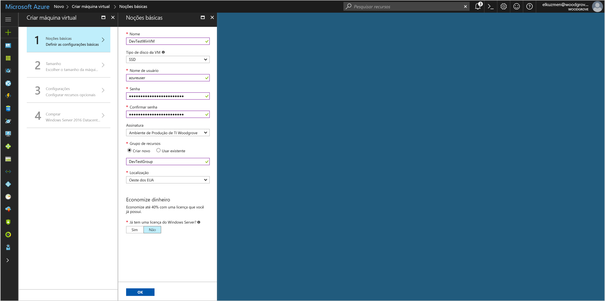

# <a name="tutorial-use-a-windows-vm-managed-identity-to-access-azure-storage"></a>Tutorial: Usar uma Identidade Gerenciada da VM do Windows para acessar o Armazenamento do Azure

[!INCLUDE[preview-notice](../../../includes/active-directory-msi-preview-notice.md)]

Este tutorial mostra como habilitar a Identidade Gerenciada para uma Máquina Virtual do Windows e, em seguida, usar essa identidade para acessar o Armazenamento do Azure.  Você aprenderá como:

> [!div class="checklist"]
> * Criar uma máquina virtual do Windows em um novo grupo de recursos 
> * Habilitar a Identidade Gerenciado em uma VM (Máquina Virtual) do Windows
> * Criar um contêiner de blobs em uma conta de armazenamento
> * Conceda à sua Identidade Gerenciada de VM do Windows acesso a uma conta de armazenamento 
> * Obter um acesso e usá-lo para chamar o Armazenamento do Azure 

> [!NOTE]
> A autenticação do Azure Active Directory para Armazenamento do Azure está em versão prévia.

## <a name="prerequisites"></a>Pré-requisitos

[!INCLUDE [msi-qs-configure-prereqs](../../../includes/active-directory-msi-qs-configure-prereqs.md)]

[!INCLUDE [msi-tut-prereqs](../../../includes/active-directory-msi-tut-prereqs.md)]

## <a name="sign-in-to-azure"></a>Entrar no Azure

Entre no Portal do Azure em [https://portal.azure.com](https://portal.azure.com).

## <a name="create-a-windows-virtual-machine-in-a-new-resource-group"></a>Criar uma máquina virtual do Windows em um novo grupo de recursos

Nesta seção, você cria uma VM do Windows que, depois, receberá uma Identidade Gerenciada.

1.  Clique no botão **+/Criar novo serviço** encontrado no canto superior esquerdo do portal do Azure.
2.  Selecione **Computação** e, em seguida, selecione **Windows Server 2016 Datacenter**. 
3.  Insira as informações da máquina virtual. O **Nome de usuário** e **Senha** criados aqui são as credenciais usadas para fazer logon na máquina virtual.
4.  Escolha uma **Assinatura** para a máquina virtual na lista suspensa.
5.  Para selecionar um novo **Grupo de recursos** no qual você deseja criar a máquina virtual, escolha **Criar novo**. Ao concluir, clique em **OK**.
6.  Selecione o tamanho para a VM. Para ver mais tamanhos, selecione **Exibir todos os** ou altere o filtro **Tipo de disco com suporte**. Na folha de configurações, mantenha os padrões e clique em **OK**.

    

## <a name="enable-managed-identity-on-your-vm"></a>Habilitar a Identidade Gerenciada em sua VM

Uma Identidade Gerenciada de Máquina Virtual permite que você obtenha tokens de acesso do Azure AD sem a necessidade de colocar as credenciais em seu código. Nos bastidores, habilitar a Identidade Gerenciada em uma Máquina Virtual por meio do Portal do Azure faz duas coisas: registra sua VM com o Azure AD e para criar uma identidade gerenciada e configura a identidade na VM. 

1. Navegue até o grupo de recursos de sua nova máquina virtual e selecione a máquina virtual que você criou na etapa anterior.
2. Na categoria **Configurações**, clique em **Configuração**.
3. Para habilitar a Identidade Gerenciada, selecione **Sim**.
4. Clique em **Salvar** para aplicar a configuração. 

## <a name="create-a-storage-account"></a>Criar uma conta de armazenamento 

Nesta seção, você criará uma conta de armazenamento. 

1. Clique no botão **+ Criar um recurso** localizado no canto superior esquerdo do Portal do Azure.
2. Clique em **Armazenamento** e, em seguida, **Conta de armazenamento – blob, arquivo, tabela, fila**.
3. Sob **Nome**, insira um nome para a conta de armazenamento.  
4. **Modelo de implantação** e **Tipo de conta** devem ser definidos como **Resource manager** e **Armazenamento (uso geral v1)**. 
5. Verifique se a **Assinatura** e o **Grupo de Recursos** correspondem ao que você especificou quando criou sua VM na etapa anterior.
6. Clique em **Criar**.

    

## <a name="create-a-blob-container-and-upload-a-file-to-the-storage-account"></a>Criar um contêiner de blob e carregar um arquivo na conta de armazenamento

Arquivos exigem armazenamento de blobs, então é preciso criar um contêiner de blobs para armazenar o arquivo. Em seguida, você carrega um arquivo no contêiner de blobs na nova conta de armazenamento.

1. Navegue de volta para sua conta de armazenamento criado recentemente.
2. Em **Serviço Blob**, clique em **Contêineres**.
3. No topo da página, clique em **+ Contêiner**.
4. Em **Novo contêiner**, insira um nome para o contêiner e, sob **Nível de acesso público**, mantenha o valor padrão.

    

5. Usando um editor de sua escolha, crie um arquivo denominado *hello world.txt* em seu computador local.  Abra o arquivo e adicione o texto (sem as aspas) "Hello world! :)" e salve-o. 
6. Carregue o arquivo no contêiner recém-criado clicando no nome do contêiner, depois em **Carregar**
7. No painel **Carregar blob**, em **Arquivos**, clique no ícone de pasta e navegue até o arquivo **hello_world.txt** em seu computador local, selecione-o e clique em **Carregar**.
    

## <a name="grant-your-vm-access-to-an-azure-storage-container"></a>Conceder à sua VM acesso a um contêiner do Armazenamento do Azure 

Você pode usar a identidade gerenciada da VM para recuperar os dados no Azure Storage Blob.   

1. Navegue de volta para sua conta de armazenamento criado recentemente.  
2. Clique no link do **Controle de acesso (IAM)** no painel à esquerda.  
3. Clique em **+ Adicionar** na parte superior da página para adicionar uma nova atribuição de função para a sua VM.
4. Em **Função**, no menu suspenso, selecione **Leitor de Dados de Blob de Armazenamento (Versão prévia)**. 
5. No menu suspenso seguinte, em **Atribuir acesso a**, escolha **Máquina Virtual**.  
6. Depois, verifique se a assinatura correta está listada no menu suspenso **Assinatura** e defina **Grupo de Recursos** como **Todos os grupos de recursos**.  
7. Em **Selecionar**, escolha sua VM e clique em **Salvar**. 

    

## <a name="get-an-access-token-and-use-it-to-call-azure-storage"></a>Obter um token de acesso e usá-lo para chamar o Armazenamento do Azure 

O Armazenamento do Azure tem suporte nativo para autenticação do Azure AD, de modo que ele pode aceitar diretamente os tokens de acesso obtidos por meio da Identidade Gerenciada. Isso faz parte da integração do Armazenamento do Azure com o Azure AD, e é diferente de fornecer as credenciais na cadeia de conexão.

Confira um exemplo de código .Net de abertura de uma conexão com o Armazenamento do Azure usando um token de acesso e, em seguida, leitura do conteúdo do arquivo que você criou anteriormente. Esse código deve ser executado na VM para poder acessar o ponto de extremidade da Identidade Gerenciada da VM. É necessário ter o .NET Framework 4.6 ou superior para usar o método de token de acesso. Substitua o valor de `<URI to blob file>` adequadamente. Você pode obter esse valor navegando até o arquivo criado e carregado no armazenamento de blobs e copiando a **URL** sob **Propriedades**, na página **Visão geral**.

```csharp
using System;
using System.Collections.Generic;
using System.Linq;
using System.Text;
using System.Threading.Tasks;
using System.IO;
using System.Net;
using System.Web.Script.Serialization; 
using Microsoft.WindowsAzure.Storage.Auth;
using Microsoft.WindowsAzure.Storage.Blob;

namespace StorageOAuthToken
{
    class Program
    {
        static void Main(string[] args)
        {
            //get token
            string accessToken = GetMSIToken("https://storage.azure.com/");
           
            //create token credential
            TokenCredential tokenCredential = new TokenCredential(accessToken);

            //create storage credentials
            StorageCredentials storageCredentials = new StorageCredentials(tokenCredential);

            Uri blobAddress = new Uri("<URI to blob file>");

            //create block blob using storage credentials
            CloudBlockBlob blob = new CloudBlockBlob(blobAddress, storageCredentials);
        
            //retrieve blob contents
            Console.WriteLine(blob.DownloadText());
            Console.ReadLine();
        }

        static string GetMSIToken(string resourceID)
        {
            string accessToken = string.Empty;
            // Build request to acquire MSI token
            HttpWebRequest request = (HttpWebRequest)WebRequest.Create("http://169.254.169.254/metadata/identity/oauth2/token?api-version=2018-02-01&resource=" + resourceID);
            request.Headers["Metadata"] = "true";
            request.Method = "GET";

            try
            {
                // Call /token endpoint
                HttpWebResponse response = (HttpWebResponse)request.GetResponse();

                // Pipe response Stream to a StreamReader, and extract access token
                StreamReader streamResponse = new StreamReader(response.GetResponseStream());
                string stringResponse = streamResponse.ReadToEnd();
                JavaScriptSerializer j = new JavaScriptSerializer();
                Dictionary<string, string> list = (Dictionary<string, string>)j.Deserialize(stringResponse, typeof(Dictionary<string, string>));
                accessToken = list["access_token"];
                return accessToken;
            }
            catch (Exception e)
            {
                string errorText = String.Format("{0} \n\n{1}", e.Message, e.InnerException != null ? e.InnerException.Message : "Acquire token failed");
                return accessToken;
            }
        }            
    }
}
```

A resposta tem o conteúdo do arquivo:

`Hello world! :)`

## <a name="next-steps"></a>Próximas etapas

Neste tutorial, você aprendeu a habilitar uma Identidade Gerenciada de Máquina Virtual do Windows para acessar o Armazenamento do Azure.  Para saber mais sobre o Armazenamento do Azure, confira:

> [!div class="nextstepaction"]
> [Armazenamento do Azure](/azure/storage/common/storage-introduction)


