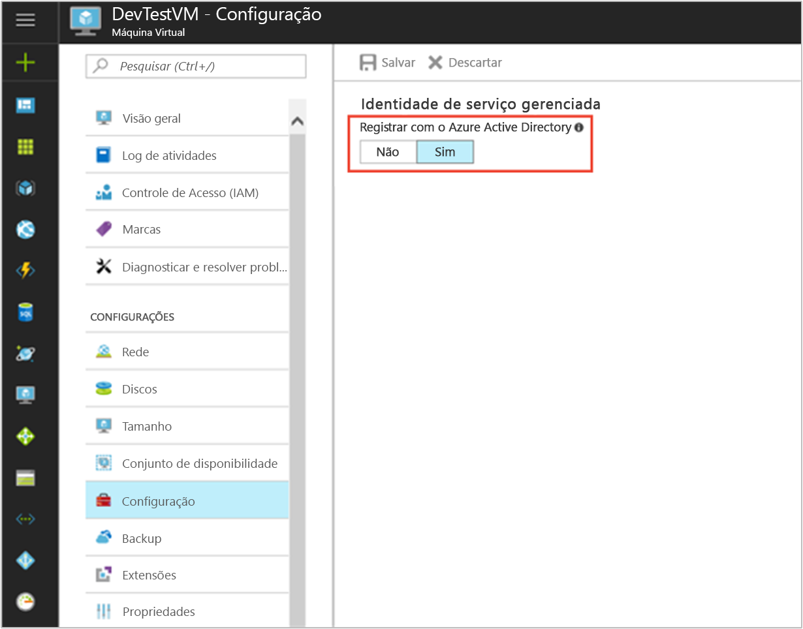

# <a name="tutorial-use-a-windows-vm-managed-service-identity-to-access-azure-storage-via-a-sas-credential"></a>Tutorial: Usar a Identidade de Serviço Gerenciada da VM do Windows para acessar o Armazenamento do Microsoft Azure por meio de uma credencial SAS

[!INCLUDE[preview-notice](../../../includes/active-directory-msi-preview-notice.md)]

Este tutorial mostra como habilitar a Identidade de Serviço Gerenciada para uma Máquina Virtual do Windows e usar a Identidade do Serviço Gerenciado para obter uma credencial SAS (Storage Access Signature) de armazenamento. Especificamente, uma [credencial SAS de serviço](/azure/storage/common/storage-dotnet-shared-access-signature-part-1?toc=%2fazure%2fstorage%2fblobs%2ftoc.json#types-of-shared-access-signatures). 

Uma SAS de Serviço permite conceder acesso limitado a objetos em uma conta de armazenamento por tempo limitado e para um serviço específico (em nosso caso, o serviço blob) sem expor uma chave de acesso de conta. Você pode usar a credencial SAS normalmente ao realizar operações de armazenamento, por exemplo, ao usar o SDK de Armazenamento. Para este tutorial, vamos demonstrar o upload e o download de um blob usando o PowerShell do Armazenamento do Azure. Você saberá como:


> [!div class="checklist"]
> * Habilitar a Identidade de Serviço Gerenciado na máquina virtual do Windows 
> * Conceda à sua VM acesso a SAS de conta de armazenamento no Resource Manager 
> * Obter um token de acesso usando a identidade da VM e usá-lo para recuperar SAS do Resource Manager 

## <a name="prerequisites"></a>Pré-requisitos

[!INCLUDE [msi-qs-configure-prereqs](../../../includes/active-directory-msi-qs-configure-prereqs.md)]

[!INCLUDE [msi-tut-prereqs](../../../includes/active-directory-msi-tut-prereqs.md)]

## <a name="sign-in-to-azure"></a>Entrar no Azure

Entre no Portal do Azure em [https://portal.azure.com](https://portal.azure.com).

## <a name="create-a-windows-virtual-machine-in-a-new-resource-group"></a>Criar uma máquina virtual do Windows em um novo grupo de recursos

Para este tutorial, vamos criar uma nova VM do Windows. Você também pode ativar a identidade de serviço gerenciado em uma VM existente.

1.  Clique no botão **+/Criar novo serviço** encontrado no canto superior esquerdo do portal do Azure.
2.  Selecione **Computação** e, em seguida, selecione **Windows Server 2016 Datacenter**. 
3.  Insira as informações da máquina virtual. O **Nome de usuário** e **Senha** criados aqui são as credenciais usadas para fazer logon na máquina virtual.
4.  Escolha uma **Assinatura** para a máquina virtual na lista suspensa.
5.  Para selecionar um novo **Grupo de recursos** no qual você deseja criar a máquina virtual, escolha **Criar novo**. Ao concluir, clique em **OK**.
6.  Selecione o tamanho para a VM. Para ver mais tamanhos, selecione **Exibir todos os** ou altere o filtro **Tipo de disco com suporte**. Na folha de configurações, mantenha os padrões e clique em **OK**.

    

## <a name="enable-managed-service-identity-on-your-vm"></a>Ativar a identidade do serviço gerenciado na sua VM

Uma Identidade de serviço gerenciada de máquina virtual permite obter tokens de acesso do Azure AD sem a necessidade de colocar credenciais em seu código. Nos bastidores, habilitar a identidade do serviço gerenciado faz duas coisas: registra sua VM com o Active Directory do Azure para criar sua identidade gerenciada e configura a identidade na VM.

1. Navegue até o grupo de recursos de sua nova máquina virtual e selecione a máquina virtual que você criou na etapa anterior.
2. Em “Configurações” da VM no painel esquerdo, clique em **Configuração**.
3. Para registrar e ativar a Identidade do serviço gerenciado, selecione **Sim**, se desejar desativá-la, escolha Não.
4. Lembre-se de clicar em **Salvar** para salvar a configuração.

    

## <a name="create-a-storage-account"></a>Criar uma conta de armazenamento 

Se você ainda não tiver uma, agora você criará uma conta de armazenamento. Você também pode ignorar esta etapa e conceder o acesso à identidade de serviço gerenciado da VM à credencial SAS de uma conta de armazenamento existente. 

1. Clique no botão **+/Criar novo serviço** encontrado no canto superior esquerdo do portal do Azure.
2. Clique em **Armazenamento**, então **Conta de Armazenamento** e um novo painel "Criar conta de armazenamento" será exibido.
3. Insira um nome para a conta de armazenamento, que você usará mais tarde.  
4. **Modelo de implantação** e **Tipo de conta** devem ser definidos como "Resource manager" e "Finalidade geral", respectivamente. 
5. Verifique se a **Assinatura** e o **Grupo de Recursos** correspondem ao que você especificou quando criou sua VM na etapa anterior.
6. Clique em **Criar**.

    

## <a name="create-a-blob-container-in-the-storage-account"></a>Criar um contêiner de blobs na conta de armazenamento

Mais tarde vamos carregar e baixar um arquivo para a nova conta de armazenamento. Como arquivos exigem armazenamento de blobs, é preciso criar um contêiner de blobs para armazenar o arquivo.

1. Navegue de volta para sua conta de armazenamento criado recentemente.
2. Clique no link **Contêineres** no painel à esquerda, em "Serviço Blob".
3. Clique em **+ Contêiner** na parte superior da página e um painel "Novo contêiner" deslizará para fora.
4. Dê um nome ao contêiner, selecione um nível de acesso, então clique em **OK**. O nome especificado será usado posteriormente no tutorial. 

    

## <a name="grant-your-vms-managed-service-identity-access-to-use-a-storage-sas"></a>Conceder o acesso à identidade do serviço gerenciado da VM para usar um SAS de armazenamento 

O Armazenamento do Azure não dá suporte nativo a autenticação do Azure AD.  No entanto, você pode usar uma identidade de serviço gerenciado para recuperar um SAS de armazenamento do Gerenciador de recursos e usar o SAS para acessar o armazenamento.  Nesta etapa, você concede o acesso à Identidade do serviço gerenciado da VM à sua conta de armazenamento SAS.   

1. Navegue de volta para sua conta de armazenamento criado recentemente.   
2. Clique no link do **Controle de acesso (IAM)** no painel à esquerda.  
3. Clique em **+ Adicionar** na parte superior da página para adicionar uma nova atribuição de função para a sua VM
4. Defina **Função** como "Colaborador da Conta de Armazenamento" no lado direito da página.  
5. No próximo menu suspenso, escolha **Atribuir acesso a** ao recurso “Máquina Virtual”.  
6. Em seguida, verifique se a assinatura correta é listada no menu suspenso **Assinatura** e, em seguida, defina **Grupo de Recursos** como "Todos os grupos de recursos".  
7. Por fim, em **Selecionar**, escolha sua Máquina Virtual do Windows na lista suspensa e clique em **Salvar**. 

    

## <a name="get-an-access-token-using-the-vms-identity-and-use-it-to-call-azure-resource-manager"></a>Obter um token de acesso usando a identidade da máquina virtual e usá-la para chamar o Azure Resource Manager 

Para o restante do tutorial, trabalharemos na VM criada anteriormente.

Você precisará usar os cmdlets do PowerShell do Azure Resource Manager nesta parte.  Se ele não estiver instalado, [baixe a versão mais recente](https://docs.microsoft.com/powershell/azure/overview) antes de continuar.

1. No portal do Azure, navegue até **Máquinas Virtuais**, vá para a Máquina Virtual do Windows e, na página **Visão geral**, clique em **Conectar** na parte superior.
2. Insira o seu **Nome de usuário** e **Senha** que você adicionou quando criou a VM do Windows. 
3. Agora que você criou uma **Conexão de Área de Trabalho Remota** com a máquina virtual, abra o PowerShell na sessão remota. 
4. Usando Invoke-WebRequest do Powershell, faça uma solicitação ao endpoint local de Identidade de serviço gerenciado para obter um token de acesso para o Azure Resource Manager.

    ```powershell
       $response = Invoke-WebRequest -Uri 'http://169.254.169.254/metadata/identity/oauth2/token?api-version=2018-02-01&resource=https%3A%2F%2Fmanagement.azure.com%2F' -Method GET -Headers @{Metadata="true"}
    ```
    
    > [!NOTE]
    > O valor do parâmetro "resource" deve ser uma correspondência exata para o que é esperado pelo Azure AD. Ao usar a ID de recurso do Azure Resource Manager, você deve incluir a barra à direita no URI.
    
    Em seguida, extraia o elemento “Conteúdo”, que está armazenado como uma cadeia de caracteres formatada em JSON (JavaScript Object Notation) no objeto $response. 
    
    ```powershell
    $content = $response.Content | ConvertFrom-Json
    ```
    Em seguida, extraia o token de acesso da resposta.
    
    ```powershell
    $ArmToken = $content.access_token
    ```

## <a name="get-a-sas-credential-from-azure-resource-manager-to-make-storage-calls"></a>Obter uma credencial SAS do Azure Resource Manager para fazer chamadas de armazenamento 

Agora use o PowerShell para chamar o Resource Manager usando o token de acesso recuperado da seção anterior para criar uma credencial SAS de armazenamento. Quando tivermos a credencial SAS, poderemos chamar as operações de armazenamento.

Para esta solicitação, vamos usar os parâmetros de solicitação HTTP a seguir para criar a credencial SAS:

```JSON
{
    "canonicalizedResource":"/blob/<STORAGE ACCOUNT NAME>/<CONTAINER NAME>",
    "signedResource":"c",              // The kind of resource accessible with the SAS, in this case a container (c).
    "signedPermission":"rcw",          // Permissions for this SAS, in this case (r)ead, (c)reate, and (w)rite. Order is important.
    "signedProtocol":"https",          // Require the SAS be used on https protocol.
    "signedExpiry":"<EXPIRATION TIME>" // UTC expiration time for SAS in ISO 8601 format, for example 2017-09-22T00:06:00Z.
}
```

Esses parâmetros são incluídos no corpo da POSTAGEM da solicitação para a credencial SAS. Para obter mais informações sobre os parâmetros para a criação de uma credencial SAS, consulte [Referência REST de SAS do Serviço de Lista](/rest/api/storagerp/storageaccounts/listservicesas).

Primeiro, converta os parâmetros em JSON e, em seguida, chame o ponto de extremidade `listServiceSas` de armazenamento para criar a credencial SAS:

```powershell
$params = @{canonicalizedResource="/blob/<STORAGE-ACCOUNT-NAME>/<CONTAINER-NAME>";signedResource="c";signedPermission="rcw";signedProtocol="https";signedExpiry="2017-09-23T00:00:00Z"}
$jsonParams = $params | ConvertTo-Json
```

```powershell
$sasResponse = Invoke-WebRequest -Uri https://management.azure.com/subscriptions/<SUBSCRIPTION-ID>/resourceGroups/<RESOURCE-GROUP>/providers/Microsoft.Storage/storageAccounts/<STORAGE-ACCOUNT-NAME>/listServiceSas/?api-version=2017-06-01 -Method POST -Body $jsonParams -Headers @{Authorization="Bearer $ArmToken"}
```
> [!NOTE] 
> A URL diferencia maiúsculas de minúsculas, portanto, certifique-se de usar letras maiúsculas e minúsculas exatamente da mesma forma que você usou anteriormente ao nomear o Grupo de Recursos, incluindo a letra maiúscula "G" em "resourceGroups". 

Agora podemos pode extrair a credencial SAS da resposta:

```powershell
$sasContent = $sasResponse.Content | ConvertFrom-Json
$sasCred = $sasContent.serviceSasToken
```

Se você inspecionar as credenciais SAS, verá algo assim:

```powershell
PS C:\> $sasCred
sv=2015-04-05&sr=c&spr=https&se=2017-09-23T00%3A00%3A00Z&sp=rcw&sig=JVhIWG48nmxqhTIuN0uiFBppdzhwHdehdYan1W%2F4O0E%3D
```

Em seguida, criamos um arquivo chamado "test.txt". Em seguida, use a credencial SAS para autenticar-se com o cmdlet `New-AzureStorageContent`, carregar o arquivo para nosso contêiner de blob e então baixar o arquivo.

```bash
echo "This is a test text file." > test.txt
```

Certifique-se instalar os cmdlets do Armazenamento do Azure primeiro, usando `Install-Module Azure.Storage`. Então carregue o blob recém-criado usando o cmdlet do PowerShell `Set-AzureStorageBlobContent`:

```powershell
$ctx = New-AzureStorageContext -StorageAccountName <STORAGE-ACCOUNT-NAME> -SasToken $sasCred
Set-AzureStorageBlobContent -File test.txt -Container <CONTAINER-NAME> -Blob testblob -Context $ctx
```

Resposta:

```powershell
ICloudBlob        : Microsoft.WindowsAzure.Storage.Blob.CloudBlockBlob
BlobType          : BlockBlob
Length            : 56
ContentType       : application/octet-stream
LastModified      : 9/21/2017 6:14:25 PM +00:00
SnapshotTime      :
ContinuationToken :
Context           : Microsoft.WindowsAzure.Commands.Storage.AzureStorageContext
Name              : testblob
```

Você também pode baixar o blob que acabou de criar, usando o cmdlet do PowerShell `Get-AzureStorageBlobContent`:

```powershell
Get-AzureStorageBlobContent -Blob testblob -Container <CONTAINER-NAME> -Destination test2.txt -Context $ctx
```

Resposta:

```powershell
ICloudBlob        : Microsoft.WindowsAzure.Storage.Blob.CloudBlockBlob
BlobType          : BlockBlob
Length            : 56
ContentType       : application/octet-stream
LastModified      : 9/21/2017 6:14:25 PM +00:00
SnapshotTime      :
ContinuationToken :
Context           : Microsoft.WindowsAzure.Commands.Storage.AzureStorageContext
Name              : testblob
```

## <a name="next-steps"></a>Próximas etapas

Neste tutorial, você aprendeu a criar uma Identidade de Serviço Gerenciada para acessar o Armazenamento do Azure usando uma credencial de SAS.  Para saber mais sobre SAS de Armazenamento do Azure, confira:

> [!div class="nextstepaction"]
>[Como usar SAS (assinaturas de acesso compartilhado)](/azure/storage/common/storage-dotnet-shared-access-signature-part-1)


