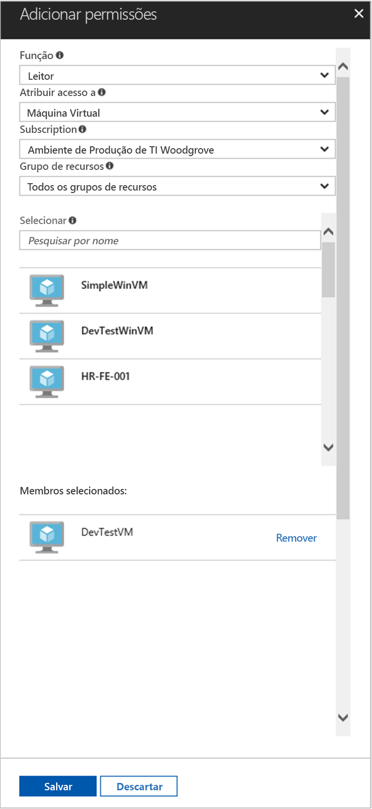

# <a name="use-managed-service-identity-with-a-linux-vm-to-access-azure-resource-manager"></a>Usar identidade de serviço gerenciado com uma VM do Linux para acessar o Azure Resource Manager

[!INCLUDE[preview-notice](../../includes/active-directory-msi-preview-notice.md)]

Este tutorial mostra como habilitar a Identidade de Serviço Gerenciado (MSI) para uma Máquina Virtual do Linux e, em seguida, usar essa identidade para acessar a API do Azure Resource Manager. As Identidades de Serviço Gerenciado são gerenciadas automaticamente pelo Azure e permitem a você autenticar os serviços que oferecem suporte à autenticação do Azure AD sem a necessidade de inserir as credenciais em seu código. Você aprenderá como:

> [!div class="checklist"]
> * Habilitar MSI em uma Máquina Virtual do Linux 
> * Conceder o acesso da VM a um Grupo de Recursos no Azure Resource Manager 
> * Obter um token de acesso usando a identidade da máquina virtual e usá-la para chamar o Azure Resource Manager 


Se você não tiver uma assinatura do Azure, crie uma [conta gratuita](https://azure.microsoft.com/free/?WT.mc_id=A261C142F) antes de começar.

## <a name="sign-in-to-azure"></a>Entrar no Azure

Entre no portal do Azure em [https://portal.azure.com](https://portal.azure.com).

## <a name="create-a-linux-virtual-machine-in-a-new-resource-group"></a>Criar uma Máquina Virtual do Linux em um novo Grupo de Recursos

Para este tutorial, vamos criar uma nova VM do Linux. Você também pode habilitar o MSI em uma VM existente.

1. Clique no botão **Novo** no canto superior esquerdo do Portal do Azure.
2. Selecione **Computação** e, em seguida, selecione **Ubuntu Server 16.04 LTS**.
3. Insira as informações da máquina virtual. Para **Tipo de autenticação**, selecione **Chave pública SSH** ou **Senha**. As credenciais criadas permitirão que você faça logon na máquina virtual.

    

4. Escolha uma **Assinatura** para a máquina virtual na lista suspensa.
5. Para selecionar um novo **Grupo de recursos** no qual você deseja criar a máquina virtual, escolha **Criar novo**. Ao concluir, clique em **OK**.
6. Selecione o tamanho para a VM. Para ver mais tamanhos, selecione **Exibir todos** ou altere o filtro Tipo de disco com suporte. Na folha de configurações, mantenha os padrões e clique em **OK**.

## <a name="enable-msi-on-your-vm"></a>Habilitar o MSI na sua VM

Um MSI de máquina virtual permite obter tokens de acesso do Azure AD sem a necessidade de colocar as credenciais no seu código. Nos bastidores, habilitar o MSI faz duas coisas: instala a extensão de VM do MSI em sua VM, e isso permite MSI para a VM.  

1. Selecione a **Máquina Virtual** na qual você deseja habilitar MSI.
2. Na barra de navegação à esquerda, clique em **Configuração**.
3. Você verá **Identidade de Serviço Gerenciado**. Para registrar e habilitar o MSI, selecione **Sim**; se você deseja desabilitá-la, escolha Não.
4. Lembre-se de clicar em **Salvar** para salvar a configuração.

    

5. Se você deseja verificar quais extensões estão nesta **VM do Linux**, clique em **Extensões**. Se o MSI estiver habilitado, **ManagedIdentityExtensionforLinux** aparecerá na lista.

    

## <a name="grant-your-vm-access-to-a-resource-group-in-azure-resource-manager"></a>Conceder o acesso da VM a um Grupo de Recursos no Azure Resource Manager 

Usando o MSI seu código pode obter tokens de acesso para autenticar para recursos que oferecem suporte à autenticação do Azure AD. A API do Azure Resource Manager oferece suporte à autenticação do Azure AD. Primeiro, é preciso conceder acesso de identidade desta VM a um recurso no Azure Resource Manager, neste caso, o Grupo de Recursos no qual a VM está contida.  

1. Navegue até a guia para **Grupo de Recursos**.
2. Selecione o **Grupo de Recursos** específico criado anteriormente.
3. Vá para **Controle de acesso (IAM)** no painel esquerdo.
4. Clique para **Adicionar** uma nova atribuição de função para sua VM. Escolha **Função** como **Leitor**.
5. No menu suspenso seguinte, **Atribuir acesso a** ao recurso **Máquina Virtual**.
6. Em seguida, certifique-se de que a assinatura correta está listada na lista suspensa **Assinatura**. E para **Grupo de Recursos**, selecione **Todos os grupos de recursos**.
7. Por fim, em **Selecionar** escolha sua Máquina Virtual do Linux na lista suspensa e clique em **Salvar**.

    

## <a name="get-an-access-token-using-the-vm-identity-and-use-it-to-call-resource-manager"></a>Obter um token de acesso usando a identidade da máquina virtual e usá-la para chamar o Gerenciador de Recursos 

Para concluir essas etapas, você precisará de cliente SSH. Se você estiver usando o Windows, poderá usar o cliente SSH no [Subsistema do Windows para Linux](https://msdn.microsoft.com/commandline/wsl/about). 

1. No portal, navegue até a VM do Linux e em **Visão geral**, clique em **Conectar**.  
2. **Conecte-se** à VM com um cliente SSH de sua escolha. 
3. Na janela de terminal, usando a CURL, faça uma solicitação para o ponto de extremidade do MSI local para obter um token de acesso para o Azure Resource Manager.  
 
    A solicitação CURL para o token de acesso está abaixo.  
    
    ```bash
    curl http://localhost:50432/oauth2/token --data "resource=https://management.azure.com/" -H Metadata:true   
    ```
    
    > [!NOTE]
    > O valor do parâmetro "resource" deve ser uma correspondência exata para o que é esperado pelo Azure AD.  No caso da ID de recurso do Gerenciador de Recursos, você deve incluir a barra à direita no URI. 
    
    A resposta inclui o token de acesso que você precisa para acessar o Azure Resource Manager. 
    
    Resposta:  

    ```bash
    {"access_token":"eyJ0eXAiOiJKV1QiLCJhbGciOiJSUzI1NiIsIng1dCI6IkhIQnlLVS0wRHFBcU1aaDZaRlBkMlZXYU90ZyIsImtpZCI6IkhIQnlLVS0wRHFBcU1aaDZaRlBkMlZXYU90ZyJ9.eyJhdWQiOiJodHRwczovL21hbmFnZW1lbnQuYXp1cmUuY29tIiwiaXNzIjoiaHR0cHM6Ly9zdHMud2luZG93cy5uZXQvNzJmOTg4YmYtODZmMS00MWFmLTkxYWItMmQ3Y2QwMTFkYjQ3LyIsImlhdCI6MTUwNDEyNjYyNywibmJmIjoxNTA0MTI2NjI3LCJleHAiOjE1MDQxMzA1MjcsImFpbyI6IlkyRmdZTGg2dENWSzRkSDlGWGtuZzgyQ21ZNVdBZ0E9IiwiYXBwaWQiOiI2ZjJmNmU2OS04MGExLTQ3NmEtOGRjZi1mOTgzZDZkMjUxYjgiLCJhcHBpZGFjciI6IjIiLCJpZHAiOiJodHRwczovL3N0cy53aW5kb3dzLm5ldC83MmY5ODhiZi04NmYxLTQxYWYtOTFhYi0yZDdjZDAxMWRiNDcvIiwib2lkIjoiMTEyODJiZDgtMDNlMi00NGVhLTlmYjctZTQ1YjVmM2JmNzJlIiwic3ViIjoiMTEyODJiZDgtMDNlMi00NGVhLTlmYjctZTQ1YjVmM2JmNzJlIiwidGlkIjoiNzJmOTg4YmYtODZmMS00MWFmLTkxYWItMmQ3Y2QwMTFkYjQ3IiwidXRpIjoib0U5T3JVZFJMMHVKSEw4UFdvOEJBQSIsInZlciI6IjEuMCJ9.J6KS7b9kFgDkegJ-Vfff19LMnu3Cfps4dL2uNGucb5M76rgDM5f73VO-19wZSRhQPxWmZLETzN3SljnIMQMkYWncp79MVdBud_xqXYyLdQpGkNinpKVJhTo1j1dY27U_Cjl4yvvpBTrtH3OX9gG0GtQs7PBFTTLznqcH3JR9f-bTSEN4wUhalaIPHPciVDtJI9I24_vvMfVqxkXOo6gkL0mEPfpXZRLwrBNd607AzX0KVmLFrwA1vYJnCV-sSV8bwTh2t6CVEj240t0iyeVWVc2usJ0NY2rxPzKd_UckQ_zzrECG3kS4vuYePKz6GqNJFVzm2w2c61lX0-O1CwvQ9w","refresh_token":"","expires_in":"3599","expires_on":"1504130527","not_before":"1504126627","resource":"https://management.azure.com","token_type":"Bearer"} 
    ```
    
    Você pode usar esse token de acesso para acessar o Azure Resource Manager, por exemplo, para ler os detalhes do Grupo de Recursos ao qual você concedeu acesso anteriormente para essa VM. Substitua os valores de <SUBSCRIPTION ID>, <RESOURCE GROUP> e <ACCESS TOKEN> por aqueles que você criou anteriormente. 
    
    > [!NOTE]
    > A URL diferencia maiúsculas de minúsculas, portanto, verifique se você está usando letras maiúsculas e minúsculas exatamente da mesma forma que você usou anteriormente ao nomear o Grupo de Recursos e a letra maiúscula "G" em "resourceGroup".  
    
    ```bash 
    curl https://management.azure.com/subscriptions/<SUBSCRIPTION ID>/resourceGroups/<RESOURCE GROUP>?api-version=2016-09-01 -H "Authorization: Bearer <ACCESS TOKEN>" 
    ```
    
    A resposta de volta com as informações do Grupo de Recursos específicas: 
     
    ```bash
    {"id":"/subscriptions/98f51385-2edc-4b79-bed9-7718de4cb861/resourceGroups/DevTest","name":"DevTest","location":"westus","properties":{"provisioningState":"Succeeded"}} 
    ```
     
## <a name="related-content"></a>Conteúdo relacionado

- Para obter uma visão geral do MSI, confira [Visão geral da Identidade de Serviço Gerenciado](../active-directory/msi-overview.md).

Use a seção de comentários a seguir para fornecer seus comentários e nos ajudar a aprimorar e adaptar nosso conteúdo.


