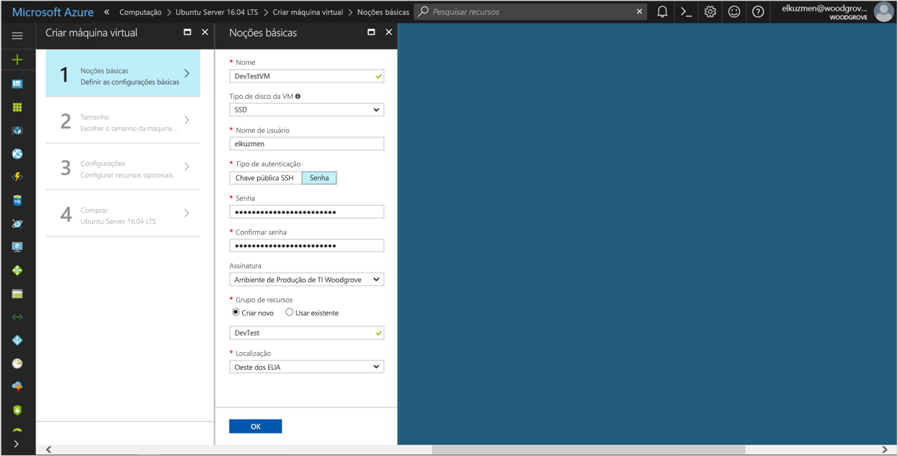
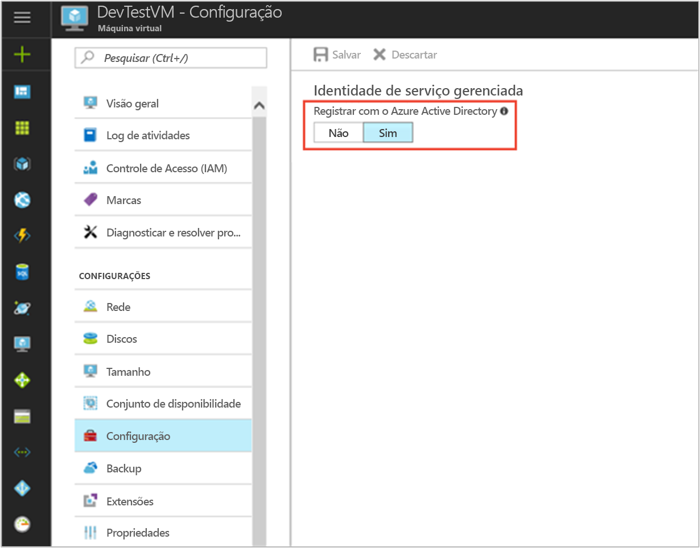

# <a name="use-managed-service-identity-for-a-linux-vm-to-access-azure-data-lake-store"></a>Usar uma Identidade do Serviço Gerenciado para uma VM Linux para acessar o Azure Data Lake Store

[!INCLUDE[preview-notice](../../includes/active-directory-msi-preview-notice.md)]

Este tutorial mostra como usar uma Identidade do Serviço Gerenciado para uma máquina virtual (VM) Linux para acessar o Azure Data Lake Store. O Azure gerencia automaticamente as identidades que você cria por meio da MSI. Você pode usar a MSI para autenticar um serviço que seja compatível com a autenticação do Azure Active Directory (Azure AD) sem precisar inserir as credenciais no seu código. 

Neste tutorial, você aprenderá como:

> [!div class="checklist"]
> * Habilitar a MSI em uma VM Linux. 
> * Conceder à sua VM acesso ao Azure Data Lake Store.
> * Obter um token de acesso usando a identidade da VM e usá-lo para acessar o Azure Data Lake Store.

## <a name="prerequisites"></a>pré-requisitos

[!INCLUDE [msi-qs-configure-prereqs](../../includes/active-directory-msi-qs-configure-prereqs.md)]

[!INCLUDE [msi-tut-prereqs](../../includes/active-directory-msi-tut-prereqs.md)]

## <a name="sign-in-to-azure"></a>Entrar no Azure

Entre no [Portal do Azure](https://portal.azure.com).

## <a name="create-a-linux-virtual-machine-in-a-new-resource-group"></a>Criar uma máquina virtual do Linux em um novo grupo de recursos

Para este tutorial, vamos criar uma nova VM do Linux. Você também pode habilitar o MSI em uma VM existente.

1. Selecione o botão **Novo** no canto superior esquerdo do portal do Azure.
2. Selecione **Computação** e, em seguida, selecione **Ubuntu Server 16.04 LTS**.
3. Insira as informações da máquina virtual. Para **Tipo de autenticação**, selecione **Chave pública SSH** ou **Senha**. As credenciais criadas permitirão que você faça logon na máquina virtual.

   

4. Na lista **Assinatura**, selecione uma assinatura para a máquina virtual.
5. Para selecionar um novo grupo de recursos no qual você deseja criar a máquina virtual, selecione **Grupo de recursos** > **Criar novo**. Quando terminar, selecione **OK**.
6. Selecione o tamanho para a VM. Para ver mais tamanhos, selecione **Exibir todos os** ou altere o filtro **Tipo de disco com suporte**. Na página Configurações, mantenha os padrões e selecione **OK**.

## <a name="enable-msi-on-your-vm"></a>Habilitar o MSI na sua VM

Você pode usar a MSI para uma máquina virtual para obter tokens de acesso do Azure AD sem a necessidade de colocar as credenciais no seu código. Habilitar a MSI instala a extensão de VM da MSI na VM e habilita a MSI no Azure Resource Manager.  

1. Para **Máquina Virtual**, selecione a máquina virtual na qual você deseja habilitar a MSI.
2. No painel esquerdo, selecione **Configuração**.
3. Você verá **Identidade de serviço gerenciado**. Para registrar e habilitar a MSI, selecione **Sim**. Se você quiser desabilitá-la, selecione **Não**.
   
4. Selecione **Salvar**.
5. Se você deseja verificar quais extensões estão nesta VM Linux, selecione **Extensões**. Se a MSI estiver habilitada, **ManagedIdentityExtensionforLinux** aparecerá na lista.

   

## <a name="grant-your-vm-access-to-azure-data-lake-store"></a>Conceder acesso ao Azure Data Lake Store à sua VM

Agora você pode conceder acesso à sua VM a arquivos e pastas no Azure Data Lake Store. Para esta etapa, você pode usar uma instância Data Lake Store existente ou criar uma nova. Para criar uma nova instância Data Lake Store usando o portal do Azure, siga o [Guia de início rápido do Azure Data Lake Store](https://docs.microsoft.com/azure/data-lake-store/data-lake-store-get-started-portal). Também há guias de início rápido que usam a CLI do Azure e o Azure PowerShell na [documentação do Azure Data Lake Store](https://docs.microsoft.com/azure/data-lake-store/data-lake-store-overview).

No Data Lake Store, crie uma nova pasta e conceda permissão à MSI para ler, gravar e executar arquivos nessa pasta:

1. No portal do Azure, selecione **Data Lake Store** no painel esquerdo.
2. Selecione a instância Data Lake Store que você deseja usar.
3. Selecione **Data Explorer** na barra de comandos.
4. A pasta raiz da instância Data Lake Store é selecionada. Selecione **Acesso** na barra de comandos.
5. Selecione **Adicionar**.  Na caixa **Selecionar**, insira o nome da sua VM, por exemplo, **DevTestVM**. Selecione sua VM nos resultados da pesquisa e clique em **Selecionar**.
6. Clique em **Selecionar permissões**.  Selecione **Leitura** e **Execução**, adicione a **Esta pasta** e adicione como **Somente permissão de acesso**. Selecione **Ok**.  A permissão deverá ser adicionada com êxito.
7. Feche o painel **Acesso**.
8. Para este tutorial, crie uma nova pasta. Selecione **Nova pasta** na barra de comandos e dê um nome para ela, por exemplo **TestFolder**.  Selecione **Ok**.
9. Selecione a pasta que você criou e selecione **Acesso** na barra de comandos.
10. Semelhante à etapa 5, selecione **Adicionar**. Na caixa **Selecionar**, insira o nome da sua VM. Selecione sua VM nos resultados da pesquisa e clique em **Selecionar**.
11. Semelhante à etapa 6, selecione **Selecionar Permissões**. Selecione **Leitura**, **Gravação** e **Execução**, adicione **Esta pasta** e adicione como **Uma entrada de permissão de acesso e uma entrada de permissão padrão**. Selecione **Ok**.  A permissão deverá ser adicionada com êxito.

Agora a MSI pode executar todas as operações nos arquivos da pasta que você criou. Para saber mais sobre como gerenciar acesso ao Data Lake Store, confira [Controle de acesso no Data Lake Store](https://docs.microsoft.com/azure/data-lake-store/data-lake-store-access-control).

## <a name="get-an-access-token-and-call-the-data-lake-store-file-system"></a>Obter um token de acesso e chamar o sistema de arquivos do Data Lake Store

O Azure Data Lake Store tem suporte nativo para autenticação do Azure AD, de modo que ele pode aceitar diretamente os tokens de acesso obtidos por meio da MSI. Para autenticar para o sistema de arquivos do Data Lake Store, você envia um token de acesso emitido pelo Azure AD para o ponto de extremidade do sistema de arquivos do Data Lake Store. O token de acesso está em um cabeçalho de autorização no formato “Portador \<ACCESS_TOKEN_VALUE\>”.  Para saber mais sobre o suporte do Data Lake Store à autenticação do Azure AD, confira [Autenticação com o Data Lake Store usando o Azure Active Directory](https://docs.microsoft.com/azure/data-lake-store/data-lakes-store-authentication-using-azure-active-directory).

Neste tutorial, você se autentica na API REST do sistema de arquivos do Data Lake Store usando o cURL para fazer solicitações REST.

> [!NOTE]
> Os SDKs do cliente do sistema de arquivos do Data Lake Store ainda não oferecem suporte à Identidade de Serviço Gerenciado.

Para concluir essas etapas, você precisará do cliente SSH. Se você estiver usando o Windows, poderá usar o cliente SSH no [Subsistema do Windows para Linux](https://msdn.microsoft.com/commandline/wsl/about). Se precisar de ajuda para configurar as chaves do cliente SSH, confira [Como usar chaves SSH com o Windows no Azure](../virtual-machines/linux/ssh-from-windows.md) ou [Como criar e usar um par de chaves SSH pública e privada para VMs Linux no Azure](../virtual-machines/linux/mac-create-ssh-keys.md).

1. No portal, navegue até sua VM Linux. Em **Visão geral**, selecione **Conectar**.  
2. Conecte-se à VM usando um cliente SSH de sua escolha. 
3. Na janela de terminal, usando o cURL, faça uma solicitação para o ponto de extremidade da MSI local para obter um token de acesso para o sistema de arquivos do Data Lake Store. O identificador de recursos do Data Lake Store é “https://datalake.azure.net/”.  É importante incluir a barra à direita no identificador de recursos.
    
   ```bash
   curl http://localhost:50342/oauth2/token --data "resource=https://datalake.azure.net/" -H Metadata:true   
   ```
    
   Uma resposta bem-sucedida retorna o token de acesso que você usará para autenticar-se no Data Lake Store:

   ```bash
   {"access_token":"eyJ0eXAiOiJ...",
    "refresh_token":"",
    "expires_in":"3599",
    "expires_on":"1508119757",
    "not_before":"1508115857",
    "resource":"https://datalake.azure.net/",
    "token_type":"Bearer"}
   ```

4. Usando o cURL, faça uma solicitação para o ponto de extremidade REST do sistema de arquivos do Data Lake Store para listar as pastas na pasta raiz. Esta é uma maneira simples de verificar se tudo está configurado corretamente. Copie o valor do token de acesso da etapa anterior. É importante que a cadeia de caracteres “Bearer” no cabeçalho de autorização tenha um “B” maiúsculo. Você pode encontrar o nome da sua instância do Data Lake Store na seção **Visão geral** do painel **Data Lake Store** no Portal do Azure.

   ```bash
   curl https://<YOUR_ADLS_NAME>.azuredatalakestore.net/webhdfs/v1/?op=LISTSTATUS -H "Authorization: Bearer <ACCESS_TOKEN>"
   ```
    
   Uma resposta bem-sucedida tem a seguinte aparência:

   ```bash
   {"FileStatuses":{"FileStatus":[{"length":0,"pathSuffix":"TestFolder","type":"DIRECTORY","blockSize":0,"accessTime":1507934941392,"modificationTime":1508105430590,"replication":0,"permission":"770","owner":"bd0e76d8-ad45-4fe1-8941-04a7bf27f071","group":"bd0e76d8-ad45-4fe1-8941-04a7bf27f071"}]}}
   ```

5. Agora você pode tentar carregar um arquivo para sua instância do Data Lake Store. Primeiramente, crie um arquivo para ser carregado.

   ```bash
   echo "Test file." > Test1.txt
   ```

6. Usando o cURL, faça uma solicitação para o ponto de extremidade REST do sistema de arquivos do Data Lake Store para carregar o arquivo para a pasta que você criou anteriormente. O carregamento envolve um redirecionamento, e o cURL segue o redirecionamento automaticamente. 

   ```bash
   curl -i -X PUT -L -T Test1.txt -H "Authorization: Bearer <ACCESS_TOKEN>" 'https://<YOUR_ADLS_NAME>.azuredatalakestore.net/webhdfs/v1/<FOLDER_NAME>/Test1.txt?op=CREATE' 
   ```

    Uma resposta bem-sucedida tem a seguinte aparência:

   ```bash
   HTTP/1.1 100 Continue
   HTTP/1.1 307 Temporary Redirect
   Cache-Control: no-cache, no-cache, no-store, max-age=0
   Pragma: no-cache
   Expires: -1
   Location: https://mytestadls.azuredatalakestore.net/webhdfs/v1/TestFolder/Test1.txt?op=CREATE&write=true
   x-ms-request-id: 756f6b24-0cca-47ef-aa12-52c3b45b954c
   ContentLength: 0
   x-ms-webhdfs-version: 17.04.22.00
   Status: 0x0
   X-Content-Type-Options: nosniff
   Strict-Transport-Security: max-age=15724800; includeSubDomains
   Date: Sun, 15 Oct 2017 22:10:30 GMT
   Content-Length: 0
       
   HTTP/1.1 100 Continue
       
   HTTP/1.1 201 Created
   Cache-Control: no-cache, no-cache, no-store, max-age=0
   Pragma: no-cache
   Expires: -1
   Location: https://mytestadls.azuredatalakestore.net/webhdfs/v1/TestFolder/Test1.txt?op=CREATE&write=true
   x-ms-request-id: af5baa07-3c79-43af-a01a-71d63d53e6c4
   ContentLength: 0
   x-ms-webhdfs-version: 17.04.22.00
   Status: 0x0
   X-Content-Type-Options: nosniff
   Strict-Transport-Security: max-age=15724800; includeSubDomains
   Date: Sun, 15 Oct 2017 22:10:30 GMT
   Content-Length: 0
   ```

Usando outras APIs do sistema de arquivos do Data Lake Store, é possível acrescentar aos arquivos, baixar arquivos e muito mais.

Parabéns! Você foi autenticado no sistema de arquivos do Data Lake Store usando uma MSI para uma VM Linux.

## <a name="related-content"></a>Conteúdo relacionado

- Para obter uma visão geral do MSI, confira [Visão geral da Identidade de Serviço Gerenciado](../active-directory/msi-overview.md).
- Para operações de gerenciamento, o Data Lake Store usa o Azure Resource Manager.  Para obter mais informações sobre como usar uma MSI para autenticar-se no Gerenciador de Recursos, confira [Usar uma Identidade de Serviço Gerenciado (MSI) da VM Linux para acessar o Gerenciador de Recursos](https://docs.microsoft.com/azure/active-directory/msi-tutorial-linux-vm-access-arm).
- Saiba mais sobre a [autenticação com o Data Lake Store usando o Azure Active Directory](https://docs.microsoft.com/azure/data-lake-store/data-lakes-store-authentication-using-azure-active-directory).
- Saiba mais sobre [operações do sistema de arquivos no Azure Data Lake Store usando a API REST](https://docs.microsoft.com/azure/data-lake-store/data-lake-store-data-operations-rest-api) ou as [APIs do sistema de arquivos WebHDFS](https://docs.microsoft.com/rest/api/datalakestore/webhdfs-filesystem-apis).
- Saiba mais sobre o [controle de acesso no Data Lake Store](https://docs.microsoft.com/azure/data-lake-store/data-lake-store-access-control).

Use a seção de comentários a seguir para fornecer seus comentários e nos ajudar a aprimorar e adaptar nosso conteúdo.