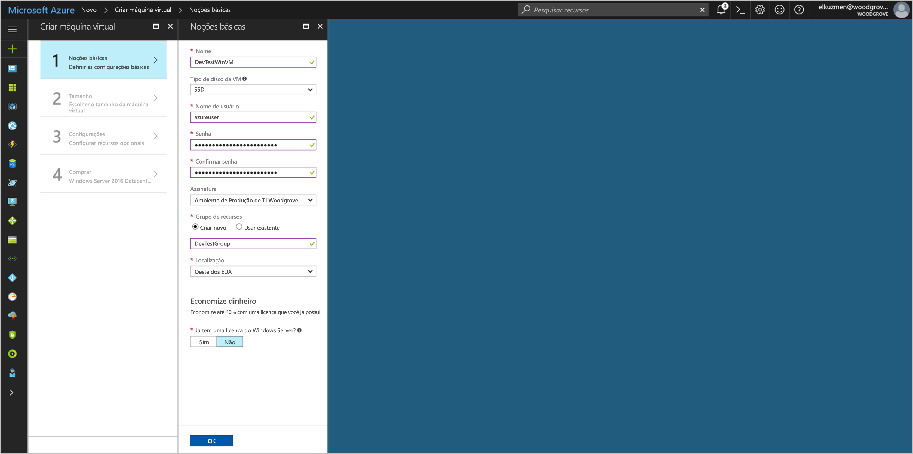
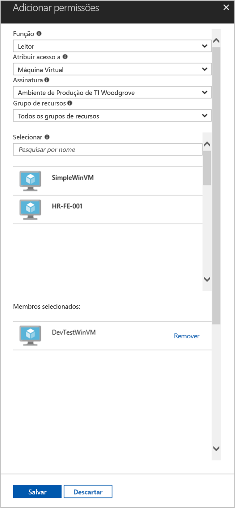

# <a name="use-a-windows-vm-managed-service-identity-msi-to-access-resource-manager"></a>Usar umo MSI (Identidade de Serviço Gerenciado) da VM do Windows para acessar o Resource Manager

[!INCLUDE[preview-notice](../../includes/active-directory-msi-preview-notice.md)]

Este tutorial mostra como habilitar o MSI (Identidade de Serviço Gerenciado) para uma VM (máquina virtual) do Windows. Você pode usar essa identidade para acessar a API do Azure Resource Manager. As Identidades de Serviço Gerenciado são gerenciadas automaticamente pelo Azure e permitem a você autenticar os serviços que oferecem suporte à autenticação do Azure AD sem a necessidade de inserir as credenciais em seu código. Você aprenderá como:

> [!div class="checklist"]
> * Habilitar MSI em uma VM do Windows 
> * Conceder o acesso da VM a um Grupo de Recursos no Azure Resource Manager 
> * Obter um token de acesso usando a identidade da máquina virtual e usá-la para chamar o Azure Resource Manager


Se você não tiver uma assinatura do Azure, crie uma [conta gratuita](https://azure.microsoft.com/free/?WT.mc_id=A261C142F) antes de começar.

## <a name="sign-in-to-azure"></a>Entrar no Azure
Entre no portal do Azure em [https://portal.azure.com](https://portal.azure.com).

## <a name="create-a-windows-virtual-machine-in-a-new-resource-group"></a>Criar uma máquina virtual do Windows em um novo grupo de recursos

Para este tutorial, vamos criar uma nova VM do Windows.  Você também pode habilitar o MSI em uma VM existente.

1.  Clique no botão **Novo** no canto superior esquerdo do Portal do Azure.
2.  Selecione **Computação** e, em seguida, selecione **Windows Server 2016 Datacenter**. 
3.  Insira as informações da máquina virtual. O **Nome de usuário** e **Senha** criados aqui são as credenciais usadas para fazer logon na máquina virtual.
4.  Escolha uma **Assinatura** para a máquina virtual na lista suspensa.
5.  Para selecionar um novo **Grupo de Recursos** no qual será criada a máquina virtual, escolha **Criar Novo**. Ao concluir, clique em **OK**.
6.  Selecione o tamanho para a VM. Para ver mais tamanhos, selecione **Exibir todos os** ou altere o filtro **Tipo de disco com suporte**. Na página Configurações, mantenha os padrões e clique em **OK**.

    

## <a name="enable-msi-on-your-vm"></a>Habilitar o MSI na sua VM 

Um MSI de VM permite obter tokens de acesso do Azure AD sem a necessidade de colocar as credenciais no seu código. Habilitar o MSI informa ao Azure para criar uma identidade gerenciada para sua VM. Nos bastidores, habilitar o MSI faz duas coisas: instala a extensão de VM do MSI em sua VM, e isso permite MSI no Azure Resource Manager.

1.  Selecione a **Máquina Virtual** na qual você deseja habilitar MSI.  
2.  Na barra de navegação à esquerda, clique em **Configuração**. 
3.  Você verá **Identidade de Serviço Gerenciado**. Para registrar e habilitar o MSI, selecione **Sim**; se você deseja desabilitá-la, escolha Não. 
4.  Lembre-se de clicar em **Salvar** para salvar a configuração.  
    

5. Se você deseja verificar quais as extensões que estão nessa VM, clique em **Extensões**. Se o MSI estiver habilitadO, **ManagedIdentityExtensionforWindows** aparecerá na lista.

    

## <a name="grant-your-vm-access-to-a-resource-group-in-resource-manager"></a>Conceder acesso a um Grupo de Recursos no Azure Resource Manager para sua VM
Usando o MSI seu código pode obter tokens de acesso para autenticar para recursos que oferecem suporte à autenticação do Azure AD.  O Azure Resource Manager oferece suporte à autenticação do Azure AD.  Primeiro, é preciso conceder acesso de identidade desta VM a um recurso no Resource Manager, neste caso, o Grupo de Recursos no qual a VM está contida.  

1.  Navegue até a guia para **Grupos de Recursos**. 
2.  Selecione o **Grupo de Recursos** específico criado para sua **VM do Windows**. 
3.  Acesse **Controle de acesso (IAM)** no painel esquerdo. 
4.  Em seguida, opte por **Adicionar** uma nova atribuição de função para a **VM do Windows**.  Escolha **Função** como **Leitor**. 
5.  No menu suspenso seguinte, **Atribuir acesso a** **Máquina Virtual** do recurso. 
6.  Em seguida, certifique-se de que a assinatura correta está listada na lista suspensa **Assinatura**. E para **Grupo de Recursos**, selecione **Todos os grupos de recursos**. 
7.  Por fim, em **Selecionar** escolha sua VM do Windows na lista suspensa e clique em **Salvar**.

    

## <a name="get-an-access-token-using-the-vm-identity-and-use-it-to-call-azure-resource-manager"></a>Obter um token de acesso usando a identidade da máquina virtual e usá-la para chamar o Azure Resource Manager 

Você precisará usar o **PowerShell** nesta parte.  Se ele não estiver instalado, baixe-o [aqui](https://docs.microsoft.com/powershell/azure/overview?view=azurermps-4.3.1). 

1.  No portal, navegue até **Máquinas Virtuais** e vá para a máquina virtual do Windows e em **Visão geral**, clique em **Conectar**. 
2.  Insira o seu **Nome de usuário** e **Senha** que você adicionou quando criou a VM do Windows. 
3.  Agora que você criou uma **Conexão de Área de Trabalho Remota** com a máquina virtual, abra o **PowerShell** na sessão remota. 
4.  Usando Invoke-WebRequest do Powershell, faça uma solicitação ao ponto de extremidade do MSI local para obter um token de acesso para o Azure Resource Manager.

    ```powershell
       $response = Invoke-WebRequest -Uri http://localhost:50342/oauth2/token -Method GET -Body @{resource="https://management.azure.com/"} -Headers @{Metadata="true"}
    ```
    
    > [!NOTE]
    > O valor do parâmetro "resource" deve ser uma correspondência exata para o que é esperado pelo Azure AD. Ao usar a ID de recurso do Azure Resource Manager, você deve incluir a barra à direita no URI.
    
    Em seguida, extraia a resposta completa, que é armazenada como uma cadeia de caracteres JSON (JavaScript Object Notation) formatada no objeto $response. 
    
    ```powershell
    $content = $response.Content | ConvertFrom-Json
    ```
    Em seguida, extraia o token de acesso da resposta.
    
    ```powershell
    $ArmToken = $content.access_token
    ```
    
    Por fim, chame o Azure Resource Manager usando o token de acesso. Neste exemplo, também estamos usando Invoke-WebRequest do PowerShell para fazer a chamada para o Azure Resource Manager e incluir o token de acesso no cabeçalho de Autorização.
    
    ```powershell
    (Invoke-WebRequest -Uri https://management.azure.com/subscriptions/<SUBSCRIPTION ID>/resourceGroups/<RESOURCE GROUP>?api-version=2016-06-01 -Method GET -ContentType "application/json" -Headers @{ Authorization ="Bearer $ArmToken"}).content
    ```
    > [!NOTE] 
    > A URL diferencia maiúsculas de minúsculas, portanto, verifique se você está usando letras maiúsculas e minúsculas exatamente da mesma forma que você usou anteriormente ao nomear o Grupo de Recursos e a letra maiúscula "G" em "resourceGroups".
        
    O comando a seguir retorna os detalhes do Grupo de Recursos:

    ```powershell
    {"id":"/subscriptions/98f51385-2edc-4b79-bed9-7718de4cb861/resourceGroups/DevTest","name":"DevTest","location":"westus","properties":{"provisioningState":"Succeeded"}}
    ```

## <a name="related-content"></a>Conteúdo relacionado

- Para obter uma visão geral do MSI, confira [Visão geral da Identidade de Serviço Gerenciado](../active-directory/msi-overview.md).

Use a seção de comentários a seguir para fornecer seus comentários e nos ajudar a aprimorar e adaptar nosso conteúdo.

