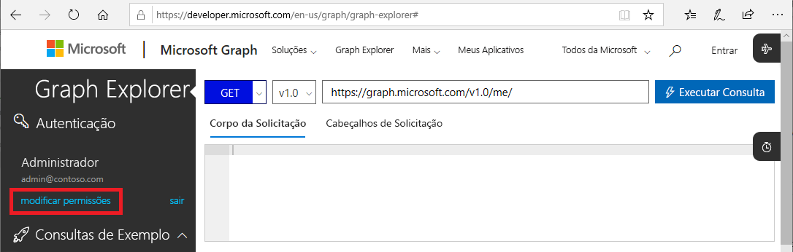
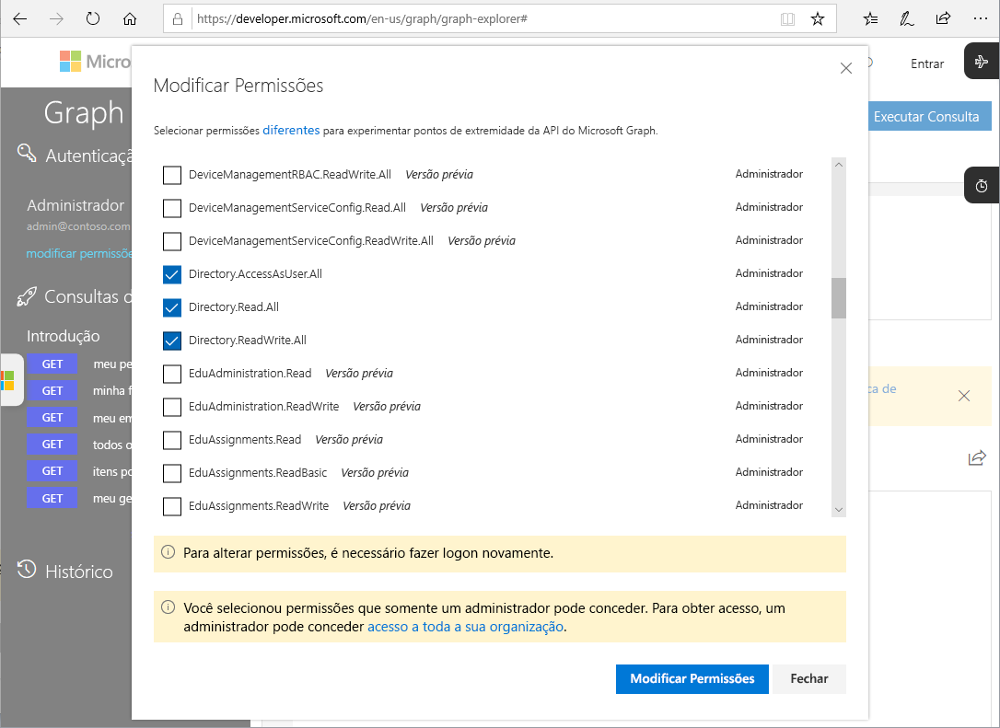

# APIs do Microsoft Graph para PIM (Versão prévia)

Para a maioria das tarefas que você pode executar no Azure AD Privileged Identity Management (PIM) usando o portal do Azure, você também pode executar usando as [APIs do Microsoft Graph](https://developer.microsoft.com/graph/docs/concepts/overview). Este artigo descreve alguns conceitos importantes ao usar as APIs do Microsoft Graph para PIM. Para obter detalhes sobre as APIs do Microsoft Graph, confira a [Referência de API do Azure AD Privileged Identity Management](https://developer.microsoft.com/graph/docs/api-reference/beta/resources/privilegedidentitymanagement_root).

> [!IMPORTANT]
> APIs na versão /beta no Microsoft Graph estão em versão prévia e estão sujeitas a alterações. Não há suporte para o uso dessas APIs em aplicativos de produção.

## Permissões necessárias

Para chamar as APIs do Microsoft Graph para PIM, você deve ter **uma ou mais** das seguintes permissões:

- `Directory.AccessAsUser.All`
- `Directory.Read.All`
- `Directory.ReadWrite.All`
- `PrivilegedAccess.ReadWrite.AzureAD`

### Definir permissões

Os aplicativos que chamam as APIs do Microsoft Graph para PIM devem ter as permissões necessárias. A forma mais fácil de especificar as permissões necessárias é usando a [estrutura de consentimento do Azure AD](../develop/consent-framework.md).

### Definir permissões no Graph Explorer

Caso esteja usando o Graph Explorer para testar suas chamadas, você pode especificar as permissões na ferramenta.

1. Entre no [Graph Explorer](https://developer.microsoft.com/graph/graph-explorer) como um Administrador Global.

1. Clique em **modificar permissões**.

    

1. Adicione marcas de seleção ao lado das permissões que você deseja incluir. `PrivilegedAccess.ReadWrite.AzureAD` ainda não está disponível no Graph Explorer.

    

1. Clique em **Modificar Permissões** para aplicar as alterações de permissão.

## Próximas etapas

- [Referência de API do Azure AD Privileged Identity Management](https://developer.microsoft.com/graph/docs/api-reference/beta/resources/privilegedidentitymanagement_root)
