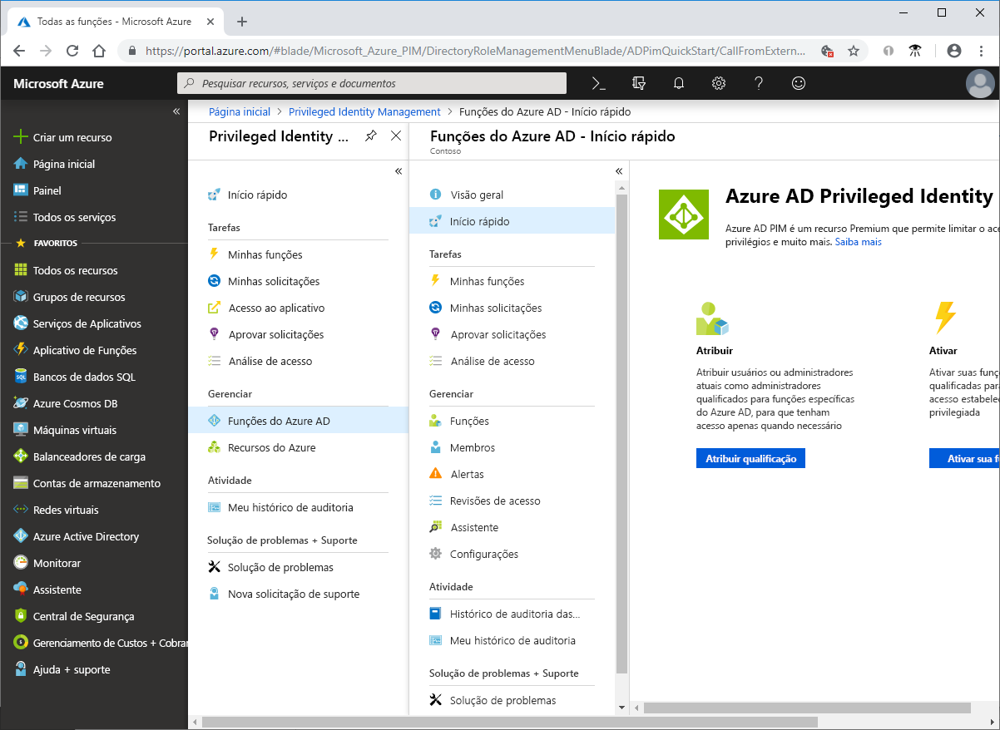

# O que é o Azure AD Privileged Identity Management?

O PIM (Privileged Identity Management) do Azure AD (Azure Active Directory) é um serviço que permite gerenciar, controlar e monitorar o acesso a importantes recursos em sua organização. Isso inclui o acesso a recursos no Azure AD, recursos do Azure e outros Microsoft Online Services, como o Office 365 ou o Microsoft Intune.

## Por que devo usar o PIM?

As empresas desejam minimizar o número de pessoas que têm acesso a informações seguras ou recursos, porque isso reduz a chance de um ator mal-intencionado obter esse tipo de acesso ou um usuário autorizado afetar acidentalmente um recurso confidencial. No entanto, os usuários ainda precisam executar operações privilegiadas em aplicativos do Azure AD, Azure, Office 365 ou SaaS. As organizações podem proporcionar aos usuários acesso privilegiado JIT (Just-In-Time) aos recursos do Azure e ao Azure AD. É preciso supervisionar o que esses usuários estão fazendo com seus privilégios de administrador. O PIM ajuda a reduzir o risco de direitos de acesso excessivos, desnecessários ou mal utilizados.

## O que posso fazer com o PIM?

O PIM, essencialmente, ajuda você a gerenciar quem, o que, quando, onde e por que para os recursos com os quais você se importa. Veja alguns dos principais recursos do PIM:

- Fornecer acesso privilegiado **just-in-time** ao Azure AD e aos recursos do Azure
- Atribua acesso com **limite de tempo** aos recursos usando as datas de início e término
- Exigir **aprovação** para ativar funções com privilégios
- Impor **autenticação multifator** para ativar qualquer função
- Usar **justificativa** para entender por que os usuários ativam
- Obter **notificações** quando as funções privilegiadas forem ativadas
- Realizar **revisões de acesso** para garantir que os usuários ainda precisem de funções
- Baixar o **histórico de auditoria** para auditoria interna ou externa

## Pré-requisitos

Para usar o PIM, é necessário ter uma das licenças pagas ou de versão de avaliação a seguir. Para obter mais informações, confira [O que é Azure Active Directory?](../fundamentals/active-directory-whatis.md).

- Azure AD Premium P2
- Enterprise Mobility + Security (EMS) E5

Para saber mais sobre licenças para usuários, confira [License requirements to use PIM](subscription-requirements.md) (Requisitos de licença para usar o PIM).

## Terminologia

Para entender melhor o PIM e sua documentação, examine os termos a seguir.

| Termo ou conceito | Categoria de atribuição de função | DESCRIÇÃO |
| --- | --- | --- |
| qualificado | Type | Uma atribuição de função que requer que um usuário execute uma ou mais ações para usá-la. Se um usuário se qualificou para uma função, isso significa que ele poderá ativá-la quando precisar executar tarefas privilegiadas. Não há nenhuma diferença no modo de acesso concedido a uma pessoa com uma atribuição de função permanente em comparação com uma qualificada. A única diferença é que algumas pessoas não precisam desse acesso o tempo todo. |
| ativo | Type | Uma atribuição de função que não requer que um usuário execute nenhuma ação para usar a função. Usuários atribuídos como ativos têm os privilégios atribuídos à função. |
| ativar |  | O processo de execução de uma ou mais ações a fim de usar uma função para a qual um usuário está qualificado. As ações podem incluir a execução de uma verificação de MDA (Autenticação Multifator), fornecimento de uma justificativa comercial ou solicitação de aprovação dos aprovadores designados. |
| atribuída | Estado | Um usuário que tem uma atribuição de função ativa. |
| ativada | Estado | Um usuário que tem uma atribuição de função qualificada, executou as ações para ativar a função e agora está ativo.  Depois que a função for ativada, o usuário poderá usar a função por um período pré-configurado antes de precisar ativá-la novamente. |
| qualificada permanentemente | Duration | Uma atribuição de função em que um usuário sempre está qualificado para ativar a função. |
| permanentemente ativa | Duration | Uma atribuição de função em que um usuário sempre pode usar a função sem executar nenhuma ação. |
| qualificado com expiração | Duration | Uma atribuição de função em que um usuário está qualificado para ativar a função dentro de uma data de início e término especificada. |
| ativo com expiração | Duration | Uma atribuição de função em que um usuário pode usar a função sem executar nenhuma ação dentro de uma data de início e término especificada. |
| Acesso JIT (Just-In-Time) |  | Um modelo no qual os usuários recebem permissões temporárias para executar tarefas privilegiadas, o que impede que usuários mal-intencionados ou não autorizados obtenham acesso após a expiração das permissões. O acesso é concedido somente quando os usuários precisam dele. |
| princípio de acesso de privilégios mínimos |  | Uma prática de segurança recomendada na qual todos os usuários recebem apenas os privilégios mínimos necessários para realizar as tarefas que estão autorizados a executar. Essa prática minimiza o número de Administradores Globais usando funções de administrador específicas para determinados cenários. |

## Como é a aparência do PIM?

Depois de configurar o PIM, você verá as opções **Tarefas**, **Gerenciar** e **Atividade** no menu de navegação esquerdo. Como administrador, você poderá escolher entre gerenciar **funções do Azure AD** e funções de **recursos do Azure**. Quando você escolhe o tipo de funções a ser gerenciado, você vê um conjunto semelhante de opções para esse tipo de função.

## Quem pode fazer o que no PIM?

Se você for a primeira pessoa a usar o PIM, receberá automaticamente as funções de [Administrador de Segurança](../users-groups-roles/directory-assign-admin-roles.md#security-administrator) e [Administrador de Função com Privilégios](../users-groups-roles/directory-assign-admin-roles.md#privileged-role-administrator) no diretório.

Para funções do Azure AD, apenas um usuário que está na função de Administrador de Função Privilegiada pode gerenciar atribuições para outros administradores no PIM. Você pode [conceder acesso a outros administradores para gerenciar o PIM](pim-how-to-give-access-to-pim.md). Os Administradores Globais, Administradores de Segurança e Leitores de Segurança podem exibir atribuições às funções do Azure AD no PIM.

Para funções de recurso do Azure, somente um administrador de assinatura, um Proprietário de recurso ou um Administrador de Acesso de Usuário de recursos pode gerenciar atribuições para outros administradores no PIM. Por padrão, o usuários que são Administradores de Funções com Privilégio, Administradores de Segurança ou Leitores de Segurança não têm acesso para exibir as atribuições a funções de recurso do Azure no PIM.

## Cenários

O PIM é compatível com os seguintes cenários:

**Como PRA (Administrador da Função com Privilégios), você pode:**

- Habilitar a aprovação para funções específicas
- Especificar usuários e/ou grupos aprovadores para aprovar solicitações
- Exibir o histórico de solicitações e aprovações de todas as funções com privilégios

**Como aprovador, você pode:**

- Exibir as aprovações pendentes (solicitações)
- Aprovar ou rejeitar solicitações de elevação de função (única e/ou em massa)
- Fornecer uma justificativa para minha aprovação/rejeição 

**Como usuário de função qualificado, você pode:**

- Solicitar a ativação de uma função que exige aprovação
- Exibir o status de sua solicitação a ser ativada
- Concluir a tarefa no Azure AD caso a ativação tenha sido aprovada

## Próximas etapas

- [Requisitos de licença para usar o PIM](subscription-requirements.md)
- [Protegendo o acesso privilegiado para implantações de nuvem e híbridos no Azure AD](../users-groups-roles/directory-admin-roles-secure.md?toc=%2fazure%2factive-directory%2fprivileged-identity-management%2ftoc.json)
- [Implantar o PIM](pim-deployment-plan.md)
