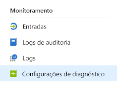
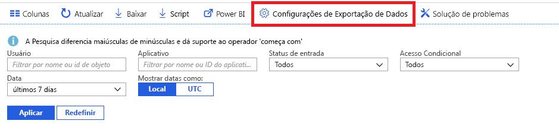

# O que é o monitoramento do Azure Active Directory? (versão prévia)

Com o monitoramento do Azure Active Directory (Azure AD), agora você pode rotear sua atividade do Azure AD logs para diferentes pontos de extremidade. Você pode mantê-lo para uso de longo prazo ou integrá-lo com ferramentas de gerenciamento de eventos e informações de segurança (SIEM) de terceiros para obter informações sobre seu ambiente.

No momento, você pode rotear os logs para:

- Uma conta de armazenamento do Azure.
- Um hub de eventos do Azure, para que você possa integrar suas instâncias de Splunk e Sumologic.
- Um espaço de trabalho do Log Analytics do Azure, no qual você pode analisar os dados, criar o painel e alertas para eventos específicos

> [!VIDEO https://www.youtube.com/embed/syT-9KNfug8]

[!INCLUDE [azure-monitor-log-analytics-rebrand](../../../includes/azure-monitor-log-analytics-rebrand.md)]

## Definição das configurações de diagnóstico

Para definir as configurações de monitoramento de logs de atividades do Azure AD, entre primeiro no [portal do Azure](https://portal.azure.com), em seguida, selecione **Azure Active Directory**. A partir daqui, você pode acessar a página de definição de configurações de diagnóstico de duas maneiras:

* Selecione **Configurações de diagnóstico**, na seção **Monitoramento**.

    
    
* Selecione **Logs de auditoria** ou **Entradas**, em seguida, selecione **Exportar configurações**. 

    

## Rotear logs para conta de armazenamento

Ao rotear os logs para uma conta de armazenamento do Azure, você pode mantê-los por um tempo maior que o período de retenção padrão descrito em nossas [políticas de retenção](reference-reports-data-retention.md). Saiba como [encaminhar os dados para sua conta de armazenamento](quickstart-azure-monitor-route-logs-to-storage-account.md).

## Transmitir por streaming logs para um hub de eventos

O roteamento de logs para um hub de eventos do Azure permite que você faça a integração com ferramentas SIEM de terceiros como Sumologic e Splunk. Essa integração permite combinar dados de log de atividades do Azure AD com outros dados gerenciados pelo seu SIEM para fornecer em informações mais avançadas sobre seu ambiente. Saiba como [enviar seus logs para um hub de eventos](tutorial-azure-monitor-stream-logs-to-event-hub.md).

## Enviar logs para os logs do Azure Monitor

Os [logs do Azure Monitor](https://docs.microsoft.com/azure/log-analytics/log-analytics-overview) são uma solução que consolida dados de monitoramento de diferentes fontes e fornece um mecanismo de análise e linguagem de consulta que fornece insights sobre a operação de seus aplicativos e seus recursos. Enviando os logs de atividades do Azure AD para os logs do Azure Monitor, você pode recuperar e monitorar os dados coletados rapidamente, além de fornecer alertas sobre eles. Saiba como [enviar dados para os logs do Azure Monitor](howto-integrate-activity-logs-with-log-analytics.md).

Você também pode instalar as exibições criadas previamente para logs de atividades do Azure AD para monitorar cenários comuns que envolvem entradas e eventos de auditoria. Saiba como [instalar e usar as exibições do Log Analytics para logs de atividades do Azure AD](howto-install-use-log-analytics-views.md).

## Próximas etapas

* [Logs de atividades no Azure Monitor](concept-activity-logs-azure-monitor.md)
* [Transmitir logs para um hub de eventos](tutorial-azure-monitor-stream-logs-to-event-hub.md)
* [Enviar logs para os logs do Azure Monitor](howto-integrate-activity-logs-with-log-analytics.md)
