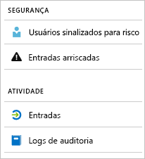

# O que são os relatórios do Azure Active Directory?

Os relatórios do Azure Active Directory (Azure AD) fornecem uma visão abrangente da atividade em seu ambiente. Os dados fornecidos permitem a você:

- Determinar como os aplicativos e serviços estão sendo utilizados pelos usuários
- Detectar possíveis riscos que afetem a integridade do seu ambiente
- Solucionar problemas que impedem a conclusão dos trabalhos pelos usuários  

A arquitetura de relatório se baseia em dois pilares principais:

- [Relatórios de segurança](#security-reports)
- [Relatórios de atividades](#activity-reports)

## Relatórios de segurança

Os relatórios de segurança ajudam a proteger as identidades da organização. Há dois tipos de relatórios de segurança:

- **Usuários sinalizados como risco**: no [relatório de usuários sinalizados como risco de segurança](concept-user-at-risk.md), obtenha uma visão geral das contas de usuário que podem ter sido comprometidas.

- **Entradas de risco**: com o [relatório de entradas de risco](concept-risky-sign-ins.md), você tem um indicador de tentativas de logon que pode ter sido realizadas por alguém que não é o proprietário legítimo de uma conta de usuário. 

### Qual licença do Azure AD você precisa para acessar a atividade de entrada?  

Todas as edições do Azure AD fornecem relatórios de usuários sinalizados como risco e de entradas de risco. No entanto, o nível de granularidade do relatório varia entre as edições: 

- Nas **edições do Azure Active Directory Gratuito e Básico**, você obtém uma lista de usuários sinalizados como risco e de entradas de risco. 

- A edição do **Azure Active Directory Premium 1** estende esse modelo, também permitindo que você examine alguns dos eventos de risco subjacentes que foram detectados para cada relatório. 

- A edição do **Azure Active Directory Premium 2** fornece as informações mais detalhadas sobre os eventos de risco subjacentes e também permite configurar políticas de segurança que atendem automaticamente a níveis de risco configurados.

## Relatórios de atividades

Os relatórios de atividade ajudam você a compreender o comportamento de usuários em sua organização. Há dois tipos de relatórios de atividade no Azure AD:

- **Trilhas de auditoria**: o [relatório de atividade das trilhas de auditoria](concept-audit-logs.md) fornece acesso ao histórico de todas as tarefas executadas em seu locatário.

- **Entradas**: com o [relatório de atividades de entradas](concept-sign-ins.md), você pode determinar quem realizou as tarefas indicadas pelo relatório das trilhas de auditoria.

### Relatório de logs de auditoria 

O [relatório das trilhas de auditoria](concept-audit-logs.md) fornece registros de atividades de sistema para fins de conformidade. Esses dados permitem abordar cenários comuns, como:

- Alguém em meu locatário tem acesso a um grupo de administração. Quem deu o acesso? 

- Quero saber a lista de usuários que estão entrando em um aplicativo específico, já que integrei o aplicativo recentemente e desejo saber se ele está tendo boa recepção

- Quero saber quantas redefinições de senha estão ocorrendo em meu locatário

#### Qual é a licença do Azure AD necessária para acessar o relatório das trilhas de auditoria?  

O relatório das trilhas de auditoria está disponível para os recursos para os quais você possui licenças. Se você tem uma licença para um recurso específico, também tem acesso às informações da trilha de auditoria dele. Para obter mais detalhes, veja [Recursos e funcionalidades do Azure Active Directory](https://www.microsoft.com/cloud-platform/azure-active-directory-features).   

### Relatório de entradas

O [relatório de entradas](concept-sign-ins.md) permite encontrar respostas para perguntas como:

- O que é o padrão de entrada de um usuário?
- Quantos usuários entraram em uma semana?
- Qual é o status dessas entradas?

#### Qual licença do Azure AD você precisa para acessar o relatório de atividades de entrada?  

Para acessar o relatório de atividades de entrada, seu locatário deve ter uma licença do Azure AD Premium associada a ele.

## Acesso Programático

Além da interface do usuário, o Azure AD também oferece a você [acesso programático](concept-reporting-api.md) aos dados de relatórios, por meio de um conjunto de APIs baseadas em REST. Você pode chamar essas APIs de várias ferramentas e linguagens de programação. 

## Próximas etapas

- [Relatório de entradas de risco](concept-risky-sign-ins.md)
- [Relatório de trilhas de auditoria](concept-audit-logs.md)
- [Relatório de logs de entrada](concept-sign-ins.md)
