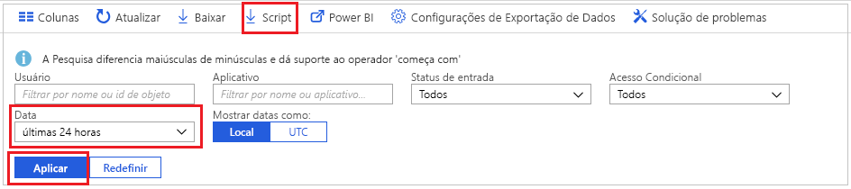
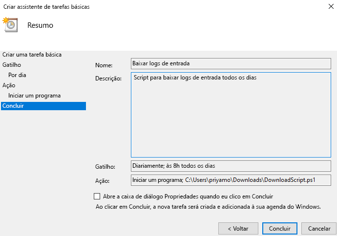

# Tutorial: Como baixar e usar um script para acessar logs de credenciais

Você pode baixar os dados de atividade de entrada se desejar trabalhar com eles fora do portal do Azure. A opção **Download** no portal do Azure cria um arquivo CSV contendo os 5000 registros mais recentes. Se você precisar de mais flexibilidade, por exemplo, para baixar mais de 5000 registros por vez, ou para baixar os logs em intervalos agendados, use o botão **Script** para gerar um script do PowerShell para baixar seus dados.

Neste tutorial, você aprenderá a gerar um script para baixar todos os logs de entrada das últimas 24 horas e agendar uma execução diária. 

## Pré-requisitos

Você precisa de

* Um locatário do Azure Active Directory com uma licença premium (P1/P2). Observe que, se você não tiver dados de atividades antes da atualização, serão necessários alguns dias para que os dados sejam exibidos nos relatórios depois que você atualizar para uma licença premium. 
* Um usuário, que está na função de **administrador global**, **administrador de segurança**, **leitor de segurança** ou **leitor de relatório** para o locatário. Além disso, qualquer usuário pode acessar suas próprias entradas. 
* Se você quiser executar o script baixado em seu computador com Windows 10, [configure o módulo do Azure PowerShell e defina a política de execução](concept-sign-ins.md#running-the-script-on-a-windows-10-machine).

## Tutorial

1. Navegue até o [portal do Azure](https://portal.azure.com) e selecione seu diretório.
2. Selecione **Azure Active Directory** e selecione **Entradas** na seção **Monitoramento**. 
3. Use o filtro de lista suspensa **Intervalo de Datas** e selecione **24 horas** para obter os dados das últimas 24 horas. 
4. Selecione **Aplicar** e verifique se o filtro foi aplicado conforme o esperado. 
5. Selecione **Script** no menu superior para baixar o script do Powershell com os filtros aplicados.

     
     
6. Abra o aplicativo **Agendador de Tarefas** em seu computador com Windows e selecione **Criar Tarefa Básica**.
7. Insira um nome e uma descrição para a tarefa e clique em **Avançar**.
8. Selecione o botão de opção **Diário** para permitir a execução diária da tarefa e insira a data e a hora de início.
9. No menu Ação, selecione **Iniciar um programa** e selecione o script baixado e **Avançar**. 
10. Examine a tarefa agendada e selecione **Concluir** para criar a tarefa.

     

Agora, sua tarefa será executada todos os dias e salvará os registros de entrada das últimas 24 horas em um arquivo no formato **AAD_SignInReport_YYYYMMDD_HHMMSS.csv**. Você também pode editar o script do PowerShell baixado para salvá-lo com um nome de arquivo diferente, ou para modificar o número de registros baixados. 

## Próximas etapas

* [Políticas de retenção de relatório do Azure Active Directory](reference-reports-data-retention.md)
* [Introdução à API de relatório do Azure Active Directory](concept-reporting-api.md)
* [Acessar a API de relatórios com certificados](tutorial-access-api-with-certificates.md)
