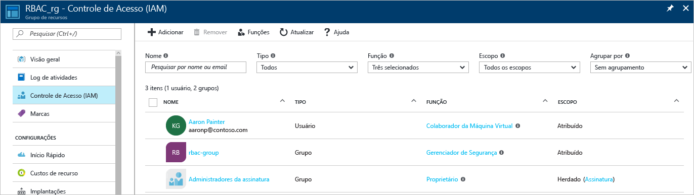
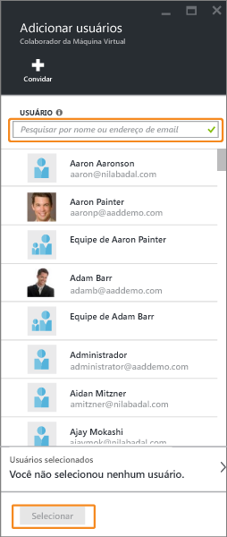
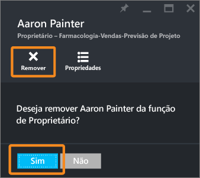
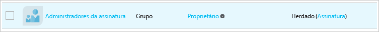

<properties
	pageTitle="Use o Controle de Acesso Baseado em Função no portal do Microsoft Azure | Microsoft Azure"
	description="Introdução ao gerenciamento de acesso com o Controle de Acesso Baseado em Função no Portal do Azure. Use as atribuições de função para atribuir permissões a seus recursos."
	services="active-directory"
	documentationCenter=""
	authors="kgremban"
	manager="femila"
	editor=""/>

<tags
	ms.service="active-directory"
	ms.devlang="na"
	ms.topic="get-started-article"
	ms.tgt_pltfrm="na"
	ms.workload="identity"
	ms.date="09/30/2016"
	ms.author="kgremban"/>

# Usar as atribuições de função para gerenciar o acesso aos recursos de assinatura do Azure

> [AZURE.SELECTOR]
- [Portal do Azure](role-based-access-control-azure-portal.md)
- [Portal clássico do Azure](role-based-access-control-configure.md)

O RBAC (controle de acesso baseado em função) do Azure permite o gerenciamento de acesso refinado para o Azure. Usando o RBAC, você pode conceder apenas a quantidade de acesso que os usuários precisam para realizar seus trabalhos. Este artigo ajuda você a começar a usar o RBAC no portal do Azure. Se você quiser saber mais sobre como o RBAC ajuda você a gerenciar o acesso, confira [O que é Controle de Acesso Baseado em Função](role-based-access-control-what-is.md).

## Exibir o acesso
Você pode ver quem tem acesso a um recurso, grupo de recursos ou assinatura em sua folha principal no [portal do Azure](https://portal.azure.com). Por exemplo, queremos ver quem tem acesso a um dos nossos grupos de recursos:

1. Selecione o ícone **Grupo de recursos** na barra de navegação à esquerda. 
2. Na folha **Grupos de recursos**, selecione o nome do grupo de recursos.
3. Selecione **Usuários** no canto superior direito da folha do grupo de recursos. 
4. A folha **Usuários** lista todos os usuários, grupos e aplicativos que receberam acesso ao grupo de recursos.

	

Observe que alguns usuários tiveram o acesso **Atribuído**, ao passo que outros o **Herdaram**. O acesso é atribuído especificamente ao grupo de recursos ou herdado de uma atribuição à assinatura pai.

> [AZURE.NOTE] Os administradores e coadministradores de assinatura clássicos são, na realidade, os proprietários da assinatura no novo modelo de RBAC.

## Adicionar acesso
Conceda acesso de dentro do recurso, do grupo de recursos ou da assinatura que é o escopo da atribuição de função.

1. Selecione **Adicionar** na folha **Usuários**. 
2. Selecione a função que você deseja atribuir na folha **Selecionar uma função**.
3. Selecione o usuário, o grupo ou o aplicativo ao qual você deseja conceder acesso. Você pode pesquisar o diretório por nomes para exibição, endereços de email e identificadores de objeto.

	

4. Selecione **OK** para criar a atribuição. O pop-up **Adicionando usuário** rastreia o progresso. 

Após a adição de uma atribuição de função com êxito, ela será exibida na folha **Usuários**.

## Remover acesso

1. Selecione a atribuição de função na folha **Usuários**.
2. Selecione **Remover** na folha detalhes de atribuição. 
3. Clique em **sim** para confirmar a remoção. 

Atribuições herdadas não podem ser removidas. Na imagem abaixo, observe que o botão Remover fica esmaecido. Em vez disso, examine o detalhe **Atribuído Em**. Vá para o recurso listado ali a fim de remover a atribuição de função.

## Outras ferramentas para gerenciar o acesso
Você pode atribuir funções e gerenciar o acesso com comandos do RBAC do Azure em ferramentas que não sejam o portal do Azure. Siga os links para saber mais sobre os pré-requisitos e começar a usar os comandos do RBAC do Azure.

- [PowerShell do Azure](role-based-access-control-manage-access-powershell.md)
- [Interface de linha de comando do Azure](role-based-access-control-manage-access-azure-cli.md)
- [API REST](role-based-access-control-manage-access-rest.md)

## Próximas etapas
- [Criar relatório de histórico de alterações de acesso](role-based-access-control-access-change-history-report.md)
- Confira as [Funções internas do RBAC do Azure](role-based-access-built-in-roles.md)
- Defina suas próprias [Funções personalizadas no RBAC do Azure](role-based-access-control-custom-roles.md)

<!---HONumber=AcomDC_1005_2016-->