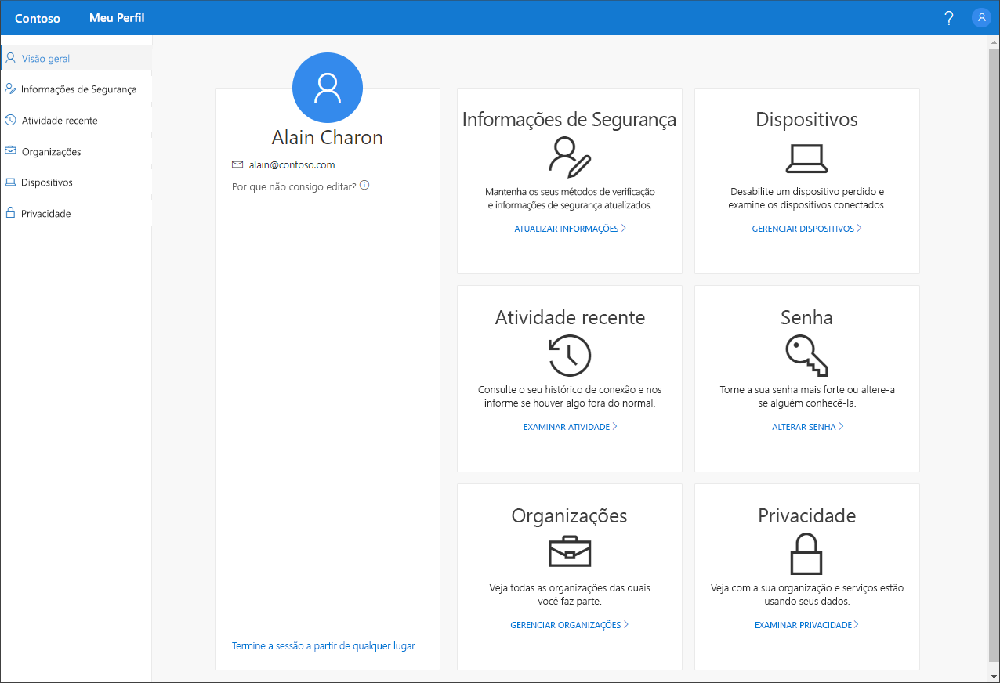

# Visão geral do portal Meu Perfil (versão prévia)

[!INCLUDE [preview-notice](../../../includes/active-directory-end-user-preview-notice-myprofile.md)]

Você pode usar o portal **Meu Perfil** (versão prévia) para gerenciar sua conta corporativa ou de estudante para:

- Configurar e gerenciar suas informações de segurança para verificação em duas etapas e redefinição de senha.

- Exibir sua atividade de entrada.

- Gerenciar seus dispositivos e organizações conectados.

- Exibir como a organização usa os dados.

>[!Important]
>Este conteúdo destina-se aos usuários. Se você for um administrador, é possível encontrar mais informações sobre como configurar e gerenciar seu ambiente do Azure Active Directory (Azure AD) na [Documentação do Azure Active Directory](https://docs.microsoft.com/azure/active-directory).

## Acessar o portal Meu Perfil
Você pode acessar o portal **Meu Perfil** acessando https://myprofile.microsoft.com, da versão atual de qualquer um dos seguintes navegadores:

- Chrome
- Microsoft Edge
- Safari
- Firefox
- Internet Explorer 11

    

## Nesta seção
Você pode encontrar mais informações sobre o portal **Meu Perfil** e suas páginas, nos artigos a seguir.

|Artigo |DESCRIÇÃO |
|------|------------|
|[Gerenciar suas informações de segurança (versão prévia)](user-help-security-info-overview.md)|Descreve como configurar e gerenciar suas informações de segurança.|
|[Exibir atividade de entrada recente](myprofile-portal-recent-activity-page.md)|Descreve como exibir a atividade de entrada recente para sua conta corporativa ou de estudante.|
|[Gerenciar suas organizações](myprofile-portal-organizations-page.md)|Descreve como gerenciar as organizações conectadas à sua conta corporativa ou de estudante.|
|[Gerenciar seus dispositivos conectados](myprofile-portal-devices-page.md)| Descreve como gerenciar os dispositivos que você conectou à sua conta corporativa ou de estudante.|
|[Exibir suas informações de privacidade](myprofile-portal-privacy-page.md)|Descreve como exibir o que sua organização faz com seus dados.|