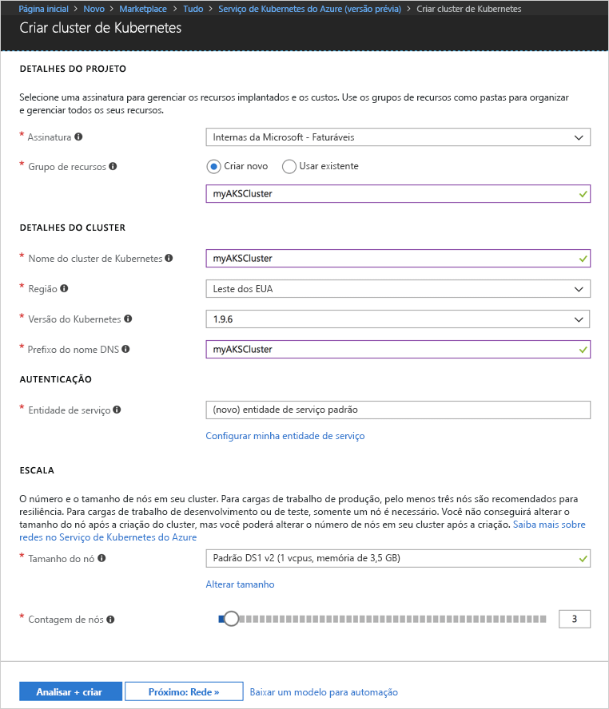
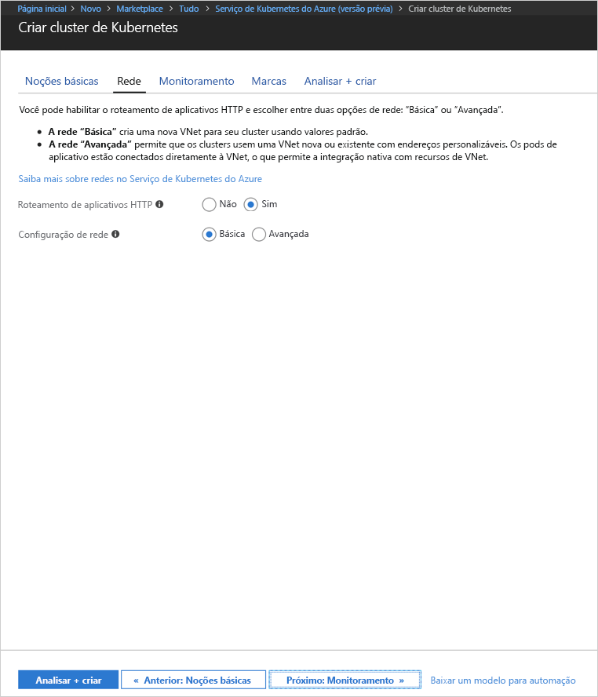
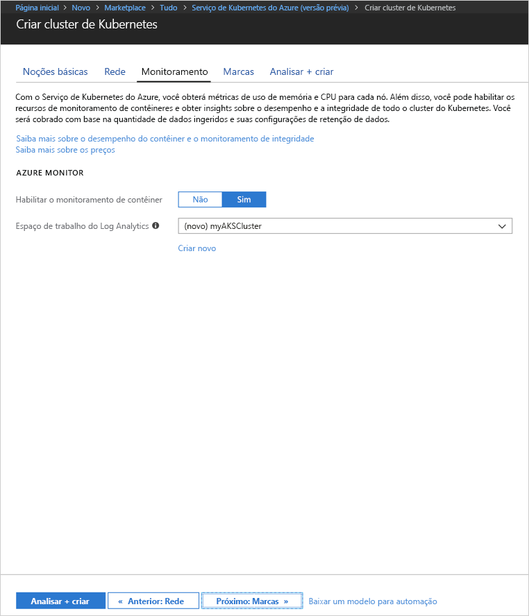
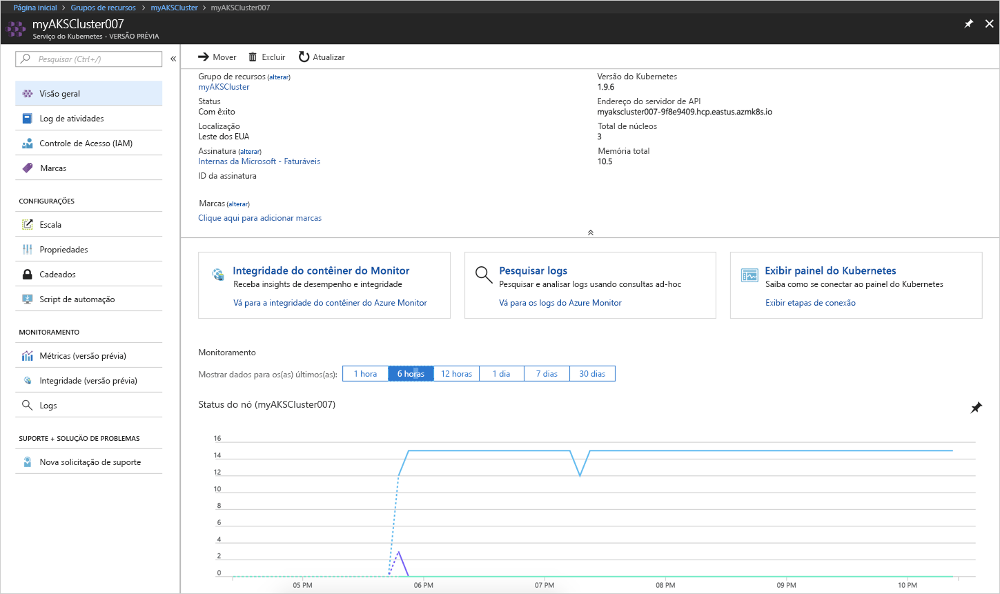
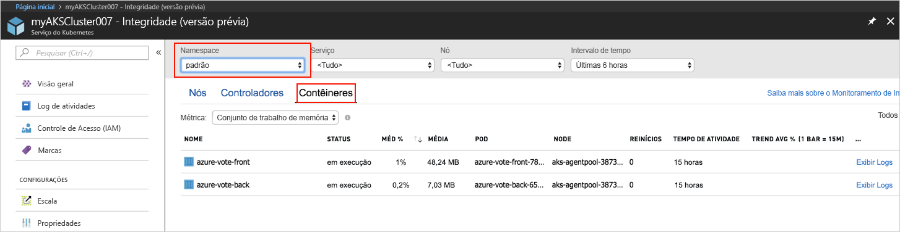
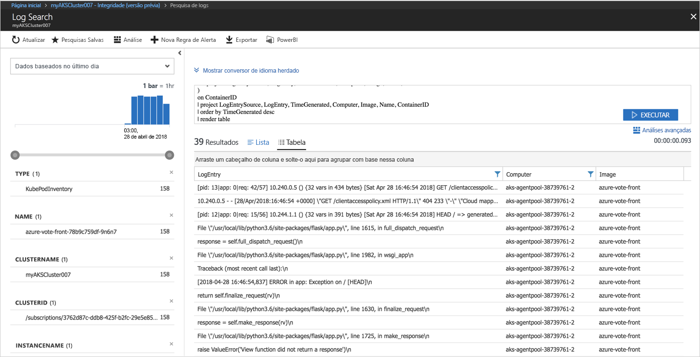

# <a name="quickstart-deploy-an-azure-kubernetes-service-aks-cluster"></a>Início Rápido: Implantar um cluster do Serviço de Kubernetes do Azure (AKS)

Neste guia de início rápido, implante um cluster AKS usando o Portal do Azure. Um aplicativo de vários contêineres composto por um front-end da Web e uma instância Redis é executado no cluster. Depois de concluído, o aplicativo pode ser acessado pela internet.


Este guia de início rápido pressupõe uma compreensão básica dos conceitos do Kubernetes. Para obter informações detalhadas sobre o Kubernetes, consulte a [documentação do Kubernetes][kubernetes-documentation].

## <a name="sign-in-to-azure"></a>Entrar no Azure

Entre no Portal do Azure em http://portal.azure.com.


## <a name="create-aks-cluster"></a>Criar cluster AKS

Escolha **Criar um recurso** > selecione **Serviço de Kubernetes** > **Criar**.

Conclua as seguintes etapas sob cada título do formulário de criação de cluster AKS.

- **DETALHES DO PROJETO**: selecione uma assinatura do Azure e um grupo de recursos do Azure novo ou existente.
- **DETALHES DO CLUSTER**: insira um nome, a região, a versão e o prefixo do nome DNS do cluster AKS.
- **AUTENTICAÇÃO**: crie uma nova entidade de serviço ou use uma existente. Ao usar um SPN existente, você precisa fornecer a ID e segredo de cliente do SPN.
- **ESCALA**: selecione um tamanho de VM para os nós de AKS. O tamanho da VM **não pode** ser alterado após a implantação de um cluster AKS. Além disso, selecione o número de nós para implantação no cluster. A contagem de nós **pode** ser ajustada após a implantação do cluster.

Selecione **Próximo: Rede** quando concluir.



Configure as seguintes opções de rede:

- **Roteamento de aplicativo HTTP**: configura um controlador de entrada integrado com a criação automática de nome DNS público. Para saber mais sobre o roteamento de Http, consulte [Roteamento de HTTP AKS e DNS][http-routing].
- **Configuração de rede**: escolha entre a configuração de rede básica usando o plug-in Kubernetes [kubenet][kubenet], ou a configuração avançada de rede usando a [CNI do Azure ][azure-cni]. Para saber mais sobre as opções de rede, confira a [Visão geral da rede AKS][aks-network].

Selecione **Próximo: Monitoramento** quando concluir.



Ao implantar um cluster AKS, o Insights de Contêiner do Azure pode ser configurado para monitorar a integridade do cluster AKS e pods em execução no cluster. Para saber mais sobre o monitoramento de integridade do contêiner, confira [Integridade do Serviço Kubernetes do Monitor do Azure][aks-monitor].

Selecione **Sim** para habilitar o monitoramento de contêiner, e selecione um espaço de trabalho existente do Log Analytics, ou crie um novo.

Selecione **Revisar+ Criar** e depois **Criar** quando terminar.



Após uma breve espera, o cluster AKS será implantado e estará pronto para uso. Navegue até o grupo de recursos de cluster AKS, selecione o recurso AKS e você deverá ver o painel do cluster AKS.



## <a name="connect-to-the-cluster"></a>Conectar-se ao cluster

Para gerenciar um cluster Kubernetes, use [kubectl][kubectl], o cliente de linha de comando Kubernetes. O cliente kubectl está pré-instalado no Azure Cloud Shell.

Abra o Cloud Shell usando o botão no canto superior direito do Portal do Azure.


Use o comando [az aks get-credentials][az-aks-get-credentials] para configurar o kubectil para conectar-se ao seu cluster do Kubernetes.

Copie e cole o seguinte comando para o Cloud Shell. Se necessário, modifique o nome do cluster e do grupo de recursos.

```azurecli-interactive
az aks get-credentials --resource-group myAKSCluster --name myAKSCluster
```

Para verificar a conexão ao seu cluster, use o comando [kubectl get][kubectl-get] para retornar uma lista de nós do cluster.

```azurecli-interactive
kubectl get nodes
```

Saída:

```
NAME                       STATUS    ROLES     AGE       VERSION
aks-agentpool-11482510-0   Ready     agent     9m        v1.9.6
aks-agentpool-11482510-1   Ready     agent     8m        v1.9.6
aks-agentpool-11482510-2   Ready     agent     9m        v1.9.6
```

## <a name="run-the-application"></a>Executar o aplicativo

Arquivos de manifesto Kubernetes definem um estado desejado para um cluster, incluindo as imagens de contêiner que devem estar em execução. Neste exemplo, um manifesto é usado para criar todos os objetos necessários para executar o aplicativo Azure Vote. Esses objetos incluem duas [Implantações de Kubernetes][kubernetes-deployment], uma para o front-end do Azure Vote e outra para uma instância do Redis. Além disso, dois [Serviços Kubernetes][kubernetes-service] são criados, um serviço interno para a instância do Redis, e um serviço externo para acessar o aplicativo Azure Vote na internet.

Crie um arquivo chamado `azure-vote.yaml` e copie-o para o código YAML a seguir. Se você estiver trabalhando no Azure Cloud Shell, crie o arquivo usando o vi ou Nano, como se estivesse trabalhando em um sistema físico ou virtual.

```yaml
apiVersion: apps/v1beta1
kind: Deployment
metadata:
  name: azure-vote-back
spec:
  replicas: 1
  template:
    metadata:
      labels:
        app: azure-vote-back
    spec:
      containers:
      - name: azure-vote-back
        image: redis
        ports:
        - containerPort: 6379
          name: redis
---
apiVersion: v1
kind: Service
metadata:
  name: azure-vote-back
spec:
  ports:
  - port: 6379
  selector:
    app: azure-vote-back
---
apiVersion: apps/v1beta1
kind: Deployment
metadata:
  name: azure-vote-front
spec:
  replicas: 1
  template:
    metadata:
      labels:
        app: azure-vote-front
    spec:
      containers:
      - name: azure-vote-front
        image: microsoft/azure-vote-front:v1
        ports:
        - containerPort: 80
        env:
        - name: REDIS
          value: "azure-vote-back"
---
apiVersion: v1
kind: Service
metadata:
  name: azure-vote-front
spec:
  type: LoadBalancer
  ports:
  - port: 80
  selector:
    app: azure-vote-front
```

Use o comando [kubectl apply][kubectl-apply] para executar o aplicativo.

```azurecli-interactive
kubectl apply -f azure-vote.yaml
```

Saída:

```
deployment "azure-vote-back" created
service "azure-vote-back" created
deployment "azure-vote-front" created
service "azure-vote-front" created
```

## <a name="test-the-application"></a>Testar o aplicativo

Conforme o aplicativo é executado, um [serviço Kubernetes][kubernetes-service] é criado para expor o aplicativo à Internet. A conclusão desse processo pode levar alguns minutos.

Para monitorar o andamento, use o comando [kubectl get service][kubectl-get] com o argumento `--watch`.

```azurecli-interactive
kubectl get service azure-vote-front --watch
```

Inicialmente, o *EXTERNAL -IP* para o serviço *azure-vote-front* aparece como *pendente*.

```
NAME               TYPE           CLUSTER-IP   EXTERNAL-IP   PORT(S)        AGE
azure-vote-front   LoadBalancer   10.0.37.27   <pending>     80:30572/TCP   6s
```

Depois que o endereço *EXTERNAL-IP* for alterado de *pendente* para um *endereço IP*, use `CTRL-C` para interromper o processo kubectl watch.

```
azure-vote-front   LoadBalancer   10.0.37.27   52.179.23.131   80:30572/TCP   2m
```

Agora, vá até o endereço IP externo a fim de ver o aplicativo Azure Vote.


## <a name="monitor-health-and-logs"></a>Monitorar integridade e logs

Se o monitoramento de informações do contêiner tiver sido habilitado, métricas de integridade para o cluster AKS e pods em execução no cluster estarão disponíveis no painel do cluster AKS. Para saber mais sobre o monitoramento de integridade do contêiner, confira [Integridade do Serviço Kubernetes do Monitor do Azure][aks-monitor].

Para ver o status, o tempo de atividade e o uso de recursos atuais dos pods do Azure Vote, navegue de volta até o recurso AKS, selecione **Monitorar Integridade do Contêiner** > selecione o namespace **padrão** > e selecione **Contêineres**. Talvez demore alguns minutos para que esses dados sejam preenchidos no Portal do Azure.



Para ver logs do pod `azure-vote-front`, selecione o link **Exibir Logs**. Esses logs incluem os fluxos stdout e stderr do contêiner.



## <a name="delete-cluster"></a>Excluir cluster

Quando o cluster não for mais necessário, exclua o recurso de cluster, o que excluirá todos os recursos associados. Essa operação pode ser concluída no Portal do Azure selecionando o botão Excluir no painel do cluster AKS. Como alternativa, o comando [az aks delete][az-aks-delete] pode ser usado no Cloud Shell.

```azurecli-interactive
az aks delete --resource-group myAKSCluster --name myAKSCluster --no-wait
```

## <a name="get-the-code"></a>Obter o código

Neste guia de início rápido, foram usadas imagens de contêiner criadas previamente para criar uma implantação de Kubernetes. O código de aplicativo relacionado, o Dockerfile e o arquivo de manifesto Kubernetes estão disponíveis no GitHub.

[https://github.com/Azure-Samples/azure-voting-app-redis][azure-vote-app]

## <a name="next-steps"></a>Próximas etapas

Neste início rápido, você implantou um cluster Kubernetes e um aplicativo de com vários contêineres nele.

Para saber mais sobre o AKS e percorrer um código completo de exemplo de implantação, prossiga para o tutorial de cluster Kubernetes.

> [!div class="nextstepaction"]
> [Tutorial do AKS][aks-tutorial]

<!-- LINKS - external -->
[azure-vote-app]: https://github.com/Azure-Samples/azure-voting-app-redis.git
[azure-cni]: https://github.com/Azure/azure-container-networking/blob/master/docs/cni.md
[kubectl]: https://kubernetes.io/docs/user-guide/kubectl/
[kubectl-apply]: https://kubernetes.io/docs/reference/generated/kubectl/kubectl-commands#apply
[kubectl-get]: https://kubernetes.io/docs/reference/generated/kubectl/kubectl-commands#get
[kubenet]: https://kubernetes.io/docs/concepts/cluster-administration/network-plugins/#kubenet
[kubernetes-deployment]: https://kubernetes.io/docs/concepts/workloads/controllers/deployment/
[kubernetes-documentation]: https://kubernetes.io/docs/home/
[kubernetes-service]: https://kubernetes.io/docs/concepts/services-networking/service/

<!-- LINKS - internal -->
[az-aks-get-credentials]: /cli/azure/aks?view=azure-cli-latest#az_aks_get_credentials
[az-aks-delete]: /cli/azure/aks#az-aks-delete
[aks-monitor]: ../monitoring/monitoring-container-health.md
[aks-network]: ./networking-overview.md
[aks-tutorial]: ./tutorial-kubernetes-prepare-app.md
[http-routing]: ./http-application-routing.md
