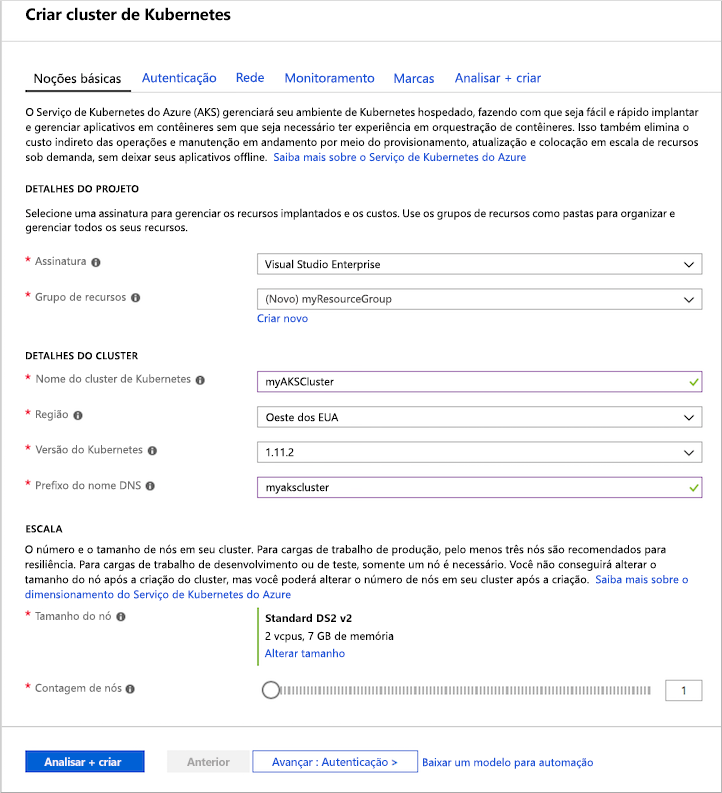
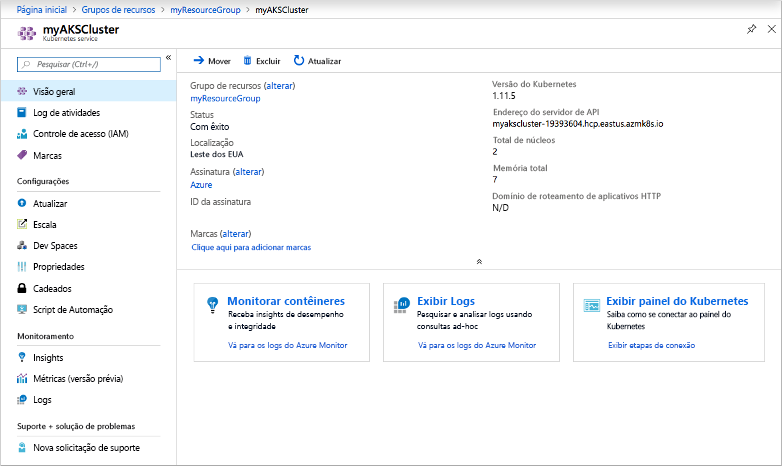
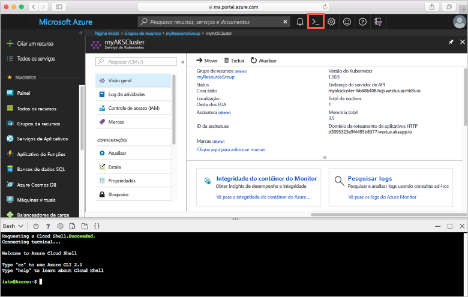
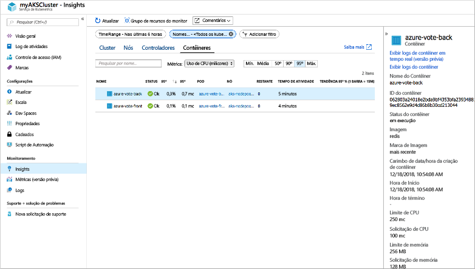
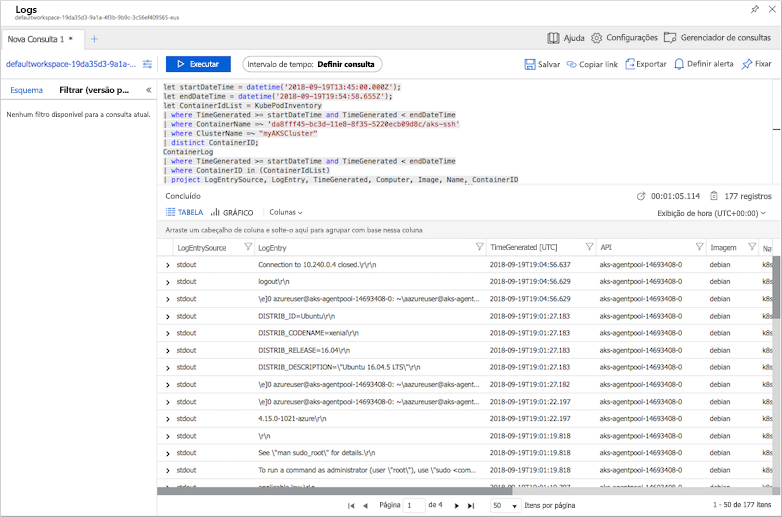

# <a name="quickstart-deploy-an-azure-kubernetes-service-aks-cluster"></a>Início Rápido: Implantar um cluster do Serviço de Kubernetes do Azure (AKS)

Neste guia de início rápido, implante um cluster AKS usando o Portal do Azure. Um aplicativo de vários contêineres composto por um front-end da Web e uma instância Redis é executado no cluster. Depois de concluído, o aplicativo pode ser acessado pela internet.


Este guia de início rápido pressupõe uma compreensão básica dos conceitos do Kubernetes. Para obter informações detalhadas sobre o Kubernetes, consulte a [documentação do Kubernetes][kubernetes-documentation].

Se você não tiver uma assinatura do Azure, crie uma [conta gratuita](https://azure.microsoft.com/free/?WT.mc_id=A261C142F) antes de começar.

## <a name="sign-in-to-azure"></a>Entrar no Azure

Entre no Portal do Azure em http://portal.azure.com.

## <a name="create-an-aks-cluster"></a>Criar um cluster AKS

No canto superior esquerdo do portal do Azure, selecione **Criar um recurso** > **Serviço Kubernetes**.

Para criar um cluster do AKS, conclua as seguintes etapas:

1. **Noções básicas** – Configure as seguintes opções:
    - *DETALHES DO PROJETO*: selecione uma assinatura do Azure e selecione ou crie um grupo de recursos do Azure, por exemplo, *myResourceGroup*. Insira um **nome do cluster do Kubernetes**, como *myAKSCluster*.
    - *DETALHES DO CLUSTER*: selecione uma região, a versão do Kubernetes e o prefixo de nome DNS para o cluster do AKS.
    - *ESCALA*: selecione um tamanho de VM para os nós de AKS. O tamanho da VM **não pode** ser alterado após a implantação de um cluster AKS.
        - Selecione o número de nós para implantação no cluster. Para este início rápido, defina **Contagem de nós** como *1*. A contagem de nós **pode** ser ajustada após a implantação do cluster.
    
    

    Selecione **Avançar: Autenticação** ao concluir.

1. **Autenticação** – Configure as seguintes opções:
    - Crie uma nova entidade de serviço ou use a opção *Configurar* para usar uma existente. Ao usar um SPN existente, você precisa fornecer a ID e segredo de cliente do SPN.
    - Habilite a opção para RBAC (controle de acesso baseado em função) do Kubernetes. Esses controles fornecem controle mais refinado sobre o acesso aos recursos do Kubernetes implantados no cluster do AKS.

    Selecione **Próximo: Rede** quando concluir.

1. **Rede** – Configure as seguintes opções de rede, que devem ser definidas como padrão:
    
    - **Encaminhamento de aplicativo HTTP**: selecione **Sim** para configurar um controlador de entrada integrado com criação automática de nome DNS público. Para saber mais sobre o roteamento de Http, consulte [Roteamento de HTTP AKS e DNS][http-routing].
    - **Configuração de rede**: selecione a configuração de rede **Básica** usando o plug-in Kubernetes [kubenet][kubenet] em vez da configuração de rede avançada usando a [CNI do Azure][azure-cni]. Para saber mais sobre as opções de rede, confira a [Visão geral da rede AKS][aks-network].
    
    Selecione **Próximo: Monitoramento** quando concluir.

1. Ao implantar um cluster do AKS, o Azure Monitor para contêineres pode ser configurado para monitorar a integridade do cluster do AKS e dos pods em execução no cluster. Para saber mais sobre o monitoramento de integridade do contêiner, confira [Integridade do Serviço Kubernetes do Monitor do Azure][aks-monitor].

    Selecione **Sim** para habilitar o monitoramento de contêiner, e selecione um workspace existente do Log Analytics, ou crie um novo.
    
    Selecione **Revisar+ Criar** e depois **Criar** quando estiver pronto.

Demora alguns minutos para o cluster do AKS ser criado e ficar pronto para uso. Navegue para o grupo de recursos do cluster do AKS, como *myResourceGroup*, e selecione o recurso do AKS, como *myAKSCluster*. O painel do cluster do AKS é mostrado como na seguinte captura de tela de exemplo:



## <a name="connect-to-the-cluster"></a>Conectar-se ao cluster

Para gerenciar um cluster Kubernetes, use [kubectl][kubectl], o cliente de linha de comando Kubernetes. O cliente `kubectl` está pré-instalado no Azure Cloud Shell.

Abra o Cloud Shell usando o botão no canto superior direito do Portal do Azure.



Use o comando [az aks get-credentials][az-aks-get-credentials] para configurar `kubectl` e se conectar ao seu cluster do Kubernetes. O exemplo a seguir obtém as credenciais para o nome do cluster *myAKSCluster* no grupo de recursos chamado *myResourceGroup*:

```azurecli-interactive
az aks get-credentials --resource-group myResourceGroup --name myAKSCluster
```

Para verificar a conexão ao seu cluster, use o comando [kubectl get][kubectl-get] para retornar uma lista de nós do cluster.

```azurecli-interactive
kubectl get nodes
```

A saída de exemplo a seguir mostra o único nó criado nas etapas anteriores.

```
NAME                       STATUS    ROLES     AGE       VERSION
aks-agentpool-14693408-0   Ready     agent     10m       v1.11.2
```

## <a name="run-the-application"></a>Executar o aplicativo

Arquivos de manifesto Kubernetes definem um estado desejado para um cluster, incluindo as imagens de contêiner que devem estar em execução. Neste início rápido, um manifesto é usado para criar todos os objetos necessários para executar um aplicativo Azure Vote de exemplo. Esses objetos incluem duas [Implantações de Kubernetes][kubernetes-deployment]: uma para o front-end do Azure Vote e outra para uma instância do Redis. Além disso, dois [Serviços Kubernetes][kubernetes-service] são criados: um serviço interno para a instância do Redis e um serviço externo para acessar o aplicativo Azure Vote na internet.

> [!TIP]
> Neste início rápido, você criará e implantará manualmente seus manifestos de aplicativo no cluster AKS. Em mais cenários do mundo real, você pode usar o [Azure Dev Spaces][azure-dev-spaces] para iterar e depurar seu código rápida e diretamente no cluster AKS. Você pode usar o Dev Spaces em várias plataformas de sistema operacional e ambientes de desenvolvimento e trabalhar em conjunto com outras pessoas de sua equipe.

Crie um arquivo chamado `azure-vote.yaml` e copie-o para o código YAML a seguir. Se você estiver trabalhando no Azure Cloud Shell, crie o arquivo usando `vi` ou `Nano`, como se estivesse trabalhando em um sistema físico ou virtual.

```yaml
apiVersion: apps/v1
kind: Deployment
metadata:
  name: azure-vote-back
spec:
  replicas: 1
  selector:
    matchLabels:
      app: azure-vote-back
  template:
    metadata:
      labels:
        app: azure-vote-back
    spec:
      containers:
      - name: azure-vote-back
        image: redis
        resources:
          requests:
            cpu: 100m
            memory: 128Mi
          limits:
            cpu: 250m
            memory: 256Mi
        ports:
        - containerPort: 6379
          name: redis
---
apiVersion: v1
kind: Service
metadata:
  name: azure-vote-back
spec:
  ports:
  - port: 6379
  selector:
    app: azure-vote-back
---
apiVersion: apps/v1
kind: Deployment
metadata:
  name: azure-vote-front
spec:
  replicas: 1
  selector:
    matchLabels:
      app: azure-vote-front
  template:
    metadata:
      labels:
        app: azure-vote-front
    spec:
      containers:
      - name: azure-vote-front
        image: microsoft/azure-vote-front:v1
        resources:
          requests:
            cpu: 100m
            memory: 128Mi
          limits:
            cpu: 250m
            memory: 256Mi
        ports:
        - containerPort: 80
        env:
        - name: REDIS
          value: "azure-vote-back"
---
apiVersion: v1
kind: Service
metadata:
  name: azure-vote-front
spec:
  type: LoadBalancer
  ports:
  - port: 80
  selector:
    app: azure-vote-front
```

Use o comando [kubectl apply][kubectl-apply] para executar o aplicativo.

```azurecli-interactive
kubectl create -f azure-vote.yaml
```

A saída de exemplo abaixo mostra os recursos de Kubernetes criados no cluster do AKS:

```
deployment "azure-vote-back" created
service "azure-vote-back" created
deployment "azure-vote-front" created
service "azure-vote-front" created
```

## <a name="test-the-application"></a>Testar o aplicativo

Conforme o aplicativo é executado, um [serviço Kubernetes][kubernetes-service] é criado para expor o aplicativo à Internet. A conclusão desse processo pode levar alguns minutos.

Para monitorar o andamento, use o comando [kubectl get service][kubectl-get] com o argumento `--watch`.

```azurecli-interactive
kubectl get service azure-vote-front --watch
```

Inicialmente, o *EXTERNAL -IP* para o serviço *azure-vote-front* aparece como *pendente*.

```
NAME               TYPE           CLUSTER-IP   EXTERNAL-IP   PORT(S)        AGE
azure-vote-front   LoadBalancer   10.0.37.27   <pending>     80:30572/TCP   6s
```

Depois que o endereço *EXTERNAL-IP* for alterado de *pendente* para um *endereço IP*, use `CTRL-C` para interromper o processo kubectl watch.

```
azure-vote-front   LoadBalancer   10.0.37.27   52.179.23.131   80:30572/TCP   2m
```

Abra o endereço IP externo de seu serviço em um navegador para ver o aplicativo Azure Vote, conforme mostrado no exemplo abaixo:


## <a name="monitor-health-and-logs"></a>Monitorar integridade e logs

Quando você criou o cluster, o monitoramento de insights do contêiner foi habilitado. Esse recurso de monitoramento fornece métricas de integridade para o cluster do AKS e pods em execução no cluster. Para saber mais sobre o monitoramento de integridade do contêiner, confira [Integridade do Serviço Kubernetes do Monitor do Azure][aks-monitor].

Talvez demore alguns minutos para que esses dados sejam preenchidos no Portal do Azure. Para ver o status atual, o tempo de atividade e o uso de recursos dos pods do Azure Vote, navegue para o recurso de AKS no portal do Azure, por exemplo, *myAKSCluster*. Em seguida, você pode acessar o status da integridade da seguinte maneira:

1. Em **Monitoramento**, no lado esquerdo, escolha **Insights (versão prévia)**
1. Na parte superior, escolha **+ Adicionar Filtro**
1. Selecione *Namespace* como a propriedade e, em seguida, escolha *\<Todos exceto kube-system\>*
1. Escolha exibir os **Contêineres**.

Os contêineres *azure-vote-back* e *azure-vote-front* são exibidos, conforme mostrado no exemplo a seguir:



Para ver os logs do pod `azure-vote-front`, selecione o link **Exibir logs de contêiner** no lado direito da lista de contêineres. Esses logs incluem os fluxos *stdout* e *stderr* do contêiner.



## <a name="delete-cluster"></a>Excluir cluster

Quando o cluster não for mais necessário, exclua o recurso de cluster, o que excluirá todos os recursos associados. Essa operação pode ser concluída no portal do Azure selecionando o botão **Excluir** no painel do cluster do AKS. Como alternativa, o comando [az aks delete][az-aks-delete] pode ser usado no Cloud Shell:

```azurecli-interactive
az aks delete --resource-group myResourceGroup --name myAKSCluster --no-wait
```

> [!NOTE]
> Quando você excluir o cluster, a entidade de serviço do Azure Active Directory usada pelo cluster do AKS não será removida. Para obter etapas sobre como remover a entidade de serviço, veja [Considerações sobre a entidade de segurança e a exclusão de serviço AKS][sp-delete].

## <a name="get-the-code"></a>Obter o código

Neste guia de início rápido, foram usadas imagens de contêiner criadas previamente para criar uma implantação de Kubernetes. O código de aplicativo relacionado, o Dockerfile e o arquivo de manifesto Kubernetes estão disponíveis no GitHub.

[https://github.com/Azure-Samples/azure-voting-app-redis][azure-vote-app]

## <a name="next-steps"></a>Próximas etapas

Neste início rápido, você implantou um cluster Kubernetes e um aplicativo de com vários contêineres nele.

Para saber mais sobre o AKS e percorrer um código completo de exemplo de implantação, prossiga para o tutorial de cluster Kubernetes.

> [!div class="nextstepaction"]
> [Tutorial do AKS][aks-tutorial]

<!-- LINKS - external -->
[azure-vote-app]: https://github.com/Azure-Samples/azure-voting-app-redis.git
[azure-cni]: https://github.com/Azure/azure-container-networking/blob/master/docs/cni.md
[kubectl]: https://kubernetes.io/docs/user-guide/kubectl/
[kubectl-apply]: https://kubernetes.io/docs/reference/generated/kubectl/kubectl-commands#apply
[kubectl-get]: https://kubernetes.io/docs/reference/generated/kubectl/kubectl-commands#get
[kubenet]: https://kubernetes.io/docs/concepts/cluster-administration/network-plugins/#kubenet
[kubernetes-deployment]: https://kubernetes.io/docs/concepts/workloads/controllers/deployment/
[kubernetes-documentation]: https://kubernetes.io/docs/home/
[kubernetes-service]: https://kubernetes.io/docs/concepts/services-networking/service/

<!-- LINKS - internal -->
[az-aks-get-credentials]: /cli/azure/aks?view=azure-cli-latest#az-aks-get-credentials
[az-aks-delete]: /cli/azure/aks#az-aks-delete
[aks-monitor]: ../monitoring/monitoring-container-health.md
[aks-network]: ./concepts-network.md
[aks-tutorial]: ./tutorial-kubernetes-prepare-app.md
[http-routing]: ./http-application-routing.md
[sp-delete]: kubernetes-service-principal.md#additional-considerations
[azure-dev-spaces]: https://docs.microsoft.com/azure/dev-spaces/
