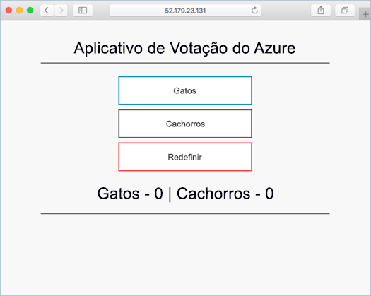
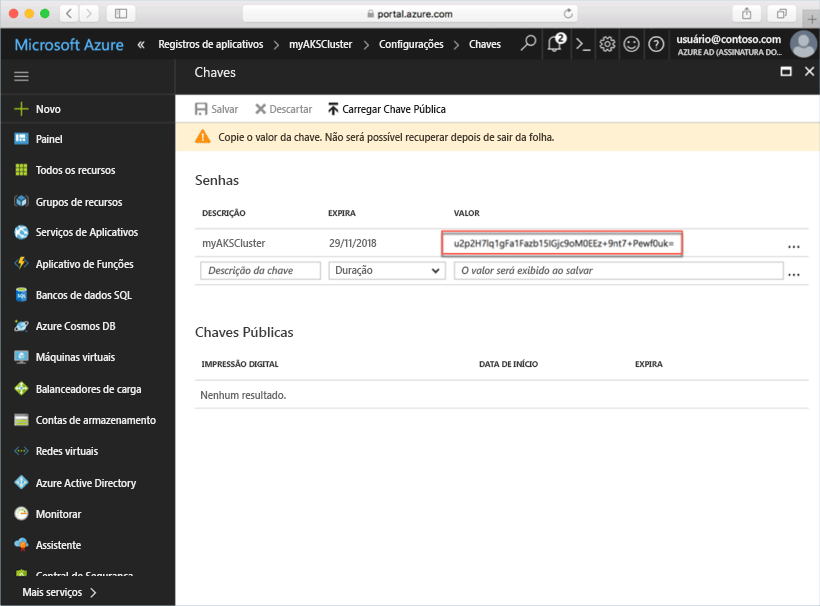
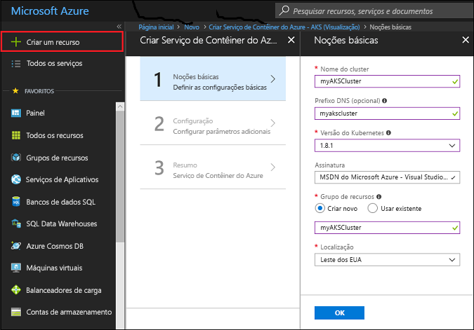
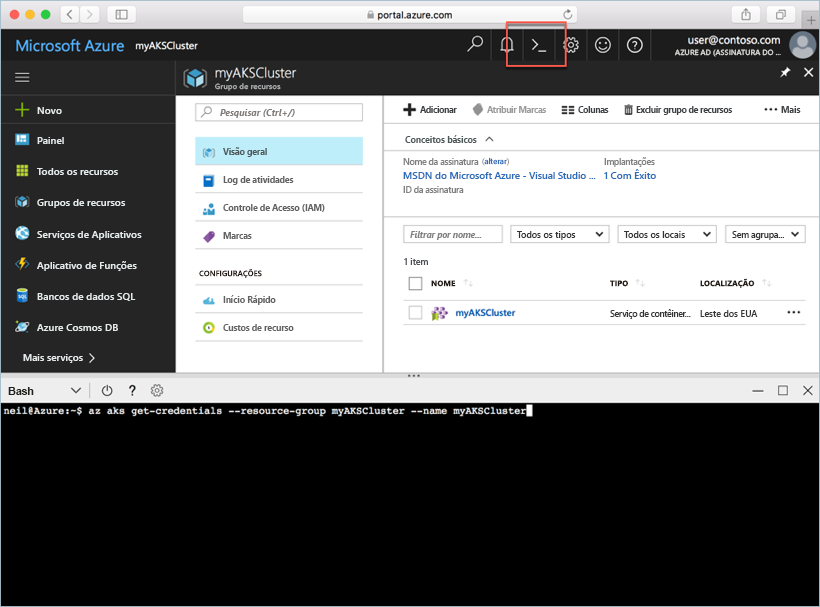

# <a name="deploy-an-azure-container-service-aks-cluster"></a>Implantar um cluster do AKS (Serviço de Contêiner do Azure)

Neste guia de início rápido, implante um cluster AKS usando o Portal do Azure. Um aplicativo de vários contêineres composto por um front-end da Web e uma instância Redis é executado no cluster. Depois de concluído, o aplicativo pode ser acessado pela internet.



Este guia de início rápido pressupõe uma compreensão básica dos conceitos do Kubernetes. Para obter informações detalhadas sobre o Kubernetes, consulte a [documentação do Kubernetes][kubernetes-documentation].

## <a name="sign-in-to-azure"></a>Entrar no Azure

Entre no Portal do Azure em http://portal.azure.com.

## <a name="create-service-principal"></a>Criar uma entidade de serviço

Antes de criar o cluster AKS no Portal do Azure, é necessário criar uma entidade de serviço. O Azure usa esta entidade de serviço para gerenciar a infraestrutura associada ao cluster AKS.

Selecione **Azure Active Directory** > **Registros do aplicativo** > **Novo registro do aplicativo**.

Insira um nome para o aplicativo; pode ser qualquer valor. Selecione **Aplicativo Web/API** como o tipo de aplicativo. Insira um valor para a **URL de logon**; pode ser qualquer valor em um formato de URL válido, mas não precisa ser um ponto de extremidade real.

Selecione **Criar** quando terminar.


Selecione o registro do aplicativo recém-criado e anote a ID do aplicativo. Esse valor é necessário ao criar o cluster AKS.


Em seguida, é necessário criar uma senha para a entidade de serviço. Selecione **Todas as configurações** > **Chaves** e insira qualquer valor para a descrição da chave. Selecione uma duração, que é o tempo durante o qual a entidade de serviço é válida.

Clique em **Salvar** e anote o valor da senha. A senha é necessária ao criar um cluster AKS.



## <a name="create-aks-cluster"></a>Criar cluster AKS

Selecione **Novo** > **Contêineres** > **Serviço de Contêiner do Azure – AKS (versão prévia)**.

Forneça um nome do cluster, um prefixo DNS, um nome do grupo de recursos, um local e a versão do Kubernetes para o cluster. Anote o nome do cluster e o nome do grupo de recursos, eles serão necessários ao se conectar ao cluster.

Selecione **OK** quando concluir.



No formulário de configuração, insira o seguinte:

- Nome de usuário – o nome fornecido para as contas administrativas em nós de cluster.
- Chave pública do SSH – associada à chave que será usada para acessar os nós de cluster.
- ID do cliente da entidade de serviço – a ID do aplicativo da entidade de serviço criada anteriormente neste documento.
- Segredo do cliente da entidade de serviço – a senha da entidade de serviço criada anteriormente neste documento.
- Contagem de nós – número de nós AKS para a serem criados.
- Tamanho da máquina virtual de nó – o tamanho da VM para os nós AKS
- Tamanho do disco do sistema operacional – tamanho do disco do sistema operacional dos nós AKS.

Selecione **OK** ao concluir e **OK** novamente após a validação ser concluída.


Após uma breve espera, o cluster ASK será implantado e estará pronto para uso.

## <a name="connect-to-the-cluster"></a>Conectar-se ao cluster

Para gerenciar um cluster Kubernetes, use [kubectl][kubectl], o cliente de linha de comando Kubernetes. O cliente kubectl está pré-instalado no Azure Cloud Shell.

Abra o Cloud Shell usando o botão no canto superior direito do Portal do Azure.



Use o comando [az aks get-credentials][az-aks-get-credentials] para configurar o kubectil para conectar-se ao seu cluster do Kubernetes.

Copie e cole o seguinte comando para o Cloud Shell. Se necessário, modifique o nome do cluster e do grupo de recursos.

```azurecli-interactive
az aks get-credentials --resource-group myAKSCluster --name myAKSCluster
```

Para verificar a conexão ao seu cluster, use o comando [kubectl get][kubectl-get] para retornar uma lista de nós do cluster.

```azurecli-interactive
kubectl get nodes
```

Saída:

```
NAME                       STATUS    ROLES     AGE       VERSION
aks-agentpool-14693408-0   Ready     agent     6m        v1.8.1
aks-agentpool-14693408-1   Ready     agent     6m        v1.8.1
aks-agentpool-14693408-2   Ready     agent     7m        v1.8.1
```

## <a name="run-the-application"></a>Executar o aplicativo

Um arquivo de manifesto Kubernetes define um estado desejado para o cluster, incluindo quais imagens de contêiner devem estar em execução. Neste exemplo, use um manifesto para criar todos os objetos necessários para executar o aplicativo Azure Vote.

Crie um arquivo chamado `azure-vote.yaml` e copie-o para o código YAML a seguir. Se você estiver trabalhando no Azure Cloud Shell, será possível criar o arquivo usando o vi ou Nano, como se estivesse trabalhando em um sistema físico ou virtual.

```yaml
apiVersion: apps/v1beta1
kind: Deployment
metadata:
  name: azure-vote-back
spec:
  replicas: 1
  template:
    metadata:
      labels:
        app: azure-vote-back
    spec:
      containers:
      - name: azure-vote-back
        image: redis
        ports:
        - containerPort: 6379
          name: redis
---
apiVersion: v1
kind: Service
metadata:
  name: azure-vote-back
spec:
  ports:
  - port: 6379
  selector:
    app: azure-vote-back
---
apiVersion: apps/v1beta1
kind: Deployment
metadata:
  name: azure-vote-front
spec:
  replicas: 1
  template:
    metadata:
      labels:
        app: azure-vote-front
    spec:
      containers:
      - name: azure-vote-front
        image: microsoft/azure-vote-front:v1
        ports:
        - containerPort: 80
        env:
        - name: REDIS
          value: "azure-vote-back"
---
apiVersion: v1
kind: Service
metadata:
  name: azure-vote-front
spec:
  type: LoadBalancer
  ports:
  - port: 80
  selector:
    app: azure-vote-front
```

Use o comando [kubectl create][kubectl-create] para executar o aplicativo.

```azurecli-interactive
kubectl create -f azure-vote.yaml
```

Saída:

```
deployment "azure-vote-back" created
service "azure-vote-back" created
deployment "azure-vote-front" created
service "azure-vote-front" created
```

## <a name="test-the-application"></a>Testar o aplicativo

Conforme o aplicativo é executado, um [serviço Kubernetes][kubernetes-service] é criado para expor o front-end do aplicativo à Internet. A conclusão desse processo pode levar alguns minutos.

Para monitorar o andamento, use o comando [kubectl get service][kubectl-get] com o argumento `--watch`.

```azurecli-interactive
kubectl get service azure-vote-front --watch
```

Inicialmente, o *EXTERNAL -IP* para o serviço *azure-vote-front* aparece como *pendente*.

```
NAME               TYPE           CLUSTER-IP   EXTERNAL-IP   PORT(S)        AGE
azure-vote-front   LoadBalancer   10.0.37.27   <pending>     80:30572/TCP   6s
```

Depois que o endereço *EXTERNAL-IP* for alterado de *pendente* para um *endereço IP*, use `CTRL-C` para interromper o processo kubectl watch.

```
azure-vote-front   LoadBalancer   10.0.37.27   52.179.23.131   80:30572/TCP   2m
```

Agora você pode navegar para o endereço IP externo a fim de ver o aplicativo Azure Vote.


## <a name="delete-cluster"></a>Excluir cluster

Quando o cluster não for mais necessário, será possível excluir o grupo de recursos de cluster, que excluirá todos os recursos associados. Isso pode ser concluído no Portal do Azure selecionando o grupo de recursos e clicando no botão Excluir. Como alternativa, o comando [az group delete][az-group-delete] pode ser usado no Cloud Shell.

```azurecli-interactive
az group delete --name myAKSCluster --no-wait
```

## <a name="get-the-code"></a>Obter o código

Neste guia de início rápido, foram usadas imagens de contêiner criadas previamente para criar uma implantação de Kubernetes. O código de aplicativo relacionado, o Dockerfile e o arquivo de manifesto Kubernetes estão disponíveis no GitHub.

[https://github.com/Azure-Samples/azure-voting-app-redis][azure-vote-app]

## <a name="next-steps"></a>Próximas etapas

Neste início rápido, você implantou um cluster Kubernetes e um aplicativo de com vários contêineres nele.

Para saber mais sobre o AKS e percorrer um código completo de exemplo de implantação, prossiga para o tutorial de cluster Kubernetes.

> [!div class="nextstepaction"]
> [Gerenciar um cluster AKS][aks-tutorial]

<!-- LINKS - external -->
[azure-vote-app]: https://github.com/Azure-Samples/azure-voting-app-redis.git
[kubectl]: https://kubernetes.io/docs/user-guide/kubectl/
[kubectl-create]: https://kubernetes.io/docs/reference/generated/kubectl/kubectl-commands#create
[kubectl-get]: https://kubernetes.io/docs/reference/generated/kubectl/kubectl-commands#get
[kubernetes-documentation]: https://kubernetes.io/docs/home/
[kubernetes-service]: https://kubernetes.io/docs/concepts/services-networking/service/

<!-- LINKS - internal -->
[az-aks-get-credentials]: /cli/azure/aks?view=azure-cli-latest#az_aks_get_credentials
[az-group-delete]: /cli/azure/group#delete
[aks-tutorial]: ./tutorial-kubernetes-prepare-app.md


