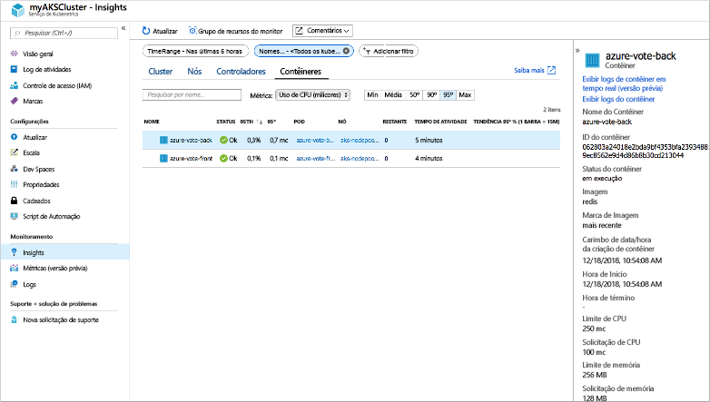
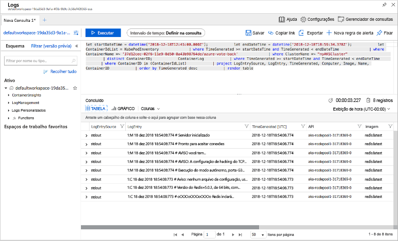

# <a name="quickstart-deploy-an-azure-kubernetes-service-aks-cluster-using-the-azure-cli"></a>Início rápido: Implantar um cluster do AKS (Serviço de Kubernetes do Azure) usando a CLI do Azure

O AKS (Serviço de Kubernetes do Azure) é um serviço de Kubernetes gerenciado que permite implantar e gerenciar clusters rapidamente. Neste início rápido, você implantará um cluster do AKS usando a CLI do Azure. Um aplicativo de vários contêineres que inclui um front-end da Web e uma instância do Redis é executado no cluster. Em seguida, você verá como monitorar a integridade do cluster e dos pods que executam seu aplicativo.


Este guia de início rápido pressupõe uma compreensão básica dos conceitos do Kubernetes. Para obter mais informações, confira [Principais conceitos do Kubernetes para o AKS (Serviço de Kubernetes do Azure)][kubernetes-concepts].

Se você não tiver uma assinatura do Azure, crie uma [conta gratuita](https://azure.microsoft.com/free/?WT.mc_id=A261C142F) antes de começar.

[!INCLUDE [cloud-shell-try-it.md](../../includes/cloud-shell-try-it.md)]

Se você optar por instalar e usar a CLI localmente, este início rápido exigirá a execução da CLI do Azure versão 2.0.52 ou posterior. Execute `az --version` para encontrar a versão. Se precisar instalar ou atualizar, consulte [Instalar a CLI do Azure][azure-cli-install].

## <a name="create-a-resource-group"></a>Criar um grupo de recursos

Um grupo de recursos do Azure é um grupo lógico no qual os recursos do Azure são implantados e gerenciados. Ao criar um grupo de recursos, você é solicitado a especificar um local. Essa é a localização na qual os metadados do grupo de recursos são armazenados e na qual os recursos são executados no Azure, caso você não especifique outra região durante a criação de recursos. Crie um grupo de recursos usando o comando [az group create][az-group-create].

O exemplo a seguir cria um grupo de recursos chamado *myResourceGroup* no local *eastus*.

```azurecli-interactive
az group create --name myResourceGroup --location eastus
```

A seguinte saída de exemplo mostra o grupo de recursos criado com êxito:

```json
{
  "id": "/subscriptions/<guid>/resourceGroups/myResourceGroup",
  "location": "eastus",
  "managedBy": null,
  "name": "myResourceGroup",
  "properties": {
    "provisioningState": "Succeeded"
  },
  "tags": null
}
```

## <a name="create-aks-cluster"></a>Criar cluster AKS

Use o comando [az aks create][az-aks-create] para criar um cluster do AKS. O exemplo a seguir cria um cluster chamado *myAKSCluster* com um nó. O Azure Monitor para contêineres também é habilitado usando o parâmetro *--enable-addons monitoring*.

```azurecli-interactive
az aks create \
    --resource-group myResourceGroup \
    --name myAKSCluster \
    --node-count 1 \
    --enable-addons monitoring \
    --generate-ssh-keys
```

Após alguns minutos, o comando será concluído e retornará informações no formato JSON sobre o cluster.

## <a name="connect-to-the-cluster"></a>Conectar-se ao cluster

Para gerenciar um cluster do Kubernetes, use [kubectl][kubectl], o cliente de linha de comando do Kubernetes. Se você usar o Azure Cloud Shell, o `kubectl` já estará instalado. Para instalar o `kubectl` localmente, use o comando [az aks install-cli][az-aks-install-cli]:

```azurecli
az aks install-cli
```

Para configurar o `kubectl` para conectar-se ao seu cluster do Kubernetes, use o comando [az aks get-credentials][az-aks-get-credentials]. Este comando baixa as credenciais e configura a CLI do Kubernetes para usá-las.

```azurecli-interactive
az aks get-credentials --resource-group myResourceGroup --name myAKSCluster
```

Para verificar a conexão ao seu cluster, use o comando [kubectl get][kubectl-get] para retornar uma lista de nós do cluster.

```azurecli-interactive
kubectl get nodes
```

A saída de exemplo a seguir mostra o único nó criado nas etapas anteriores. Verifique se o status do nó é *Pronto*:

```
NAME                       STATUS   ROLES   AGE     VERSION
aks-nodepool1-31718369-0   Ready    agent   6m44s   v1.9.11
```

## <a name="run-the-application"></a>Executar o aplicativo

Um arquivo de manifesto do Kubernetes define um estado desejado para o cluster, como as imagens de contêiner a serem executadas. Neste início rápido, um manifesto é usado para criar todos os objetos necessários para executar o aplicativo Azure Vote. Esse manifesto inclui duas [implantações do Kubernetes][kubernetes-deployment] – uma para os aplicativos de exemplo do Azure Vote Python e outra para uma instância do Redis. Dois [Serviços de Kubernetes][kubernetes-service] também são criados – um serviço interno para a instância do Redis e um serviço externo para acessar o aplicativo Azure Vote na Internet.

> [!TIP]
> Neste início rápido, você criará e implantará manualmente seus manifestos de aplicativo no cluster AKS. Em mais cenários do mundo real, você pode usar o [Azure Dev Spaces][azure-dev-spaces] para iterar e depurar seu código rápida e diretamente no cluster AKS. Você pode usar o Dev Spaces em várias plataformas de sistema operacional e ambientes de desenvolvimento e trabalhar em conjunto com outras pessoas de sua equipe.

Crie um arquivo chamado `azure-vote.yaml` e copie a definição YAML a seguir. Se você usar o Azure Cloud Shell, esse arquivo poderá ser criado usando `vi` ou `nano`, como se você estivesse trabalhando em um sistema físico ou virtual:

```yaml
apiVersion: apps/v1
kind: Deployment
metadata:
  name: azure-vote-back
spec:
  replicas: 1
  selector:
    matchLabels:
      app: azure-vote-back
  template:
    metadata:
      labels:
        app: azure-vote-back
    spec:
      containers:
      - name: azure-vote-back
        image: redis
        resources:
          requests:
            cpu: 100m
            memory: 128Mi
          limits:
            cpu: 250m
            memory: 256Mi
        ports:
        - containerPort: 6379
          name: redis
---
apiVersion: v1
kind: Service
metadata:
  name: azure-vote-back
spec:
  ports:
  - port: 6379
  selector:
    app: azure-vote-back
---
apiVersion: apps/v1
kind: Deployment
metadata:
  name: azure-vote-front
spec:
  replicas: 1
  selector:
    matchLabels:
      app: azure-vote-front
  template:
    metadata:
      labels:
        app: azure-vote-front
    spec:
      containers:
      - name: azure-vote-front
        image: microsoft/azure-vote-front:v1
        resources:
          requests:
            cpu: 100m
            memory: 128Mi
          limits:
            cpu: 250m
            memory: 256Mi
        ports:
        - containerPort: 80
        env:
        - name: REDIS
          value: "azure-vote-back"
---
apiVersion: v1
kind: Service
metadata:
  name: azure-vote-front
spec:
  type: LoadBalancer
  ports:
  - port: 80
  selector:
    app: azure-vote-front
```

Implante o aplicativo usando o comando [kubectl apply][kubectl-apply] e especifique o nome do manifesto YAML:

```azurecli-interactive
kubectl apply -f azure-vote.yaml
```

A seguinte saída de exemplo mostra as Implantações e os Serviços criados com êxito:

```
deployment "azure-vote-back" created
service "azure-vote-back" created
deployment "azure-vote-front" created
service "azure-vote-front" created
```

## <a name="test-the-application"></a>Testar o aplicativo

Quando o aplicativo é executado, um serviço de Kubernetes expõe o front-end do aplicativo à Internet. A conclusão desse processo pode levar alguns minutos.

Para monitorar o andamento, use o comando [kubectl get service][kubectl-get] com o argumento `--watch`.

```azurecli-interactive
kubectl get service azure-vote-front --watch
```

Inicialmente, o *EXTERNAL-IP* para o serviço *azure-vote-front* é mostrado como *pendente*.

```
NAME               TYPE           CLUSTER-IP   EXTERNAL-IP   PORT(S)        AGE
azure-vote-front   LoadBalancer   10.0.37.27   <pending>     80:30572/TCP   6s
```

Quando o endereço *EXTERNAL-IP* for alterado de *pendente* para um endereço IP público real, use `CTRL-C` para interromper o processo de inspeção do `kubectl`. A seguinte saída de exemplo mostra um endereço IP público válido atribuído ao serviço:

```
azure-vote-front   LoadBalancer   10.0.37.27   52.179.23.131   80:30572/TCP   2m
```

Para ver o aplicativo Azure Vote em ação, abra um navegador da Web no endereço IP externo do serviço.


## <a name="monitor-health-and-logs"></a>Monitorar integridade e logs

Quando o cluster do AKS foi criado, o Azure Monitor para contêineres foi habilitado para capturar métricas de integridade para os nós de cluster e os pods. Essas métricas de integridade estão disponíveis no portal do Azure.

Para ver o status atual, o tempo de atividade e o uso de recursos para os pods do Voto do Azure, conclua as seguintes etapas:

1. Abra um navegador Web no portal do Azure [https://portal.azure.com][azure-portal].
1. Selecione o grupo de recursos, como *myResourceGroup*, selecione o cluster do AKS, como *myAKSCluster*.
1. Em **Monitoramento**, no lado esquerdo, escolha **Insights**
1. Na parte superior, escolha **+ Adicionar Filtro**
1. Selecione *Namespace* como a propriedade e, em seguida, escolha *\<Todos exceto kube-system\>*
1. Escolha exibir os **Contêineres**.

Os contêineres *azure-vote-back* e *azure-vote-front* são exibidos, conforme mostrado no exemplo a seguir:



Para ver os logs do pod `azure-vote-front`, selecione o link **Exibir logs de contêiner** no lado direito da lista de contêineres. Esses logs incluem os fluxos *stdout* e *stderr* do contêiner.



## <a name="delete-cluster"></a>Excluir cluster

Quando o cluster não for mais necessário, use o comando [az group delete][az-group-delete] para remover o grupo de recursos, o serviço de contêiner e todos os recursos relacionados.

```azurecli-interactive
az group delete --name myResourceGroup --yes --no-wait
```

> [!NOTE]
> Quando você excluir o cluster, a entidade de serviço do Azure Active Directory usada pelo cluster do AKS não será removida. Para obter etapas sobre como remover a entidade de serviço, veja [Considerações sobre a entidade de segurança e a exclusão de serviço AKS][sp-delete].

## <a name="get-the-code"></a>Obter o código

Neste início rápido, foram usadas imagens de contêiner pré-criadas para criar uma implantação do Kubernetes. O código de aplicativo relacionado, o Dockerfile e o arquivo de manifesto Kubernetes estão disponíveis no GitHub.

[https://github.com/Azure-Samples/azure-voting-app-redis][azure-vote-app]

## <a name="next-steps"></a>Próximas etapas

Neste início rápido, você implantou um cluster Kubernetes e um aplicativo de com vários contêineres nele.  [Acesse o painel da Web do Kubernetes][kubernetes-dashboard] para o cluster recém-criado.

Para saber mais sobre o AKS e percorrer um código completo de exemplo de implantação, prossiga para o tutorial de cluster Kubernetes.

> [!div class="nextstepaction"]
> [Tutorial do AKS][aks-tutorial]

<!-- LINKS - external -->
[azure-vote-app]: https://github.com/Azure-Samples/azure-voting-app-redis.git
[kubectl]: https://kubernetes.io/docs/user-guide/kubectl/
[kubectl-apply]: https://kubernetes.io/docs/reference/generated/kubectl/kubectl-commands#apply
[kubectl-get]: https://kubernetes.io/docs/reference/generated/kubectl/kubectl-commands#get
[azure-dev-spaces]: https://docs.microsoft.com/azure/dev-spaces/

<!-- LINKS - internal -->
[kubernetes-concepts]: concepts-clusters-workloads.md
[aks-monitor]: https://aka.ms/coingfonboarding
[aks-tutorial]: ./tutorial-kubernetes-prepare-app.md
[az-aks-browse]: /cli/azure/aks?view=azure-cli-latest#az-aks-browse
[az-aks-create]: /cli/azure/aks?view=azure-cli-latest#az-aks-create
[az-aks-get-credentials]: /cli/azure/aks?view=azure-cli-latest#az-aks-get-credentials
[az-aks-install-cli]: /cli/azure/aks?view=azure-cli-latest#az-aks-install-cli
[az-group-create]: /cli/azure/group#az-group-create
[az-group-delete]: /cli/azure/group#az-group-delete
[azure-cli-install]: /cli/azure/install-azure-cli
[sp-delete]: kubernetes-service-principal.md#additional-considerations
[azure-portal]: https://portal.azure.com
[kubernetes-deployment]: concepts-clusters-workloads.md#deployments-and-yaml-manifests
[kubernetes-service]: concepts-network.md#services
[kubernetes-dashboard]: kubernetes-dashboard.md
