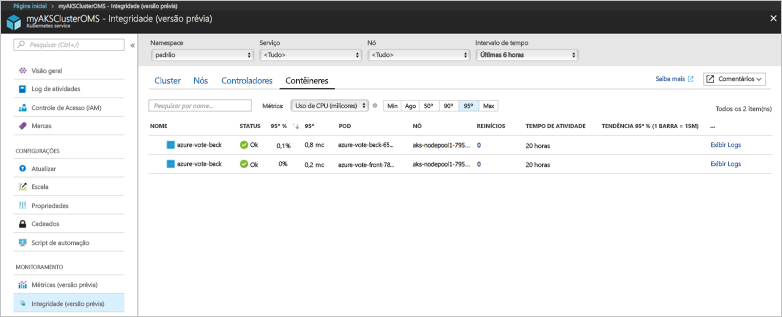
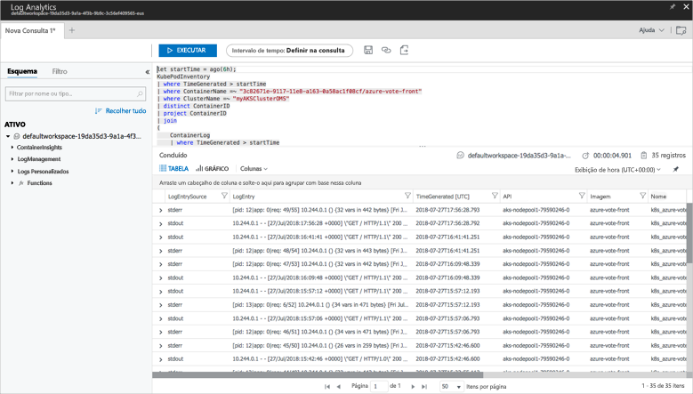

# <a name="quickstart-deploy-an-azure-kubernetes-service-aks-cluster"></a>Início Rápido: Implantar um cluster do Serviço de Kubernetes do Azure (AKS)

Neste início rápido, um cluster AKS é implantado usando a CLI do Azure. Um aplicativo de vários contêineres composto por um front-end da Web e uma instância Redis é executado no cluster. Depois de concluído, o aplicativo pode ser acessado pela internet.


Este início rápido pressupõe uma compreensão básica dos conceitos de Kubernetes; para saber mais sobre Kubernetes, consulte a [documentação do Kubernetes][kubernetes-documentation].

[!INCLUDE [cloud-shell-try-it.md](../../includes/cloud-shell-try-it.md)]

Se você optar por instalar e usar a CLI localmente, este início rápido exigirá a execução da CLI do Azure versão 2.0.43 ou posterior. Execute `az --version` para encontrar a versão. Se precisar instalar ou atualizar, consulte [Instalar a CLI do Azure][azure-cli-install].

## <a name="create-a-resource-group"></a>Criar um grupo de recursos

Crie um grupo de recursos com o comando [az group create][az-group-create]. Um grupo de recursos do Azure é um grupo lógico no qual os recursos do Azure são implantados e gerenciados. Ao criar um grupo de recursos, você é solicitado a especificar um local. Esse local é onde os seus recursos são executados no Azure.

O exemplo abaixo cria um grupo de recursos denominado *myAKSCluster* no local *eastus*.

```azurecli-interactive
az group create --name myAKSCluster --location eastus
```

Saída:

```json
{
  "id": "/subscriptions/00000000-0000-0000-0000-000000000000/resourceGroups/myAKSCluster",
  "location": "eastus",
  "managedBy": null,
  "name": "myAKSCluster",
  "properties": {
    "provisioningState": "Succeeded"
  },
  "tags": null
}
```

## <a name="create-aks-cluster"></a>Criar cluster AKS

Use o comando [az aks create][az-aks-create] para criar um cluster do AKS. O exemplo a seguir cria um cluster chamado *myAKSCluster* com um nó. O monitoramento de integridade do contêiner também é habilitado usando o parâmetro *--enable-addons monitoring*. Para saber mais sobre como habilitar a solução de monitoramento de integridade do contêiner, consulte [Integridade do Serviço Kubernetes do Monitor do Azure][aks-monitor].

```azurecli-interactive
az aks create --resource-group myAKSCluster --name myAKSCluster --node-count 1 --enable-addons monitoring --generate-ssh-keys
```

Após alguns minutos, o comando é concluído e retorna informações formatadas em JSON sobre o cluster.

## <a name="connect-to-the-cluster"></a>Conectar-se ao cluster

Para gerenciar um cluster Kubernetes, use [kubectl][kubectl], o cliente de linha de comando Kubernetes.

Se você estiver usando o Azure Cloud Shell, o `kubectl` já estará instalado. Se você quiser instalá-lo localmente, use o comando [az aks install-cli][az-aks-install-cli].


```azurecli
az aks install-cli
```

Para configurar o `kubectl` para conectar-se ao seu cluster do Kubernetes, use o comando [az aks get-credentials][az-aks-get-credentials]. Esta etapa baixa credenciais e configura a CLI de Kubernetes para usá-las.

```azurecli-interactive
az aks get-credentials --resource-group myAKSCluster --name myAKSCluster
```

Para verificar a conexão ao seu cluster, use o comando [kubectl get][kubectl-get] para retornar uma lista de nós do cluster. Pode levar alguns minutos para que os nós sejam exibidos.

```azurecli-interactive
kubectl get nodes
```

Saída:

```
NAME                          STATUS    ROLES     AGE       VERSION
k8s-myAKSCluster-36346190-0   Ready     agent     2m        v1.7.7
```

## <a name="run-the-application"></a>Executar o aplicativo

Um arquivo de manifesto Kubernetes define um estado desejado para o cluster, incluindo as imagens de contêiner que devem estar em execução. Neste exemplo, um manifesto é usado para criar todos os objetos necessários para executar o aplicativo Azure Vote. Esse manifesto inclui duas [Implantações de Kubernetes][kubernetes-deployment], uma para os aplicativos do Azure Vote Python e outra para uma instância do Redis. Além disso, dois [Serviços Kubernetes][kubernetes-service] são criados, um serviço interno para a instância do Redis, e um serviço externo para acessar o aplicativo Azure Vote na internet.

Crie um arquivo chamado `azure-vote.yaml` e copie-o para o código YAML a seguir. Se você estiver trabalhando no Azure Cloud Shell, esse arquivo poderá ser criado usando o vi ou Nano, como se estivesse trabalhando em um sistema físico ou virtual.

```yaml
apiVersion: apps/v1beta1
kind: Deployment
metadata:
  name: azure-vote-back
spec:
  replicas: 1
  template:
    metadata:
      labels:
        app: azure-vote-back
    spec:
      containers:
      - name: azure-vote-back
        image: redis
        ports:
        - containerPort: 6379
          name: redis
---
apiVersion: v1
kind: Service
metadata:
  name: azure-vote-back
spec:
  ports:
  - port: 6379
  selector:
    app: azure-vote-back
---
apiVersion: apps/v1beta1
kind: Deployment
metadata:
  name: azure-vote-front
spec:
  replicas: 1
  template:
    metadata:
      labels:
        app: azure-vote-front
    spec:
      containers:
      - name: azure-vote-front
        image: microsoft/azure-vote-front:v1
        ports:
        - containerPort: 80
        env:
        - name: REDIS
          value: "azure-vote-back"
---
apiVersion: v1
kind: Service
metadata:
  name: azure-vote-front
spec:
  type: LoadBalancer
  ports:
  - port: 80
  selector:
    app: azure-vote-front
```

Use o comando [kubectl apply][kubectl-apply] para executar o aplicativo.

```azurecli-interactive
kubectl apply -f azure-vote.yaml
```

Saída:

```
deployment "azure-vote-back" created
service "azure-vote-back" created
deployment "azure-vote-front" created
service "azure-vote-front" created
```

## <a name="test-the-application"></a>Testar o aplicativo

Conforme o aplicativo é executado, um [serviço Kubernetes][kubernetes-service] é criado para expor o front-end do aplicativo à Internet. A conclusão desse processo pode levar alguns minutos.

Para monitorar o andamento, use o comando [kubectl get service][kubectl-get] com o argumento `--watch`.

```azurecli-interactive
kubectl get service azure-vote-front --watch
```

Inicialmente o *EXTERNAL -IP* para o serviço *azure-vote-front* aparece como *pendente*.

```
NAME               TYPE           CLUSTER-IP   EXTERNAL-IP   PORT(S)        AGE
azure-vote-front   LoadBalancer   10.0.37.27   <pending>     80:30572/TCP   6s
```

Depois que o endereço *EXTERNAL-IP* for alterado de *pendente* para um *endereço IP*, use `CTRL-C` para interromper o processo kubectl watch.

```
azure-vote-front   LoadBalancer   10.0.37.27   52.179.23.131   80:30572/TCP   2m
```

Agora, vá até o endereço IP externo a fim de ver o aplicativo Azure Vote.


## <a name="monitor-health-and-logs"></a>Monitorar integridade e logs

Quando o cluster do AKS foi criado, o monitoramento foi habilitado para capturar métricas de integridade para os nós de cluster e os pods. Essas métricas de integridade estão disponíveis no portal do Azure. Para saber mais sobre o monitoramento de integridade do contêiner, confira [Integridade do Serviço Kubernetes do Monitor do Azure][aks-monitor].

Para ver o status atual, o tempo de atividade e o uso de recursos para os pods do Voto do Azure, conclua as seguintes etapas:

1. Abra um navegador Web no portal do Azure [https://portal.azure.com][azure-portal].
1. Selecione o grupo de recursos, como *myResourceGroup*, selecione o cluster do AKS, como *myAKSCluster*. 
1. Escolha **Monitorar a integridade de contêiner** > selecione o namespace **padrão** > depois selecione **Contêineres**.

Talvez demore alguns minutos para que esses dados sejam preenchidos no Portal do Azure, como mostrado no exemplo a seguir:



Para ver os logs para o pod `azure-vote-front`, selecione o link **Exibir Logs** no lado direito da lista de contêineres. Esses logs incluem os fluxos *stdout* e *stderr* do contêiner.



## <a name="delete-cluster"></a>Excluir cluster

Quando o cluster não for mais necessário, use o comando [az group delete][az-group-delete] para remover o grupo de recursos, o serviço de contêiner e todos os recursos relacionados.

```azurecli-interactive
az group delete --name myAKSCluster --yes --no-wait
```

> [!NOTE]
> Quando você excluir o cluster, a entidade de serviço do Azure Active Directory usada pelo cluster do AKS não será removida. Para obter etapas sobre como remover a entidade de serviço, veja [Considerações sobre a entidade de segurança e a exclusão de serviço AKS][sp-delete].

## <a name="get-the-code"></a>Obter o código

Neste guia de início rápido, foram usadas imagens de contêiner criadas previamente para criar uma implantação de Kubernetes. O código de aplicativo relacionado, o Dockerfile e o arquivo de manifesto Kubernetes estão disponíveis no GitHub.

[https://github.com/Azure-Samples/azure-voting-app-redis][azure-vote-app]

## <a name="next-steps"></a>Próximas etapas

Neste início rápido, você implantou um cluster Kubernetes e um aplicativo de com vários contêineres nele.

Para saber mais sobre o AKS e percorrer um código completo de exemplo de implantação, prossiga para o tutorial de cluster Kubernetes.

> [!div class="nextstepaction"]
> [Tutorial do AKS][aks-tutorial]

<!-- LINKS - external -->
[azure-vote-app]: https://github.com/Azure-Samples/azure-voting-app-redis.git
[kubectl]: https://kubernetes.io/docs/user-guide/kubectl/
[kubectl-apply]: https://kubernetes.io/docs/reference/generated/kubectl/kubectl-commands#apply
[kubernetes-deployment]: https://kubernetes.io/docs/concepts/workloads/controllers/deployment/
[kubernetes-documentation]: https://kubernetes.io/docs/home/
[kubectl-get]: https://kubernetes.io/docs/reference/generated/kubectl/kubectl-commands#get
[kubernetes-service]: https://kubernetes.io/docs/concepts/services-networking/service/

<!-- LINKS - internal -->
[aks-monitor]: https://aka.ms/coingfonboarding
[aks-tutorial]: ./tutorial-kubernetes-prepare-app.md
[az-aks-browse]: /cli/azure/aks?view=azure-cli-latest#az_aks_browse
[az-aks-create]: /cli/azure/aks?view=azure-cli-latest#az_aks_create
[az-aks-get-credentials]: /cli/azure/aks?view=azure-cli-latest#az_aks_get_credentials
[az-aks-install-cli]: /cli/azure/aks?view=azure-cli-latest#az_aks_install_cli
[az-group-create]: /cli/azure/group#az_group_create
[az-group-delete]: /cli/azure/group#az_group_delete
[azure-cli-install]: /cli/azure/install-azure-cli
[sp-delete]: kubernetes-service-principal.md#additional-considerations
[azure-portal]: https://portal.azure.com
