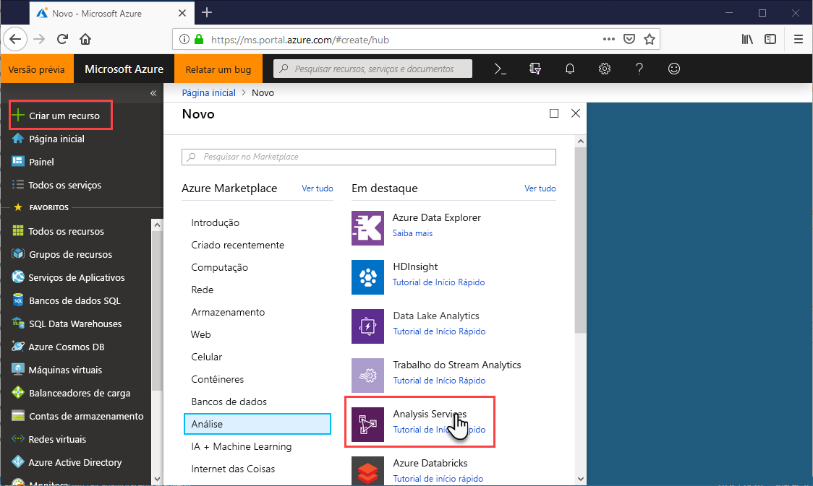
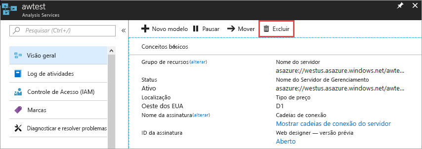

# Início Rápido: Criar um servidor – Portal

Este início rápido descreve como criar um recurso de servidor do Analysis Services em sua assinatura do Azure por meio do portal.

## Pré-requisitos 

* **Assinatura do Azure**: Acesse [Avaliação Gratuita do Azure](https://azure.microsoft.com/offers/ms-azr-0044p/) para criar uma conta.
* **Azure Active Directory**: sua assinatura deve estar associada a um locatário do Azure Active Directory. Também é preciso estar conectado ao Azure com uma conta no Azure Active Directory em questão. Para obter mais informações, confira [Autenticação e permissões de usuário](analysis-services-manage-users.md).

## Entre no Portal do Azure 

[Entre no portal](https://portal.azure.com)

## Criar um servidor

1. Clique em **+ Criar um recurso** > **Dados + Análise** > **Analysis Services**.

    

2. Em **Analysis Services**, preencha os campos obrigatórios e pressione **Criar**.
   
   * **Nome do servidor**: digite um nome exclusivo usado para fazer referência ao servidor.
   * **Assinatura**: selecione a assinatura a qual o servidor será associado.
   * **Grupo de recursos**: crie um novo grupo de recursos ou selecione um que você já tenha. Os grupo de recursos são projetados para ajudar você a gerenciar uma coleção de recursos do Azure. Para saber mais, veja [grupos de recursos](../azure-resource-manager/resource-group-overview.md).
   * **Localização**: localização do datacenter do Azure que hospeda o servidor. Escolha um local mais próximo da sua maior base de usuários.
   * **Tipo de preço**: Selecione um tipo de preço. Se você estiver testando e pretende instalar o banco de dados do modelo de exemplo, selecione a camada gratuita **D1**. Para saber mais, veja [Preços do Azure Analysis Services](https://azure.microsoft.com/pricing/details/analysis-services/). 
    * **Administrador**: por padrão, essa será a conta com a qual você entrou. Você pode escolher uma conta diferente no Microsoft Azure Active Directory.
    * **Configuração de Armazenamento de Backup**: Opcional. Se você já tiver uma [conta de armazenamento](../storage/common/storage-introduction.md), você pode especificá-la como o padrão para o backup do banco de dados de modelo. Você também pode especificar a configuração de [backup e restauração](analysis-services-backup.md) mais tarde.
    * **Término da chave armazenamento**: Opcional. Especifique um período de expiração para a chave de armazenamento.

A criação do servidor geralmente demora menos de um minuto. Se você tiver selecionado **Adicionar ao Portal**, navegue até o portal para ver o novo servidor. Ou navegue até **Todos os serviços** > **Analysis Services** para ver se o servidor está pronto.

## Limpar recursos

Quando não for mais necessário, exclua o seu servidor. Em **Visão geral**, clique em **Excluir**. 

 

## Próximas etapas
Neste início rápido, você aprendeu a criar um servidor em sua assinatura do Azure. Agora que você tem um servidor, pode ajudar a protegê-lo configurando um firewall do servidor (opcional). Você também pode adicionar um modelo de dados de amostra básico ao servidor diretamente do portal. Ter um modelo de exemplo é útil para saber mais sobre como configurar funções do modelo de banco de dados e testar conexões de cliente. Para saber mais, continue para o tutorial para adicionar um modelo de exemplo.

> [!div class="nextstepaction"]
> [Início Rápido: Configurar firewall do servidor – Portal](analysis-services-qs-firewall.md)   
> [!div class="nextstepaction"]
> [Tutorial: Adicionar um modelo de exemplo ao seu servidor](analysis-services-create-sample-model.md)
