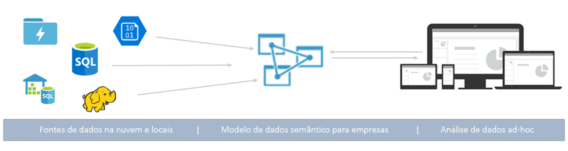
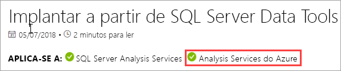
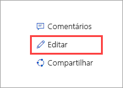

# O que é o Azure Analysis Services?

O Azure Analysis Services é uma PaaS (plataforma como serviço) totalmente gerenciada que fornece modelos de dados de nível empresarial na nuvem. Utilize recursos de modelagem e mashup avançados para combinar dados de várias fontes de dados, definir métricas e proteger os dados em um único modelo de dados semânticos tabulares confiável. O modelo de dados fornece uma maneira mais rápida e fácil para os usuários navegarem quantidades de dados em massa para análise de dados ad-hoc.

**Vídeo:** Confira a [Visão geral do Azure Analysis Services](https://sec.ch9.ms/ch9/d6dd/a1cda46b-ef03-4cea-8f11-68da23c5d6dd/AzureASoverview_high.mp4) para saber como o Azure Analysis Services ajusta-se nos recursos gerais de BI da Microsoft.

## Entre rapidamente em funcionamento

No Portal do Azure, você pode [criar um servidor](analysis-services-create-server.md) em questão de minutos. E com os [modelos](../azure-resource-manager/resource-manager-create-first-template.md) do Azure Resource Manager e PowerShell, você pode criar servidores usando um modelo declarativo. Com um único modelo, é possível implantar recursos do servidor junto com outros componentes do Azure, como contas de armazenamento e Azure Functions. 

**Vídeo:** Confira [Automatizar implantação](https://channel9.msdn.com/series/Azure-Analysis-Services/AzureAnalysisServicesAutomation) para saber mais sobre como é possível usar a Automação do Azure para acelerar a criação de servidor.

O Azure Analysis Services integra-se com vários serviços do Azure, permitindo que você crie soluções sofisticadas de análise. A integração com o [Azure Active Directory](../active-directory/fundamentals/active-directory-whatis.md) fornece acesso seguro e baseado em função para seus dados críticos. Integre com pipelines do [Azure Data Factory](../data-factory/introduction.md), incluindo uma atividade que carrega dados no modelo. A [Automação do Azure](../automation/automation-intro.md) e o [Azure Functions](../azure-functions/functions-overview.md) podem ser usados para coordenação leve de modelos usando código personalizado. 

## A camada certa quando você precisa

Azure Analysis Services está disponível nas camadas **Desenvolvedor**, **Básico** e **Standard**. Em cada nível, os custos do plano variam de acordo com a potência do processamento, QPUs e quantidade de memória. Quando você cria um servidor, é possível selecionar um plano de dentro de uma camada. Você pode alterar os planos para cima ou para baixo na mesma camada ou fazer upgrade para uma camada mais alta, mas não é possível fazer downgrade de uma camada superior para uma camada inferior.

### Camada de Desenvolvedor

Essa camada é recomendada para cenários de avaliação, desenvolvimento e teste. Um único plano inclui a mesma funcionalidade da camada Standard, mas é limitado em capacidade de processamento, QPUs e tamanho de memória. Escalar horizontalmente réplica de consulta *não está disponível* para essa camada. Essa camada não oferece um SLA.

|Plano  |QPUs  |Memória (GB)  |
|---------|---------|---------|
|D1    |    20     |    3     |

### Camada básica

O nível é recomendado para soluções de produção com modelos tabulares menores, concorrência limitada do usuário e requisitos simples de atualização de dados. Escalar horizontalmente réplica de consulta *não está disponível* para essa camada. Perspectivas, várias partições e recursos do modelo tabular do DirectQuery *não têm suporte* nessa camada.  

|Plano  |QPUs  |Memória (GB)  |
|---------|---------|---------|
|B1    |    40     |    10     |
|B2    |    80     |    20     |

### Camada padrão

Essa camada é para aplicativos de produção críticos, que exigem simultaneidade elástica do usuário e têm modelos de dados em crescimento acelerado. Ele dá suporte à atualização de dados avançada para atualizações de modelos de dados quase em tempo real e a todos os recursos de modelagem tabular.

|Plano  |QPUs  |Memória (GB)  |
|---------|---------|---------|
|S1    |    40     |    10     |
|S2    |    100     |    25     |
|S3    |    200     |    50     |
|S4    |    400     |    100     |
|S8*    |    320     |    200     |
|S9*    |    640    |    400     |

\* Não disponível em todas as regiões.  

## Disponibilidade por região

O Azure Analysis Services tem suporte em regiões do mundo todo. Os planos com suporte e a réplica de consulta dependem da região escolhida. A disponibilidade de réplica do plano e da consulta pode mudar dependendo da necessidade e dos recursos disponíveis para cada região. 

### Américas

|Região  | Planos com suporte | Consultar réplicas (somente planos Standard) |
|---------|---------|:---------:|
|Sul do Brasil     |    B1, B2, S0, S1, S2, S4, D1     |     1    |
|Canadá Central    |     B1, B2, S0, S1, S2, S4, D1    |     1    |
|Leste dos EUA     |     B1, B2, S0, S1, S2, S4, D1    |    1     |
|Leste dos EUA 2     |     B1, B2, S0, S1, S2, S4, D1   |    7    |
|Leste dos EUA 2     |     S8, S9   |    1    |
|Centro-Norte dos EUA     |     B1, B2, S0, S1, S2, S4, D1     |    1     |
|Centro dos EUA     |    B1, B2, S0, S1, S2, S4, D1     |    1     |
|Centro-Sul dos Estados Unidos     |    B1, B2, S0, S1, S2, S4, D1     |    1     |
|Centro-Oeste dos EUA   |     B1, B2, S0, S1, S2, S4, D1    |    3     |
|Oeste dos EUA     |    B1, B2, S0, S1, S2, S4, D1    |    7   |
|Oeste dos EUA     |    S8, S9   |    2  |
|Oeste dos EUA 2    |    B1, B2, S0, S1, S2, S4, D1    |    3   |
|Oeste dos EUA 2    |    S8, S9  |    1     |

### Europa

|Região  | Planos com suporte | Consultar réplicas (somente planos Standard) |
|---------|---------|:---------:|
|Norte da Europa     |    B1, B2, S0, S1, S2, S4, D1      |    7     |
|Sul do Reino Unido     |    B1, B2, S0, S1, S2, S4, D1      |     1    |
|Europa Ocidental     |    B1, B2, S0, S1, S2, S4, D1   |    7    |
|Europa Ocidental    |   S8, S9  |  1  |

### Pacífico Asiático 

|Região  | Planos com suporte | Consultar réplicas (somente planos Standard) |
|---------|---------|:---------:|
|Leste da Austrália     |    B1, B2, S0, S1, S2, S4     |    3     |
|Leste da Austrália     |    S8, S9    |    1     |
|Sudeste da Austrália     | B1, B2, S0, S1, S2, S4, D1       |    1     |
|Leste do Japão     |   B1, B2, S0, S1, S2, S4, D1       |    1     |
|Sudeste Asiático     |     B1, B2, S0, S1, S2, S4, S8, S9, D1     |   1      |
|Índia Ocidental     |    B1, B2, S0, S1, S2, S4, D1     |    1     |

## Escalar de acordo com suas necessidades

### Escalar verticalmente\reduzir verticalmente, pausar e retomar

Você pode fazer um upgrade, downgrade ou pausar o servidor. Use o portal do Azure ou tenha controle total usando o PowerShell. Você paga apenas pelo que usa.  

### Recursos de expansão para respostas de consulta rápidas

Com escalar horizontalmente, as consultas do cliente são distribuídas entre várias *réplicas de consulta* em um pool de consulta. As réplicas de consulta possuem cópias sincronizadas dos seus modelos de tabela. Ao distribuir a carga de trabalho de consulta, os tempos de resposta durante cargas de trabalho de consulta altas podem ser reduzidos. As operações de processamento do modelo podem ser separadas do pool de consultas, garantindo que as consultas não são afetadas negativamente pelas operações de processamento. 

Você pode criar um pool de consultas com até sete réplicas de consulta adicionais (total de oito, incluindo o servidor). O número de réplicas de consulta que você pode ter no pool depende da região ou do plano escolhido. As réplicas de consulta não podem ser espalhadas fora da região do servidor. As réplicas de consulta são cobradas com a mesma taxa que o servidor.

Assim como com a mudança de camadas, é possível escalar horizontalmente as réplicas de consulta, de acordo com suas necessidades. Configure para escalar horizontalmente no portal ou usando APIs REST. Para saber mais, consulte [Expansão do Azure Analysis Services](analysis-services-scale-out.md).

## Preços

O custo total depende de vários fatores, por exemplo, a região escolhida, camada, réplicas de consulta e pausar/retomar. Use a calculadora de [Preços do Azure Analysis Services](https://azure.microsoft.com/pricing/details/analysis-services/) para determinar o preço típico da região. Essa ferramenta calcula o preço de uma instância de servidor único para uma única região. Tenha em mente que as réplicas de consulta são cobradas na mesma taxa que o servidor. 

## Criado no SQL Server Analysis Services

O Azure Analysis Services é compatível com os mesmos recursos incríveis já presentes no SQL Server Analysis Services Enterprise Edition. O Azure Analysis Services dá suporte a modelos tabulares nos [níveis de compatibilidade](analysis-services-compat-level.md) 1200 e superior. Modelos tabulares são constructos de modelagem relacional (modelo, tabelas, colunas), articulados nas definições do objeto de metadados tabulares no código TOM (Modelo de Objeto Tabular) e TMSL (Linguagem de Scripts de Modelo de Tabela). Partições, perspectivas, segurança em nível de linha, relacionamentos bidirecionais e traduções todos têm suporte*. Modelos multidimensionais e PowerPivot para SharePoint *não* têm suporte no Azure Analysis Services.

Há suporte para ambos os modos DirectQuery e in-memory. No modo in-memory (padrão), os modelos tabulares dão suporte a várias fontes de dados. Como os dados do modelo são altamente compactados e armazenados em cache in-memory, esse modo fornece a resposta de consulta mais rápida em grandes quantidades de dados. Ele também fornece a maior flexibilidade para consultas e conjuntos de dados complexos. O particionamento habilita cargas incrementais, aumenta a paralelização e reduz o consumo de memória. Outros recursos avançados de modelagem de dados, como tabelas calculadas e todas as funções do DAX têm suporte. Os modelos in-memory devem ser atualizados (processados) para atualizar os dados armazenados em cache das fontes de dados. Com o suporte à entidade de serviço do Azure, as operações de atualização autônoma usando PowerShell, TOM, TMSL e REST oferecem flexibilidade para garantir que os dados do modelo estejam sempre atualizados. 

O modo DirectQuery* aproveita o banco de dados relacional back-end para armazenamento e execução de consultas. Há suporte para conjuntos de dados extremamente grandes em um único SQL Server, SQL Server Data Warehouse, Banco de Dados SQL do Azure, SQL Data Warehouse do Azure, Oracle e fontes de dados Teradata. Os conjuntos de dados de back-end podem exceder a memória de recursos do servidor disponível. Cenários de atualização de modelo de dados complexos não são necessários. Há também algumas restrições, como tipos limitados de fonte de dados, limitações de fórmula do DAX e alguns recursos avançados de modelagem de dados não têm suporte. Antes de determinar o melhor modo para as suas necessidades, consulte o [Modo de Consulta Direta](https://docs.microsoft.com/sql/analysis-services/tabular-models/directquery-mode-ssas-tabular).

\* A disponibilidade de recursos depende da camada.

## Fontes de dados com suporte

Modelos tabulares no Azure Analysis Services dão suporte a uma ampla variedade de fontes de dados, desde arquivos de texto simples até Big Data no Azure Data Lake Store. Para saber mais, confira [Fontes de dados com suporte no Azure Analysis Services](analysis-services-datasource.md).

## Seus dados estão seguros

O Azure Analysis Services fornece segurança para os dados confidenciais em vários níveis. No nível do servidor: Firewall, autenticação do Azure, funções de administrador do servidor e Criptografia do Servidor. E no nível do modelo de dados, funções de usuário, segurança em nível de objeto e em nível de linha garantem que os dados estejam seguros e sejam vistos apenas pelos usuários que desejam vê-los.

### Firewall

O Firewall do Azure Analysis Services bloqueia todas as conexões de clientes que não sejam os endereços IP especificados nas regras. Configure as regras especificando os endereços IP permitidos por IPs de clientes individuais ou por intervalo. As conexões do Power BI (serviço) também podem ser permitidas ou bloqueadas. Configure o firewall e as regras no portal ou usando o PowerShell. Para saber mais, consulte [Configurar um firewall de servidor](analysis-services-qs-firewall.md).

### Autenticação

A autenticação do usuário é tratada pelo [ AAD (Azure Active Directory)](../active-directory/fundamentals/active-directory-whatis.md). Ao fazer logon, os usuários usam uma identidade de conta da organização com acesso baseado em função ao banco de dados. As identidades de usuário devem ser membros do Azure Active Directory padrão para a assinatura em que reside o servidor. Para obter mais informações, confira [Autenticação e permissões de usuário](analysis-services-manage-users.md).

### Segurança de dados

O Azure Analysis Services usa o Armazenamento de Blobs do Azure para persistir o armazenamento e os metadados em bancos de dados do Analysis Services. Os arquivos de dados no blob são criptografados usando o [ SSE (Criptografia do Servidor de Blobs) do Azure](../storage/common/storage-service-encryption.md). Ao usar o modo Consulta Direta, apenas os metadados serão armazenados. Os dados reais são acessados por meio de protocolo criptografado da fonte de dados no momento da consulta.

O acesso seguro a fontes de dados locais na organização é obtido, instalando e configurando um [Gateway de dados local](analysis-services-gateway.md). Os gateways fornecem acesso a dados para os modos in-memory e DirectQuery.

### Funções

O Analysis Services usa [autorização baseada em função](https://docs.microsoft.com/sql/analysis-services/tabular-models/roles-ssas-tabular) que concede acesso a operações de modelo de banco de dados e servidor, objetos e dados. Todos os usuários que acessam um servidor ou banco de dados fazem isso com sua conta de usuário do Azure AD dentro de uma função atribuída. A função de administrador do servidor está no nível do recurso de servidor. Por padrão, a conta usada ao criar um servidor é incluída automaticamente na função Administradores do Servidor. Contas adicionais de usuário e grupo são adicionadas usando o portal, SSMS ou PowerShell.
  
Usuários finais não administrativos que consultam dados têm acesso concedido por meio de funções de banco de dados. Uma função de banco de dados é criada como um objeto separado no banco de dados e se aplica somente ao banco de dados no qual a função foi criada. As funções do banco de dados são definidas pelas permissões Administrador, Leitura e Leitura e Processo (banco de dados). As contas de usuário e grupo são adicionadas usando SSMS ou PowerShell.

### Segurança em nível de linha

Modelos tabulares em todos os níveis de compatibilidade dão suporte a segurança em nível de linha. A segurança em nível de linha é configurada no modelo usando expressões do DAX que definem as linhas em uma tabela e todas as linhas na direção de uma tabela relacionada que um usuário pode consultar. Os filtros de linha usando expressões do DAX são definidos para as permissões Leitura, Leitura e Processar. 

### Segurança em nível de objeto 

Os modelos tabulares no nível de compatibilidade 1400 dão suporte para segurança em nível de objeto, que inclui segurança em nível de tabela e segurança em nível de coluna. A segurança em nível de objeto é definida nos metadados com base em JSON no arquivo Model.bim usando TMSL ou TOM. Para saber mais, consulte [Segurança em nível de objeto](https://docs.microsoft.com/sql/analysis-services/tabular-models/object-level-security).

### Automação através de entidades de serviço

As entidades de serviço são um recurso de aplicativo do Azure Active Directory que você cria em seu locatário para executar operações de nível de serviço e recursos autônomos. As entidades de serviço são usadas com Automação do Azure, modo autônomo do PowerShell, aplicativos cliente personalizados e aplicativos Web para automatizar tarefas comuns como atualizar dados, escalar verticalmente/reduzir verticalmente e pausar/retomar. As permissões são atribuídas a entidades de serviço por meio da associação de função. Para saber mais, consulte [Automação com entidades de serviço](analysis-services-service-principal.md).

### Governança do Azure

O Azure Analysis Services é regido pelos [Termos do Microsoft Online Services](https://www.microsoftvolumelicensing.com/DocumentSearch.aspx?Mode=3&DocumentTypeId=31) e pela [Política de Privacidade da Microsoft](https://privacy.microsoft.com/privacystatement).
Para saber mais sobre a Segurança do Azure, confira a [Central de Confiabilidade da Microsoft](https://www.microsoft.com/trustcenter).

## Use as ferramentas que você já conhece

### Visual Studio

Desenvolva e implante modelos com o [SQL Server Data Tools (SSDT) para Visual Studio](https://msdn.microsoft.com/library/mt204009.aspx) gratuito. O SSDT inclui modelos de projeto do Analysis Services que o deixa pronto rapidamente. O SSDT agora inclui a moderna consulta de fonte de dados Obter Dados e a funcionalidade mashup para modelos de tabela 1400. Se você estiver familiarizado com o Obter Dados no Power BI Desktop e Excel 2016, já sabe como é fácil criar consultas de fonte de dados altamente personalizadas. 

Se você estiver usando o Visual Studio 2017, os projetos do Microsoft Analysis Services estarão disponíveis como um pacote VSIX para instalação gratuita. [Baixar do Marketplace](https://marketplace.visualstudio.com/items?itemName=ProBITools.MicrosoftAnalysisServicesModelingProjects).

### SQL Server Management Studio

Gerencie seus servidores e bancos de dados modelo usando o [SQL Server Management Studio (SSMS)](https://docs.microsoft.com/sql/ssms/download-sql-server-management-studio-ssms). Conecte-se aos servidores na nuvem. Execute scripts TMSL diretamente da janela de consulta XMLA e automatize tarefas usando scripts TMSL e PowerShell. Novos recursos e funcionalidades acontecem rapidamente. O SSMS é atualizado mensalmente.

### PowerShell

As tarefas de gerenciamento de recursos de servidor, como criar servidores, suspender ou retomar operações de servidor ou alterar o nível de serviço (camada), usam cmdlets do AzureRM (Azure Resource Manager). Outras tarefas de gerenciamento de bancos de dados, como adição ou remoção de membros da função, processamento ou execução de scripts TMSL usam os cmdlets incluídos no módulo SqlServer. Para saber mais, consulte [Gerenciar o Azure Analysis Services com o PowerShell ](analysis-services-powershell.md).

### Modelo de objeto e script

Os modelos de tabela oferecem desenvolvimento rápido e são altamente personalizáveis. Modelos tabulares incluem o [TOM](https://docs.microsoft.com/sql/analysis-services/tabular-model-programming-compatibility-level-1200/introduction-to-the-tabular-object-model-tom-in-analysis-services-amo) (Modelo de Objeto Tabular) para descrever objetos de modelo. O TOM é exposto em JSON por meio de [TMSL (Linguagem de Scripts de Modelo de Tabela)](https://docs.microsoft.com/sql/analysis-services/tabular-model-scripting-language-tmsl-reference) e da linguagem de definição de dados AMO por meio do namespace [Microsoft.AnalysisServices.Tabular](https://msdn.microsoft.com/library/microsoft.analysisservices.tabular.aspx). 

## Dá suporte às ferramentas de cliente mais recentes

Há suporte para ferramentas modernas de exploração e visualização de dados como Power BI, Excel, Reporting Services e ferramentas de terceiros, fornecendo aos usuários informações altamente interativas e visualmente avançadas sobre seus dados de modelo. 

## Monitoramento e diagnóstico

O Azure Analysis Services é integrado às métricas do Azure, fornecendo um grande número de métricas específicas de recursos para ajudá-lo a monitorar o desempenho e a integridade dos servidores. Para obter mais informações, consulte [Monitorar métricas do servidor](analysis-services-monitor.md). Registre métricas com [logs de diagnóstico de recursos do Azure](../azure-monitor/platform/diagnostic-logs-overview.md). Monitore e envie logs para [Armazenamento do Azure](https://azure.microsoft.com/services/storage/), transmita-os para [Hubs de Eventos do Azure](https://azure.microsoft.com/services/event-hubs/) e exporte-os para [Log Analytics](https://azure.microsoft.com/services/log-analytics/), um serviço do [Azure](https://www.microsoft.com/cloud-platform/operations-management-suite). Para saber mais, consulte [Configurar log de diagnósticos](analysis-services-logging.md).

O Azure Analysis Services também dá suporte para uso de [DMVs (Modos de Exibição de Gerenciamento Dinâmico)](https://docs.microsoft.com/sql/analysis-services/instances/use-dynamic-management-views-dmvs-to-monitor-analysis-services). Com base na sintaxe SQL, conjuntos de linhas do esquema da interface DMVs que retornam metadados e informações de monitoramento sobre a instância do servidor.

## Documentação

A documentação específica do Azure Analysis Services está incluída aqui. Use o índice no lado esquerdo da tela do navegador para localizar artigos. 

Como os modelos tabulares do Azure Analysis Services são muito parecidos com os modelos tabulares do SQL Server Analysis Services, há uma extensa biblioteca de artigos conceituais, procedurais, de desenvolvimento e referência compartilhados na [Documentação do SQL Server Analysis Services](https://docs.microsoft.com/sql/analysis-services/analysis-services). Artigos na documentação do SQL Server Analysis Services mostram se também aplicam-se ao Azure Analysis Services por uma faixa APPLIES TO abaixo do título.

### Contribua!

A documentação do Analysis Services, como este artigo, é software livre. Se você tiver uma conta do GitHub, poderá editar um artigo, clicando em Editar (lápis) no canto superior direito da tela do navegador. Use o editor do navegador e clique em Propor alteração do arquivo. 

Sua contribuição será analisada pela equipe de documentação e, se aprovada, seu nome de conta do GitHub será mostrado como colaborador. Para saber mais, consulte o [Guia do colaborador de documentos](https://docs.microsoft.com/contribute/).

A documentação do Azure Analysis Services também usa [Problemas do GitHub](https://docs.microsoft.com/teamblog/a-new-feedback-system-is-coming-to-docs). Você pode fornecer comentários sobre o produto ou a documentação. Use os **Comentários** na parte inferior de um artigo. Os problemas do GitHub ainda não estão habilitados para a documentação do SQL Server Analysis Services. 

## Blogs

As coisas estão mudando rapidamente. Obtenha as últimas informações no [blog da equipe do Analysis Services](https://blogs.msdn.microsoft.com/analysisservices/) e [Blog do Azure](https://azure.microsoft.com/blog/).

## Comunidade

O Analysis Services tem uma comunidade de usuários vibrante. Participe das conversas no [Fórum do Azure Analysis Services](https://aka.ms/azureanalysisservicesforum).

## Próximas etapas

> [!div class="nextstepaction"]
> [Inscrever-se para um teste gratuito do Azure](https://azure.microsoft.com/offers/ms-azr-0044p/)   

> [!div class="nextstepaction"]
> [Início Rápido: Criar um servidor – Portal](analysis-services-create-server.md)   

> [!div class="nextstepaction"]
> [Início Rápido: Criar um servidor – PowerShell](analysis-services-create-powershell.md)  
