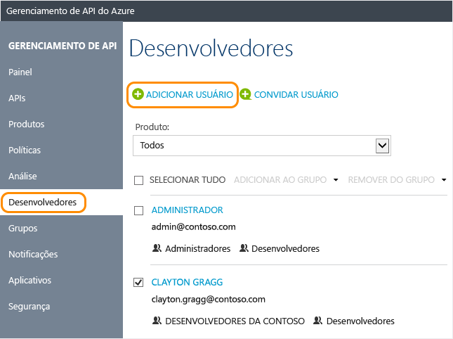

# Como gerenciar contas de usuário no Gerenciamento de API do Azure

No Gerenciamento de API, os desenvolvedores são os usuários das APIs que você expõe utilizando o Gerenciamento d API. Este guia mostra como criar e convidar desenvolvedores a utilizarem as APIs e os produtos que você disponibilizar para eles com sua instância do Gerenciamento da API. Para saber mais sobre como gerenciar contas de usuário por meio de programação, confira a documentação sobre [Entidade de usuário](https://docs.microsoft.com/en-us/rest/api/apimanagement/user) na referência [REST de Gerenciamento de API](/rest/api/apimanagement/).

[!INCLUDE [premium-dev-standard-basic.md](../../includes/api-management-availability-premium-dev-standard-basic.md)]

## Pré-requisitos

Conclua as tarefas neste artigo: [Criar uma instância do Gerenciamento de API do Azure](get-started-create-service-instance.md).

[!INCLUDE [api-management-navigate-to-instance.md](../../includes/api-management-navigate-to-instance.md)]

## Criar um novo desenvolvedor

Para adicionar um novo usuário, siga as etapas desta seção:

1. Selecione a guia **Usuários** à esquerda da tela.
2. Pressione **+Adicionar**.
3. Insira as informações apropriadas para o usuário.
4. Pressione **Adicionar**.

    

Por padrão, as contas de desenvolvedor criadas recentemente têm o estado **Ativa** e são associadas ao grupo **Desenvolvedores**. As contas de desenvolvedor que estão com estado **ativa** podem ser utilizadas para acessar todas as APIs nas quais estão inscritas. Para associar um desenvolvedor recém-criado a grupos adicionais, consulte [Como associar grupos a desenvolvedores][How to associate groups with developers].

## Convidar um desenvolvedor
Para convidar um desenvolvedor, siga as etapas desta seção:

1. Selecione a guia **Usuários** à esquerda da tela.
2. Pressione **+Convidar**.

Uma mensagem de confirmação é exibida, mas o desenvolvedor recém-convidado não aparecerá na lista até que ele aceite o convite. 

Quando um desenvolvedor é convidado, um email é enviado a ele. O email é gerado utilizando um modelo e pode ser personalizado. Para obter mais informações, consulte [Configurar modelos de email][Configure email templates].

Após o convite ser aceito, a conta se torna ativa.

##  Desativar ou reativar uma conta de desenvolvedor

Por padrão, as contas de desenvolvedor criadas ou convidadas recentemente têm o estado **Ativa**. Para desativar uma conta de desenvolvedor, clique em **Bloquear**. Para reativar uma conta de desenvolvedor bloqueada, clique em **Ativar**. Uma conta de desenvolvedor bloqueada não pode acessar o portal do desenvolvedor nem chamar APIs. Para excluir uma conta de usuário, clique em **Excluir**.

Para bloquear um usuário, siga as seguintes etapas.

1. Selecione a guia **Usuários** à esquerda da tela.
2. Clique no usuário que você deseja bloquear.
3. Pressione **Bloquear**.

## Redefinir a senha de um usuário

Para trabalhar de forma programática com contas de usuário, confira a documentação sobre [Entidade de usuário](https://docs.microsoft.com/en-us/rest/api/apimanagement/user) na referência [REST de Gerenciamento de API](/rest/api/apimanagement/). Para redefinir uma senha de conta de usuário para um valor específico, você pode usar a operação [Atualizar um usuário](https://docs.microsoft.com/rest/api/apimanagement/apimanagementrest/azure-api-management-rest-api-user-entity#UpdateUser) e especificar a senha desejada.

## Próximas etapas
Após criar uma conta de desenvolvedor, você pode associá-la a funções e inscrevê-la em produtos e APIs. Para obter mais informações, confira [Como criar e utilizar grupos][How to create and use groups].

[api-management-management-console]: ./media/api-management-howto-create-or-invite-developers/api-management-management-console.png
[api-management-add-new-user]: ./media/api-management-howto-create-or-invite-developers/api-management-add-new-user.png
[api-management-create-developer]: ./media/api-management-howto-create-or-invite-developers/api-management-create-developer.png
[api-management-invite-developer]: ./media/api-management-howto-create-or-invite-developers/api-management-invite-developer.png
[api-management-new-developer]: ./media/api-management-howto-create-or-invite-developers/api-management-new-developer.png
[api-management-invite-developer-window]: ./media/api-management-howto-create-or-invite-developers/api-management-invite-developer-window.png
[api-management-invite-developer-confirmation]: ./media/api-management-howto-create-or-invite-developers/api-management-invite-developer-confirmation.png
[api-management-pending-verification]: ./media/api-management-howto-create-or-invite-developers/api-management-pending-verification.png
[api-management-view-developer]: ./media/api-management-howto-create-or-invite-developers/api-management-view-developer.png
[api-management-reset-password]: ./media/api-management-howto-create-or-invite-developers/api-management-reset-password.png

[Create a new developer]: #create-developer
[Invite a developer]: #invite-developer
[Deactivate or reactivate a developer account]: #block-developer
[Next steps]: #next-steps
[How to create and use groups]: api-management-howto-create-groups.md
[How to associate groups with developers]: api-management-howto-create-groups.md#associate-group-developer

[Get started with Azure API Management]: get-started-create-service-instance.md
[Create an API Management service instance]: get-started-create-service-instance.md
[Configure email templates]: api-management-howto-configure-notifications.md#email-templates
