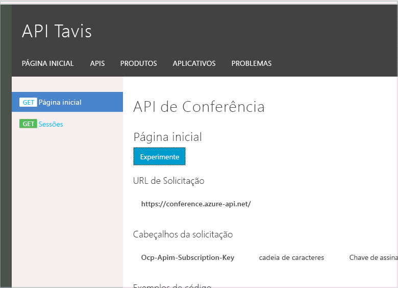

# <a name="monitor-your-apis-with-azure-api-management-event-hubs-and-moesif"></a>Monitorar suas APIs com Gerenciamento de API do Azure, os Hubs de Eventos e Moesif
O [serviço Gerenciamento de API](api-management-key-concepts.md) oferece muitos recursos para aprimorar o processamento de solicitações HTTP enviadas à API do HTTP. No entanto, a existência das solicitações e respostas é transitória. A solicitação é feita e flui pelo serviço Gerenciamento de API para a API de back-end. Sua API processa a solicitação e uma resposta flui de volta para o consumidor da API. O serviço Gerenciamento de API mantém algumas estatísticas importantes sobre as APIs para exibição no painel do portal do Azure, mas fora isso, os detalhes são apagados.

Ao usar a política log-to-eventhub no serviço Gerenciamento de API, você poderá enviar todos os detalhes da solicitação e da resposta para um [Hub de Eventos do Azure](../event-hubs/event-hubs-what-is-event-hubs.md). Existem vários motivos pelos quais você pode querer gerar eventos de mensagens HTTP enviadas para suas APIs. Alguns exemplos incluem trilha de auditoria de atualizações, análise de uso, alerta de exceção e integrações de terceiros.

Este artigo demonstra como capturar a mensagem inteira de solicitação e resposta HTTP, como enviá-la a um Hub de Eventos e como retransmitir essa mensagem a um serviço terceirizado que forneça serviços de registro em log e monitoramento de HTTP.

## <a name="why-send-from-api-management-service"></a>Por que enviar do serviço Gerenciamento de API?
É possível escrever middleware HTTP que possa se conectar à estrutura de API HTTP para capturar solicitações e respostas HTTP e mantê-las em sistemas de registro em log e monitoramento. A desvantagem dessa abordagem é que o middleware HTTP precisa ser integrado à API de back-end e deve corresponder à plataforma da API. Se houver várias APIs, cada uma delas deverá implantar o middleware. Normalmente, há motivos pelos quais as APIs de back-end não podem ser atualizadas.

O uso do serviço Gerenciamento de API do Azure para se integrar à infraestrutura de registro em log fornece uma solução centralizada independente de plataforma. Ela também é escalonável, em parte devido aos recursos de [replicação geográfica](api-management-howto-deploy-multi-region.md) do Gerenciamento de API do Azure.

## <a name="why-send-to-an-azure-event-hub"></a>Por que enviar a um Hub de Eventos do Azure?
É pertinente perguntar, por que criar uma política que seja específica dos Hubs de Evento do Azure? Há muitos locais diferentes onde eu posso querer registrar em log minhas solicitações. Por que não basta enviar as solicitações diretamente para o destino final?  Essa é uma opção. No entanto, ao registrar em log as solicitações de um serviço de gerenciamento de API, será necessário considerar como as mensagens de log afetam o desempenho da API. Os aumentos graduais na carga podem ser tratados aumentando as instâncias disponíveis dos componentes do sistema ou aproveitando a replicação geográfica. No entanto, picos curtos no tráfego podem fazer com que as solicitações sejam atrasadas caso as solicitações para infraestrutura de registro em log comecem a ficar lentas sob carga.

Os Hubs de Eventos do Azure foram desenvolvidos para acomodar volumes gigantes de dados, com capacidade para lidar com um número muito maior de eventos do que o número de solicitações HTTP processadas pelas APIs. O Hub de Eventos atua como um tipo de buffer sofisticado entre o serviço Gerenciamento de API e a infraestrutura que armazena e processa as mensagens. Isso garante que o desempenho da API não sofrerá devido à infraestrutura de log.

Depois que os dados tiverem sido passados para um Hub de Eventos, eles serão mantidos e ficarão aguardando que os consumidores do Hub de Eventos os processem. Para o Hub de Eventos, não faz diferença como eles são processados; seu único interesse é ter certeza de que a mensagem será entregue com êxito.

Os Hubs de Eventos conseguem transmitir eventos a vários grupos de consumidores. Isso permite que os eventos sejam processados por sistemas diferentes. Desse modo, é possível oferecer suporte a muitos cenários de integração, sem impor atrasos adicionais no processamento da solicitação de API no serviço Gerenciamento de API, pois somente um evento precisa ser gerado.

## <a name="a-policy-to-send-applicationhttp-messages"></a>Uma política para enviar mensagens de aplicativo/http
Um Hub de Eventos aceita dados de evento como uma cadeia de caracteres simples. Você é que define o conteúdo dessa cadeia de caracteres. Para poder empacotar uma solicitação HTTP e enviá-la para os Hubs de Eventos, precisamos formatar a cadeia de caracteres com as informações da solicitação ou da resposta. Em situações como essa, se houver um formato existente que possamos reutilizar, talvez não seja necessário escrever nosso próprio código de análise. Inicialmente, considerei o uso do [HAR](http://www.softwareishard.com/blog/har-12-spec/) para enviar solicitações e respostas HTTP. No entanto, esse formato é otimizado para armazenar uma sequência de solicitações HTTP em um formato baseado em JSON. Ele continha vários elementos obrigatórios que adicionaram complexidade desnecessária ao cenário de transmitir a mensagem HTTP por cabo.

Uma opção alternativa foi usar o tipo de mídia `application/http` , como descrito na [RFC 7230](https://tools.ietf.org/html/rfc7230)da especificação HTTP. Esse tipo de mídia usa o mesmo formato que é utilizado para enviar de fato mensagens HTTP por cabo, mas toda a mensagem pode ser colocada no corpo de outra solicitação HTTP. Em nosso caso, vamos usar o corpo como nossa mensagem para envio aos Hubs de Eventos. Para sua conveniência, há um analisador nas bibliotecas do [Microsoft ASP.NET Web API 2.2 Client](https://www.nuget.org/packages/Microsoft.AspNet.WebApi.Client/) que pode analisar esse formato e convertê-lo nos objetos nativos `HttpRequestMessage` e `HttpResponseMessage`.

Para poder criar essa mensagem, precisamos aproveitar as [Expressões de política](/azure/api-management/api-management-policy-expressions) baseadas em C# no Gerenciamento de API do Azure. Veja a política que envia uma mensagem de solicitação HTTP aos Hubs de Eventos do Azure.

```xml
<log-to-eventhub logger-id="conferencelogger" partition-id="0">
@{
   var requestLine = string.Format("{0} {1} HTTP/1.1\r\n",
                                               context.Request.Method,
                                               context.Request.Url.Path + context.Request.Url.QueryString);

   var body = context.Request.Body?.As<string>(true);
   if (body != null && body.Length > 1024)
   {
       body = body.Substring(0, 1024);
   }

   var headers = context.Request.Headers
                          .Where(h => h.Key != "Authorization" && h.Key != "Ocp-Apim-Subscription-Key")
                          .Select(h => string.Format("{0}: {1}", h.Key, String.Join(", ", h.Value)))
                          .ToArray<string>();

   var headerString = (headers.Any()) ? string.Join("\r\n", headers) + "\r\n" : string.Empty;

   return "request:"   + context.Variables["message-id"] + "\n"
                       + requestLine + headerString + "\r\n" + body;
}
</log-to-eventhub>
```

### <a name="policy-declaration"></a>Declaração de política
Existem alguns itens específicos sobre essa expressão de política que vale a pena mencionar. A política log-to-eventhub tem um atributo chamado logger-id, que se refere ao nome do agente que foi criado no serviço Gerenciamento de API. Os detalhes de como configurar um agente do Hub de Eventos no serviço Gerenciamento de API podem ser encontrados no documento [Como registrar em log eventos nos Hubs de Eventos do Azure no Gerenciamento de API do Azure](api-management-howto-log-event-hubs.md). O segundo atributo é um parâmetro opcional que indica aos Hubs de Eventos em qual partição armazenar a mensagem. Os Hubs de Eventos usam partições para habilitar a escalabilidade e exigem no mínimo duas. A entrega ordenada das mensagens é garantida apenas dentro de uma partição. Se não indicarmos ao Hub de Eventos qual partição deve receber a mensagem, ele usará um algoritmo de round robin para distribuir a carga. No entanto, isso pode fazer com que algumas das nossas mensagens sejam processadas fora de ordem.

### <a name="partitions"></a>Partições
Para garantir que nossas mensagens sejam entregues aos consumidores em ordem e aproveitar o recurso de distribuição de carga das partições, optei por enviar mensagens de solicitação HTTP a uma partição e mensagens de resposta HTTP a uma segunda partição. Isso garante uma distribuição de carga uniforme e faz com que todas as solicitações e respostas sejam consumidas na ordem certa. É possível que uma resposta seja consumida antes da solicitação correspondente, mas isso não é um problema, pois temos um mecanismo diferente para correlacionar solicitações com respostas e sabemos que as solicitações sempre vêm antes das respostas.

### <a name="http-payloads"></a>Cargas HTTP
Depois de criar `requestLine`, verificamos se o corpo da solicitação deve ser truncado. O corpo da solicitação é truncado a apenas 1024. Esse número poderá ser aumentado, embora as mensagens individuais do Hub de Eventos estejam limitadas a 256 KB, de modo que é provável que alguns corpos de mensagem HTTP não caibam em uma única mensagem. Ao registrar em log e analisar, uma quantidade significativa de informações só poderá ser derivada da linha e dos cabeçalhos da solicitação HTTP. Além disso, muitas solicitações de API retornam apenas corpos pequenos e, portanto, a perda do valor das informações ao truncar corpos grandes é razoavelmente mínima em comparação com a redução nos custos de transferir, processar e armazenar para manter todo o conteúdo do corpo. Uma observação final sobre o processamento do corpo é que precisamos passar `true`para o método`As<string>()`, pois estamos lendo o conteúdo do corpo, mas também queremos que a API de back-end seja capaz de ler o corpo. Ao passar true para esse método, fazemos com que o corpo seja armazenado em buffer, de modo que ele possa ser lido uma segunda vez. Será importante lembrar-se disso, caso você tenha uma API que carregue arquivos grandes ou use sondagens longas. Nesses casos, é melhor evitar a leitura do corpo.

### <a name="http-headers"></a>Cabeçalhos HTTP
Os cabeçalhos HTTP podem ser transferidos para o formato da mensagem em um formato de pares simples de chave/valor. Optamos por retirar determinados campos sensíveis à segurança, a fim de evitar vazamento desnecessário das informações credenciais. É improvável que as chaves da API e outras credenciais sejam usadas para fins de análise. Se desejarmos analisar o usuário e o produto específico que ele está usando, poderemos obter isso no objeto `context` e adicionar à mensagem.

### <a name="message-metadata"></a>Metadados da mensagem
Quando criamos a mensagem completa a ser enviada ao hub de eventos, a primeira linha não fará realmente parte da mensagem `application/http` . A primeira linha é composta de metadados adicionais que consistem em apontar se a mensagem é de solicitação ou de resposta e em uma ID de mensagem usada para correlacionar solicitações com as respostas. A ID da mensagem é criada usando outra política que se parece com esta:

```xml
<set-variable name="message-id" value="@(Guid.NewGuid())" />
```

Poderíamos ter criado a mensagem de solicitação, tê-la armazenado em uma variável até que a resposta fosse retornada e, em seguida, enviado a solicitação e a resposta como uma única mensagem. No entanto, ao enviarmos a solicitação e a resposta de modo independente e usando uma id de mensagem para correlacionar as duas, obtemos um pouco mais de flexibilidade no tamanho da mensagem, a capacidade de aproveitar várias partições enquanto mantemos a ordem da mensagem, e a solicitação aparecerá em nosso painel de log em pouco tempo. Também pode haver alguns cenários em que uma resposta válida nunca é enviada para o hub de evento, possivelmente devido a um erro fatal de solicitação no serviço Gerenciamento de API, mas ainda ficamos com um registro da solicitação.

A política para enviar a mensagem de resposta HTTP é semelhante à solicitação e, portanto, a configuração da política completa se parece com esta:

```xml
<policies>
  <inbound>
      <set-variable name="message-id" value="@(Guid.NewGuid())" />
      <log-to-eventhub logger-id="conferencelogger" partition-id="0">
      @{
          var requestLine = string.Format("{0} {1} HTTP/1.1\r\n",
                                                      context.Request.Method,
                                                      context.Request.Url.Path + context.Request.Url.QueryString);

          var body = context.Request.Body?.As<string>(true);
          if (body != null && body.Length > 1024)
          {
              body = body.Substring(0, 1024);
          }

          var headers = context.Request.Headers
                               .Where(h => h.Key != "Authorization" && h.Key != "Ocp-Apim-Subscription-Key")
                               .Select(h => string.Format("{0}: {1}", h.Key, String.Join(", ", h.Value)))
                               .ToArray<string>();

          var headerString = (headers.Any()) ? string.Join("\r\n", headers) + "\r\n" : string.Empty;

          return "request:"   + context.Variables["message-id"] + "\n"
                              + requestLine + headerString + "\r\n" + body;
      }
  </log-to-eventhub>
  </inbound>
  <backend>
      <forward-request follow-redirects="true" />
  </backend>
  <outbound>
      <log-to-eventhub logger-id="conferencelogger" partition-id="1">
      @{
          var statusLine = string.Format("HTTP/1.1 {0} {1}\r\n",
                                              context.Response.StatusCode,
                                              context.Response.StatusReason);

          var body = context.Response.Body?.As<string>(true);
          if (body != null && body.Length > 1024)
          {
              body = body.Substring(0, 1024);
          }

          var headers = context.Response.Headers
                                          .Select(h => string.Format("{0}: {1}", h.Key, String.Join(", ", h.Value)))
                                          .ToArray<string>();

          var headerString = (headers.Any()) ? string.Join("\r\n", headers) + "\r\n" : string.Empty;

          return "response:"  + context.Variables["message-id"] + "\n"
                              + statusLine + headerString + "\r\n" + body;
     }
  </log-to-eventhub>
  </outbound>
</policies>
```

A política `set-variable` cria um valor que pode ser acessado pela política `log-to-eventhub` na seção `<inbound>` e na seção `<outbound>`.

## <a name="receiving-events-from-event-hubs"></a>Recebendo eventos dos Hubs de Eventos
Os eventos do Hub de Eventos do Azure são recebidos usando o [protocolo AMQP](https://www.amqp.org/). A equipe do Barramento de Serviço da Microsoft disponibilizou bibliotecas de cliente para facilitar o consumo de eventos. Duas abordagens diferentes são aceitas, uma é ser um *Consumidor Direto* e a outra é usar a classe `EventProcessorHost`. Exemplos dessas duas abordagens podem ser encontrados no [Guia de Programação dos Hubs de Eventos](../event-hubs/event-hubs-programming-guide.md). A principal diferença é: o `Direct Consumer` dá a você controle total e o `EventProcessorHost` executa alguns trabalhos para você, mas faz determinadas suposições sobre como esses trabalhos são processados.

### <a name="eventprocessorhost"></a>EventProcessorHost
Neste exemplo, usamos o `EventProcessorHost` para simplificar, mas ele pode não ser a melhor opção para esse cenário específico. `EventProcessorHost` faz o trabalho difícil, para que você não precise se preocupar com problemas de threading em uma classe específica de processador de eventos. Entretanto, em nosso cenário, estamos simplesmente convertendo a mensagem em outro formato e passando-a para outro serviço usando um método assíncrono. Não há necessidade de atualizar o estado compartilhado e, portanto, nenhum risco de ter problemas de threading. Na maioria dos cenários, `EventProcessorHost` provavelmente é a melhor opção e, certamente, a mais fácil.

### <a name="ieventprocessor"></a>IEventProcessor
O conceito central ao usar `EventProcessorHost` é criar uma implementação da interface `IEventProcessor` que contenha o método `ProcessEventAsync`. A essência desse método é mostrada aqui:

```csharp
async Task IEventProcessor.ProcessEventsAsync(PartitionContext context, IEnumerable<EventData> messages)
{

    foreach (EventData eventData in messages)
    {
        _Logger.LogInfo(string.Format("Event received from partition: {0} - {1}", context.Lease.PartitionId,eventData.PartitionKey));

        try
        {
            var httpMessage = HttpMessage.Parse(eventData.GetBodyStream());
            await _MessageContentProcessor.ProcessHttpMessage(httpMessage);
        }
        catch (Exception ex)
        {
            _Logger.LogError(ex.Message);
        }
    }
    ... checkpointing code snipped ...
}
```

Uma lista de objetos EventData é passada no método e nós iteramos essa lista. Os bytes de cada método são analisados em um objeto HttpMessage e esse objeto é passado para uma instância de IHttpMessageProcessor.

### <a name="httpmessage"></a>HttpMessage
A instância de `HttpMessage` contém três partes de dados:

```csharp
public class HttpMessage
{
    public Guid MessageId { get; set; }
    public bool IsRequest { get; set; }
    public HttpRequestMessage HttpRequestMessage { get; set; }
    public HttpResponseMessage HttpResponseMessage { get; set; }

... parsing code snipped ...

}
```

A instância `HttpMessage` contém um GUID `MessageId` que nos permite conectar a solicitação HTTP à resposta HTTP correspondente e um valor booliano que identifica se o objeto contém uma instância de HttpRequestMessage e HttpResponseMessage. Ao usar a compilação nas classes HTTP de `System.Net.Http`, pude aproveitar o código de análise `application/http` que está incluído em `System.Net.Http.Formatting`.  

### <a name="ihttpmessageprocessor"></a>IHttpMessageProcessor
A instância `HttpMessage` é então encaminhada para implementação de `IHttpMessageProcessor`, que é uma interface que criei para separar o recebimento e a interpretação do evento do Hub de Eventos do Azure e o processamento real dele.

## <a name="forwarding-the-http-message"></a>Encaminhando a mensagem HTTP
Para esse exemplo, decidi que seria interessante enviar a solicitação HTTP para a [Análise de API do Moesif](https://www.moesif.com). O Moesif é um serviço baseado em nuvem especializado em depuração e análise de HTTP. Ele tem uma camada gratuita para ser fácil testá-lo e nos permite ver as solicitações HTTP em tempo real fluindo pelo nosso serviço Gerenciamento de API.

A implementação de `IHttpMessageProcessor` se parece com esta:

```csharp
public class MoesifHttpMessageProcessor : IHttpMessageProcessor
{
    private readonly string RequestTimeName = "MoRequestTime";
    private MoesifApiClient _MoesifClient;
    private ILogger _Logger;
    private string _SessionTokenKey;
    private string _ApiVersion;
    public MoesifHttpMessageProcessor(ILogger logger)
    {
        var appId = Environment.GetEnvironmentVariable("APIMEVENTS-MOESIF-APP-ID", EnvironmentVariableTarget.Process);
        _MoesifClient = new MoesifApiClient(appId);
        _SessionTokenKey = Environment.GetEnvironmentVariable("APIMEVENTS-MOESIF-SESSION-TOKEN", EnvironmentVariableTarget.Process);
        _ApiVersion = Environment.GetEnvironmentVariable("APIMEVENTS-MOESIF-API-VERSION", EnvironmentVariableTarget.Process);
        _Logger = logger;
    }

    public async Task ProcessHttpMessage(HttpMessage message)
    {
        if (message.IsRequest)
        {
            message.HttpRequestMessage.Properties.Add(RequestTimeName, DateTime.UtcNow);
            return;
        }

        EventRequestModel moesifRequest = new EventRequestModel()
        {
            Time = (DateTime) message.HttpRequestMessage.Properties[RequestTimeName],
            Uri = message.HttpRequestMessage.RequestUri.OriginalString,
            Verb = message.HttpRequestMessage.Method.ToString(),
            Headers = ToHeaders(message.HttpRequestMessage.Headers),
            ApiVersion = _ApiVersion,
            IpAddress = null,
            Body = message.HttpRequestMessage.Content != null ? System.Convert.ToBase64String(await message.HttpRequestMessage.Content.ReadAsByteArrayAsync()) : null,
            TransferEncoding = "base64"
        };

        EventResponseModel moesifResponse = new EventResponseModel()
        {
            Time = DateTime.UtcNow,
            Status = (int) message.HttpResponseMessage.StatusCode,
            IpAddress = Environment.MachineName,
            Headers = ToHeaders(message.HttpResponseMessage.Headers),
            Body = message.HttpResponseMessage.Content != null ? System.Convert.ToBase64String(await message.HttpResponseMessage.Content.ReadAsByteArrayAsync()) : null,
            TransferEncoding = "base64"
        };

        Dictionary<string, string> metadata = new Dictionary<string, string>();
        metadata.Add("ApimMessageId", message.MessageId.ToString());

        EventModel moesifEvent = new EventModel()
        {
            Request = moesifRequest,
            Response = moesifResponse,
            SessionToken = _SessionTokenKey != null ? message.HttpRequestMessage.Headers.GetValues(_SessionTokenKey).FirstOrDefault() : null,
            Tags = null,
            UserId = null,
            Metadata = metadata
        };

        Dictionary<string, string> response = await _MoesifClient.Api.CreateEventAsync(moesifEvent);

        _Logger.LogDebug("Message forwarded to Moesif");
    }

    private static Dictionary<string, string> ToHeaders(HttpHeaders headers)
    {
        IEnumerable<KeyValuePair<string, IEnumerable<string>>> enumerable = headers.GetEnumerator().ToEnumerable();
        return enumerable.ToDictionary(p => p.Key, p => p.Value.GetEnumerator()
                                                         .ToEnumerable()
                                                         .ToList()
                                                         .Aggregate((i, j) => i + ", " + j));
    }
}
```

O `MoesifHttpMessageProcessor` tira proveito de uma [biblioteca de API C# para Moesif](https://www.moesif.com/docs/api?csharp#events) que facilita o envio por push dos dados de evento de HTTP para o respectivo serviço. Para enviar dados HTTP para a API de Coletor do Moesif, você precisa de uma conta e uma ID de aplicativo. É possível obter uma ID de aplicativo Moesif ao criar uma conta no [site do Moesif](https://www.moesif.com) e, em seguida, acessando o _Menu no canto superior direito_ -> _Configuração do aplicativo_.

## <a name="complete-sample"></a>Exemplo completo
O [código-fonte](https://github.com/dgilling/ApimEventProcessor) e os testes do exemplo estão no GitHub. Para executar o exemplo, você precisará de um [Serviço de Gerenciamento de API](get-started-create-service-instance.md), de um [Hub de Eventos conectado](api-management-howto-log-event-hubs.md) e de uma [Conta de Armazenamento](../storage/common/storage-create-storage-account.md).   

O exemplo é apenas um aplicativo de console simples que escuta eventos originados no Hub de Eventos, os converte em objetos `EventRequestModel` e `EventResponseModel` do Moesif e os encaminha para a API de Coletor do Moesif.

Na imagem animada a seguir, você pode ver uma solicitação sendo feita em uma API no Portal do Desenvolvedor e o aplicativo de console que mostra a mensagem sendo recebida, processada e encaminhada. Em seguida, a solicitação e a resposta serão mostradas no fluxo de eventos.



## <a name="summary"></a>Resumo
O serviço Gerenciamento de API do Azure fornece um lugar ideal para capturar o tráfego HTTP que entra e sai de suas APIs. Os Hubs de Eventos do Azure são uma solução escalonável de baixo custo para capturar esse tráfego e mantê-lo em sistemas de processamento secundários para registro em log, monitoramento e outras análise sofisticadas. A conexão a sistemas de monitoramento de tráfego de terceiros, como o Moesif, usa apenas algumas dezenas de linhas de código.

## <a name="next-steps"></a>Próximas etapas
* Saiba mais sobre Hubs de Eventos do Azure
  * [Introdução aos Hubs de Eventos do Azure](../event-hubs/event-hubs-c-getstarted-send.md)
  * [Receber mensagens com EventProcessorHost](../event-hubs/event-hubs-dotnet-standard-getstarted-receive-eph.md)
  * [Guia de programação dos Hubs de Eventos](../event-hubs/event-hubs-programming-guide.md)
* Saiba mais sobre a integração do Gerenciamento de API e Hubs de eventos
  * [Como registrar eventos em log para Hubs de Eventos do Azure no Gerenciamento de API do Azure](api-management-howto-log-event-hubs.md)
  * [Referência de entidade do agente](https://docs.microsoft.com/rest/api/apimanagement/apimanagementrest/azure-api-management-rest-api-logger-entity)
  * [referência de política de log ao hub de eventos](/azure/api-management/api-management-advanced-policies#log-to-eventhub)
