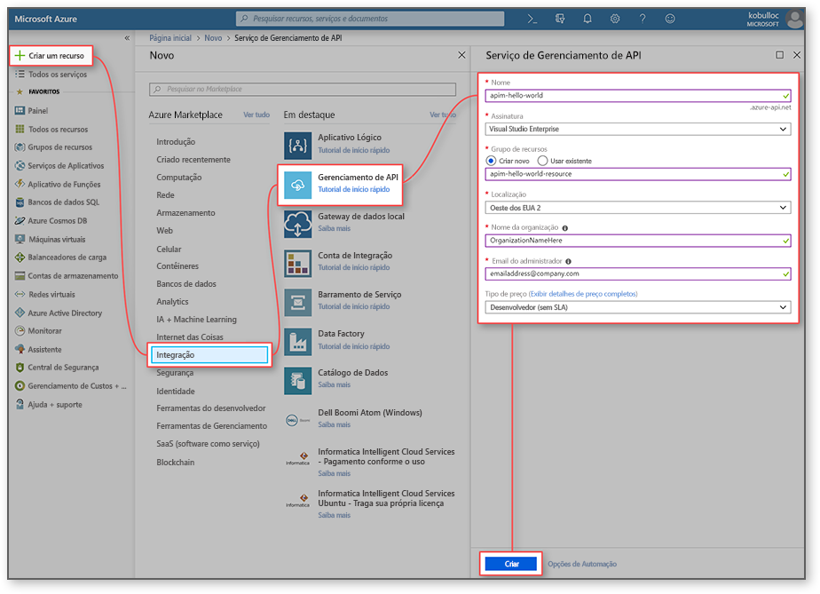
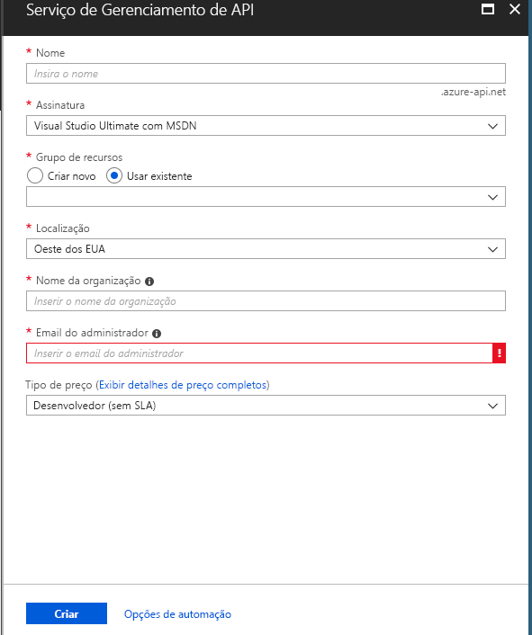
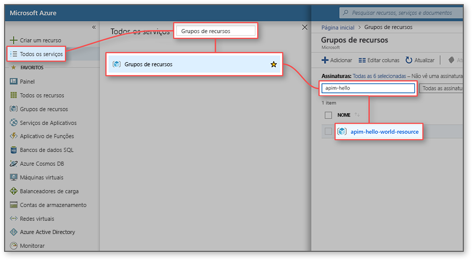
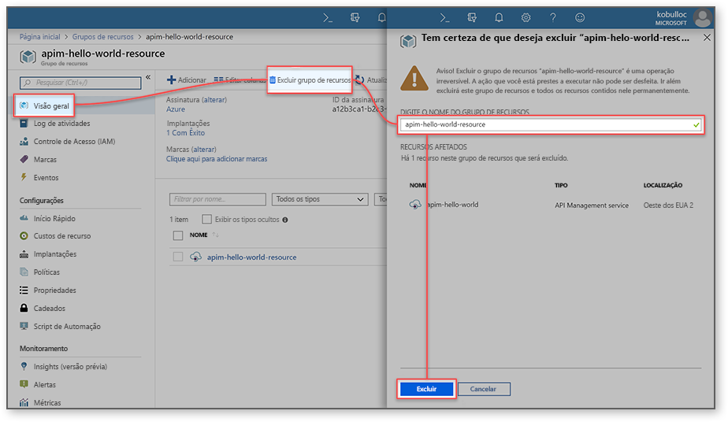

# Criar uma nova instância do serviço de Gerenciamento de API do Azure

O APIM (Gerenciamento de API) do Azure ajuda as organizações a publicar APIs para parceiros externos e desenvolvedores internos a fim de liberar o potencial de seus dados e serviços. O Gerenciamento de API fornece as competências essenciais para garantir um programa de API de sucesso através do envolvimento do desenvolvedor, ideias de negócios, análises, segurança e proteção. O APIM permite que você crie e gerencie gateways de API modernos para serviços de back-end hospedados em qualquer lugar. Para obter mais informações, confira o tópico [Visão geral](api-management-key-concepts.md).

Este guia de início rápido descreve as etapas para criar uma nova instância de Gerenciamento de API usando o portal do Azure.

[!INCLUDE [quickstarts-free-trial-note](../../includes/quickstarts-free-trial-note.md)]

## Fazer logon no Azure

Faça logon no Portal do Azure em http://portal.azure.com.

## Criar um novo serviço

1. No [portal do Azure](https://portal.azure.com/), selecione **Criar um recurso** > **Enterprise Integration** > **Gerenciamento de API**.

    Como alternativa, escolha **Novo**, digite `API management` na caixa de pesquisa e pressione Enter. Clique em **Criar**.

2. Na janela **Serviço de gerenciamento de API**, insira as configurações.

    

    | Configuração                 | Valor sugerido                               | Descrição                                                                                                                                                                                                                                                                                                                         |
|-------------------------|-----------------------------------------------|-------------------------------------------------------------------------------------------------------------------------------------------------------------------------------------------------------------------------------------------------------------------------------------------------------------------------------------|
| **Nome**                | Um nome exclusivo para o serviço de gerenciamento de API | O nome não poderá ser alterado posteriormente. O nome do serviço é usado para gerar um nome de domínio padrão na forma de *{name}.azure-api.net.* Se você quiser usar um nome de domínio personalizado, consulte [Configurar um domínio personalizado](configure-custom-domain.md).   O nome do serviço é usado para referir-se ao serviço e ao recurso do Azure correspondente. |
| **Assinatura**        | Sua assinatura                             | A assinatura sob a qual essa nova instância de serviço será criada. Você pode selecionar a assinatura entre as diferentes assinaturas do Azure às quais você tem acesso.                                                                                                                                                            |
| **Grupo de recursos**      | *apimResourceGroup*                           | Você pode selecionar um recurso novo ou existente. Um grupo de recursos é uma coleção de recursos que compartilham o ciclo de vida, as permissões e as políticas. Saiba mais [aqui](../azure-resource-manager/resource-group-overview.md#resource-groups).                                                                                                  |
| **Localidade**            | *Oeste dos EUA*                                    | Selecione a região geográfica perto de você. Somente as regiões de serviço de Gerenciamento de API disponíveis aparecem na caixa de listagem suspensa.                                                                                                                                                                                                          |
| **Nome da organização**   | O nome da sua organização                 | Esse nome é usado em vários locais, incluindo o título do portal do desenvolvedor e o remetente de emails de notificação.                                                                                                                                                                                                             |
| **Email do administrador** | *admin@org.com*                               | Defina o endereço de email ao qual todas as notificações de **Gerenciamento de API** serão enviadas.                                                                                                                                                                                                                                              |
| **Tipo de preços**        | *Desenvolvedores*                                   | Defina a camada **Desenvolvedor** para avaliar o serviço. Essa camada não é para uso em produção. Para obter mais informações sobre a colocação em escala das camadas de Gerenciamento de API, confira [atualizar e dimensionar](upgrade-and-scale.md).                                                                                                                                    |

3. Escolha **Criar**.

    > [!TIP]
    > Geralmente leva entre 20 e 30 minutos para criar um serviço de Gerenciamento de API. Selecionar **Fixar ao painel** torna a localização de um serviço recém-criado mais fácil.

[!INCLUDE [api-management-navigate-to-instance.md](../../includes/api-management-navigate-to-instance.md)]

## Limpar recursos

Quando não for mais necessário, você poderá remover o grupo de recursos e todos os recursos relacionados seguindo estas etapas:

1. No portal do Azure, clique em **Todos os serviços**.
2. Insira `resource groups` na caixa de pesquisa e clique no resultado.

    

3. Localize seu grupo de recursos e clique nele.
4. Clique em **Excluir grupo de recursos**.

    

5. Confirme a exclusão inserindo o nome do seu grupo de recursos.
6. Clique em **Excluir**.

## Próximas etapas

> [!div class="nextstepaction"]
> [Importar e publicar sua primeira API](import-and-publish.md)
