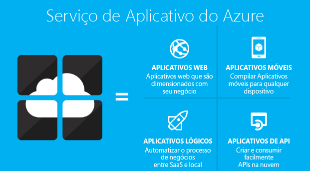
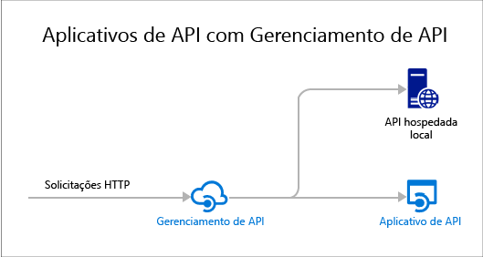

# Visão geral de Aplicativos de API
Os aplicativos de API no Serviço de Aplicativo do Azure oferecem recursos que tornam mais fácil desenvolver, hospedar e consumir APIs na nuvem e no local. Com aplicativos de API, você obtém segurança de nível corporativo, controle de acesso simples, conectividade híbrida, geração automática do SDK e integração perfeita com [Aplicativos Lógicos](../app-service-logic/app-service-logic-what-are-logic-apps.md).

O [Serviço de Aplicativo do Azure](../app-service/app-service-value-prop-what-is.md) é uma plataforma completamente gerenciada para Web, móvel e situações de integração. Os Aplicativos de API são um dos quatro tipos de aplicativos oferecidos pelo [Serviço de Aplicativo do Azure](../app-service/app-service-value-prop-what-is.md).

## Por que usar Aplicativos de API?
Aqui estão alguns dos principais recursos dos aplicativos de API:

* **Coloque sua API existente como ela está** – você não precisa alterar nenhum código em suas APIs existentes para tirar proveito dos Aplicativos de API. Basta implantar seu código em um aplicativo de API. Sua API pode usar qualquer linguagem ou estrutura com suporte do Serviço de Aplicativo, incluindo ASP.NET e C#, Java, PHP, Node.js e Python.
* **Consumo fácil** - O suporte integrado para [Metadados de API do Swagger](http://swagger.io/) torna suas APIs facilmente consumíveis por uma variedade de clientes. Geração automática de código do cliente para suas APIs em uma variedade de linguagens incluindo C#, Java e Javascript. Configure facilmente [CORS](app-service-api-cors-consume-javascript.md) sem alterar seu código. Para obter mais informações, consulte [Metadados de aplicativos de API para geração de código e descoberta de API](app-service-api-metadata.md) e [Consumir um aplicativo de API a partir do JavaScript usando CORS](app-service-api-cors-consume-javascript.md).
* **Controle de acesso simples** - Protege um aplicativo de API contra o acesso não autenticado sem fazer alterações ao seu código. Serviços de autenticação internos protegem as APIs para acesso por outros serviços ou por clientes que representam usuários. Os provedores de identidade com suporte incluem Azure Active Directory, Facebook, Twitter, Google e Conta da Microsoft. Os clientes podem usar a ADAL (Biblioteca de Autenticação do Active Directory) ou o SDK de Aplicativos Móveis. Para saber mais, confira [Autenticação e autorização para Aplicativos de API no Serviço de Aplicativo do Azure](app-service-api-authentication.md).
* **Integração do Visual Studio** -Ferramentas dedicadas no Visual Studio simplificam o trabalho de criação, implantação, consumo, depuração e gerenciamento de aplicativos de API. Para obter mais informações, consulte [Anunciando o SDK 2.8.1 do Azure para .NET](/blog/announcing-azure-sdk-2-8-1-for-net/).
* **Integração com Aplicativos lógicos** - Aplicativos de API criados por você podem ser consumidos por [Aplicativos lógicos do Serviço de Aplicativo](../app-service-logic/app-service-logic-what-are-logic-apps.md). Para saber mais, confira [Usando a API personalizada hospedada no Serviço de Aplicativo com Aplicativos lógicos](../app-service-logic/app-service-logic-custom-hosted-api.md) e [Nova versão de esquema 2015-08-01-preview](../app-service-logic/app-service-logic-schema-2015-08-01.md).

Além disso, um aplicativo de API pode tirar proveito dos recursos oferecidos pelos [Aplicativos Web](../app-service-web/app-service-web-overview.md) e [Aplicativos Móveis](../app-service-mobile/app-service-mobile-value-prop.md). O inverso também é verdadeiro: se você usar um aplicativo Web ou aplicativo móvel para hospedar uma API, ele pode tirar proveito de recursos dos Aplicativos de API como metadados Swagger para geração de código de cliente e CORS para acesso de domínio cruzado de navegador. A única diferença entre os três tipos de aplicativo (API, Web, móveis) é o nome e o ícone usado para eles no Portal do Azure.

## Qual é a diferença entre os Aplicativos de API e Gerenciamento de API do Azure?
Os Aplicativos de API e o [Gerenciamento de API do Azure](../api-management/api-management-key-concepts.md) são serviços complementares:

* O Gerenciamento de API trata do gerenciamento de APIs. Coloque um front-end de Gerenciamento de API em uma API para monitorar e restringir o uso, manipular a entrada e a saída, consolidar várias APIs em um ponto de extremidade e assim por diante. As APIs gerenciadas podem ser hospedadas em qualquer lugar.
* Os Aplicativos de API tratam da hospedagem de APIs. O serviço inclui recursos que facilitam o desenvolvimento e o consumo de APIs, mas não faz os tipos de monitoramento, limitação, manipulação ou consolidação que o Gerenciamento de API faz. Se você não precisa de recursos do Gerenciamento de API, pode hospedar APIs em aplicativos de API sem usar o Gerenciamento de API.

Aqui está um diagrama que ilustra o Gerenciamento de API usado para APIs hospedadas em aplicativos de API e em outros lugares.

Alguns recursos de Gerenciamento de API e Aplicativos de API têm funções semelhantes. Por exemplo, ambos podem automatizar o suporte a CORS. Quando você usa os dois serviços juntos, usa o Gerenciamento de API para CORS, já que ele funciona como o front-end para seus aplicativos de API.

## Introdução
Para começar a usar os Aplicativos de API implantando código de exemplo em um deles, confira o tutorial para a estrutura de sua preferência:

* [ASP.NET](app-service-api-dotnet-get-started.md)
* [Node.js](app-service-api-nodejs-api-app.md)
* [Java](app-service-api-java-api-app.md)

Para fazer perguntas sobre os aplicativos de API, inicie um thread no [Fórum dos Aplicativos de API](https://social.msdn.microsoft.com/Forums/pt-BR/home?forum=AzureAPIApps).

<!---HONumber=AcomDC_0824_2016-->