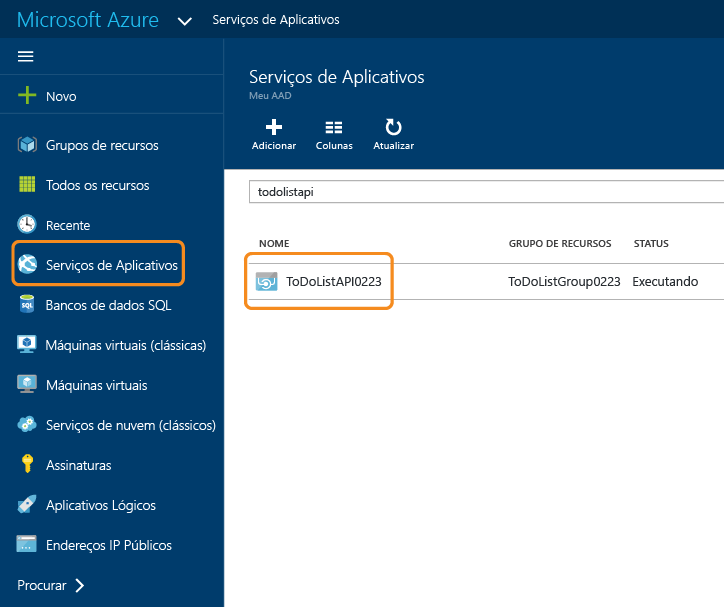
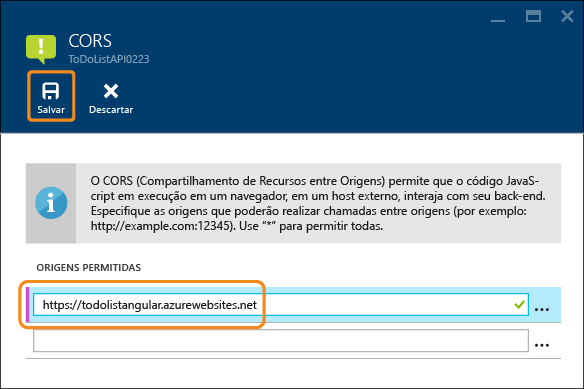
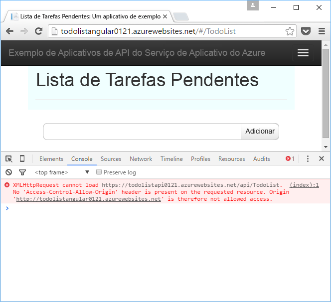
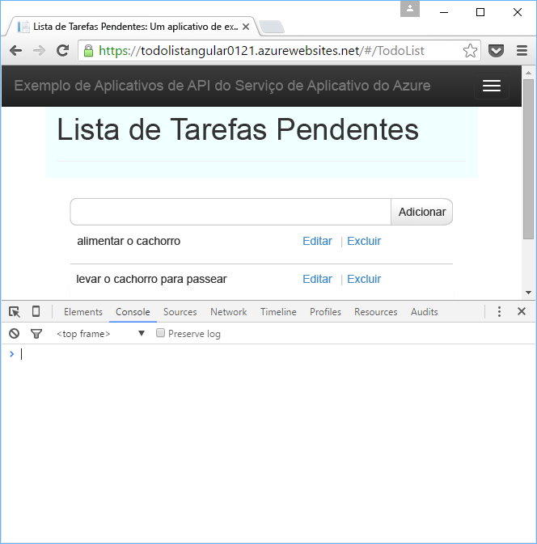

<properties
	pageTitle="Suporte a CORS no Serviço de Aplicativo | Microsoft Azure"
	description="Saiba como usar o suporte a CORS no Serviço de Aplicativo do Azure."
	services="app-service\api"
	documentationCenter=".net"
	authors="tdykstra"
	manager="wpickett"
	editor=""/>

<tags
	ms.service="app-service-api"
	ms.workload="na"
	ms.tgt_pltfrm="dotnet"
	ms.devlang="na"
	ms.topic="get-started-article"
	ms.date="03/31/2016"
	ms.author="tdykstra"/>

# Consumir um aplicativo de API do JavaScript usando CORS

O Serviço de Aplicativo oferece suporte interno para [CORS (Compartilhamento de Recursos Entre Origens)](https://en.wikipedia.org/wiki/Cross-origin_resource_sharing), que habilita os clientes JavaScript a fazer chamadas entre domínios para APIs que estão hospedadas em aplicativos de API. O Serviço de Aplicativo permite configurar o acesso ao CORS para a API sem escrever código na API.

Este artigo contém duas seções:

* A seção [Como configurar o CORS](#corsconfig) explica de forma geral como configurar o CORS para qualquer aplicativo de API, aplicativo Web ou aplicativo móvel. Ela se aplica igualmente a todas as estruturas às quais o Serviço de Aplicativo dá suporte, incluindo .NET, Node.js e Java. 

* Começando pela seção [Continuação dos tutoriais de Introdução ao .NET](#tutorialstart), o artigo é um tutorial que demonstra o suporte a CORS com base no que você fez no [primeiro tutorial de Introdução a aplicativos de API](app-service-api-dotnet-get-started.md).

##  Como configurar CORS no Serviço de Aplicativo do Azure

Você pode configurar o CORS no portal do Azure ou usando as ferramentas do [Azure Resource Manager](../resource-group-overview.md).

#### Configurar CORS no portal do Azure

8. Em um navegador, acesse o [portal do Azure](https://portal.azure.com/).

2. Clique em **Serviços de Aplicativos** e clique no nome do aplicativo de API.

	

10. Na folha **Configurações** que é aberta à direita da folha **Aplicativo de API**, localize a seção **API** e clique em **CORS**.

	

11. Na caixa de texto, insira a URL ou as URLs das quais você deseja permitir chamadas JavaScript.

	Por exemplo, se você implantou o aplicativo JavaScript para um aplicativo Web chamado todolistangular, digite "https://todolistangular.azurewebsites.net". Como alternativa, você pode inserir um asterisco (*) para especificar que todos os domínios de origem são aceitos.

13. Clique em **Salvar**.

	

	Depois que você clicar em **Salvar**, o aplicativo de API aceitará chamadas JavaScript das URLs especificadas.

#### Configurar CORS usando as ferramentas do Azure Resource Manager

Você também pode configurar o CORS para um aplicativo de API usando os [modelos do Azure Resource Manager](../resource-group-authoring-templates.md) em ferramentas de linha de comando, como o [Azure PowerShell](../powershell-install-configure.md) e a [CLI do Azure](../xplat-cli-install.md).

Para ver um exemplo de um modelo do Azure Resource Manager que define a propriedade do CORS, abra o [arquivo azuredeploy.json no repositório do aplicativo de exemplo deste tutorial](https://github.com/azure-samples/app-service-api-dotnet-todo-list/blob/master/azuredeploy.json). Localize a seção do modelo que se parece com o exemplo a seguir:

		"cors": {
		    "allowedOrigins": [
		        "todolistangular.azurewebsites.net"
		    ]
		}

##  Continuação do tutorial de introdução do .NET

Se está seguindo a série de introdução do Node.js ou do Java para aplicativos de API, você concluiu a série de introdução. Vá para a seção [Próximas etapas](#next-steps) para obter sugestões e saber mais sobre aplicativos de API.

O restante deste artigo é uma continuação da série de introdução do .NET e pressupõe que você tenha concluído com êxito [o primeiro tutorial](app-service-api-dotnet-get-started.md).

## Implantar o projeto ToDoListAngular para um novo aplicativo Web

No [primeiro tutorial](app-service-api-dotnet-get-started.md), você criou um aplicativo de API de camada intermediária e um aplicativo de API da camada de dados. Neste tutorial, você criará um aplicativo Web SPA (aplicativo de página única) que chama o aplicativo de API de camada intermediária. Para que o SPA funcione, você terá que habilitar CORS no aplicativo de API de camada intermediária.

No [aplicativo de exemplo ToDoList](https://github.com/Azure-Samples/app-service-api-dotnet-todo-list), o projeto ToDoListAngular é um cliente do AngularJS simples que chama o projeto de API Web ToDoListAPI de camada intermediária. O código JavaScript no arquivo *app/scripts/todoListSvc.js* chama a API usando o provedor HTTP do AngularJS.

		angular.module('todoApp')
		.factory('todoListSvc', ['$http', function ($http) {
		    var apiEndpoint = "http://localhost:46439";
		
		    $http.defaults.useXDomain = true;
		    delete $http.defaults.headers.common['X-Requested-With']; 
		
		    return {
		        getItems : function(){
		            return $http.get(apiEndpoint + '/api/TodoList');
		        },

		        /* Get by ID, Put, and Delete methods not shown */

		        postItem : function(item){
		            return $http.post(apiEndpoint + '/api/TodoList', item);
		        }
		    };
		}]);

### Criar um novo aplicativo Web para o projeto ToDoListAngular

O procedimento para criar um novo aplicativo Web do Serviço de Aplicativo e implantar um projeto nele é semelhante ao que você viu em [criar e implantar um aplicativo de API no primeiro tutorial nesta série](app-service-api-dotnet-get-started.md#createapiapp). A única diferença é que o tipo de aplicativo é **aplicativo Web** em vez de **aplicativo de API**. Para obter capturas de tela das caixas de diálogo, confira

1. No **Gerenciador de Soluções**, clique com o botão direito do mouse no projeto ToDoListAngular e em **Publicar**.

3.  Na guia **Perfil** do assistente **Publicar Web**, clique em **Serviço de Aplicativo do Microsoft Azure**.

5. Na caixa de diálogo **Serviço de Aplicativo**, clique em **Novo**.

3. Na guia **Hospedagem** da caixa de diálogo **Criar Serviço de Aplicativo**, insira um **Nome de Aplicativo Web** que seja exclusivo no domínio *azurewebsites.net*.

5. Escolha a **Assinatura** do Azure com a qual você deseja trabalhar.

6. Na lista suspensa **Grupo de Recursos**, escolha o mesmo grupo de recursos que você criou anteriormente.

4. Na lista suspensa **Plano do Serviço de Aplicativo**, escolha o mesmo plano criado anteriormente.

7. Clique em **Criar**.

	O Visual Studio cria o aplicativo Web, cria um perfil de publicação para ele e exibe a etapa **Conexão** do assistente **Publicar Web**.

	Não clique **Publicar** ainda. Na seção seguinte, você configurará o novo aplicativo Web para chamar o aplicativo de API de camada intermediária que está em execução no Serviço de Aplicativo.

### Definir a URL de camada intermediária nas configurações do aplicativo Web

1. Vá para o [portal do Azure](https://portal.azure.com/) e navegue até a folha **Aplicativo Web** do aplicativo Web que você criou para hospedar o projeto TodoListAngular (front-end).

2. Clique em **Configurações > Configurações do aplicativo**.

3. Na seção **Configurações do aplicativo**, adicione a chave e o valor a seguir:

	|Chave|Valor|Exemplo
	|---|---|---|
	|toDoListAPIURL|https://{your nome de aplicativo de API de tipo médio }.azurewebsites.net|https://todolistapi0121.azurewebsites.net|

4. Clique em **Salvar**.

	Quando o código for executado no Azure, esse valor substituirá a URL de localhost no arquivo *Web.config*.

	O código que obtém o valor de configuração está em *index.cshtml*:

		
		

	O código em *todoListSvc.js* usa a configuração:

		return {
		    getItems : function(){
		        return $http.get(apiEndpoint + '/api/TodoList');
		    },
		    getItem : function(id){
		        return $http.get(apiEndpoint + '/api/TodoList/' + id);
		    },
		    postItem : function(item){
		        return $http.post(apiEndpoint + '/api/TodoList', item);
		    },
		    putItem : function(item){
		        return $http.put(apiEndpoint + '/api/TodoList/', item);
		    },
		    deleteItem : function(id){
		        return $http({
		            method: 'DELETE',
		            url: apiEndpoint + '/api/TodoList/' + id
		        });
		    }
		};

### Implantar o projeto da Web ToDoListAngular no novo aplicativo Web

*  No Visual Studio, na etapa **Conexão** do assistente **Publicar na Web**, clique em **Publicar**.

	O Visual Studio implanta o projeto ToDoListAngular no novo aplicativo Web e abre um navegador para a URL do aplicativo Web.

### Testar o aplicativo sem CORS habilitado 

2. Nas Ferramentas de Desenvolvedor do navegador, abra a janela Console.

3. Na janela do navegador que exibe a interface do usuário AngularJS, clique no link **Lista de Tarefas Pendentes**.

	O código JavaScript tenta chamar o aplicativo de API de camada intermediária, mas a chamada falhará porque o front-end está em execução em um domínio diferente do back-end. A janela Console de Ferramentas de Desenvolvedor do navegador mostra uma mensagem de erro entre origens.

	

## Configure o CORS para o aplicativo de API de camada intermediária

Nesta seção, você define a configuração de CORS no Azure para o aplicativo de API ToDoListAPI de camada intermediária. Essa configuração permitirá que o aplicativo de API de camada intermediária receba chamadas JavaScript do aplicativo Web que você criou para o projeto ToDoListAngular.

8. Em um navegador, acesse o [portal do Azure](https://portal.azure.com/).

2. Clique em **Serviços de Aplicativos** e clique no aplicativo de API ToDoListAPI (camada intermediária).

	

10. Na folha **Configurações** que abre à direita da folha **Aplicativo de API**, encontre a seção **API** e clique em **CORS**.

	

12. Na caixa de texto, insira a URL do aplicativo Web ToDoListAngular (front-end). Por exemplo, se você tiver implantado o projeto ToDoListAngular para um aplicativo Web chamado todolistangular0121, permitirá chamadas da URL `https://todolistangular0121.azurewebsites.net`.

	Como alternativa, você pode inserir um asterisco (*) para especificar que todos os domínios de origem são aceitos.

13. Clique em **Salvar**.

	

	Depois que você clicar em **Salvar**, o aplicativo de API aceitará chamadas JavaScript da URL especificada. Nessa captura de tela, o aplicativo de API ToDoListAPI0223 aceitará chamadas de cliente JavaScript do aplicativo Web ToDoListAngular.

### Testar o aplicativo com CORS habilitado

* Abra um navegador para a URL HTTPS do aplicativo Web. 

	Desta vez, o aplicativo lhe permite exibir, adicionar, editar e excluir itens pendentes.

	

## CORS do Serviço de Aplicativo versus CORS da API Web

Em um projeto de API Web, você pode instalar o pacote NuGet [Microsoft.AspNet.WebApi.Cors](https://www.nuget.org/packages/Microsoft.AspNet.WebApi.Cors/) para especificar no código de quais domínios a API aceitará chamadas JavaScript.
 
O suporte a CORS da API Web é mais flexível do que o suporte a CORS do Serviço de Aplicativo. Por exemplo, você pode especificar no código diferentes origens aceitas para diferentes métodos de ação, enquanto para o CORS do Serviço de Aplicativo, você especifica um conjunto de origens aceitas para todos os métodos do aplicativo de API.

> [AZURE.NOTE] Não tente usar o CORS da API Web e o CORS do Serviço de Aplicativo em um aplicativo de API. O CORS do Serviço de Aplicativo terá a precedência e o CORS da API Web não funcionará. Por exemplo, se você habilitar um domínio de origem no Serviço de Aplicativo e habilitar todos os domínios de origem no código de API Web, o aplicativo de API do Azure aceitará somente chamadas de domínio especificadas no Azure.

### Como habilitar o CORS no código da API Web

As etapas a seguir resumem o processo para habilitar o suporte ao CORS da API Web. Para saber mais, confira [Permitindo solicitações entre origens na API Web ASP.NET 2](http://www.asp.net/web-api/overview/security/enabling-cross-origin-requests-in-web-api).

1. Em um projeto de API Web, instale o pacote NuGet [Microsoft.AspNet.WebApi.Cors](https://www.nuget.org/packages/Microsoft.AspNet.WebApi.Cors/).

1. Inclua uma linha de código `config.EnableCors()` no método **Register** da classe **WebApiConfig**, como no exemplo a seguir.

		public static class WebApiConfig
		{
		    public static void Register(HttpConfiguration config)
		    {
		        // Web API configuration and services
	            
		        // The following line enables you to control CORS by using Web API code
		        config.EnableCors();
	
		        // Web API routes
		        config.MapHttpAttributeRoutes();
	
		        config.Routes.MapHttpRoute(
		            name: "DefaultApi",
		            routeTemplate: "api/{controller}/{id}",
		            defaults: new { id = RouteParameter.Optional }
		        );
		    }
		}

1. No controlador de API Web, adicione uma instrução `using` ao namespace `System.Web.Http.Cors` e adicione o atributo `EnableCors` à classe de controlador ou a métodos de ação individuais. No exemplo a seguir, o suporte a CORS aplica-se ao controlador inteiro.

		namespace ToDoListAPI.Controllers 
		{
		    [HttpOperationExceptionFilterAttribute]
		    [EnableCors(origins:"https://todolistangular0121.azurewebsites.net", headers:"accept,content-type,origin,x-my-header", methods: "get,post")]
		    public class ToDoListController : ApiController
 
## Uso do Gerenciamento de API com Aplicativos de API

Se você usar o Gerenciamento de API do Azure com um aplicativo de API, configure CORS no Gerenciamento de API em vez de no aplicativo de API. Para saber mais, consulte os recursos a seguir:

* [Visão geral do Gerenciamento de API do Azure (vídeo: CORS começa em 12:10)](https://azure.microsoft.com/documentation/videos/azure-api-management-overview/)
* [Políticas entre domínios de Gerenciamento de API](https://msdn.microsoft.com/library/azure/dn894084.aspx#CORS)
 
## Solucionar problemas

Caso você encontre um problema ao percorrer este tutorial, aqui estão algumas ideias para solução de problemas.

* Verifique se você está usando a última versão do [SDK do Azure para .NET para Visual Studio 2015](http://go.microsoft.com/fwlink/?linkid=518003).

* Verifique se você inseriu `https` na configuração de CORS e se está usando `https` para executar o aplicativo Web de front-end.

* Verifique se você inseriu a configuração CORS no aplicativo de API de camada intermediária e não no aplicativo Web de front-end.

* Se você estiver configurando o CORS no código do aplicativo e no Serviço de Aplicativo do Azure, observe que a configuração do CORS do Serviço de Aplicativo substituirá tudo o que você estiver fazendo no código do aplicativo.

Para saber mais sobre os recursos do Visual Studio que simplificam a solução de problemas, confira [Solução de problemas em aplicativos do Serviço de Aplicativo do Azure no Visual Studio](../app-service-web/web-sites-dotnet-troubleshoot-visual-studio.md).

## Próximas etapas 

Neste artigo, você viu como habilitar o suporte a CORS do Serviço de Aplicativo para que o código JavaScript de cliente possa chamar uma API em um domínio diferente. Para saber mais sobre aplicativos de API, leia a [introdução à autenticação no Serviço de Aplicativo](../app-service/app-service-authentication-overview.md) e vá para o tutorial [autenticação de usuário para aplicativos de API](app-service-api-dotnet-user-principal-auth.md).

<!---HONumber=AcomDC_0601_2016-->