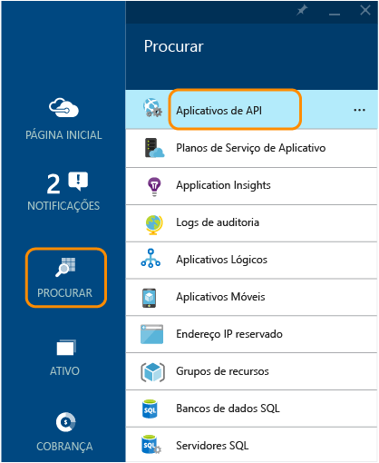
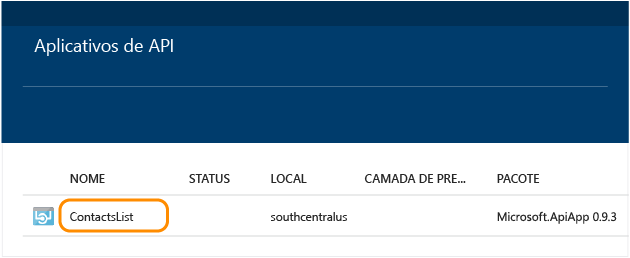
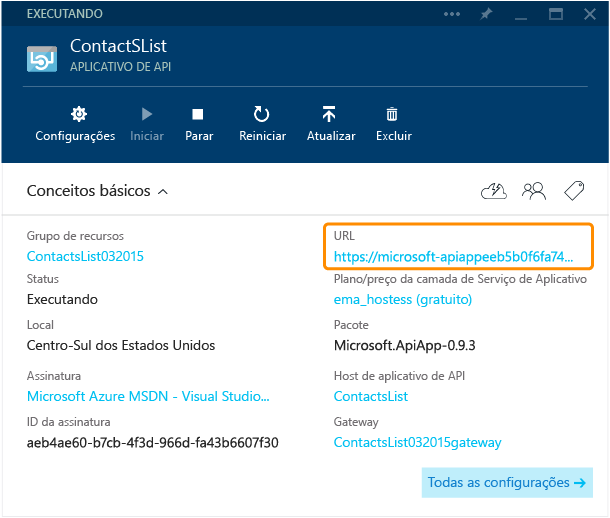
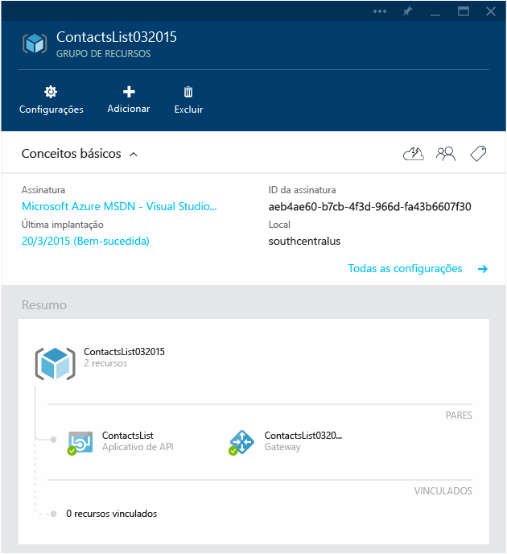
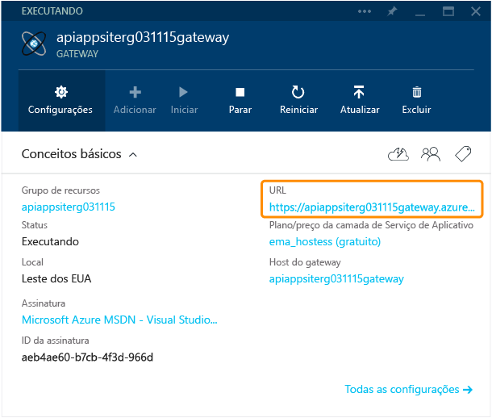
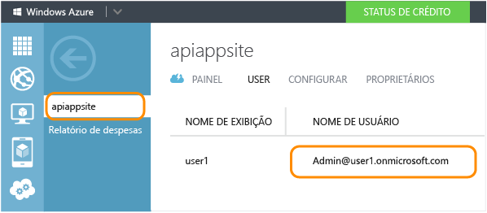
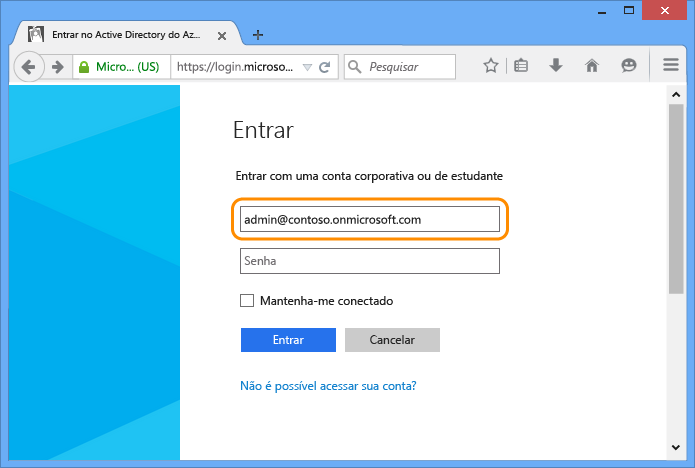
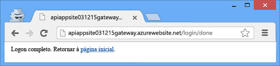
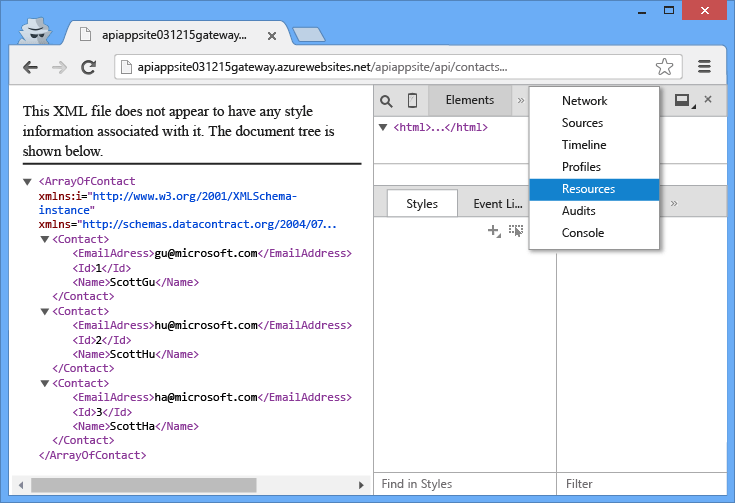

<properties 
	pageTitle="Proteger um aplicativo de API do Azure" 
	description="Saiba como proteger um aplicativo de API do Azure usando o Visual Studio." 
	services="app-service\api" 
	documentationCenter=".net" 
	authors="tdykstra" 
	manager="wpickett" 
	editor="jimbe"/>

<tags 
	ms.service="app-service-api" 
	ms.workload="web" 
	ms.tgt_pltfrm="dotnet" 
	ms.devlang="na" 
	ms.topic="article" 
	ms.date="03/24/2015" 
	ms.author="tdykstra"/>

# Proteger um aplicativo de API: adicionar autenticação do Active Directory do Azure ou do provedor social

## Visão geral

Este tutorial mostra como proteger um aplicativo de API para que somente usuários autenticados possam acessá-lo. O tutorial também mostra código que você pode usar em um aplicativo de API do ASP.NET para recuperar informações sobre o usuário conectado.

Você executará as seguintes etapas:

- Chamar o aplicativo de API para verificar se ele está funcionando.
- Aplicar regras de autenticação ao aplicativo de API.
- Chamar o aplicativo de API novamente para verificar se ele rejeita as solicitações não autenticadas.
- Fazer logon no provedor configurado.
- Chamar o aplicativo de API novamente para verificar se o acesso autenticado funciona.
- Escrever e testar o código que recupera as declarações para o usuário conectado.

## Pré-requisitos

Este tutorial funciona com o aplicativo de API que você criou em [Criar um aplicativo de API](app-service-dotnet-create-api-app.md) e implantou em [Implantar um aplicativo de API](app-service-dotnet-deploy-api-app.md).

## Usar o navegador para chamar o aplicativo de API 

A maneira mais simples de verificar se seu aplicativo de API é acessível publicamente é chamá-lo em um navegador.

1. Em seu navegador, vá para o [Portal de visualização do Azure].

3. Na home page, clique em **Procurar > Aplicativos de API** e clique no nome do aplicativo de API que você deseja proteger.

	

	

3. Na folha **Aplicativo de API**, clique na **URL** para abrir uma janela do navegador que chama o Aplicativo de API.

	

2. Adicione `/api/contacts/get/` à URL na barra de endereço do navegador.

	Por exemplo, se a URL do seu aplicativo de API for:

    	https://microsoft-apiappeeb5bdsasd744e188be7fa26f239bd4b.azurewebsites.net/

	A URL completa seria:

    	https://microsoft-apiappeeb5bdsasd744e188be7fa26f239bd4b.azurewebsites.net/api/contacts/get/

	Navegadores diferentes controlam chamadas de API de maneiras diferentes. A imagem mostra uma chamada bem-sucedida de um navegador Chrome.

	

2. Salve a URL usada. Você vai usá-la novamente mais tarde no tutorial.

## Proteger o aplicativo de API

Quando implantou o aplicativo de API, você o implantou em um grupo de recursos. Você pode adicionar aplicativos Web e outros aplicativos de API ao mesmo grupo de recursos, e cada aplicativo de API no grupo de recursos pode ter uma das três configurações de acessibilidade :<!--todo: diagram showing different accessibility settings-->

- **Público (anônimo)** - Qualquer pessoa pode chamar o aplicativo de API de fora do grupo de recursos sem estar conectado.
- **Público (autenticado)** - Somente usuários autenticados têm permissão para chamar o aplicativo de API de fora do grupo de recursos.
- **Interno** - Somente outros aplicativos de API ou Web do mesmo grupo de recursos têm permissão para chamar o aplicativo de API. (Chamadas de aplicativos Web são consideradas externas mesmo que os aplicativos Web estejam no mesmo grupo de recursos.)

Quando o Visual Studio criou o grupo de recursos para você, ele também criou um *gateway*. Um gateway é um aplicativo Web especial que processa todas as solicitações destinadas a aplicativos de API no grupo de recursos.

Quando vai até a folha do grupo de recursos no [Portal de visualização do Azure], você pode ver seu aplicativo de API e o gateway no diagrama.

### Configurar o aplicativo de API para exigir autenticação

Para configurar seu aplicativo de API para aceitar somente solicitações autenticadas, você definirá o acesso como **Público (autenticado)** e configurará o gateway para exigir a autenticação de um provedor, como o Active Directory do Azure, Google ou Facebook.

1. Volte para a folha **Aplicativo de API** do aplicativo de API que você quer proteger.

2. Na folha **Aplicativo de API**, clique em **Configurações** e em **Configurações do aplicativo**.

	

	

3. Na folha **Configurações do aplicativo**, altere o **Nível de Acesso** para **Público (autenticado)** e clique em **Salvar**.

	

	Você protegeu o aplicativo de API de acessos não autenticados. Em seguida, você precisa configurar o gateway para especificar o provedor de autenticação a ser usado.

### Configurar o gateway para usar um provedor de autenticação

4. Role à esquerda de volta para a folha **Aplicativo de API** e clique no link para o gateway.

	

7. Na folha **Gateway**, clique em **Configurações** e em **Identidade**.

	

	

	Da folha **Identidade**, você pode navegar para diferentes folhas para configurar a autenticação usando o Active Directory do Azure e vários outros provedores.

	
  
3. Escolha o provedor de identidade que você quer usar e siga as etapas no artigo correspondente para configurar seu aplicativo de API com esse provedor. Esses artigos foram escritos para aplicativos móveis, mas os procedimentos são os mesmos para os aplicativos de API. Alguns dos procedimentos requerem que você use o [portal do Azure].

 - [Conta da Microsoft](../app-service-mobile/app-service-mobile-how-to-configure-microsoft-authentication-preview.md)
 - [Logon no Facebook](../app-service-mobile/app-service-mobile-how-to-configure-facebook-authentication-preview.md)
 - [Logon no Twitter](../app-service-mobile/app-service-mobile-how-to-configure-twitter-authentication-preview.md)
 - [Logon no Google](../app-service-mobile/app-service-mobile-how-to-configure-google-authentication-preview.md)
 - [Active Directory do Azure](../app-service-mobile/app-service-mobile-how-to-configure-active-directory-authentication-preview.md)

Por exemplo, as capturas de tela a seguir mostram o que você verá nas páginas do [portal do Azure] e nas folhas do [portal de visualização do Azure] depois de ativar a autenticação do Active Directory do Azure.

No Portal do Azure, a folha **Active Directory do Azure** tem uma **ID de Cliente** do aplicativo que você criou na guia Active Directory do Azure do portal do Azure, e a função **Locatários Permitidos** tem seu locatário do Active Directory do Azure (por exemplo, "contoso.onmicrosoft.com").

No portal do antigo, a guia **Configurar** do aplicativo que você criou no **Active Directory do Azure** tem a **URL de Logon**, o **URI de ID do Aplicativo** e a **URL de Resposta** da folha **Active Directory do Azure** no portal de visualização do Azure.

(A URL de resposta na imagem mostra a mesma URL duas vezes, uma vez com `http:` e uma vez com `https:`.)

## Verificar se a autenticação funciona

**Observação:** se você tiver problema de logon ao realizar as etapas a seguir, tente abrir uma janela privada ou incógnita.
 
1. Abra uma janela do navegador e, na barra de endereços, digite a URL que chama o método `Get` do aplicativo de API, como fez anteriormente.

	Neste momento a tentativa de acessar o aplicativo de API resulta em uma mensagem de erro.

	

2. No navegador, vá para a URL de logon. A URL segue este padrão:

    	http://[gatewayurl]/login/[providername]

	Você pode obter a URL do gateway na folha **Gateway** no [Portal de visualização do Azure]. (Para obter a folha **Gateway**, clique em gateway no diagrama mostrado na folha **Grupo de recursos**.)

	

	O [providername] deve ser um dos seguintes valores:
	
	* "microsoftaccount"
	* "facebook"
	* "twitter"
	* "google"
	* "aad"

	Aqui está um exemplo de URL de logon para o Active Directory do Azure:

		https://dropboxrgaeb4ae60b7cb4f3d966dfa43.azurewebsites.net/login/aad/

	Observe que, diferentemente da URL anterior, esta não inclui o nome de seu aplicativo de API: o gateway está autenticando você, não o aplicativo de API. O gateway controla a autenticação de todos os aplicativos de API do grupo de recursos.

3. Insira suas credenciais quando o navegador exibir uma página de logon.
 
	Se você tiver configurado logon do Active Directory do Azure, use um dos usuários listados na guia **Usuários** para o aplicativo criado na guia do Active Directory do Azure no [Portal Azure], como admin@contoso.onmicrosoft.com.

	

	

4. Quando a mensagem de "logon concluído" for exibida, insira a URL para o método Get do aplicativo de API novamente.

	Dessa vez, como você foi autenticado, a chamada é bem-sucedida. O gateway reconhece que você é um usuário autenticado e passa a solicitação para seu aplicativo de API.

	

	

## Usar o Postman para enviar uma solicitação Post

Quando você faz logon no gateway, o gateway envia de volta um token de autenticação. Esse token deve ser incluído em todas as solicitações de fontes externas que passam pelo gateway. Quando você acessa uma API com um navegador, o navegador normalmente armazena o token em um cookie e o envia com todas as chamadas posteriores para a API.

Para ver o que está acontecendo em segundo plano, nesta seção você usa uma ferramenta de navegação para criar e enviar uma solicitação Post e obtém o token de autorização do cookie e o inclui em um cabeçalho HTTP. Esta seção é opcional: na seção anterior, você já verificou que o aplicativo de API aceita apenas acesso autenticado.

Estas instruções mostram como usar a ferramenta Postman no navegador Chrome, mas você pode fazer a mesma coisa com qualquer ferramenta de cliente REST e quaisquer ferramentas de desenvolvedor do navegador.

1. Em uma janela do navegador Chrome, percorra as etapas mostradas na seção anterior para autenticar e as ferramentas do desenvolvedor (F12).

	

3. Na guia **Recursos** das ferramentas de desenvolvedor do Chrome, localize os cookies do seu gateway e clique três vezes no valor do cookie **x-zumo-auth** para selecionar tudo.

	**Observação:** Certifique-se de obter todo o valor do cookie. Se você clicar duas vezes, poderá receber apenas a primeira parte dele.

5. Clique com o botão direito do mouse no **Valor** do cookie **x-zumo-auth** e clique em **Copiar**.

	

4. Instale a extensão do Postman no navegador Chrome se ainda não o fez.

6. Abra a extensão Postman.

7. No campo URL de Solicitação, digite a URL do método Get do aplicativo de API que você usou anteriormente, mas omita `get/` do final.
 
		http://[apiappurl]/api/contacts
    
8. Clique em **Cabeçalhos** e adicione um cabeçalho *x-zumo-auth*. Cole o valor do token da área de transferência do campo **Valor**.

9. Adicione um cabeçalho de *Tipo de Conteúdo* com o valor *application/json*.

10. Clique em **dados de formulário** e adicione uma chave de *contato* com o seguinte valor:

		{   "Id": 0,   "Name": "Li Yan",   "EmailAddress": "yan@contoso.com" }

11. Clique em Enviar.

	A aplicativo de API retorna uma resposta *201 Criado*.

	

12. Para verificar se a solicitação não funciona sem o token de autenticação, exclua o cabeçalho de autenticação e clique em Enviar novamente.

	Você obtém uma resposta *403 Proibido*.

	

## Obter informações sobre o usuário conectado

Nesta seção, você altera o código no aplicativo de API ContactsList para que ele recupere e retorne o nome e endereço de email do usuário conectado.

1. No Visual Studio, abra o projeto de aplicativo de API que você implantou em [Implantar um aplicativo de API](app-service-dotnet-deploy-api-app.md) e esteve chamando para este tutorial.

3. Abra o arquivo apiapp.json e adicione uma linha que indica que o aplicativo de API usa a autenticação do Active Directory do Azure.

		"authentication": [{"type": "aad"}]

	O arquivo apiapp.json final será parecido com o exemplo a seguir:

		{
		    "$schema": "http://json-schema.org/schemas/2014-11-01/apiapp.json#",
		    "id": "ContactsList",
		    "namespace": "microsoft.com",
		    "gateway": "2015-01-14",
		    "version": "1.0.0",
		    "title": "ContactsList",
		    "summary": "",
		    "author": "",
		    "endpoints": {
		        "apiDefinition": "/swagger/docs/v1",
		        "status": null
		    },
		    "authentication": [{"type": "aad"}]
		}

	Este tutorial usa o Active Directory do Azure como um exemplo. Para outros provedores, você usaria o identificador apropriado. Aqui estão os valores de provedor válidos:

	* "aad"
	* "microsoftaccount"
	* "google"
	* "twitter"
	* "facebook". 

2. No arquivo *ContactsController.cs*, substitua o código no método `Get` pelo código a seguir.

		var runtime = Runtime.FromAppSettings(Request);
		var user = runtime.CurrentUser;
		TokenResult token = await user.GetRawTokenAsync("aad");
		var name = (string)token.Claims["name"];
		var email = (string)token.Claims["http://schemas.xmlsoap.org/ws/2005/05/identity/claims/upn"];
		return new Contact[]
		{
		    new Contact { Id = 1, EmailAddress = email, Name = name }
		};

	Em vez de três contatos de exemplo, o código retorna informações de contato para o usuário conectado.

	O código de exemplo usa o Active Directory do Azure. Para outros provedores, você usaria o identificador de declarações e o nome de token apropriados, conforme mostrado na etapa anterior.

	Para obter informações sobre declarações do Active Directory do Azure que estão disponíveis, consulte [Tipos de declaração e token com suporte](https://msdn.microsoft.com/library/dn195587.aspx).

3. Adicione uma instrução using para `Microsoft.Azure.AppService.ApiApps.Service`.

		using Microsoft.Azure.AppService.ApiApps.Service;

3. Reimplante o projeto.

	O Visual Studio lembrará das configurações de quando você implantou o projeto ao seguir o tutorial [Implantar](app-service-dotnet-deploy-api-app.md). Clique com o botão direito do mouse no projeto, clique em **Publicar**, e, em seguida, clique em **Publicar** na caixa de diálogo **Publicar Web**.

6. Siga o procedimento que você fez anteriormente para enviar uma solicitação Get para o aplicativo de API protegido.

	A mensagem de resposta mostra o nome e a ID da identidade usada para efetuar o logon.

	

## Próximas etapas

Você viu como proteger um aplicativo de API do Azure exigindo autenticação do Active Directory do Azure ou do provedor social. Para obter mais informações, consulte [O que são aplicativos de API?](app-service-api-apps-why-best-platform.md).

[Portal Azure]: https://manage.windowsazure.com/
[portal do Azure]: https://manage.windowsazure.com/
[Portal de visualização do Azure]: https://portal.azure.com/

 

<!---HONumber=62-->