<properties
	pageTitle="Introdução aos aplicativos de API e ao ASP.NET no Serviço de Aplicativos | Microsoft Azure"
	description="Saiba como criar, implantar e consumir um aplicativo de API do ASP.NET no Serviço de Aplicativo do Azure usando o Visual Studio 2015."
	services="app-service\api"
	documentationCenter=".net"
	authors="tdykstra"
	manager="wpickett"
	editor=""/>

<tags
	ms.service="app-service-api"
	ms.workload="na"
	ms.tgt_pltfrm="dotnet"
	ms.devlang="na"
	ms.topic="hero-article"
	ms.date="03/09/2016"
	ms.author="tdykstra"/>

# Introdução aos aplicativos de API e ao ASP.NET no Serviço de Aplicativo do Azure

[AZURE.INCLUDE [seletor](../../includes/app-service-api-get-started-selector.md)]

## Visão geral

Este é o primeiro de uma série de tutoriais que mostram como usar recursos do Serviço de Aplicativo do Azure que são úteis para desenvolver e hospedar APIs RESTful:

* Suporte integrado para metadados de API
* Suporte a [CORS (Compartilhamento de Recursos entre Origens)](https://en.wikipedia.org/wiki/Cross-origin_resource_sharing)
* Suporte a autenticação e autorização

Você implantará um aplicativo de exemplo para dois [aplicativos de API](app-service-api-apps-why-best-platform.md) e um aplicativo Web no Serviço de Aplicativo do Azure. O aplicativo de exemplo é uma lista de tarefas pendentes que tem um front-end SPA (aplicativo de página única), uma camada intermediária de API Web do ASP.NET e uma camada de dados de API Web do ASP.NET. O front-end SPA se baseia na estrutura [AngularJS](https://angularjs.org/).

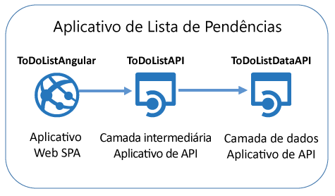

Aqui está uma captura de tela do front-end SPA.

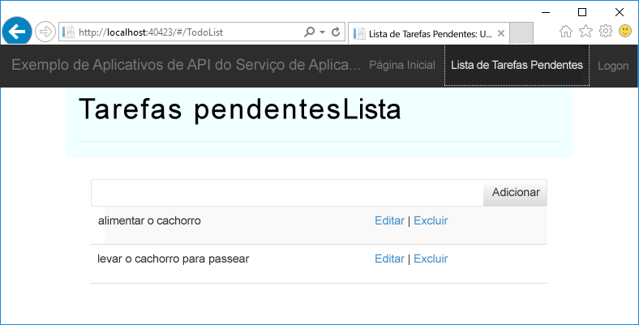

Ao concluir este tutorial, você terá as duas APIs Web em execução em aplicativos de API do Serviço de Aplicativo. Depois de concluir o tutorial a seguir, você terá o aplicativo inteiro em execução na nuvem, com o SPA em um aplicativo Web do Serviço de Aplicativo. Nos tutoriais subsequentes, você adicionará a autenticação e a autorização.

## O que você aprenderá

Neste tutorial, você aprenderá:

* Como trabalhar com aplicativos de API e aplicativos Web no Serviço de Aplicativo do Azure usando ferramentas incorporadas ao Visual Studio 2015.
* Como automatizar a descoberta de API usando o pacote NuGet do Swashbuckle para gerar dinamicamente a definição de API do Swagger JSON.
* Como usar código cliente gerado automaticamente para consumir um aplicativo de API de um cliente .NET.
* Como usar o portal do Azure para configurar o ponto de extremidade de metadados do aplicativo de API.

## Pré-requisitos

[AZURE.INCLUDE [prerequisites](../../includes/app-service-api-dotnet-get-started-prereqs.md)]

## Baixar o aplicativo de exemplo 

1. Baixe o repositório [Azure-Samples/app-service-api-dotnet-to-do-list](https://github.com/Azure-Samples/app-service-api-dotnet-todo-list).

	Você pode clicar no botão **Baixar ZIP** ou clonar o repositório no computador local.

2. Abra a solução ToDoList no Visual Studio 2015 ou 2013.

	A solução do Visual Studio é um aplicativo de exemplo que funciona com itens pendentes simples que consistem em uma descrição e um proprietário. A solução inclui três projetos:

	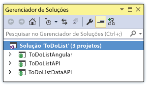

	* **ToDoListAngular** ‒ o front-end: um SPA do AngularJS que chama a camada intermediária. 

	* **ToDoListAPI** ‒ a camada intermediária: um projeto de API Web ASP.NET que chama a camada de dados para executar operações CRUD em itens pendentes.

	* **ToDoListDataAPI** ‒ a camada de dados: um projeto de API Web ASP.NET que executa operações CRUD nos itens pendentes.

	A arquitetura de três camadas é típica de muitos aplicativos, mas não é adequada para todos os cenários. Aqui ela é usada principalmente para possibilitar uma demonstração dos recursos de Aplicativos de API e, com esse objetivo em mente, o código em cada camada é simplificado. Diferentemente de um aplicativo real, a camada intermediária não tem lógica de negócios significativa. Além disso, a camada de dados usa a memória do servidor em vez de um banco de dados como seu mecanismo de persistência. Isso significa que, sempre que o aplicativo é reiniciado, todas as alterações são perdidas.

2. Compile o projeto para restaurar os pacotes NuGet.

## Opcional: executar o aplicativo localmente

Nesta seção, você verificará se pode executar o cliente localmente e chamar a API enquanto ela também estiver sendo executada localmente.

**Observação:** essas instruções funcionam para o Internet Explorer e o Edge porque esses navegadores permitem chamadas JavaScript entre origens de e para URLs `http://localhost`. Se você estiver usando o Chrome, inicie o navegador com a opção `--disable-web-security`. Se você estiver usando o Firefox, ignore esta seção.

1. Defina todos os três projetos como projetos de inicialização, primeiro iniciando ToDoListDataAPI e, em seguida, ToDoListAPI e ToDoListAngular.

	a. No **Gerenciador de Soluções**, clique com o botão direito do mouse na solução e clique em **Propriedades**.

	b. Selecione **Vários projetos de inicialização** e coloque os projetos na ordem correta.

	c. Defina **Ação** como **Iniciar** para cada projeto.

2. Pressione F5 ou clique em **Depurar > Iniciar Depuração** para iniciar os projetos no modo de depuração.

	Três janelas do navegador são abertas. Duas janelas de navegador mostram as páginas de erro de HTTP 403 (pesquisa no diretório não permitida), o que é normal para projetos de API Web. A terceira janela do navegador mostra a interface do usuário do AngularJS.

	Em alguns navegadores, você verá caixas de diálogo que indicam que o projeto está configurado para usar SSL. Se você quiser

3. Na janela do navegador que mostra a interface do usuário do AngularJS, clique na guia **Lista de Tarefas Pendentes**.

	A interface do usuário mostra dois itens pendentes padrão.

	

4. Adicione, edite e exclua itens pendentes para ver como o aplicativo funciona.

	As alterações feitas são armazenadas na memória e são perdidas quando você reinicia o aplicativo.

3. Feche as janelas do navegador e interrompa a depuração do Visual Studio.

## Usar a interface do usuário e metadados Swagger

O suporte a metadados da API 2.0 do [Swagger](http://swagger.io/) é integrado ao Serviço de Aplicativo do Azure. Cada aplicativo de API especifica um ponto de extremidade de URL que retorna metadados para a API no formato JSON Swagger. Os metadados retornados do ponto de extremidade podem ser usados para gerar código de cliente.

Um projeto de API Web ASP.NET pode gerar dinamicamente metadados do Swagger usando o pacote NuGet [Swashbuckle](https://www.nuget.org/packages/Swashbuckle). O pacote NuGet Swashbuckle já está instalado nos projetos ToDoListDataAPI e ToDoListAPI que você baixou.

Nesta seção do tutorial, você verá os metadados do Swagger 2.0 gerados e experimentará uma interface do usuário de teste baseada nos metadados do Swagger.

2. Defina o projeto ToDoListDataAPI (**não** o projeto ToDoListAPI) como o projeto de inicialização. 
 
4. Pressione F5 ou clique em **Depurar > Iniciar Depuração** para executar o projeto no modo de depuração.

	O navegador é aberto e mostra a página de erro HTTP 403.

12. Na barra de endereços do navegador, adicione `swagger/docs/v1` no fim da linha e pressione Return. (A URL é `http://localhost:45914/swagger/docs/v1`.)

	Essa é a URL padrão usada pelo Swashbuckle para retornar metadados JSON do Swagger 2.0 para a API.

	Se você estiver usando o Internet Explorer, o navegador solicitará que baixe um arquivo *v1.json*.

	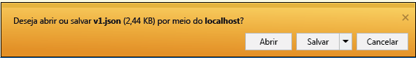

	Se você estiver usando o Chrome, o Firefox ou o Edge, o navegador exibirá o JSON em sua janela.

	

	O exemplo a seguir mostra a primeira seção dos metadados do Swagger para a API, com a definição para o método Get. Esses metadados geram a interface do usuário do Swagger, que você usará nas etapas a seguir e em uma seção posterior do tutorial para gerar o código cliente automaticamente.

		{
		  "swagger": "2.0",
		  "info": {
		    "version": "v1",
		    "title": "ToDoListDataAPI"
		  },
		  "host": "localhost:45914",
		  "schemes": [ "http" ],
		  "paths": {
		    "/api/ToDoList": {
		      "get": {
		        "tags": [ "ToDoList" ],
		        "operationId": "ToDoList_GetByOwner",
		        "consumes": [ ],
		        "produces": [ "application/json", "text/json", "application/xml", "text/xml" ],
		        "parameters": [
		          {
		            "name": "owner",
		            "in": "query",
		            "required": true,
		            "type": "string"
		          }
		        ],
		        "responses": {
		          "200": {
		            "description": "OK",
		            "schema": {
		              "type": "array",
		              "items": { "$ref": "#/definitions/ToDoItem" }
		            }
		          }
		        },
		        "deprecated": false
		      },

1. Feche o navegador e interrompa a depuração do Visual Studio.

3. No projeto ToDoListDataAPI no **Gerenciador de Soluções**, abra o arquivo *App\_Start\\SwaggerConfig.cs*, role para baixo até o código a seguir e remova as marcas de comentário dele.

		/*
		    })
		.EnableSwaggerUi(c =>
		    {
		*/

	O arquivo *SwaggerConfig.cs* é criado quando você instala o pacote do Swashbuckle em um projeto. O arquivo fornece várias maneiras de se configurar o Swashbuckle.

	O código que você removeu habilita a interface do usuário do Swagger que será usada nas etapas a seguir. Quando você cria um projeto de API Web usando o modelo de projeto de aplicativo de API, o código é comentado por padrão como medida de segurança.

5. Execute o projeto novamente.

3. Na barra de endereços do navegador, adicione `swagger` no fim da linha e pressione Return. (A URL é `http://localhost:45914/swagger`.)

4. Quando for exibida a página de interface do usuário do Swagger, clique em **ToDoList** para ver os métodos disponíveis.

	

5. Clique no primeiro botão **Obter** na lista.

6. Digite um asterisco como o valor do parâmetro `owner` e clique em **Experimentar**.

	Quando você adicionar a autenticação nos tutoriais posteriores, a camada intermediária fornecerá a ID de usuário real para a camada de dados. Por enquanto, todas as tarefas terão um asterisco como sua ID de proprietário, enquanto o aplicativo é executado sem autenticação habilitada.

	

	A interface do usuário do Swagger chama o método Get ToDoList e exibe o código de resposta e os resultados JSON.

	

6. Clique em **Postar** e marque a caixa em **Esquema de Modelo**.

	Clicar no esquema de modelo preencherá previamente a caixa de entrada onde é possível especificar o valor do parâmetro para o método Post. (Se isso não funcionar no Internet Explorer, use um navegador diferente ou insira o valor do parâmetro manualmente na próxima etapa).

	

7. Altere o JSON na caixa de entrada do parâmetro `todo` para que ele seja semelhante ao seguinte exemplo ou substitua-o por seu próprio texto de descrição:

		{
		  "ID": 2,
		  "Description": "buy the dog a toy",
		  "Owner": "*"
		}

10. Clique em **Experimentar**.

	A API de ToDoList retorna um código de resposta HTTP 204 que indica êxito.

11. Clique no primeiro botão **Obter** e nessa seção da página, clique no botão **Experimentar**.

	A resposta do método Get agora inclui o novo item pendente.

12. Opcional: Também experimente os métodos Put, Delete e Get by ID.

14. Feche o navegador e interrompa a depuração do Visual Studio.

O Swashbuckle funciona com qualquer projeto de API Web ASP.NET. Se você deseja adicionar a geração de metadados de Swagger a um projeto existente, instale o pacote Swashbuckle.

**Observação:** os metadados do Swagger incluem uma ID exclusiva para cada operação da API. Por padrão, o Swashbuckle pode gerar IDs de operação do Swagger duplicadas para os métodos do controlador da API Web. Isso acontecerá se o controlador tiver métodos HTTP sobrecarregados, como `Get()` e `Get(id)`. Para obter informações sobre como lidar com sobrecargas, consulte [Personalizar definições de API geradas pelo Swashbuckle](app-service-api-dotnet-swashbuckle-customize.md). Se você criar um projeto de API Web no Visual Studio usando o modelo de Aplicativo de API do Azure, o código que gera IDs de operação exclusivas será adicionado automaticamente ao arquivo *SwaggerConfig.cs*.

## Criar um aplicativo de API no Azure e implantar o projeto ToDoListAPI nele

Nesta seção, você usará as ferramentas do Azure integradas no assistente **Publicar na Web** do Visual Studio para criar um novo aplicativo de API no Azure. Em seguida, implante o projeto ToDoListDataAPI no novo aplicativo de API e chame a API executando a interface do usuário do Swagger novamente, desta vez enquanto ele estiver sendo executado na nuvem.

1. No **Gerenciador de Soluções**, clique com o botão direito no projeto ToDoListDataAPI e clique em **Publicar**.

	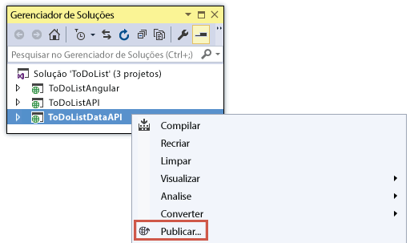

3.  Na etapa **Perfil** do assistente **Publicar Web**, clique em **Serviço de Aplicativo do Microsoft Azure**.

	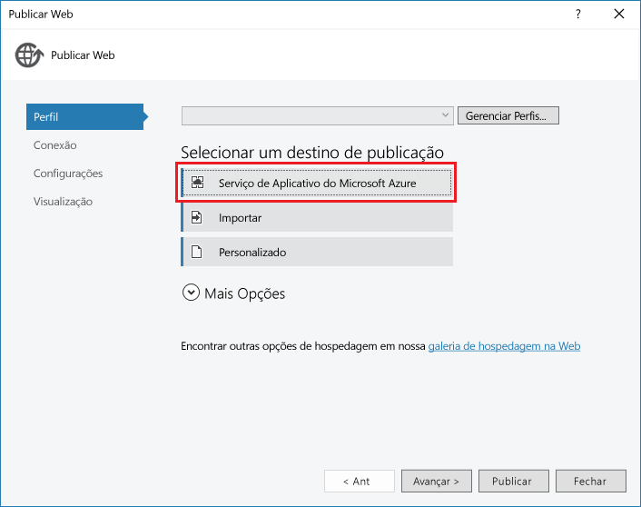

4. Entre em sua conta do Azure, se ainda não tiver feito isso, ou atualize suas credenciais se elas tiverem expirado.

4. Na caixa de diálogo Serviço de Aplicativo, escolha a **Assinatura** do Azure que você deseja usar e clique em **Novo**.

	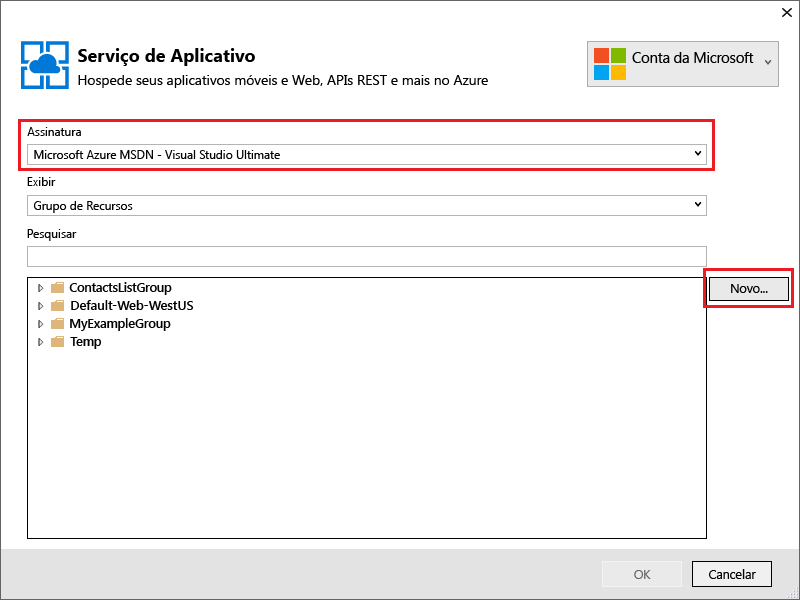

	A guia **Hospedagem** da caixa de diálogo **Criar Serviço de Aplicativo** será exibida.

	Como você está implantando um projeto de API Web com o Swashbuckle instalado, o Visual Studio pressupõe que você queira criar Aplicativo de API. Isso é indicado pelo título **Nome do Aplicativo de API** e pelo fato da lista suspensa **Alterar Tipo** estar definida para **Aplicativo de API**.

	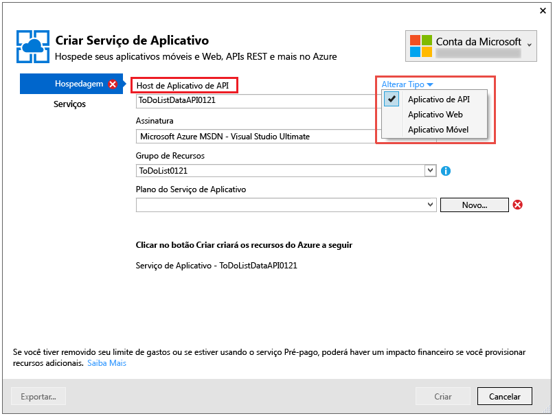

	O tipo de aplicativo não determina os recursos que estão disponíveis para o novo aplicativo de API, aplicativo Web ou aplicativo móvel. Todos os recursos do aplicativo de API mostrados nestes tutoriais estão disponíveis para todos os três tipos. A única diferença é o ícone e o texto que o portal do Azure exibe para identificar o tipo de aplicativo e a ordem na qual os recursos são listados em algumas páginas do portal. Você verá o portal do Azure posteriormente no tutorial; é uma interface da Web para gerenciar recursos do Azure.

	Para esses tutoriais, o front-end do SPA está em execução em um aplicativo Web, e cada back-end de API Web está em execução em um aplicativo de API, mas tudo funcionaria da mesma forma se todos os três fossem aplicativos Web ou aplicativos de API. Além disso, um único aplicativo de API ou aplicativo Web pode hospedar o front-end do SPA e o back-end de camada intermediária.

4. Insira um **Nome do Aplicativo de API** exclusivo no domínio *azurewebsites.net*, como ToDoListDataAPI, além de um número para torná-lo exclusivo.

	O Visual Studio sugere um nome exclusivo acrescentando uma cadeia de caracteres de data e hora ao nome do projeto. Se preferir, você poderá aceitar esse nome.

	Se você inserir um nome usado por outra pessoa, verá um ponto de exclamação vermelho à direita em vez de uma marca de verificação verde e precisará inserir outro nome de site.

	O Azure usará esse nome como o prefixo para a URL do aplicativo. A URL completa consiste nesse nome mais *.azurewebsites.net*. Por exemplo, se o nome for `ToDoListDataAPI`, a URL será `todolistdataapi.azurewebsites.net`.

6. Na lista suspensa **Grupo de Recursos**, clique em **Novo** e insira "ToDoListGroup" ou outro nome, se preferir.

	Um grupo de recursos é uma coleção de recursos do Azure, como aplicativos de API, bancos de dados, VMs e assim por diante. Para este tutorial, é melhor criar um novo grupo de recursos porque isso facilitará a exclusão de todos os recursos do Azure criados para o tutorial em uma única etapa.

	Essa caixa permite que você selecione um [grupo de recursos](../azure-portal/resource-group-portal.md) existente ou crie um novo digitando um nome diferente de qualquer grupo de recursos existente na assinatura.

4. Clique no botão **Novo** ao lado da lista suspensa **Plano do Serviço de Aplicativo**.

	A captura de tela mostra valores de exemplo para o **Nome do Aplicativo de API**, **Assinatura** e **Grupo de Recursos**. Seus valores serão diferentes.

	

	Nas etapas a seguir, você criará um plano de Serviço de Aplicativo para o novo grupo de recursos. Um plano de Serviço de Aplicativo especifica os recursos de computação em que seu aplicativo de API é executado. Por exemplo, se você escolher a camada gratuita, seu aplicativo de API será executado em VMs compartilhadas, enquanto que para algumas camadas pagas, ele é executado em VMs dedicadas. Para saber mais sobre os planos do Serviço de Aplicativo, consulte a [Visão geral dos planos do Serviço de Aplicativo](../app-service/azure-web-sites-web-hosting-plans-in-depth-overview.md).

5. Na caixa de diálogo **Configurar Plano de Serviço de Aplicativo**, insira "ToDoListPlan" ou outro nome, se preferir.

5. Na lista suspensa **Local**, escolha o local mais próximo de você.

	Essa configuração especifica em qual datacenter do Azure o aplicativo será executado. Para este tutorial, você pode selecionar qualquer região e isto não fará uma diferença notável. Porém, para um aplicativo de produção, o ideal é que seu servidor esteja o mais próximo possível dos clientes que o acessam, de modo a minimizar a [latência](http://www.bing.com/search?q=web%20latency%20introduction&qs=n&form=QBRE&pq=web%20latency%20introduction&sc=1-24&sp=-1&sk=&cvid=eefff99dfc864d25a75a83740f1e0090).

5. Na lista suspensa **Tamanho**, clique em **Gratuito**.

	Neste tutorial, o tipo de preço gratuito permitirá um desempenho suficiente.

6. Na caixa de diálogo **Configurar o Plano do Serviço de Aplicativo**, clique em **OK**.

	

7. Na caixa de diálogo **Criar Serviço de Aplicativo**, clique em **Criar**.

	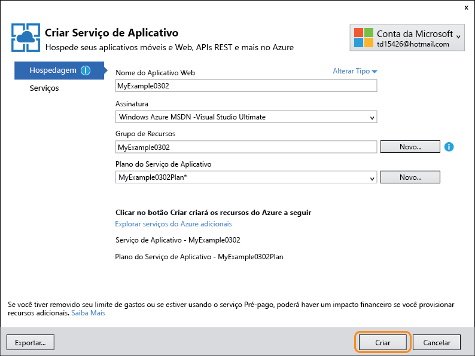

	O Visual Studio cria o aplicativo de API e um perfil de publicação que tem todas as configurações necessárias para o aplicativo de API. Em seguida, ele abre o assistente **Publicar na Web**, que você usará para implantar o projeto.

	**Observação:** existem outras maneiras de criar aplicativos de API no Serviço de Aplicativo do Azure. Por exemplo, no Visual Studio, quando você cria um novo projeto, pode criar recursos do Azure para ele da mesma maneira que acabou de ver para um projeto existente. Você também pode criar aplicativos de API usando o [portal do Azure](https://portal.azure.com/), os [cmdlets do Azure para o Windows PowerShell](../powershell-install-configure.md) ou a [interface de linha de comando de plataforma cruzada](../xplat-cli.md).

	O assistente **Publicar na Web** será aberto na guia **Conexão** (mostrada abaixo).

	Na guia **Conexão**, as configurações **Servidor** e **Nome do site** apontam para seu aplicativo de API. O **Nome de usuário** e a **Senha** são credenciais de implantação que o Azure cria para você. Após a implantação, o Visual Studio abre um navegador na **URL de Destino** (essa é a única finalidade da **URL de Destino**).

8. Clique em **Próximo**.

	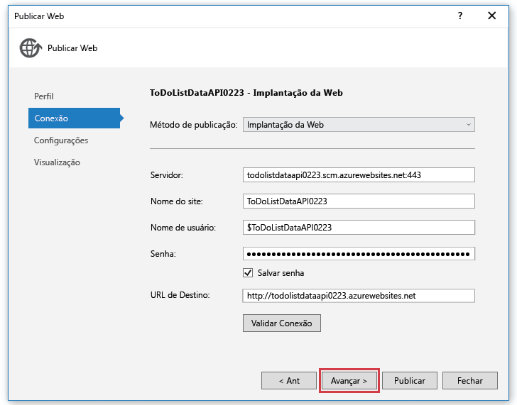

	A próxima guia é **Configurações** (mostrada abaixo). Aqui, você pode alterar a guia de configuração da compilação para implantar uma compilação de depuração para a [depuração remota](../app-service-web/web-sites-dotnet-troubleshoot-visual-studio.md#remotedebug). A guia também oferece várias **Opções de Publicação do Arquivo**:

	* Remover os arquivos adicionais no destino
	* Pré-compilar durante a publicação
	* Excluir arquivos da pasta App\_Data

	Para este tutorial, você não precisará de qualquer uma delas. Para obter explicações detalhadas sobre o que fazem, consulte [Como Implantar um Projeto Web Usando a Publicação de Um Clique no Visual Studio](https://msdn.microsoft.com/library/dd465337.aspx).

14. Clique em **Próximo**.

	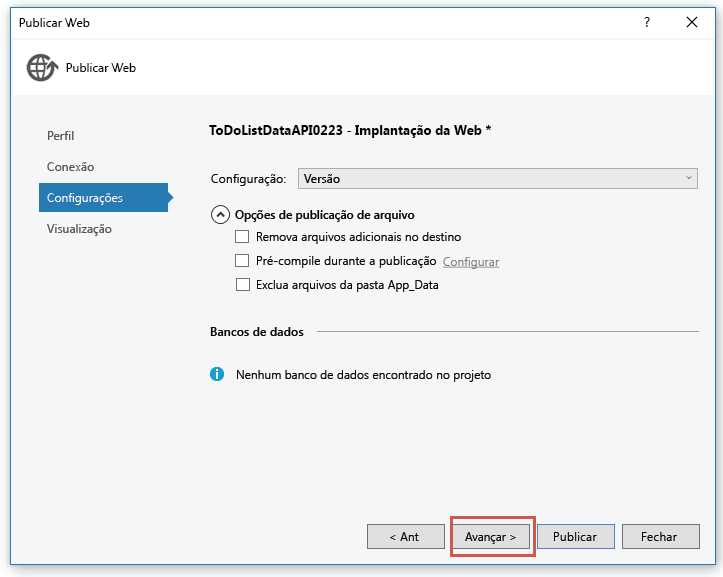

	A próxima guia é **Visualização** (mostrada abaixo), que oferece a oportunidade de ver quais arquivos serão copiados do projeto para o aplicativo de API. Quando você estiver implantando um projeto para um aplicativo de API no qual já tenha implantado antes, somente os arquivos alterados serão copiados. Se você quiser ver uma lista do que será copiado, poderá clicar no botão **Iniciar Visualização**.

15. Clique em **Publicar**.

	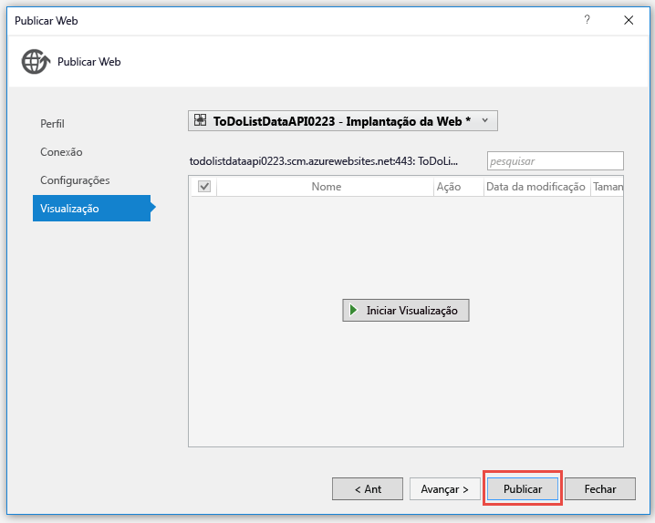

	O Visual Studio implanta o projeto ToDoListDataAPI para o novo aplicativo de API. A janela **Saída** registrará uma implantação bem-sucedida e uma página "criada com êxito" será exibida em uma janela do navegador aberta para a URL do aplicativo de API.

	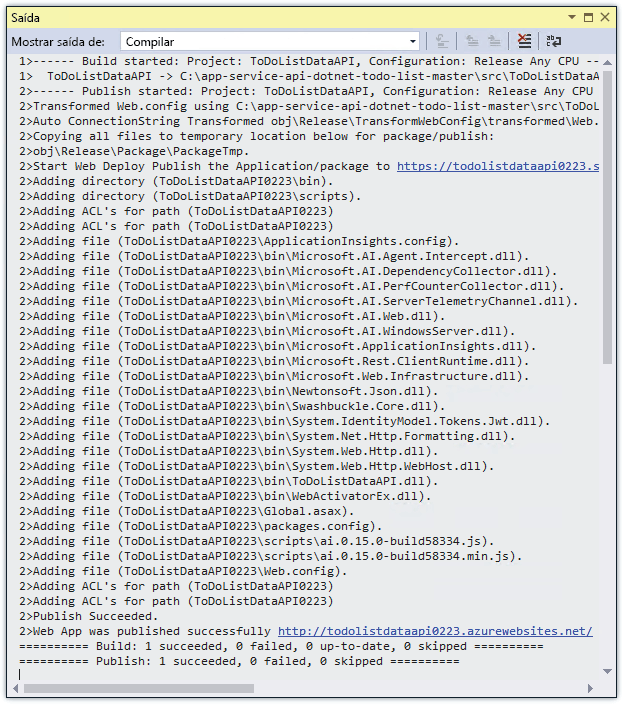

	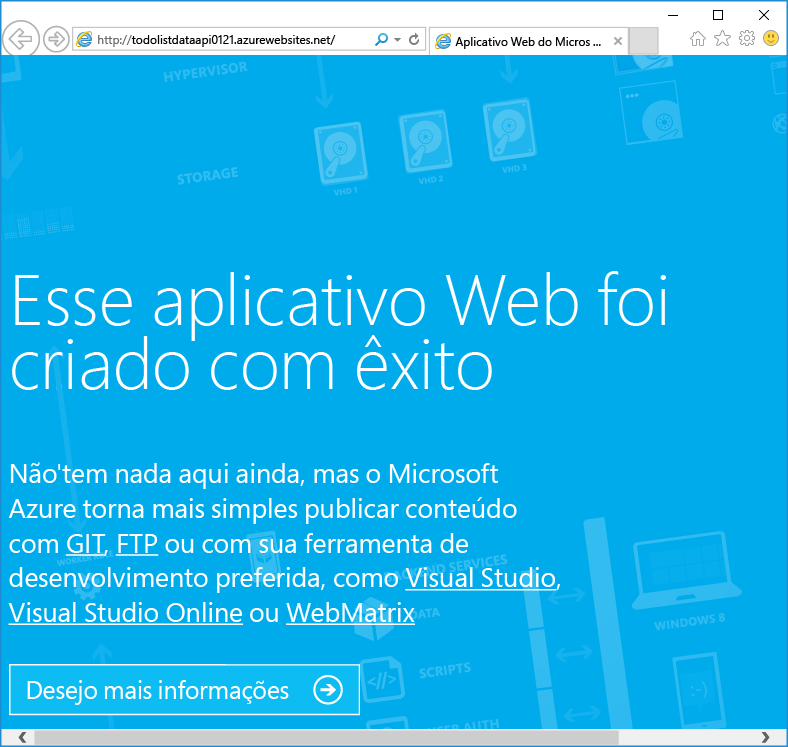

11. Adicione "swagger" à URL na barra de endereço do navegador e pressione Enter. (A URL é `http://{apiappname}.azurewebsites.net/swagger`.)

	O navegador exibe a mesma interface do usuário do Swagger que você viu anteriormente, mas agora ela está em execução na nuvem. Experimente o método Get e você verá que voltou aos itens de tarefas pendentes 2 padrão. As alterações feitas anteriormente foram salvas na memória do computador local.

12. Abra o [Portal do Azure](https://portal.azure.com/).

	O portal do Azure é uma interface da Web para gerenciar recursos do Azure, como aplicativos de API.
 
14. Clique em **Procurar > Serviços de Aplicativos**.

	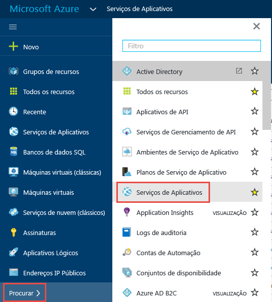

15. Na folha **Serviços de Aplicativos**, localize e clique no novo aplicativo de API. (No portal do Azure, as janelas abertas à direita são chamadas de *folhas*.)

	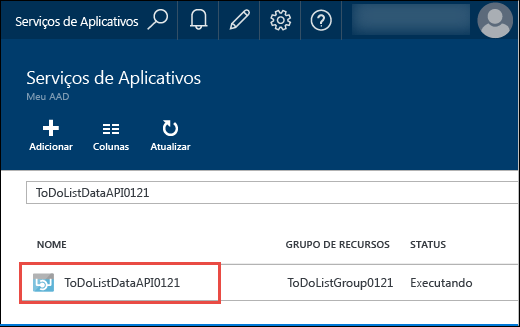

	Duas folhas são abertas. Uma folha tem uma visão geral do aplicativo de API e outra tem uma longa lista de configurações que você pode exibir e alterar.

16. Na folha **Configurações**, localize a seção **API** e clique em **Definição da API**.

	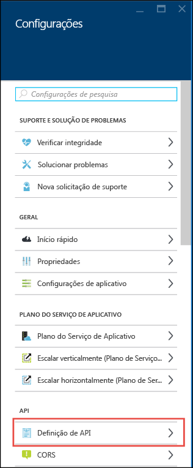

	A folha **Definição da API** permite que você especifique a URL para retornar os metadados do Swagger 2.0 no formato JSON. Quando o Visual Studio cria o aplicativo de API, define a URL de definição da API com o valor padrão para os metadados gerados pelo Swashbuckle vistos anteriormente, que é a URL base do aplicativo de API mais `/swagger/docs/v1`.

	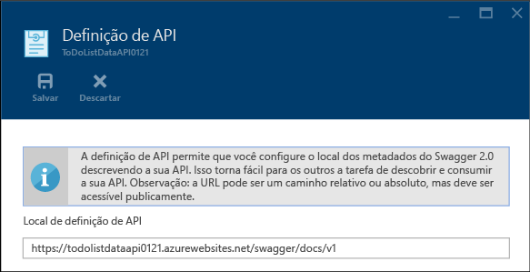

	Quando você seleciona um aplicativo de API para gerar código para ele, o Visual Studio recupera os metadados dessa URL.

##  Consumir o aplicativo de API usando o código gerado pelo cliente

Uma das vantagens da integração do Swagger a aplicativos de API do Azure é a geração automática de código. As classes de cliente geradas tornam mais fácil escrever código para chamar um aplicativo de API.

Nesta seção, você verá como consumir um aplicativo de API do código de API Web ASP.NET.

### Gerar código de cliente

Você pode gerar o código cliente para um aplicativo de API usando o Visual Studio ou a linha de comando. Para este tutorial, use o Visual Studio. Para saber mais sobre como fazer isso na linha de comando, confira o arquivo Leiame do repositório [Azure/autorest](https://github.com/azure/autorest) no GitHub.com.

O projeto ToDoListAPI já tem o código de cliente gerado, mas você o excluirá e o regenerará para ver como ele é concluído.

1. No **Gerenciador de Soluções** do Visual Studio, no projeto ToDoListAPI, exclua a pasta *ToDoListDataAPI*.

	Essa pasta foi criada usando o processo de geração de código que você está prestes a seguir.

	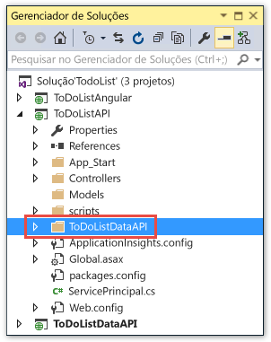

2. Clique com o botão direito no projeto ToDoListAPI e clique em **Adicionar > Cliente da API REST**.

	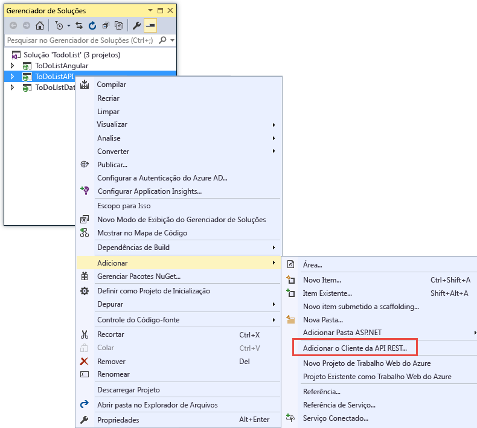

3. Na caixa de diálogo **Adicionar Cliente da API REST**, clique em **URL do Swagger** e **Selecionar Ativo do Azure**.

	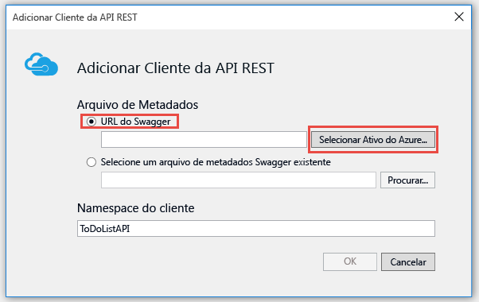

8. Na caixa de diálogo **Serviço de Aplicativo**, expanda o grupo de recursos que você está usando neste tutorial, selecione o aplicativo de API e clique em **OK**.

	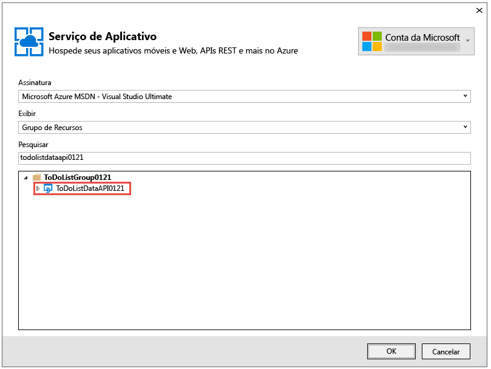

	Essa caixa de diálogo permite mais de uma forma de organização de aplicativos de API na lista, caso você tenha muito muitos para percorrer. Ele também permite inserir uma cadeia de caracteres de pesquisa para filtrar os aplicativos de API pelo nome.

	Observe que, quando você retornar à caixa de diálogo **Adicionar Cliente da API REST**, a caixa de texto terá sido preenchida com o valor de URL de definição de API visto anteriormente no portal.

	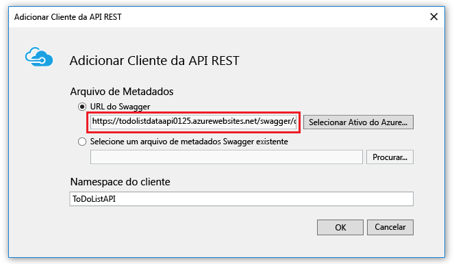

	Uma maneira alternativa de obter metadados para a geração de código é inserir a URL diretamente em vez de passar pelo diálogo Procurar. Uma alternativa é usar a opção **Selecionar um arquivo de metadados do Swagger existente**. Por exemplo, se você quiser gerar código cliente antes de implantar no Azure, poderá executar o projeto de API Web localmente, vá para a URL que fornece o arquivo JSON do Swagger, salve o arquivo e o selecione aqui.

9. Na caixa de diálogo **Adicionar Cliente da API REST**, clique em **OK**.

	O Visual Studio cria uma pasta com o nome do aplicativo de API e gera classes de cliente.

	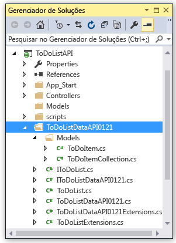

5. No projeto ToDoListAPI, abra *Controllers\\ToDoListController.cs* para ver o código que chama a API usando o cliente gerado.

	O trecho a seguir mostra como o código instancia o objeto de cliente e chama o método Get.

		private static ToDoListDataAPI NewDataAPIClient()
		{
		    var client = new ToDoListDataAPI(new Uri(ConfigurationManager.AppSettings["toDoListDataAPIURL"]));
		    return client;
		}
		
		public async Task<IEnumerable<ToDoItem>> Get()
		{
		    using (var client = NewDataAPIClient())
		    {
		        var results = await client.ToDoList.GetByOwnerAsync(owner);
		        return results.Select(m => new ToDoItem
		        {
		            Description = m.Description,
		            ID = (int)m.ID,
		            Owner = m.Owner
		        });
		    }
		}

	O parâmetro do construtor obtém a URL do ponto de extremidade na configuração do aplicativo `toDoListDataAPIURL`. No arquivo Web.config, esse valor é definido como a URL do IIS Express local do projeto de API para que você possa executar o aplicativo localmente. Se você omitir o parâmetro do construtor, o ponto de extremidade padrão será a URL da qual você gerou o código.

6. A classe de cliente será gerada com um nome diferente baseado no nome do aplicativo de API. Altere o código em *Controllers\\ToDoListController.cs* para que o nome do tipo corresponda ao que foi gerado em seu projeto. Por exemplo, se você desse ao Aplicativo de API o nome ToDoListDataAPI0121, o código seria semelhante ao seguinte exemplo:

		private static ToDoListDataAPI0121 NewDataAPIClient()
		{
		    var client = new ToDoListDataAPI0121(new Uri(ConfigurationManager.AppSettings["toDoListDataAPIURL"]));

### Criar um aplicativo de API para hospedar a camada intermediária

1. No **Gerenciador de Soluções**, clique com o botão direito no projeto ToDoListAPI (não no ToDoListDataAPI) e clique em **Publicar**.

3.  Na guia **Perfil** do assistente **Publicar Web**, clique em **Serviço de Aplicativo do Microsoft Azure**.

5. Na caixa de diálogo **Serviço de Aplicativo**, clique em **Novo**.

3. Na guia **Hospedagem** da caixa de diálogo **Criar Serviço de Aplicativo**, insira um **Nome do Aplicativo de API** exclusivo no domínio *azurewebsites.net*.

5. Escolha a **Assinatura** do Azure com a qual você deseja trabalhar.

6. Na lista suspensa **Grupo de Recursos**, escolha o mesmo grupo de recursos que você criou anteriormente.

4. Na lista suspensa **Plano do Serviço de Aplicativo**, escolha o mesmo plano criado anteriormente. O padrão será a esse valor.

7. Clique em **Criar**.

	O Visual Studio cria o aplicativo de API, cria um perfil de publicação para ele e exibe a etapa **Conexão** do assistente **Publicar na Web**.

3.  Na etapa **Conexão** do assistente **Publicar Web**, clique em **Publicar**.

	O Visual Studio implanta o projeto ToDoListAPI no novo aplicativo de API e abre um navegador para a URL do aplicativo de API. A página "Criado com êxito" é exibida.

### Definir a URL do aplicativo de API da camada de dados no aplicativo de API da camada intermediária

Se você chamasse o aplicativo de API da camada intermediária agora, ele tentaria chamar a camada de dados usando a URL do localhost que ainda está no arquivo Web.config. Nesta seção, você insere a URL do aplicativo de API da camada de dados em uma configuração de ambiente no aplicativo de API da camada intermediária. Quando o código no aplicativo de API da camada intermediária recupera a configuração da URL da camada de dados, a configuração do ambiente substitui o que está no arquivo Web.config.
 
1. Vá para o [portal do Azure](https://portal.azure.com/) e navegue até a folha **Aplicativo de API** do aplicativo de API que você criou para hospedar o projeto TodoListAPI (camada intermediária).

2. Na folha **Configurações** do Aplicativo de API, clique em **Configurações do aplicativo**.
 
4. Na folha **Configurações do Aplicativo** do Aplicativo de API, role para baixo até a seção **Configurações do aplicativo** e adicione a chave e o valor a seguir:

	| **Chave** | toDoListDataAPIURL |
	|---|---|
	| **Valor** | https://{your nome do aplicativo de API da camada de dados}.azurewebsites.net |
	| **Exemplo** | https://todolistdataapi0121.azurewebsites.net |

4. Clique em **Salvar**.

	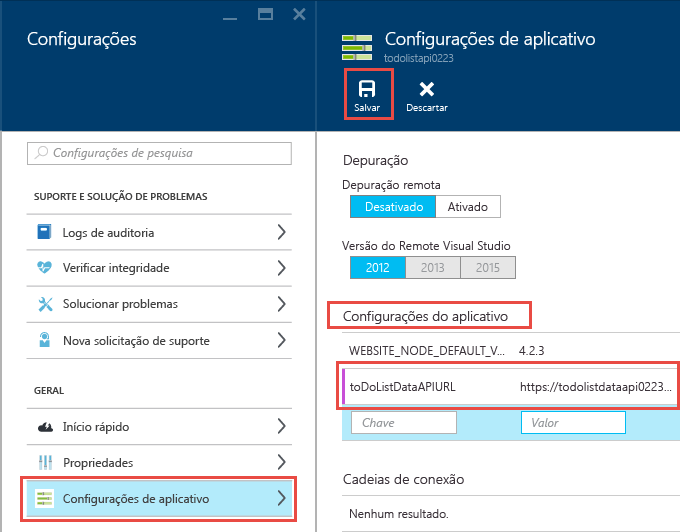

	Quando o código for executado no Azure, esse valor substituirá a URL de localhost no arquivo Web.config.

### Teste para verificar se ToDoListAPI chama ToDoListDataAPI

11. Em uma janela de navegador, navegue até a URL do novo aplicativo de API da camada intermediária que você acabou de criar (faça isso clicando na URL na folha de principal do aplicativo de API no portal).

13. Adicione "swagger" à URL na barra de endereço do navegador e pressione Enter. (A URL é `http://{apiappname}.azurewebsites.net/swagger`.)

	O navegador exibe a mesma IU do Swagger vista anteriormente para ToDoListDataAPI, mas agora `owner` não é um campo obrigatório para a operação Get, pois o aplicativo de API da camada intermediária está enviando esse valor para o aplicativo de API da camada de dados. (Quando você executar os tutoriais de autenticação, a camada intermediária enviará as IDs de usuário reais para o parâmetro `owner`; no momento, ela está codificando um asterisco.)

12. Experimente o método Get e os outros métodos para validar se o aplicativo de API de camada intermediária está chamando o aplicativo de API de camada de dados com êxito.

	

Para obter mais informações sobre o cliente gerado, consulte o [repositório AutoRest do GitHub](https://github.com/azure/autorest). Para obter ajuda com os problemas para usar o cliente gerado, abra um [problema no repositório AutoRest](https://github.com/azure/autorest/issues).

##  Opcional: Criando um projeto do aplicativo de API do zero

Neste tutorial, você baixará os projetos de API Web do ASP.NET para implantação no Serviço de Aplicativo em vez de criar novos projetos do zero. Para criar um projeto que você pretende implantar em um aplicativo de API, você pode criar um projeto de API Web típico e instalar o pacote Swashbuckle ou pode usar o novo modelo de projeto **Aplicativo de API do Azure**. Para usar esse modelo, clique em **Arquivo > Novo > Projeto > Aplicativo Web ASP.NET > Aplicativo de API do Azure**.

O modelo de projeto **Aplicativo de API do Azure** é equivalente a escolher o modelo **Vazio** do ASP.NET 4.5.2, clicar na caixa de seleção para adicionar o suporte da API Web e instalar o pacote Swashbuckle. Além disso, o modelo adiciona alguns códigos de configuração do Swashbuckle projetados para evitar a criação de IDs de operação do Swagger duplicadas.

## Opcional: URL da definição de API nos modelos do Azure Resource Manager

Neste tutorial, você viu a URL de definição de API no Visual Studio e no portal do Azure. Você também pode configurar a URL de definição da API para um aplicativo de API usando os [modelos do Azure Resource Manager](../resource-group-authoring-templates.md) nas ferramentas da linha de comando, como o [Azure PowerShell](../powershell-install-configure.md) e a [CLI do Azure](../xplat-cli-install.md).

Para ver um exemplo de um modelo do Azure Resource Manager que define a propriedade de definição da API, abra o [arquivo azuredeploy.json no repositório do aplicativo de exemplo deste tutorial](https://github.com/azure-samples/app-service-api-dotnet-todo-list/blob/master/azuredeploy.json). Localize a seção do modelo que se parece com o exemplo a seguir:

		"apiDefinition": {
		  "url": "https://todolistdataapi.azurewebsites.net/swagger/docs/v1"
		}

## Solucionar problemas

Se encontrar um problema ao percorrer este tutorial, verifique se você está usando a versão mais recente do SDK do Azure para .NET. A maneira mais fácil de fazer isso é [baixar o SDK do Azure para o Visual Studio 2015](http://go.microsoft.com/fwlink/?linkid=518003). Se você tiver a versão atual instalada, o Web Platform Installer avisará que nenhuma instalação é necessária.

Dois nomes do projeto são semelhantes (ToDoListAPI, ToDoListDataAPI). Se as coisas não ficarem conforme descrito nas instruções quando você estiver trabalhando com um projeto, verifique se que você abriu o projeto correto.

Se você estiver em uma rede corporativa e estiver tentando implantar no Serviço de Aplicativo do Azure por meio de um firewall, verifique se as portas 443 e 8172 estão abertas para implantação na Web. Se não for possível abrir essas portas, confira a seção Próximas etapas a seguir para obter outras opções de implantação.

Se implantar acidentalmente o projeto errado em um aplicativo de API e, mais tarde, implantar o projeto correto nele, você poderá ver erros do tipo "Os nomes de rotas devem ser exclusivos". Para corrigir isso, reimplante o projeto para o aplicativo de API e na guia **Configurações** do assistente **Publicar na Web**, selecione **Remover arquivos adicionais no destino**.

Quando seu aplicativo de API ASP.NET estiver em execução no Serviço de Aplicativo do Azure, procure saber mais sobre os recursos do Visual Studio que simplificam a solução de problemas. Para saber mais sobre o registro em log, a depuração remota e muito mais, consulte [Solução de problemas dos aplicativos do Serviço de Aplicativo do Azure no Visual Studio](../app-service-web/web-sites-dotnet-troubleshoot-visual-studio.md).

## Próximas etapas

Neste tutorial, você viu como criar aplicativos de API, implantar código neles, gerar código cliente para eles e consumi-los usando clientes .NET. O próximo tutorial na série de introdução aos Aplicativos de API mostra como [consumir aplicativos de API de clientes JavaScript usando CORS](app-service-api-cors-consume-javascript.md). Tutoriais subsequentes na série mostram como implementar a autenticação e a autorização.

<!---HONumber=AcomDC_0427_2016-->