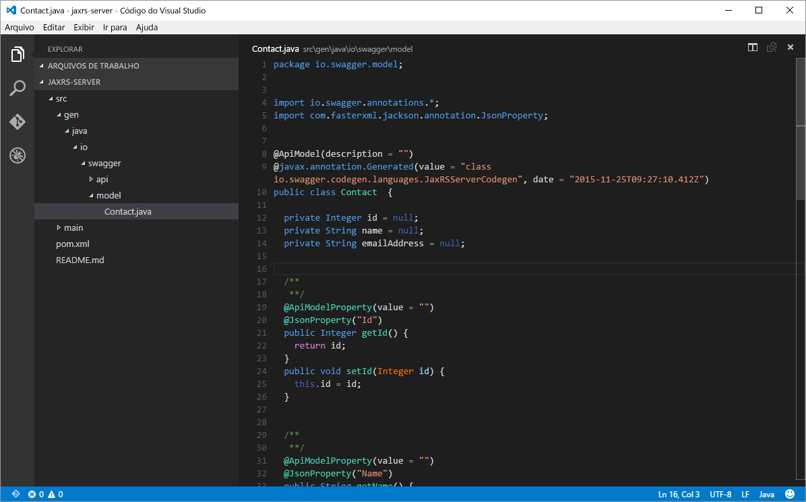
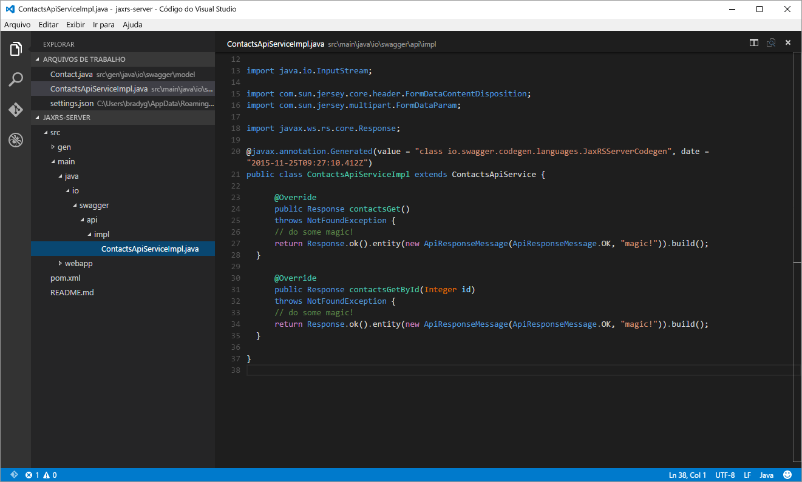
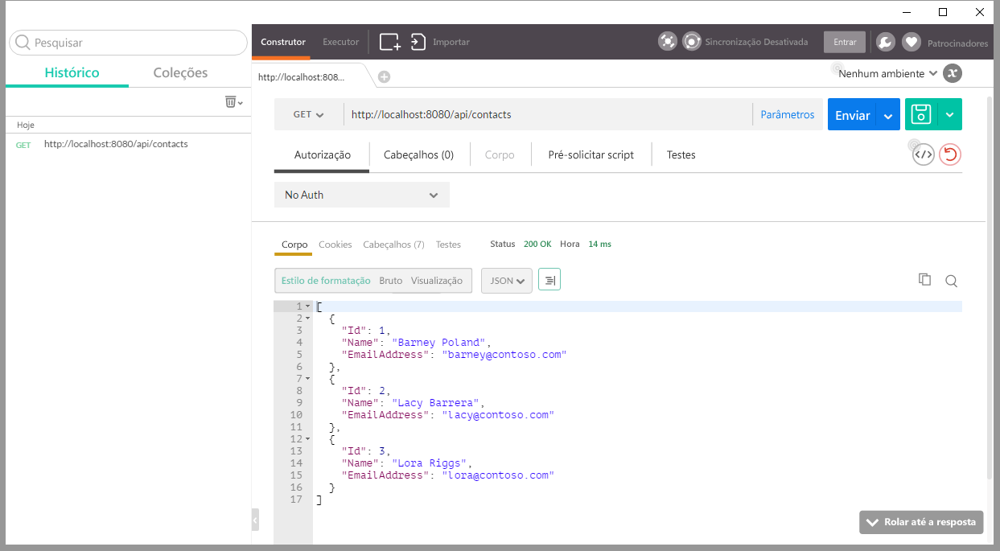
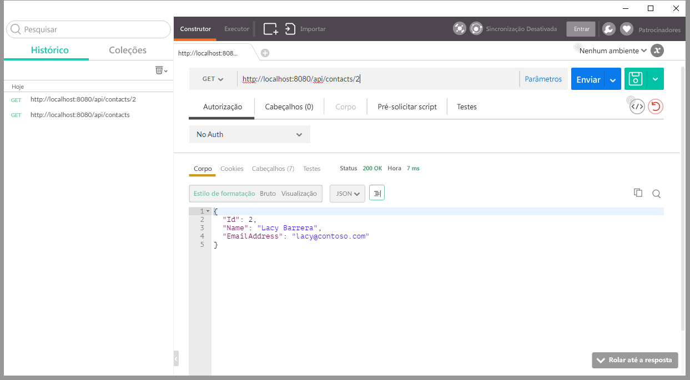
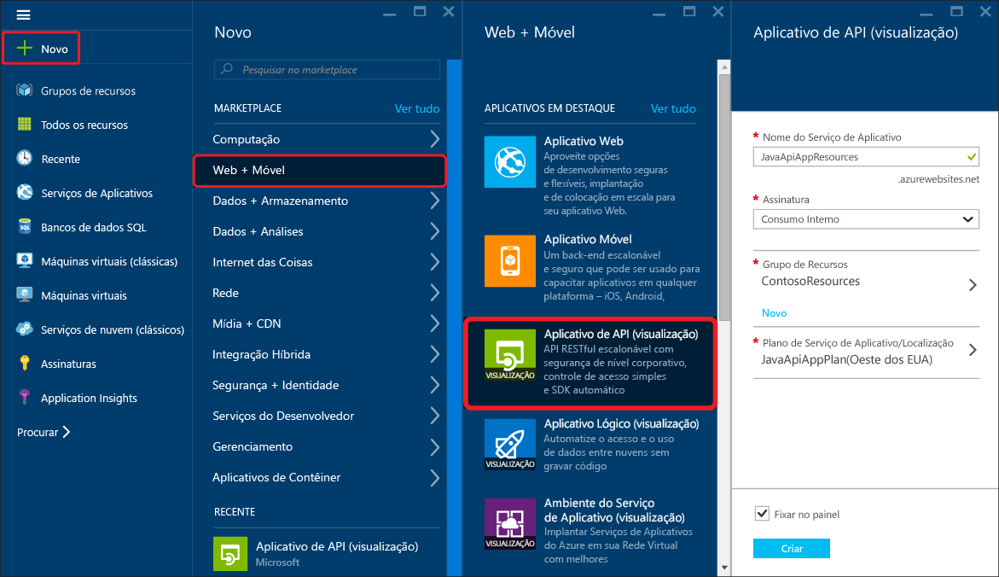
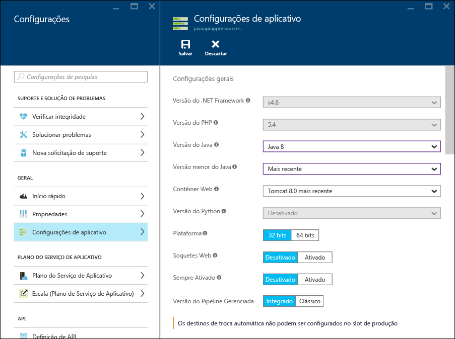
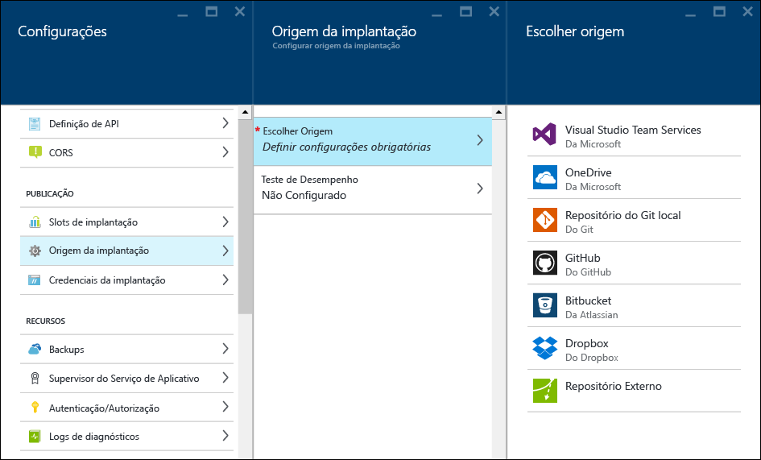
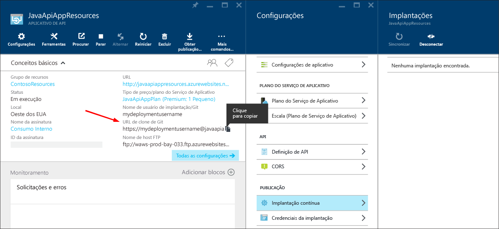
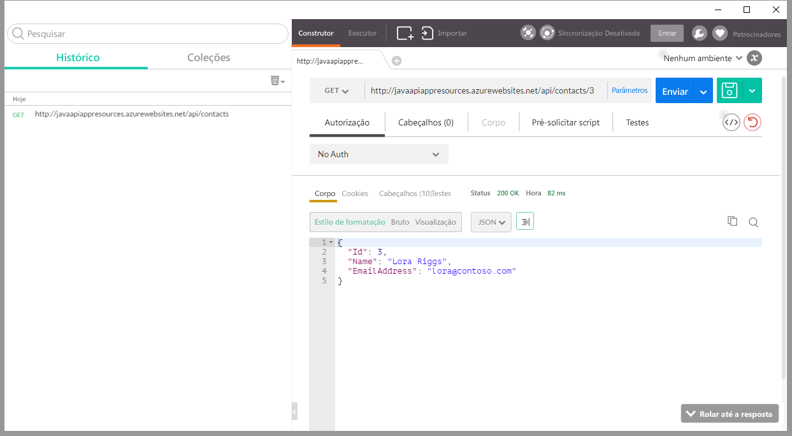

<properties
	pageTitle="Criar e implantar um aplicativo de API Java no Serviço de Aplicativo do Azure"
	description="Saiba como criar um pacote do aplicativo de API Java e implantá-lo no Serviço de Aplicativo do Azure."
	services="app-service\api"
	documentationCenter="java"
	authors="bradygaster"
	manager="mohisri" 
	editor="tdykstra"/>

<tags
	ms.service="app-service-api"
	ms.workload="web"
	ms.tgt_pltfrm="na"
	ms.devlang="java"
	ms.topic="get-started-article"
	ms.date="11/27/2015"
	ms.author="bradygaster"/>

# Criar e implantar um aplicativo de API Java no Serviço de Aplicativo do Azure

[AZURE.INCLUDE [app-service-api-get-started-selector](../../includes/app-service-api-get-started-selector.md)]

Este tutorial mostra como criar um aplicativo Java e implantá-lo em aplicativos de API do Serviço de Aplicativo do Azure usando o [Git](http://git-scm.com). As instruções deste tutorial podem ser seguidas em qualquer sistema operacional que seja capaz de executar o Java. O código deste tutorial foi criado usando o [Maven](https://maven.apache.org/). O [Jax-RS](https://jax-rs-spec.java.net/) é usado para criar o serviço RESTful e é gerado com base na especificação de metadados do [Swagger](http://swagger.io) usando o [Editor do Swagger](http://editor.swagger.io/).

## Pré-requisitos

1. [Java Developer's Kit 8](http://www.oracle.com/technetwork/java/javase/downloads/jdk8-downloads-2133151.html) (ou posterior)
1. Uma assinatura paga ou de [avaliação gratuita](https://azure.microsoft.com/pricing/free-trial/) para o [Microsoft Azure](https://azure.microsoft.com)
1. O [Maven](https://maven.apache.org/) instalado na máquina de desenvolvimento
1. O Git instalado na máquina de desenvolvimento. 

## Gerar automaticamente a API usando o Swagger.IO
Usando o editor online swagger.io, você pode entrar no código JSON ou YAML do Swagger que representa a estrutura da sua API. Após o design da área de superfície de API, você poderá exportar o código em uma variedade de plataformas e de estruturas. Na próxima seção, o código gerado automaticamente será modificado para incluir funcionalidade fictícia.

Esta demonstração começa com um corpo JSON do Swagger que será colado no editor swagger.io, que então será usado para gerar código utilizando RS-JAX para acessar um ponto de extremidade da API REST. Em seguida, você editará o código gerado automaticamente para retornar dados fictícios, simulando uma API REST criada sobre um mecanismo de persistência de dados.

1. Copiar o código JSON Swagger abaixo para a área de transferência

		{
			"swagger": "2.0",
			"info": {
				"version": "v1",
				"title": "Contact List",
				"description": "A Contact list API based on Swagger and built using Java"
			},
			"host": "localhost",
			"schemes": [
				"http",
				"https"
			],
			"basePath": "/api",
			"paths": {
				"/contacts": {
					"get": {
						"tags": [
							"Contact"
						],
						"operationId": "contacts_get",
						"consumes": [],
						"produces": [
							"application/json",
							"text/json"
						],
						"responses": {
							"200": {
								"description": "OK",
								"schema": {
									"type": "array",
									"items": {
										"$ref": "#/definitions/Contact"
									}
								}
							}
						},
						"deprecated": false
					}
				},
				"/contacts/{id}": {
					"get": {
						"tags": [
							"Contact"
						],
						"operationId": "contacts_getById",
						"consumes": [],
						"produces": [
							"application/json",
							"text/json"
						],
						"parameters": [
							{
								"name": "id",
								"in": "path",
								"required": true,
								"type": "integer",
								"format": "int32"
							}
						],
						"responses": {
							"200": {
								"description": "OK",
								"schema": {
									"type": "array",
									"items": {
										"$ref": "#/definitions/Contact"
									}
								}
							}
						},
						"deprecated": false
					}
				}
			},
			"definitions": {
				"Contact": {
					"type": "object",
					"properties": {
						"Id": {
							"format": "int32",
							"type": "integer"
						},
						"Name": {
							"type": "string"
						},
						"EmailAddress": {
							"type": "string"
						}
					}
				}
			}
		}
		
1. Navegue até o [editor online do Swagger](http://editor.swagger.io/). Quando estiver lá, clique no item de menu **Arquivo -> Colar JSON**.

    

1. Cole o JSON do Swagger da API de Lista de Contatos copiado anteriormente.

    

1. Exiba as páginas de documentação e o resumo da API renderizadas no editor.

    

1. Selecione a opção de menu **Gerar Servidor -> JAX-RS** para gerar automaticamente o código do lado do servidor que você editará posteriormente para adicionar a implementação fictícia.

    
	
	Após a geração do código, será fornecido um arquivo ZIP que você poderá baixar. Esse arquivo contém o código gerado automaticamente pelo gerador de código do Swagger e todos os scripts de compilação associados. Descompacte a biblioteca inteira em um diretório em sua estação de trabalho de desenvolvimento.

## Editar o código para adicionar a implementação da API
Nesta seção, você substituirá a implementação do lado servidor do código gerado pelo seu código personalizado. O novo código retornará uma ArrayList de entidades de Contact para o cliente da chamada.

1. Abra o arquivo de modelo *Contact.java* localizado na pasta *src/gen/java/swagger/model* usando o [Visual Studio Code](https://code.visualstudio.com) ou em seu editor de texto favorito. 

    

1. Adicione o construtor a seguir à classe **Contact**.

        public Contact(Integer id, String name, String email) 
		{
			this.id = id;
			this.name = name;
			this.emailAddress = email;
		}

1. Abra o arquivo de implementação do serviço *ContactsApiServiceImpl.java* localizado na pasta *src/main/java/swagger/api/impl* usando o [Visual Studio Code](https://code.visualstudio.com) ou em seu editor de texto favorito.

    

1. Substitua o código no arquivo por esse novo código para adicionar uma implementação fictícia ao código de serviço.

        package io.swagger.api.impl;

        import io.swagger.api.*;
        import io.swagger.model.*;
        import com.sun.jersey.multipart.FormDataParam;
        import io.swagger.model.Contact;
        import java.util.*;
        import io.swagger.api.NotFoundException;
        import java.io.InputStream;
        import com.sun.jersey.core.header.FormDataContentDisposition;
        import com.sun.jersey.multipart.FormDataParam;
        import javax.ws.rs.core.Response;

        @javax.annotation.Generated(value = "class io.swagger.codegen.languages.JaxRSServerCodegen", date = "2015-11-24T21:54:11.648Z")
        public class ContactsApiServiceImpl extends ContactsApiService {
  
            private ArrayList<Contact> loadContacts()
            {
                ArrayList<Contact> list = new ArrayList<Contact>();
                list.add(new Contact(1, "Barney Poland", "barney@contoso.com"));
                list.add(new Contact(2, "Lacy Barrera", "lacy@contoso.com"));
                list.add(new Contact(3, "Lora Riggs", "lora@contoso.com"));
                return list;
            }
  
            @Override
            public Response contactsGet()
            throws NotFoundException {
                ArrayList<Contact> list = loadContacts();
                return Response.ok().entity(list).build();
                }
  
            @Override
            public Response contactsGetById(Integer id)
            throws NotFoundException {
                ArrayList<Contact> list = loadContacts();
                Contact ret = null;
            
                for(int i=0; i<list.size(); i++)
                {
                    if(list.get(i).getId() == id)
                    {
                        ret = list.get(i);
                    }
                }
                return Response.ok().entity(ret).build();
            }
        }

1. Abra um prompt de comando.

1. Execute o comando do Maven a seguir para compilar o código e execute-o usando o servidor de aplicativo Jetty localmente.

		mvn package jetty:run
		
1. Você deverá ver a janela de comando mostrar que o Jetty iniciou seu código na porta 8080.

	
	
1. Use o [Postman](https://www.getpostman.com/) para fazer uma solicitação ao método de API "obter todos os contatos", localizado em http://localhost:8080/api/contacts.

	
	
1. Use o [Postman](https://www.getpostman.com/) para fazer uma solicitação ao método de API "obter contato específico", localizado em http://localhost:8080/api/contacts/2.

	
	
1. Por fim, compile o arquivo WAR Java (Web ARchive) executando o comando do Maven a seguir no seu console.

		mvn package war:war
		
	Depois que o arquivo WAR for criado, ele será colocado na pasta **target**. Navegue até a pasta **target** e renomeie o arquivo WAR para **ROOT.war** (utilize as maiúsculas/minúsculas dessa forma).
	
		rename swagger-jaxrs-server-1.0.0.war ROOT.war
		
	Por fim, execute os comandos a seguir para criar uma pasta **deploy** a ser usada para implantar o arquivo WAR no Azure.
	
		mkdir deploy
		mkdir deploy\webapps
		copy target\ROOT.war deploy\webapps
		cd deploy
	
## Publicar a saída no Serviço de Aplicativo do Azure
Nesta seção, você vai aprender a criar um novo Aplicativo de API usando o Portal do Azure, a preparar esse Aplicativo de API para hospedar aplicativos Java e a implantar o arquivo WAR recém-criado no Serviço de Aplicativo do Azure para executar seu novo Aplicativo de API.

1. crie um novo aplicativo de API no [portal do Azure](http://portal.azure.com) clicando no item de menu **Novo -> Web + Móvel -> aplicativo de API**.
	
	

1. Clique na opção **Configurações do aplicativo** na folha de configurações do Aplicativo de API. Em seguida, selecione as versões mais recentes do Java nos menus de versão de Java e selecione o Tomcat mais recente no menu de contêiner da Web.

	

1. Clique no item de menu das configurações de **Credenciais de implantação** e forneça um nome de usuário e uma senha que você queira usar para publicar arquivos em seu Aplicativo de API.

	

1. Clique no item de menu das configurações de **Implantação Contínua**. Quando estiver lá, clique no botão **Escolher fonte** e selecione a opção **Repositório Git Local**. Isso criará um repositório Git em execução no Azure, com uma associação ao seu Aplicativo de API. Sempre que você confirmar código para a ramificação *mestre* do repositório Git, seu código será publicado em sua instância do Aplicativo de API App em execução em tempo real.

	

1. Copie a URL do novo repositório Git para a área de transferência. Salve-a porque ela será importante daqui a pouco.

	

1. Envie por push do Git o arquivo WAR para o repositório online. Para fazer isso, navegue até a pasta **deploy** criada anteriormente para que você possa confirmar com facilidade o código no repositório em execução no seu Serviço de Aplicativo. Quando você estiver na janela do console e tiver navegado até a pasta onde a pasta webapps está localizada, emita os comandos Git a seguir para iniciar o processo e disparar uma implantação.

		git init
		git add .
		git commit -m "initial commit"
		git remote add azure [YOUR GIT URL]		
		git push azure master
		
	Quando você emitir a solicitação **push**, será solicitada a senha criada anteriormente para a credencial de implantação. Se você a inserir, deverá ver seu portal exibir que a atualização chegou e foi implantada.
		
1. Se você usar novamente o Postman para acessar o Aplicativo de API recém-implantado em execução no Serviço de Aplicativo do Azure, verá que o comportamento é consistente e que agora ele está retornando os dados de contato esperados e usando alterações de código simples feitas no código Java do Swagger.io gerado automaticamente.

	
	
## Próximas etapas
Neste artigo, você conseguiu começar com um arquivo JSON do Swagger e um código Java gerado automaticamente obtido do editor Swagger.io. A partir daí, suas alterações simples e um processo de implantação Git resultaram em um aplicativo de API funcional escrito em Java. Agora você pode voltar e saber mais sobre o [SDK do Armazenamento para Java](../storage/storage-java-how-to-use-blob-storage.md) para manter os blobs JSON. Ou você pode usar o [SDK do Java do Banco de Dados de Documentos](../documentdb/documentdb-java-application.md) para salvar os dados de contato no Banco de Dados de Documentos do Azure.

Para obter mais informações sobre como usar o Java no Azure, consulte o [Centro de desenvolvedores do Java](/develop/java/).

<!---HONumber=AcomDC_1203_2015-->