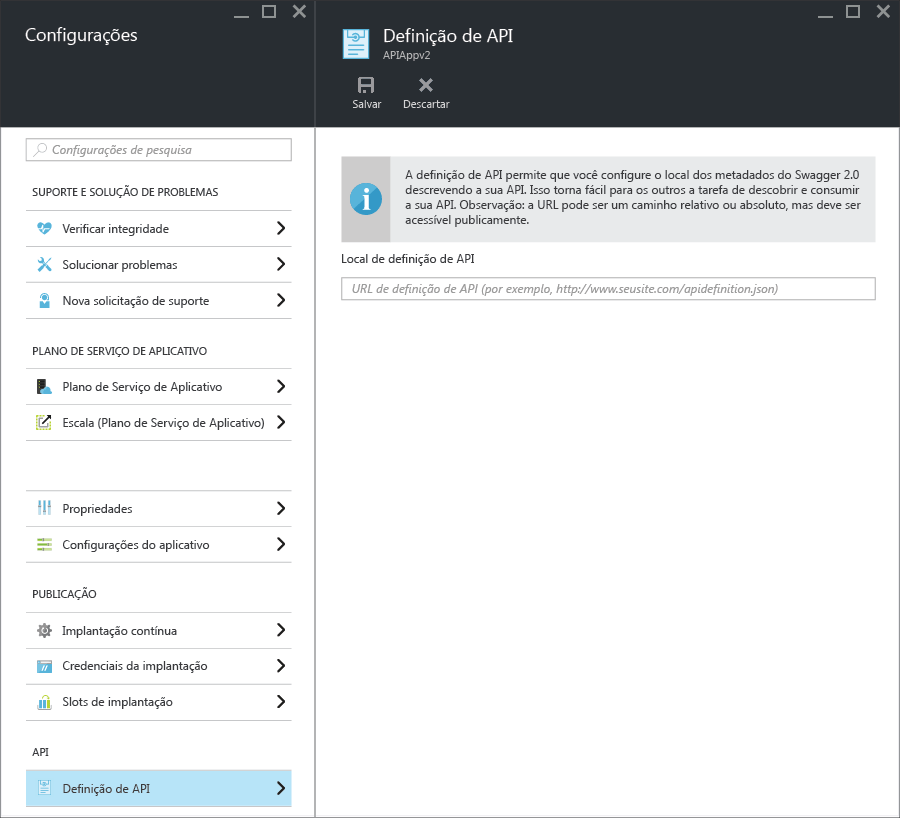

<properties
	pageTitle="Metadados de Aplicativos de API do Serviço de Aplicativo para geração de códigos e descoberta de API | Microsoft Azure"
	description="Saiba como os Aplicativos de API no Serviço de Aplicativo do Azure usam metadados do Swagger para facilitar a geração de códigos e a descoberta de API."
	services="app-service\api"
	documentationCenter=".net"
	authors="tdykstra"
	manager="wpickett"
	editor=""/>

<tags
	ms.service="app-service-api"
	ms.workload="na"
	ms.tgt_pltfrm="na"
	ms.devlang="na"
	ms.topic="article"
	ms.date="02/16/2016"
	ms.author="tdykstra"/>

# Metadados de Aplicativos de API do Serviço de Aplicativo para geração de códigos e descoberta de API 

O suporte para metadados de API do [Swagger 2.0](http://swagger.io/) baseia-se em Aplicativos de API do Serviço de Aplicativo. Você não precisa usar o Swagger, mas se usá-lo, poderá tirar proveito dos recursos de Aplicativos de API que facilitam a descoberta e o consumo.

## Ponto de extremidade do Swagger

Você pode especificar um ponto de extremidade que forneça metadados JSON do Swagger 2.0 para um aplicativo de API em uma propriedade do aplicativo de API. O ponto de extremidade pode ser relativo à URL base do aplicativo de API ou a uma URL absoluta. As URLs absolutas podem apontar para fora do aplicativo de API.

Para muitos clientes downstream (por exemplo, geração de código do Visual Studio e fluxo "Adicionar API" de PowerApps), a URL deve ser acessível publicamente (não estar protegida pelo usuário ou pela autenticação de serviço). Isso significa que, se estiver usando a autenticação do Serviço de Aplicativo e desejar expor a definição de API de dentro de seu próprio aplicativo, você precisará usar a opção de autenticação que permite que o tráfego anônimo chegue à API. Para obter mais informações, consulte [Autenticação e autorização para Aplicativos de API do Serviço de Aplicativo](app-service-api-authentication.md).

### Folha do Portal

No [portal do Azure](https://portal.azure.com/), a URL do ponto de extremidade pode ser vista e alterada na folha **Definição de API**.

### Propriedade do Gerenciador de Recursos do Azure

Você também pode configurar a URL de definição de API para um aplicativo de API usando ferramentas do Gerenciador de Recursos do Azure, como o Azure PowerShell, a CLI ou o [Gerenciador de Recursos](https://resources.azure.com/).

Defina a propriedade `apiDefinition` no tipo de recurso Microsoft.Web/sites/config para o recurso <site name>/web. Por exemplo, no **Gerenciador de Recursos**, vá para **assinaturas > {sua assinatura} > resourceGroups > {seu grupo de recursos} > provedores > Microsoft.Web > sites > {seu site} > configuração > web** e você verá a propriedade cors:

		"apiDefinition": {
		  "url": "https://contactslistapi.azurewebsites.net/swagger/docs/v1"
		}

### Valor padrão

Quando você usa o Visual Studio para criar um aplicativo de API, o ponto de extremidade de definição de API é definido automaticamente para a URL base do aplicativo de API mais `/swagger/docs/v1`. Essa é a URL padrão que o pacote NuGet [Swashbuckle](https://www.nuget.org/packages/Swashbuckle) usa para servir metadados do Swagger gerados dinamicamente para um projeto de API Web do ASP.NET.

## Geração de código

Um dos benefícios da integração do Swagger a aplicativos de API do Azure é a geração automática de código. As classes de cliente geradas tornam mais fácil escrever código para chamar um aplicativo de API.

Você pode gerar o código cliente para um aplicativo de API usando o Visual Studio ou a linha de comando. Para saber mais sobre como gerar classes de cliente no Visual Studio para um projeto de API Web do ASP.NET, confira [Introdução aos Aplicativos de API e ASP.NET](app-service-api-dotnet-get-started.md#codegen). Para saber mais sobre como fazer isso na linha de comando para todos os idiomas com suporte, confira o arquivo Leiame do repositório [Azure/autorest](https://github.com/azure/autorest) no GitHub.com.
 
## Próximas etapas

Para obter um tutorial passo a passo que oriente você durante a criação, a implantação e o consumo de um aplicativo de API, confira [Introdução aos Aplicativos de API no Serviço de Aplicativo do Azure](app-service-api-dotnet-get-started.md).

<!---HONumber=AcomDC_0302_2016-->