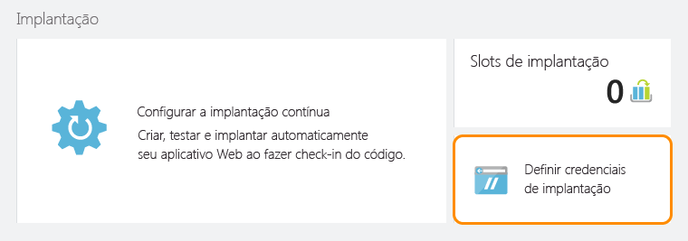

<properties
	pageTitle="Criar e implantar um aplicativo de API do Node.js no serviço de aplicativo do Azure"
	description="Saiba como criar um pacote do aplicativo de API do Node.js e implantá-lo no Serviço de Aplicativo do Azure."
	services="app-service\api"
	documentationCenter="node"
	authors="bradygaster"
	manager="mohisri" 
	editor="tdykstra "/>

<tags
	ms.service="app-service-api"
	ms.workload="web"
	ms.tgt_pltfrm="na"
	ms.devlang="node"
	ms.topic="get-started-article"
	ms.date="11/27/2015"
	ms.author="bradygaster"/>

# Criar e implantar um aplicativo de API do Node.js no serviço de aplicativo do Azure

[AZURE.INCLUDE [app-service-api-get-started-selector](../../includes/app-service-api-get-started-selector.md)]

## Pré-requisitos
1. [Node.js](nodejs.org) em execução na máquina de desenvolvimento (este exemplo pressupõe que o Node.js, versão 4.2.2, está instalado)
1. Conta do [GitHub](https://github.com/)
1. [Conta de avaliação gratuita](https://azure.microsoft.com/pricing/free-trial/) do Microsoft Azure
1. Git instalado em sua estação de trabalho de desenvolvimento local

## Instruções de configuração
Os comandos a seguir devem ser executados usando a linha de comando do Node.js. Usando o gerador Swaggerize Yo, você pode realizar o scaffold do código de linha de base do Node.js do qual precisará para atender às solicitações HTTP definidas em um arquivo JSON Swagger.
 
1. Instale globalmente os módulos NPM **yo** e **generator-swaggerize**.

        npm install -g yo
	    npm install -g generator-swaggerize
		
1. Clone o [repositório GitHub que contém o exemplo de código](https://github.com/Azure-Samples/app-service-api-node-contact-list).

		git clone https://github.com/Azure-Samples/app-service-api-node-contact-list.git
				
1. Execute o comando para realizar o scaffold da API com base no arquivo **api.json** incluído com o código-fonte. O arquivo **api.json** é um arquivo Swagger que representa a API na qual você realmente realizará o scaffold usando o comando "yo swaggerize" durante a próxima etapa.

        yo swaggerize
        
    **Observação:** API.json não é a mesma coisa que o arquivo *apiapp.json* do período de visualização dos Aplicativos de API.

1. O Swaggerize realizará o scaffold nos manipuladores e nas configuração dos metadados Swagger incluídos em **api.json**. Durante o processo de scaffold você receberá diversas perguntas, como seu nome de usuário e endereço de email do GitHub. Essas informações serão usadas para gerar o arquivo **package.json** na pasta de seu aplicativo. De todas as perguntas feitas durante o processo de scaffolding, o mais importante é que você selecione **express** quando receber a solicitação, pois este exemplo usará o mecanismo de exibição express para gerar posteriormente a página de Ajuda do Swagger quando seu Aplicativo de API estiver em execução no Azure (ou localmente).

	
    
1. Vá até a pasta que contém o código em scaffolding (nesse caso, a subpasta *ContactList*). Em seguida, instale o módulo NPM **jsonpath**.

        npm install --save jsonpath
        
    Você verá os resultados da instalação na experiência de linha de comando.

    

1. Instale o módulo NPM **swaggerize-ui**.

        npm install --save swaggerize-ui
        
    Você verá os resultados da instalação na experiência de linha de comando.

    

1. Cópia a pasta **lib** da pasta **iniciar** para a pasta **ContactList** criada pelo scaffolder.

1. Substitua o código no arquivo **handlers/contacts.js** pelo código a seguir. Esse código usa os dados JSON armazenados no arquivo **lib/contacts.json** atendido por **lib/contactRepository.js**. O novo código contats.js a seguir responderá às solicitações HTTP a fim de obter todos os contatos que usam esse código.

        'use strict';
        
        var repository = require('../lib/contactRepository');
        
        module.exports = {
            get: function contacts_get(req, res) {
                res.json(repository.all())
            }
        };

1. Substitua o código no arquivo **handlers/contacts/{id}.js** pelo código a seguir, que usará **lib/contactRepository.js** para obter o contato solicitado pela solicitação HTTP e retorná-lo como conteúdo JSON.

        'use strict';

        var repository = require('../../lib/contactRepository');
        
        module.exports = {
            get: function contacts_get(req, res) {
                res.json(repository.get(req.params['id']))
            }    
        };

1. Substitua o código no **server.js** pelo código a seguir. Observe que as alterações feitas no arquivo server.js são realçadas usando comentários, para que você possa ver as alterações feitas.

        'use strict';

        var port = process.env.PORT || 8000; // first change

        var http = require('http');
        var express = require('express');
        var bodyParser = require('body-parser');
        var swaggerize = require('swaggerize-express');
        var swaggerUi = require('swaggerize-ui'); // second change
        var path = require('path');

        var app = express();

        var server = http.createServer(app);

        app.use(bodyParser.json());

        app.use(swaggerize({
            api: path.resolve('./config/api.json'), // third change
            handlers: path.resolve('./handlers'),
            docspath: '/swagger' // fourth change
        }));

        // change four
        app.use('/docs', swaggerUi({
          docs: '/swagger'  
        }));

        server.listen(port, function () { // fifth change
            app.setHost(undefined); // sixth and final change
        });

1. Ative o servidor usando o executável de linha de comando do Node.js.

        node server.js

    A execução desse comando iniciará o servidor HTTP do Node.js e começará a atender à sua API.

1. Ao navegar até ****http://localhost:8000/contacts** você verá a saída JSON da lista de contatos (ou receberá uma solicitação para baixá-la, dependendo de seu navegador).

    

1. Ao navegar até ****http://localhost:8000/contacts/2** você verá o contato representado por esse valor de ID.

    

1. Os dados JSON do Swagger são atendidos por meio do ponto de extremidade **/swagger**:

    

1. A interface de usuário do Swagger é atendida por meio do ponto de extremidade **/docs**. Na interface de usuário do Swagger, você pode usar os recursos avançados de cliente HTML para testar sua API.

    

## Criar um novo Aplicativo de API no Portal do Azure
Nesta seção, você verá o processo de criação de um Aplicativo de API novo e vazio no Azure. Em seguida, você conectará o aplicativo a um repositório Git para habilitar o fornecimento contínuo de suas alterações no código.

O repositório GitHub do qual você clonou o código-fonte não é o mesmo repositório no qual vai enviará por push o código para implantação. O exemplo de repositório GitHub continha o estado "Inicial" do código e, agora que você tenha realizou o scaffold do estado "final" do código, será necessário enviar por push esse código apenas para o repositório Git associado ao Aplicativo de API. A primeira etapa será criar seu Aplicativo de API usando o Portal do Azure, em seguida

1. Navegar até o [Portal do Azure](http://portal.azure.com). 

1. Criar um novo Aplicativo de API.

    

1. Você pode adicionar seu novo Aplicativo de API a um Grupo de Recursos e/ou Plano de Serviço de Aplicativo existente, ou você pode criar um novo Grupo de Recursos e Plano de Serviço de Aplicativo, conforme demonstra a captura de tela abaixo.

    

1. Após a criação de seu Aplicativo de API no portal, navegue até a folha que contém as configurações para seu Aplicativo de API, conforme exibido abaixo.

    

1. Clique no item de navegação **Credenciais de implantação** no menu Configurações. Após a abertura da folha, adicione um nome de usuário e senha que você usará para publicar seu código do Node.js em seu Aplicativo de API. Em seguida, clique no botão **Salvar** na folha **Definir credenciais de implantação**.

    

1. Depois de configurar suas credenciais de implantação, você pode criar um repositório Git associado ao seu Serviço de Aplicativo. Cada vez que você envia um código a esse repositório, o Serviço de Aplicativo do Azure pegará as alterações e as implantará diretamente em sua instância do Aplicativo de API. Para criar um repositório Git a fim de associá-lo ao seu site, clique no item de menu **Implantação contínua** na folha do menu Configurações, conforme exibido abaixo. Em seguida, selecione a opção **Repositório Git Local** na folha **Escolher fonte**. Depois, clique no botão OK para criar o repositório Git.

    

1. Após a criação do repositório Git, a folha mudará e mostrará as implantações ativas. Como o repositório é novo, nenhuma implantação ativa deve estar na lista.

    

1. A última etapa será copiar a URL do repositório Git do portal. Para fazer isso, navegue até a folha de seu novo Aplicativo de API e examine a seção **Essentials** da folha. Você deve ver a **URL do clone de Git** na seção Essentials. Ao lado dela há um ícone que copiará a URL para a área de transferência. Clique na URL para copiá-la (o botão aparece quando você passa o mouse sobre a URL) ou selecione toda a URL e copie-a na área de transferência.

    

    **Observação**: você precisará da URL do clone Git na próxima etapa, portanto, salve-a em algum lugar por enquanto.

Agora que você tem um novo Aplicativo de API com um repositório Git de suporte, você pode enviar o código por push no repositório e utilizar os recursos de implantação contínua do Azure para implantar automaticamente as alterações.

## Implantar seu código de Aplicativo de API no Azure
Com os recursos internos de fornecimento contínuo do Serviço de Aplicativo do Azure, você pode simplesmente confirmar seu código em um repositório Git associado ao seu Serviço de Aplicativo, e o Azure pegará seu código-fonte e o implantará em seu Aplicativo de API.

1. Copie a pasta **src/end/ContactList** criada pelo scaffolder swaggerize em sua área de trabalho ou outra pasta, pois você criará um novo repositório Git local para o código que deve residir fora do repositório principal clonado do GitHub que contém o código de introdução. 

1. Use a experiência de linha de comando do Node.js para navegar na nova pasta. Quando estiver lá, execute o seguinte comando para criar um novo repositório Git local.

        git init

    Esse comando criará um repositório Git local e você receberá uma confirmação de que o novo repositório foi inicializado.

    

1. Use a experiência de linha de comando do Node.js para executar o comando a seguir, que adicionará um Git remoto ao seu repositório local. O repositório remoto será aquele que você acabou de criar e associar a seu Aplicativo de API em execução no Azure.

        git remote add azure YOUR_GIT_CLONE_URL_HERE

    **Observação**: convém substituir a cadeia de caracteres "YOUR\_GIT\_CLONE\_URL\_HERE" acima por sua própria URL do clone do Git copiada anteriormente.

1. Em seguida, execute os dois comandos abaixo na experiência de linha de comando do Node.js.

        git add .
        git commit -m "initial revision"

    Depois de concluir esses dois comandos, você deverá ver algo como a captura de tela abaixo na janela de linha de comando.

    

1. Para enviar por push seu código para o Azure, que disparará uma implantação em seu Aplicativo de API, execute o seguinte comando na linha de comando do Node.js. Quando receber uma solicitação de senha, use a senha que você usou anteriormente ao criar suas Credenciais de implantação no Portal do Azure.

        git push azure master

1. Se você navegar de volta para a folha **Implantação Contínua** de seu Aplicativo de API, você verá que a implantação está acontecendo.

    

    Simultaneamente, a linha de comando do Node.js refletirá o status de sua implantação, enquanto ela estiver acontecendo.

    

1. Após a conclusão da implantação, a folha **Implantação Contínua** refletirá a implantação bem-sucedida de suas alterações de código em seu Aplicativo de API. Copie a **URL** na seção **Essentials** da folha do Aplicativo de API.

    

1. Usando o cliente da API REST, como o Postman ou o Fiddler (ou seu navegador da Web), forneça a URL da chamada de API de contatos, que deve ser o ponto de extremidade **/contacts** de seu Aplicativo de API.

    **Observação:** a URL será algo como http://myapiapp.azurewebsites.net/contacts

    Ao emitir uma solicitação GET para esse ponto de extremidade, você deverá a saída JSON de seu Aplicativo de API.

    

## Próximas etapas

Agora, você já criou e implantou com êxito seu primeiro Aplicativo de API usando o Node.js. O próximo tutorial na série de introdução aos Aplicativos de API mostra como [consumir aplicativos de API de clientes JavaScript usando CORS](app-service-api-cors-consume-javascript.md).

Para expandir esse exemplo, você pode adicionar código aos manipuladores para armazenar os dados em um banco de dados ou no disco da instância de Aplicativo de API. Agora que você a Implantação Contínua está conectada, a alteração da funcionalidade do Aplicativo de API e sua extensão será tão fácil quanto a alterar e enviar seu código por push ao repositório Git.

<!---HONumber=AcomDC_1210_2015-->