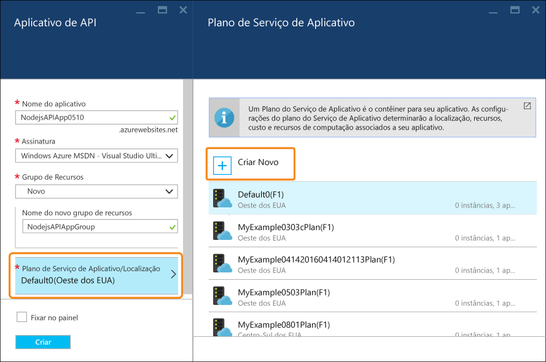
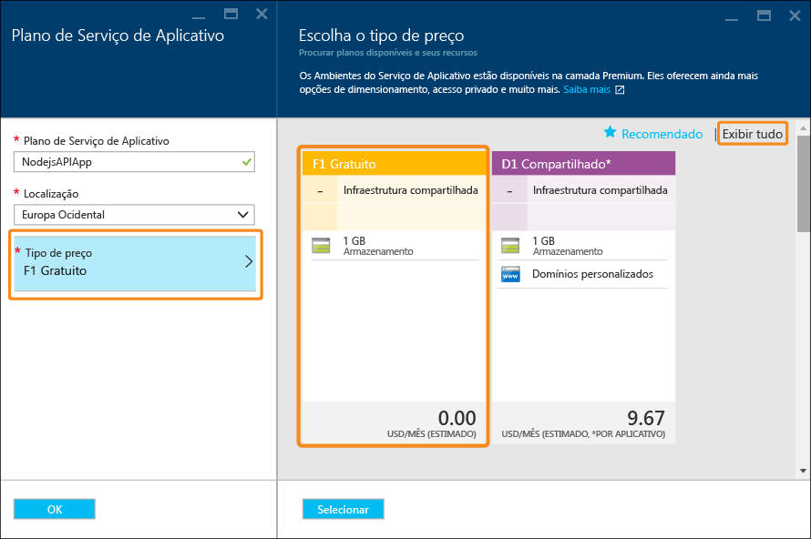

# Criar uma API RESTful do Node. js e implantá-la em um aplicativo de API no Azure
[!INCLUDE [app-service-api-get-started-selector](../../includes/app-service-api-get-started-selector.md)]

Este tutorial mostra como criar uma simples API [Node. js](http://nodejs.org) e implantá-la em um [aplicativo da API](app-service-api-apps-why-best-platform.md) no [Serviço de Aplicativo do Azure](../app-service/app-service-value-prop-what-is.md) usando o [Git](http://git-scm.com). Você pode usar qualquer sistema operacional que possa executar o Node.js e fará todo o trabalho usando ferramentas de linha de comando como cmd.exe ou bash.

## Pré-requisitos
1. Conta do Microsoft Azure ([abra uma conta gratuita aqui](https://azure.microsoft.com/pricing/free-trial/))
2. [Node.js](http://nodejs.org) instalado (este exemplo pressupõe que você tenha o Node.js versão 4.2.2)
3. [Git](https://git-scm.com/) instalado
4. [GitHub](https://github.com/) 

Embora o Serviço de Aplicativo ofereça suporte a várias maneiras de implantar seu código em um aplicativo de API, este tutorial mostra o método Git e pressupõe que você tenha um conhecimento básico de como trabalhar com o Git. Para saber mais sobre outros métodos de implantação, confira [Implantar seu aplicativo no Serviço de Aplicativo do Azure](../app-service-web/web-sites-deploy.md).

## Obter o código de amostra
1. Abra uma interface de linha de comando que pode executar comandos Node.js e Git.
2. Navegue até uma pasta que você possa usar para um repositório Git local e clone o [repositório GitHub que contém o código de exemplo](https://github.com/Azure-Samples/app-service-api-node-contact-list).
   
        git clone https://github.com/Azure-Samples/app-service-api-node-contact-list.git
   
    A API de exemplo fornece dois pontos de extremidade: uma solicitação Get para `/contacts` retorna uma lista de nomes e endereços de email no formato JSON, enquanto `/contacts/{id}` retorna apenas o contato selecionado.

## Código do Node.js em scaffolding (gerado automaticamente) baseado nos metadados do Swagger
[Swagger](http://swagger.io/) é um formato de arquivo para metadados que descreve uma API RESTful. O Serviço de Aplicativo do Azure tem [suporte interno para metadados do Swagger](app-service-api-metadata.md). Esta seção do tutorial modela um fluxo de trabalho de desenvolvimento de API em que você cria primeiro os metadados do Swagger e os utiliza para gerar automaticamente o código de servidor para a API. 

> [!NOTE]
> Você pode ignorar esta seção se não quiser saber como criar o scaffold de código Node.js de um arquivo de metadados do Swagger. Se você quiser implantar apenas o código de exemplo para um novo aplicativo de API, siga diretamente para a seção [Criar um aplicativo de API no Azure](#createapiapp) .
> 
> 

### Instalar e executar o Swaggerize
1. Execute os comandos a seguir para instalar os módulos NPM **yo** e **generator-swaggerize** globalmente.
   
        npm install -g yo
        npm install -g generator-swaggerize
   
    Swaggerize é uma ferramenta que gera o código do servidor para uma API descrita por um arquivo de metadados do Swagger. O arquivo Swagger que você usará é denominado *api.json* e está localizado na pasta *start* do repositório clonado.
2. Navegue até a pasta *start*, em seguida, execute o comando `yo swaggerize`. O Swaggerize irá fazer uma série de perguntas.  Para saber **como chamar este projeto**, digite "ContactList" para o ** caminho para o documento swagger**, insira "api.json" e para **Express, Hapi ou Restify**, insira "express".
   
        yo swaggerize
   
    
   
    **Observação**: se você encontrar um erro nesta etapa, a próxima etapa explicará como corrigi-lo.
   
    O Swaggerize cria uma pasta de aplicativo, manipuladores de scaffolding e arquivos de configuração e gera um arquivo **package.json** . O mecanismo de exibição expressa é usado para gerar a página de Ajuda do Swagger.  
3. Se o comando `swaggerize` falhar com um erro de "token inesperado" ou "sequência de escape inválida", corrija a causa do erro editando o arquivo *package.json* gerado. Na linha `regenerate` sob `scripts`, altere a barra invertida que precede *api.json* para uma barra normal, para que a linha fique como no exemplo a seguir:
   
         "regenerate": "yo swaggerize --only=handlers,models,tests --framework express --apiPath config/api.json"
4. Navegue até a pasta que contém o código em scaffolding (neste caso, a subpasta */start/ContactList*).
5. Execute `npm install`.
   
        npm install
6. Instale o módulo NPM **jsonpath** . 
   
        npm install --save jsonpath
   
    
7. Instale o módulo NPM **swaggerize-ui** . 
   
        npm install --save swaggerize-ui
   
    

### Personalizar o código com scaffolding
1. Copie a pasta **lib** da pasta **start** para a pasta **ContactList** criada pelo scaffolder. 
2. Substitua o código no arquivo **handlers/contacts.js** pelo código a seguir. 
   
    Esse código usa os dados JSON armazenados no arquivo **lib/contacts.json** atendido por **lib/contactRepository.js**. O novo código contacts.js responde a solicitações HTTP para obter todos os contatos e retorná-los como uma carga JSON. 
   
        'use strict';
   
        var repository = require('../lib/contactRepository');
   
        module.exports = {
            get: function contacts_get(req, res) {
                res.json(repository.all())
            }
        };
3. Substitua o código no arquivo **handlers/contacts/{id}.js** pelo código a seguir. 
   
        'use strict';
   
        var repository = require('../../lib/contactRepository');
   
        module.exports = {
            get: function contacts_get(req, res) {
                res.json(repository.get(req.params['id']));
            }    
        };
4. Substitua o código em **server.js** pelo código a seguir. 
   
    As alterações feitas no arquivo server.js são chamadas usando comentários, para que você possa ver as alterações feitas. 
   
        'use strict';
   
        var port = process.env.PORT || 8000; // first change
   
        var http = require('http');
        var express = require('express');
        var bodyParser = require('body-parser');
        var swaggerize = require('swaggerize-express');
        var swaggerUi = require('swaggerize-ui'); // second change
        var path = require('path');
   
        var app = express();
   
        var server = http.createServer(app);
   
        app.use(bodyParser.json());
   
        app.use(swaggerize({
            api: path.resolve('./config/swagger.json'), // third change
            handlers: path.resolve('./handlers'),
            docspath: '/swagger' // fourth change
        }));
   
        // change four
        app.use('/docs', swaggerUi({
          docs: '/swagger'  
        }));
   
        server.listen(port, function () { // fifth and final change
        });

### Testar com a API em execução localmente
1. Ative o servidor usando o executável de linha de comando do Node.js. 
   
        node server.js
2. Quando você navegar para **http://localhost:8000/contacts**, verá a saída JSON da lista de contatos (ou será solicitado a baixá-la, dependendo do seu navegador). 
   
    
3. Quando você navegar para **http://localhost:8000/contacts/2**, verá o contato representado por esse valor de id.
   
    
4. Os dados JSON do Swagger são atendidos por meio do ponto de extremidade **/swagger** :
   
    
5. A interface de usuário do Swagger é atendida por meio do ponto de extremidade **/docs** . Na interface de usuário do Swagger, você pode usar os recursos avançados de cliente HTML para testar a API.
   
    

##  Criar um novo Aplicativo de API
Nesta seção, use o portal do Azure para criar um novo Aplicativo de API no Azure. Este aplicativo de API representa os recursos de computação que o Azure fornecerá para executar seu código. Nas próximas seções, você implantará seu código para o novo aplicativo de API.

1. Navegar até o [Portal do Azure](https://portal.azure.com/). 
2. Clique em **Novo > Web + Móvel > Aplicativo de API**. 
   
    
3. Insira um **Nome do aplicativo** exclusivo no domínio *azurewebsites.net* , como NodejsAPIApp, além de um número para torná-lo exclusivo. 
   
    Por exemplo, se o nome for `NodejsAPIApp`, a URL será `nodejsapiapp.azurewebsites.net`.
   
    Se inserir um nome que outra pessoa já tenha usado, você verá um ponto de exclamação vermelho à direita.
4. Na lista suspensa **Grupo de Recursos**, clique em **Novo**, em seguida, no **Novo nome do grupo de recursos**, insira "NodejsAPIAppGroup" ou outro nome, se preferir. 
   
    Um [grupo de recursos](../azure-resource-manager/resource-group-overview.md) é uma coleção de recursos do Azure, como os aplicativos da API, bancos de dados e VMs. Para este tutorial, é melhor criar um novo grupo de recursos porque isso facilitará a exclusão de todos os recursos do Azure criados para o tutorial em uma única etapa.
5. Clique em **Plano/local do Serviço de Aplicativo**, em seguida, clique em **Criar Novo**.
   
    
   
    Nas etapas a seguir, você criará um plano de Serviço de Aplicativo para o novo grupo de recursos. Um plano de Serviço de Aplicativo especifica os recursos de computação em que seu aplicativo de API é executado. Por exemplo, se você escolher a camada gratuita, seu aplicativo de API será executado em VMs compartilhadas, enquanto que para algumas camadas pagas, ele é executado em VMs dedicadas. Para saber mais sobre os planos do Serviço de Aplicativo, consulte a [Visão geral dos planos do Serviço de Aplicativo](../app-service/azure-web-sites-web-hosting-plans-in-depth-overview.md).
6. Na folha **Plano do Serviço de Aplicativo** , insira "NodejsAPIAppPlan" ou outro nome, se preferir.
7. Na lista suspensa **Local** , escolha o local mais próximo de você.
   
    Essa configuração especifica em qual datacenter do Azure o aplicativo será executado. Para este tutorial, você pode selecionar qualquer região e isto não fará uma diferença notável. Porém, para um aplicativo de produção, o ideal é que seu servidor esteja o mais próximo possível dos clientes que o acessam, de modo a minimizar a [latência](http://www.bing.com/search?q=web%20latency%20introduction&qs=n&form=QBRE&pq=web%20latency%20introduction&sc=1-24&sp=-1&sk=&cvid=eefff99dfc864d25a75a83740f1e0090).
8. Clique em **Tipo de preço > Exibir Tudo > F1 Gratuito**.
   
    Neste tutorial, o tipo de preço gratuito permitirá um desempenho suficiente.
   
    
9. Na folha **Plano do Serviço de Aplicativo**, clique em **OK**.
10. Na folha **Aplicativo de API**, clique em **Criar**.

## Configurar seu novo aplicativo de API para implantação do Git
Você implantará seu código no aplicativo de API enviando confirmações por push para o repositório Git no Serviço de Aplicativo do Azure. Nesta seção do tutorial, você criará no Azure as credenciais e o repositório Git que usará para a implantação.  

1. Depois de criar seu aplicativo da API, clique em **Serviços de Aplicativos > {seu aplicativo da API}** na home page do portal. 
   
    O portal exibirá as folhas **Aplicativo de API** e **Configurações**.
   
    
2. Na folha **Configurações**, role para baixo até a seção **Publicação**, em seguida, clique nas **Credenciais da implantação**.
3. Na folha **Definir credenciais da implantação**, insira um nome de usuário e senha, em seguida, clique em **Salvar**.
   
    Você usará essas credenciais para publicar seu código do Node.js em seu aplicativo de API. 
   
    
4. Na folha **Configurações**, clique em **Origem da implantação > Escolher Origem > Repositório Git Local**, em seguida, clique em **OK**.
   
    
5. Após a criação do repositório Git, a folha muda para mostrar as implantações ativas. Como o repositório é novo, não existem implantações ativas na lista. 
   
    
6. Copie a URL do repositório Git. Para fazer isso, navegue até a folha de seu novo Aplicativo de API e examine a seção **Essentials** da folha. Observe a **URL de clone do Git** na seção **Essentials**. Ao passar o mouse sobre essa URL, você vê um ícone à direita que copiará a URL para a área de transferência. Clique nesse ícone para copiar a URL.
   
    
   
    **Observação**: você precisará da URL do clone de Git na próxima etapa, portanto, salve-a em algum lugar por enquanto.

Agora que tem um Aplicativo de API com um repositório Git para fazer o backup dele, você pode enviar o código ao repositório para implantar o código no aplicativo de API. 

## Implantar seu código de API no Azure
Nesta seção, você criará um repositório Git local com o código do servidor para a API e enviará seu código por meio desse repositório para o repositório no Azure criado anteriormente.

1. Copie a pasta `ContactList` para um local que poderá ser usado como um novo repositório Git local. Se você fez a primeira parte do tutorial, copie `ContactList` da pasta `start`; caso contrário, copie `ContactList` da pasta `end`.
2. Em sua ferramenta de linha de comando, navegue até a nova pasta e execute o comando a seguir para criar um novo repositório Git local. 
   
        git init
   
     
3. Se você fez a primeira parte deste tutorial e copiou a pasta `ContactList`, a cópia provavelmente incluiu a pasta `node_modules`. Você não deseja incluir a pasta `node_modules` no controle de origem porque ela é criada para você durante o processo de implantação por meio do arquivo `package.json` e `npm install`. Portanto, adicione um arquivo `.gitignore` executando o seguinte comando na raiz do diretório do projeto.

         touch .gitignore
      
   Abra o arquivo .gitignore e adicione `node_modules` à primeira linha do arquivo. Você pode confirmar se a pasta `node_modules` está sendo ignorada pelo controle de origem se executar `git status` e não vir o diretório na lista. Há um (projeto do GitHub)[https://github.com/github/gitignore/blob/master/Node.gitignore] para arquivos que é recomendável ignorar em um projeto NodeJS se você quiser adicionar mais regras.
 
4. Execute o comando a seguir para adicionar um Git remoto ao repositório do seu aplicativo de API. 
   
        git remote add azure YOUR_GIT_CLONE_URL_HERE
   
    **Observação**: substitua a cadeia de caracteres "SUA_URL_CLONE_GIT_AQUI" por sua própria URL de clone do Git copiada anteriormente. 
5. Execute os comandos a seguir para criar uma confirmação que contém todo o código. 
   
        git add .
        git commit -m "initial revision"
   
    
6. Execute o comando para enviar o seu código no Azure por push. Quando for solicitada uma senha, digite aquela que você criou anteriormente no portal do Azure.
   
        git push azure master
   
    Isso dispara uma implantação para o aplicativo de API.  
7. No navegador, volte à folha **Implantação** do Aplicativo de API e você verá que a implantação está ocorrendo. 
   
    
   
    Simultaneamente, a interface de linha de comando refletirá o status da implantação enquanto ela estiver ocorrendo. 
   
    
   
    Após a conclusão da implantação, a folha **Implantações** refletirá a implantação bem-sucedida das alterações de código no Aplicativo de API. 

## Teste com a API em execução no Azure
1. Copie a **URL** na seção **Essentials** da folha Aplicativo de API. 
   
    
2. Usando um cliente de API REST, como Postman ou Fiddler (ou seu navegador da Web), forneça a URL da chamada de API de contatos, que é o ponto de extremidade `/contacts` do Aplicativo de API. A URL será `https://{your API app name}.azurewebsites.net/contacts`
   
    Ao emitir uma solicitação GET para esse ponto de extremidade, você obterá a saída JSON do Aplicativo de API.
   
    
3. Em um navegador, vá para o ponto de extremidade `/docs` para experimentar a interface do usuário do Swagger enquanto ela é executada no Azure.

Agora que você tem o fornecimento contínuo conectado, pode fazer alterações de código e implantá-las no Azure simplesmente enviando confirmações por push para seu repositório Git do Azure.

## Próximas etapas
Agora, você já criou e implantou com êxito seu primeiro Aplicativo de API usando o Node.js. O próximo tutorial mostra como [consumir aplicativos de API de clientes JavaScript usando CORS](app-service-api-cors-consume-javascript.md).

<!--HONumber=Feb17_HO2-->

