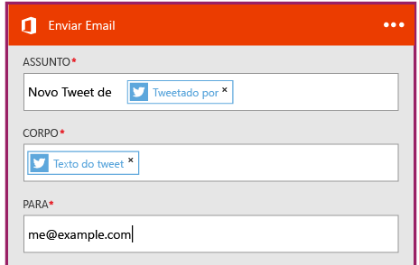

# Criar um novo aplicativo lógico conectando serviços SaaS
Este tópico demonstra como, em apenas alguns minutos, você pode começar a usar o [Aplicativo Lógico do Azure](app-service-logic-what-are-logic-apps.md). Vamos percorrer um fluxo de trabalho simples que permite enviar tweets interessantes ao seu email.

Para usar este cenário, você precisará de:

* Uma assinatura do Azure
* Uma conta do Twitter
* Uma caixa de correio do Outlook.com ou do Office 365 hospedada

## Criar um novo aplicativo lógico para enviar tweets por email
1. No [painel do portal do Azure](https://portal.azure.com), selecione **Novo**. 
2. Na barra de pesquisa, pesquise 'aplicativo lógico' e selecione **Aplicativo Lógico**. Você também pode selecionar **Novo**, **Web + Móvel** e selecione **Aplicativo Lógico**. 
3. Insira um nome para o aplicativo lógico, selecione um local e o grupo de recursos e selecione **Criar**.  Se você selecionar **Fixar no Painel** , o aplicativo lógico será aberto automaticamente depois de implantado.  
4. Depois de abrir o aplicativo lógico pela primeira vez, você poderá selecionar um modelo para começar.  Agora, clique em **Aplicativo Lógico em Branco** para compilá-lo do zero. 
5. O primeiro item que você precisa criar é o disparador.  Esse é o evento que iniciará o aplicativo lógico.  Pesquise **twitter** na caixa de pesquisa do gatilho e selecione-o.
6. Agora você digitará um termo de pesquisa para o disparo.  A **Frequência** e o **Intervalo** determinarão a frequência com que o aplicativo lógico verificará se há novos tweets (e retornará todos os tweets durante esse período de tempo).
    
7. Selecione o botão **Nova etapa** e escolha **Adicionar uma ação** ou **Adicionar uma condição**
8. Ao selecionar **Adicionar uma ação**, você pode pesquisar nos [conectores disponíveis](../connectors/apis-list.md) para escolher uma ação. Por exemplo, você pode selecionar **Outlook.com - Enviar Email** para enviar emails usando um endereço do outlook.com:  
    
9. Agora você precisa preencher os parâmetros para o email desejado:  
10. Por fim, você pode selecionar **Salvar** para ativar seu aplicativo lógico.

## Gerenciar seu aplicativo lógico após a criação
Agora seu aplicativo lógico está em execução. Ele verificará periodicamente se há tweets com o termo de pesquisa digitado. Quando encontrar um tweet correspondente, ele enviará um email. Por fim, você verá como desabilitar o aplicativo ou como está seu desempenho.

1. Vá para o [Portal do Azure](https://portal.azure.com)
2. Clique em **Procurar** no lado esquerdo da tela e selecione **Aplicativos Lógicos**.
3. Clique no novo aplicativo lógico que você acabou de criar para ver o status atual e as informações gerais.
4. Para editar o novo aplicativo lógico, clique em **Editar**.
5. Para desabilitar o aplicativo, clique em **Desabilitar** na barra de comandos.
6. Exiba históricos de execução e gatilho para monitorar quando o aplicativo lógico está em execução.  Você pode clicar em **Atualizar** para ver os dados mais recentes.

Em menos de 5 minutos, você configurou um aplicativo lógico simples e o colocou em execução na nuvem. Para saber mais sobre como usar os recursos de aplicativos lógicos, consulte [Usar os recursos de aplicativos lógicos]. Para saber mais sobre as definições de aplicativos lógicos, consulte [Criar definições de aplicativos lógicos](app-service-logic-author-definitions.md).

<!-- Shared links -->
[Azure portal]: https://portal.azure.com
[Usar os recursos de aplicativos lógicos]: app-service-logic-create-a-logic-app.md

<!--HONumber=Nov16_HO2-->

