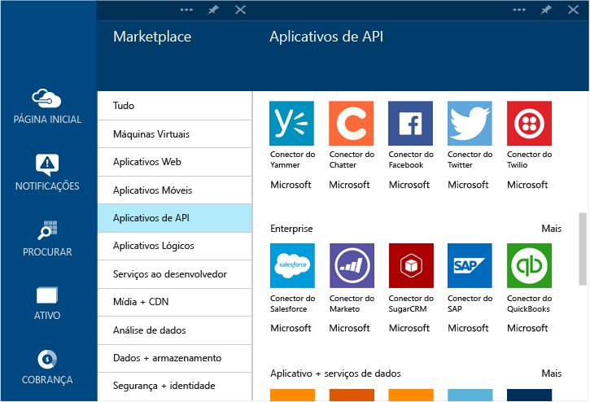

<properties 
	pageTitle="O que são aplicativos de API do BizTalk e conectores" 
	description="Saiba mais sobre Aplicativos de API, Conectores e Aplicativos de API do BizTalk" 
	services="app-service\logic" 
	documentationCenter="" 
	authors="MandiOhlinger" 
	manager="dwrede" 
	editor=""/>

<tags 
	ms.service="app-service-logic" 
	ms.workload="integration" 
	ms.tgt_pltfrm="na" 
	ms.devlang="na" 
	ms.topic="article" 
	ms.date="06/08/2015" 
	ms.author="mandia"/>

# O que são aplicativos de API do BizTalk e conectores

O produto de Serviços de Aplicativos do Azure é construído sobre um princípio de extensibilidade e conectividade comuns entre os Aplicativos da API. Um *Conector* é um tipo de Aplicativo de API que se concentra na conectividade. Conectores, como qualquer outro Aplicativo de API, são utilizados de aplicativos Web, aplicativos móveis e aplicativos lógicos. Os conectores tornam fácil conectar-se a serviços existentes e ajudam a gerenciar a autenticação, fornecem monitoramento, análise e muito mais.

Qualquer desenvolvedor pode criar seus próprios aplicativos de API e implantá-los em particular. No futuro, os desenvolvedores podem compartilhar e monetizar seus aplicativos de API personalizada criada por meio do Marketplace.

Para agilizar os desenvolvedores que criam soluções com Serviço de Aplicativo do Azure, a equipe do Azure adicionou vários conectores ao marketplace para atender a vários cenários comuns. Além disso, para estender o alcance do Serviço de Aplicativo para cenários de integração complexos e avançados, uma série de recursos Premium e BizTalk também está disponível.

No Serviço de Aplicativo do Azure, há diferentes "Níveis" de serviço disponíveis. Todos os níveis incluem todos os conectores e aplicativos de API, incluindo sua funcionalidade completa.

[Preços de Serviço de Aplicativo](http://azure.microsoft.com/pricing/details/app-service/) descreve esses níveis de serviços e também lista o que está incluído nesses níveis. As seções a seguir descrevem as diversas categorias de aplicativos de API do BizTalk e conectores.

## Conectores padrão
O Serviço de Aplicativo vem com um conjunto avançado de conectores que proporcionam uma maneira fácil de conectar os aplicativos Web, móveis e lógicos a alguns dos principais nomes em SaaS atuais, incluindo Office 365, SalesForce, Sugar CRM, OneDrive, DropBox, Marketo, Facebook e muito mais. Ele também inclui um conjunto de conectores para se comunicar com serviços externos usando FTP, SFTP, POP3/IMAP, SMTP e SOAP, o que é tão fácil quanto efetuar uma chamada HTTP.

## Conectores Premium 
Os conectores Premium estendem o alcance dos Serviços de Aplicativos ainda mais na empresa com conectividade para SAP, Oracle, DB2, Informix e WebSphere MQ.

## Serviços EDI e EAI
A criação de aplicativos críticos para os negócios exige mais do que apenas a conectividade. Baseado na base da plataforma de integração líder do setor da Microsoft - BizTalk Server - os aplicativos de API do BizTalk fornecem recursos de integração avançada que podem ser ajustados em aplicativos Web, móveis e de lógica com facilidade. Alguns desses recursos de integração incluem validação, extração, transformação, codificadores, gerenciamento de parceiros comerciais e suporte para formatos EDI como X12, EDIFACT e AS2.

## Regras
As regras de negócios encapsulam as políticas e as decisões que controlam processos de negócios. Normalmente, as regras são dinâmicas e mudam com o tempo por diferentes motivos, incluindo planos de negócios, regulamentos entre muitos outros. O recurso de Regras do BizTalk nos Serviços de Aplicativos permite desassociar essas políticas do código de aplicativo e simplificar e agilizar o processo de alteração.

## Lista de conectores e aplicativos de API
Consulte [Conectores e lista de aplicativos da API](app-service-logic-connectors-list.md) para obter uma lista completa dos conectores e API aplicativos presentes em cada categoria, incluindo conectores padrão, BizTalk EAI, conectores Premium etc.
 

<!---HONumber=62-->