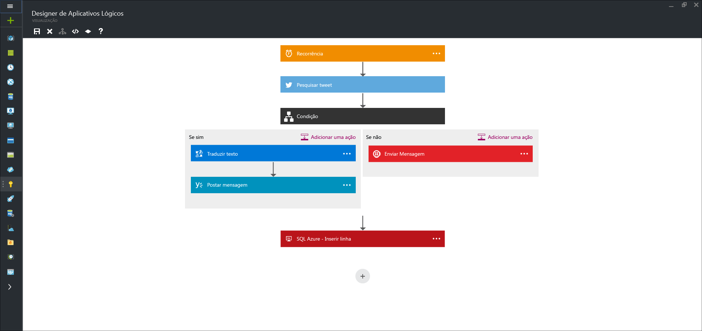

<properties 
	pageTitle="O que são aplicativos lógicos?" 
	description="Saiba mais sobre os aplicativos lógicos do Serviço de Aplicativo" 
	authors="kevinlam1" 
	manager="dwrede" 
	editor="" 
	services="app-service\logic" 
	documentationCenter=""/>

<tags
	ms.service="app-service-logic"
	ms.workload="na"
	ms.tgt_pltfrm="na"
	ms.devlang="na"
	ms.topic="get-started-article"
	ms.date="02/22/2016"
	ms.author="klam"/>

#O que são aplicativos lógicos?

| Referência rápida |
| --------------- |
| [Linguagem de definição de aplicativos lógicos](https://msdn.microsoft.com/library/azure/dn948512.aspx?f=255&MSPPError=-2147217396) |
| [Documentação da API gerenciada de Aplicativos Lógicos](https://azure.microsoft.com/documentation/articles/apis-list) |
| [Fórum de aplicativos lógicos](https://social.msdn.microsoft.com/Forums/pt-BR/home?forum=azurelogicapps) |

O Serviço de Aplicativo do Azure é uma PaaS (plataforma como serviço) totalmente gerenciada para desenvolvedores que torna mais fácil compilar aplicativos Web, móveis e de integração. Os aplicativos lógicos são uma parte desse pacote e permitem que qualquer usuário técnico ou desenvolvedor automatize a execução do processo de negócios e o fluxo de trabalho por meio de um designer visual fácil de usar.

O melhor de tudo é que os Aplicativos Lógicos podem ser combinados com [APIs Gerenciadas][managedapis] internas para ajudar a solucionar inclusive cenários de integração complicados com facilidade:

Você pode replicar automaticamente novos registros em seu Banco de Dados SQL e enviar para a recepção. Ou localizar automaticamente tweets negativos e enviá-los para um canal de margem de atraso.

##Por que aplicativos lógicos?

Aplicativos Lógicos permitem que os desenvolvedores projetem fluxos de trabalho iniciados de um gatilho e, em seguida, executem uma série de etapas. Cada etapa invoca uma API enquanto cuida com segurança da autenticação e das práticas recomendadas, como ponto de verificação e execução durável.

Se quiser automatizar qualquer processo de negócios (por exemplo, localizar tweets negativos e postar no canal de margem de atraso interna ou replicar novos registros de cliente no SQL assim que chegarem em seu sistema CRM), aplicativos lógicos tornam fácil integrar fontes de dados diferentes da nuvem para o local. Confira nossas [APIs gerenciadas][managedapis] para se inspirar e [comece][create] a usá-las agora para ver o que você pode fazer.

Além disso, com as nossas [APIs gerenciadas do BizTalk][biztalk], você pode dimensionar para desenvolver cenários de integração com o poder de um [mecanismo de regras][rules], [gerenciamento de parceiros comerciais][tpm] e muito mais.

- **Ferramentas de design fáceis de usar** - aplicativos lógicos podem ser projetados de ponta a ponta no navegador. Inicie com um gatilho - de um agendamento simples a sempre que aparecer um tweet exibida sobre a sua empresa. Então orquestre qualquer número de ações usando a galeria avançada de conectores.

- **Compor SaaS facilmente** - tarefas de composição uniformes fáceis de descrever são difíceis de implementar no código. Aplicativos lógicos tornam muito fácil se conectar a sistemas diferentes. Deseja criar uma tarefa no seu software CRM baseada na atividade de suas contas do Facebook ou do Twitter? Deseja conectar sua solução de marketing na nuvem ao seu sistema de cobrança local? Aplicativos lógicos são a maneira mais rápida e confiável de fornecer soluções para esses problemas.

- **Começo rápido com modelos** - para ajudá-lo a começar, fornecemos uma [galeria de modelos][templates] que permitem que você crie rapidamente algumas soluções comuns. De soluções avançadas do BizTalk a conectividade de SaaS simples, e até mesmo algumas que são apenas “para diversão” - a Galeria é a maneira mais rápida de compreender o poder dos aplicativos lógicos.

- **Extensibilidade embutida** - não encontra a API de que precisa? Os Aplicativos Lógicos são projetados para funcionar com aplicativos de API; você pode facilmente criar seu próprio aplicativo de API a ser usado como uma API personalizada. Crie um novo aplicativo apenas para você ou compartilhe e monetize no marketplace.

- **Potência real de integração** - inicie com facilidade e cresça conforme necessário. Aplicativos lógicos podem facilmente aproveitar o poder do BizTalk, a solução de integração da Microsoft líder do setor para habilitar os profissionais de integração a compilar as soluções de que precisam. Saiba mais sobre os [recursos do BizTalk fornecidos com os Aplicativos Lógicos][biztalk].

## Conceitos de aplicativo lógico

A seguir estão algumas das principais partes que compõem a experiência de aplicativos lógicos.

- **Fluxo de trabalho** - aplicativos lógicos proporcionam uma maneira gráfica de modelar seus processos de negócios como uma série de etapas ou um fluxo de trabalho.
- **APIs Gerenciadas** - seus aplicativos lógicos precisam de acesso a dados e a serviços. As APIs Gerenciadas são criadas especificamente para ajudar você a se conectar e a trabalhar com seus dados. Veja a lista de APIs disponíveis agora nas [APIs gerenciadas][managedapis].
- **Gatilhos** - algumas APIs Gerenciadas também podem atuar como um gatilho. Um gatilho inicia uma nova instância de um fluxo de trabalho com base em um evento específico, como a chegada de um email ou uma alteração em sua conta de Armazenamento do Azure.
-  **Ações** - cada etapa após o gatilho em um fluxo de trabalho é chamada de uma ação. Cada ação normalmente é mapeada para uma operação em seus aplicativos de API gerenciados ou personalizados.
- **BizTalk** - para obter cenários mais avançados de integração, os Aplicativos Lógicos incluem recursos do Biztalk. O BizTalk é a plataforma de integração da Microsoft líder do setor. Os aplicativos de API do BizTalk permitem que você inclua facilmente validação, transformação, regras e mais em seus fluxos de trabalho de aplicativo lógico. Saiba mais em [O que são Aplicativos de API do BizTalk][biztalk].

## Introdução

Para começar com aplicativos lógicos, siga o tutorial [Criar um aplicativo lógico][create].

Para obter mais informações a respeito da plataforma de Serviço de Aplicativo do Azure, consulte [Serviço de Aplicativo do Azure][appservice].

[biztalk]: app-service-logic-what-are-biztalk-api-apps.md
[appservice]: ../app-service/app-service-value-prop-what-is.md
[create]: app-service-logic-create-a-logic-app.md
[managedapis]: app-service-logic-connectors-list.md
[tpm]: app-service-logic-create-a-trading-partner-agreement.md
[rules]: app-service-logic-use-biztalk-rules.md
[templates]: app-service-logic-use-logic-app-templates.md

<!---HONumber=AcomDC_0224_2016-->