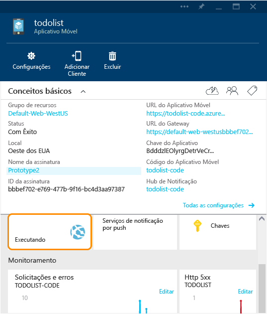
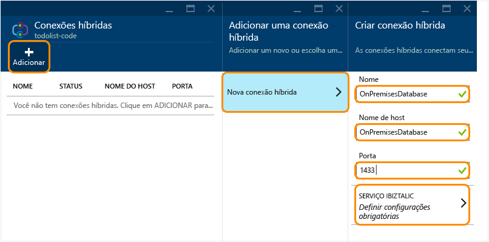
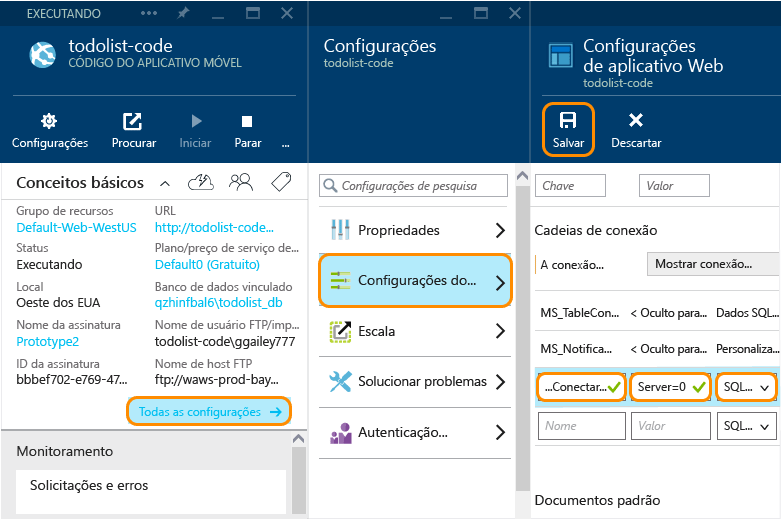

<properties 
	pageTitle="Conectar seu aplicativo móvel do Azure a um SQL Server local utilizando Conexões Híbridas" 
	description="Saiba como se conectar a um SQL Server local de um aplicativo móvel do Serviço de Aplicativo usando Conexões Híbridas" 
	services="app-service\mobile" 
	documentationCenter="" 
	authors="ggailey777" 
	manager="dwrede" 
	editor=""/>

<tags 
	ms.service="app-service-mobile" 
	ms.workload="mobile" 
	ms.tgt_pltfrm="na" 
	ms.devlang="multiple" 
	ms.topic="article" 
	ms.date="06/04/2015" 
	ms.author="glenga"/>

  
# Conectar-se a um SQL Server local por meio de aplicativos móveis usando Conexões Híbridas 

Quando sua empresa muda para nuvem, talvez não seja possível migrar todos os seus ativos para Azure imediatamente. As Conexões Híbridas permitem que os aplicativos móveis do Serviço de Aplicativo do Azure se conectem com segurança aos ativos locais. Dessa forma, você pode disponibilizar seus dados locais para os clientes móveis usando o Azure. Os ativos com suporte incluem qualquer recurso que seja executado em uma porta TCP estática, incluindo Microsoft SQL Server, MySQL, APIs da web HTTP e os serviços Web mais personalizados. As Conexões Híbridas utilizam a autorização de assinatura de acesso compartilhado (SAS) para proteger as conexões do seu serviço móvel e o Gerenciador de Conexões Híbridas local para a conexão híbrida. Para obter mais informações, consulte [Visão geral de Conexões Híbridas](../integration-hybrid-connection-overview.md).

Neste tutorial, você aprenderá a modificar um back-end de aplicativos móveis do .NET para usar um banco de dados SQL Server local em vez do Banco de Dados SQL Azure padrão provisionado com seu serviço.

##Pré-requisitos##

Este tutorial exige que você tenha o seguinte:

- **Um back-end de aplicativo móvel existente**  Siga o [tutorial de início rápido](app-service-mobile-dotnet-backend-windows-store-dotnet-get-started-preview.md) para criar e baixar um novo back-end de aplicativo móvel do .NET no [Portal do Azure].

[AZURE.INCLUDE [hybrid-connections-prerequisites](../../includes/hybrid-connections-prerequisites.md)]

## Instalar o SQL Server Express, habilitar TCP/IP e criar um banco de dados SQL Server local

[AZURE.INCLUDE [hybrid-connections-create-on-premises-database](../../includes/hybrid-connections-create-on-premises-database.md)]

## Criar uma Conexão Híbrida

Você precisa criar uma nova conexão híbrida e o serviço BizTalk para a parte de código do seu back-end de aplicativo móvel, que é um aplicativo Web.

1. No [Portal do Azure], navegue até o aplicativo móvel e clique no botão de back-end de aplicativo Web.

	

	Ele o leva até o aplicativo Web que implementa o código de back-end para seu aplicativo móvel, que é o nome do seu aplicativo móvel, seguido por `-code`.

2. Role para baixo na folha do aplicativo Web e clique em **Conexões híbridas**.
	
	
	
2. Na folha Conexões híbridas, clique em **Adicionar** e em **Nova conexão híbrida**.
	
3. Na folha **Criar conexão híbrida**, forneça um **Nome** e **Nome de Host** para sua conexão híbrida e configure a **Porta** como `1433`.
	
	

4. Clique em **Serviço BizTalk** e digite um nome para o serviço BizTalk e clique em **OK** duas vezes.

	Este tutorial usa **mobile1**. Você precisará fornecer um nome exclusivo para seu novo Serviço BizTalk.

	Após a conclusão do processo, a área **Notificações** piscará **SUCESSO** em verde, e a folha **Conexão híbrida** mostrará a nova conexão híbrida com o status **Não conectado**.
	
	
	
Nesse ponto, você concluiu uma parte importante da infraestrutura de conexão híbrida de nuvem. Em seguida, você criará uma parte local correspondente.

## Instalar o Gerenciador de Conexões Híbridas local para completar a conexão

[AZURE.INCLUDE [app-service-hybrid-connections-manager-install](../../includes/app-service-hybrid-connections-manager-install.md)]

## Configurar o projeto de back-end de aplicativo móvel para se conectar ao banco de dados do SQL Server

Nesta etapa, você define uma cadeia de conexão do banco de dados local e modifica o back-end de aplicativo móvel para usar essa conexão.

1. No Visual Studio 2013, abra o projeto que define seu back-end de aplicativo móvel. 

	Para saber como baixar seu projeto de back-end do .NET, consulte o [tutorial de início rápido](app-service-mobile-dotnet-backend-windows-store-dotnet-get-started-preview.md).

2. No Gerenciador de Soluções, abra o arquivo Web.config, localize a seção **connectionStrings** e adicione uma nova entrada do SqlClient semelhante à seguinte, que aponta para o banco de dados do SQL Server local:
	
	    <add name="OnPremisesDBConnection" 
         connectionString="Data Source=OnPremisesServer,1433;
         Initial Catalog=OnPremisesDB;
         User ID=HybridConnectionLogin;
         Password=<**secure_password**>;
         MultipleActiveResultSets=True"
         providerName="System.Data.SqlClient" />

	Lembre-se de substituir `<**secure_password**>` na cadeia pela senha que você criou para *HbyridConnectionLogin*.
	
3. Clique em **Salvar**, no Visual Studio, para salvar o arquivo Web.config.

	> [AZURE.NOTE]Essa configuração de conexão é usada quando a execução ocorre no computador local. Quando a execução é realizada no Azure, essa configuração é substituída pela configuração de conexão definida no portal.

4. Expanda a pasta **Modelos** e abra o arquivo de modelo de dados, que termina em *Context.cs*.

6. Modifique o construtor de instância **DbContext** para passar o valor `OnPremisesDBConnection` para o construtor **DbContext** base, como o trecho de código a seguir:

        public class hybridService1Context : DbContext
        {
            public hybridService1Context()
                : base("OnPremisesDBConnection")
            {
            }
        }

	O serviço usará a nova conexão para o banco de dados do SQL Server.
 
##Testar a conexão de banco de dados no local

Antes de publicar no Azure e usar a conexão híbrida, é uma boa ideia verificar se a conexão de banco de dados funciona quando executada localmente. Dessa forma, você pode diagnosticar e corrigir problemas de conexão com mais facilidade antes de publicar novamente e começar a usar a conexão híbrida.

[AZURE.INCLUDE [app-service-mobile-dotnet-backend-test-local-service-api-documentation](../../includes/app-service-mobile-dotnet-backend-test-local-service-api-documentation.md)]

## Atualize o Azure para usar a cadeia de conexão local

Agora que você verificou a conexão de banco de dados, é necessário adicionar uma configuração de aplicativo para essa nova cadeia de conexão, de modo que possa ser usada no Azure.

1. No [Portal do Azure] no código do back-end de aplicativo Web do seu aplicativo móvel, clique em **Todas as configurações** e em **Configurações do aplicativo**. 

3. Na folha **Configurações do aplicativo Web**, role para baixo até **Cadeias de conexão** e adicione uma nova cadeia de conexão do **SQL Server** chamada `OnPremisesDBConnection`, com um valor como `Server=OnPremisesServer,1433;Database=OnPremisesDB;User ID=HybridConnectionsLogin;Password=<**secure_password**>`.

	Substitua `<**secure_password**>` pela senha segura do seu banco de dados local.

	

2. Pressione **Salvar** para salvar a conexão híbrida e a cadeia de conexão que acabaram de ser criadas.

## Publicar e testar o back-end de aplicativo móvel no Azure 

Por fim, você precisa publicar o back-end de aplicativo móvel no Azure e verificar se ele está usando a conexão híbrida para armazenar dados no banco de dados local.

3. No Visual Studio, clique com o botão direito do mouse no projeto, clique em **Publicar** e, em **Publicar para a Web**, clique em **Sites do Microsoft Azure**. 

	Em vez de usar o Visual Studio, você também pode [usar Git para publicar seu back-end](mobile-services-dotnet-backend-store-code-source-control.md).

2. Entre com as credenciais do Azure e selecione seu serviço em **Selecionar Sites Existentes**.

	O Visual Studio baixa suas configurações de publicação diretamente do Azure.

3. Por fim, clique em **Publicar**.

	Após a publicação, o serviço reiniciará e a página inicial do back-end será exibida.

4. Usando o botão **Experimente agora** na página inicial ou usando um aplicativo cliente conectado ao seu aplicativo móvel, chame algumas operações que geram alterações de banco de dados.

	>[AZURE.NOTE]Quando você usar o botão **Experimente agora** para abrir as páginas de API de Ajuda, lembre-se de fornecer a chave de aplicativo como a senha (com um nome de usuário em branco).

4. No SQL Server Management Studio, conecte-se à instância do SQL Server, abra o Pesquisador de Objetos, expanda o banco de dados **OnPremisesDB** e expanda **Tabelas**.

5. Clique com o botão direito na tabela **hybridService1.TodoItems** e escolha **Selecionar as 1000 linhas principais** para exibir os resultados.

	Observe que as alterações geradas no aplicativo cliente foram salvas pelo back-end de aplicativo móvel no banco de dados local usando a conexão híbrida.

##Consulte também##
 
+ [Site de Conexões Híbridas](../../services/biztalk-services/)
+ [Visão geral de Conexões Híbridas](../integration-hybrid-connection-overview.md)
+ [Serviços BizTalk: guias Painel, Monitor, Escala, Configurar e Conexão Híbrida](../biztalk-dashboard-monitor-scale-tabs.md)
+ [Como fazer alterações no modelo de dados para um serviço móvel de back-end do .NET](../mobile-services-dotnet-backend-how-to-use-code-first-migrations.md)

<!-- IMAGES -->

<!-- Links -->
[Portal do Azure]: https://portal.azure.com/
[Azure Management Portal]: http://go.microsoft.com/fwlink/p/?linkid=213885
[Get started with Mobile Services]: ../mobile-services-dotnet-backend-windows-store-dotnet-get-started.md
 

<!---HONumber=62-->