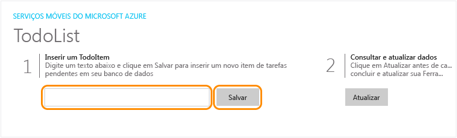
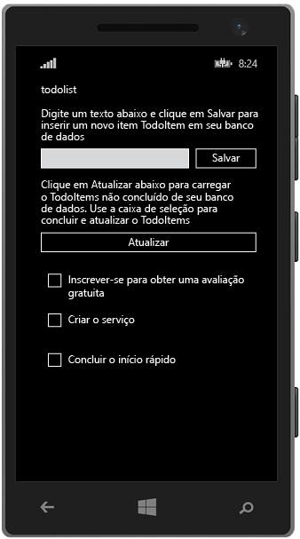

<properties
	pageTitle="Criar um aplicativo universal Windows Runtime 8.1 nos Aplicativos Móveis do Azure"
	description="Siga este tutorial para começar a usar os back-ends de aplicativo móvel do Azure para desenvolvimento da Windows Store em C#, VB ou JavaScript."
	services="app-service\mobile"
	documentationCenter="windows"
	authors="ggailey777"
	manager="dwrede"
	editor=""/>

<tags
	ms.service="app-service-mobile"
	ms.workload="mobile"
	ms.tgt_pltfrm="mobile-windows"
	ms.devlang="dotnet"
	ms.topic="hero-article"
	ms.date="08/14/2015"
	ms.author="glenga"/>

#Criar um aplicativo do Windows

[AZURE.INCLUDE [app-service-mobile-selector-get-started-preview](../../includes/app-service-mobile-selector-get-started-preview.md)]&nbsp;[AZURE.INCLUDE [app-service-mobile-note-mobile-services-preview](../../includes/app-service-mobile-note-mobile-services-preview.md)]

##Visão geral

Este tutorial mostra como adicionar um serviço de back-end baseado em nuvem a um aplicativo universal do Windows Runtime 8.1 usando um back-end de aplicativo móvel do Azure. Soluções de aplicativos universais do Windows incluem projetos para a Windows Store 8.1 e a Loja do Windows Phone 8.1, e um projeto compartilhado comum.

[AZURE.INCLUDE [app-service-mobile-windows-universal-get-started-preview](../../includes/app-service-mobile-windows-universal-get-started-preview.md)]

##Pré-requisitos

Para concluir este tutorial, você precisará do seguinte:

* Uma conta ativa do Azure. Se você não tem uma conta, você pode se inscrever para uma avaliação do Azure e obter até 10 aplicativos móveis gratuitos que você pode continuar a usar mesmo após o fim do seu período de avaliação. Para obter detalhes, consulte [Avaliação gratuita do Azure](http://azure.microsoft.com/pricing/free-trial/).

* [Visual Studio Community 2013] ou uma versão posterior.

>[AZURE.NOTE]Se você deseja começar com o serviço de aplicativo do Azure antes de inscrever-se em uma conta do Azure, vá até [Experimentar o serviço de aplicativo](http://go.microsoft.com/fwlink/?LinkId=523751&appServiceName=mobile), onde você pode criar imediatamente um aplicativo móvel inicial de curta duração no serviço de aplicativo. Nenhum cartão de crédito é exigido, sem compromissos.

##Criar um novo back-end de Aplicativo Móvel do Azure

[AZURE.INCLUDE [app-service-mobile-dotnet-backend-create-new-service-preview](../../includes/app-service-mobile-dotnet-backend-create-new-service-preview.md)]

## Baixar o projeto de servidor

1. No [Portal do Azure], clique em**Procurar Tudo** > **Aplicativos Web** e, em seguida, clique no back-end de Aplicativo Móvel que você acabou de criar. 

2. No back-end de Aplicativo Móvel, clique em **Todas as Configurações** e, em **Aplicativo Móvel**, clique **Início rápido** > **Windows (C#)**.

3. Em **Baixe e execute seu projeto de servidor** na **Criar um novo aplicativo**, clique em **Baixar**, extraia os arquivos compactados do projeto em seu computador local e abra a solução no Visual Studio.

4. Compile o projeto para restaurar os pacotes do NuGet.

##Publicar o projeto de servidor no Azure

[AZURE.INCLUDE [app-service-mobile-dotnet-backend-publish-service-preview](../../includes/app-service-mobile-dotnet-backend-publish-service-preview.md)]

##Baixe e execute o projeto do cliente

Depois de criar seu back-end de aplicativo móvel, você poderá seguir um quickstart fácil no Portal do Azure para criar um novo aplicativo ou modificar um aplicativo existente para conectar-se ao back-end de aplicativo móvel.

Nesta seção você baixa um projeto de modelo de aplicativo Windows universal que é personalizado para se conectar ao back-end do Aplicativo Móvel do Azure.

1. De volta à folha para o back-end do Aplicativo Móvel, clique em **Todas as Configurações** e, em **Aplicativo Móvel**, clique **Início rápido** > **Windows (C#)**. 

2.  Em **Baixe e execute seu projeto do Windows** na **Criar um novo aplicativo**, clique em **Baixar**, extraia os arquivos compactados do projeto em seu computador local.
  
3. (Opcional) Adicione o projeto de aplicativo Windows universal à solução com o projeto do servidor. Isso torna mais fácil depurar e testar o aplicativo e o back-end na mesma solução do Visual Studio, se você optar por fazer isso.

4. Com o aplicativo da Windows Store como projeto de inicialização, pressione a tecla F5 para recompilar o projeto e iniciar o aplicativo da Windows Store.

5. No aplicativo, digite um texto significativo, como *Concluir o tutorial*, na caixa de texto **Inserir um TodoItem** e, em seguida, clique em **Salvar**.

	

	Isso envia uma solicitação de POST para o novo back-end de aplicativo móvel hospedado no Azure.

6. Parar a depuração, clique com o botão direito no projeto `<your app name>.WindowsPhone`, clique em **Definir como Projeto de Inicialização**, pressione F5 novamente.

	

	Observe que os dados salvos da etapa anterior são carregados por meio do aplicativo móvel após o aplicativo do Windows ser iniciado.

##Próximas etapas

* [Adicionar autenticação ao seu aplicativo](app-service-mobile-dotnet-backend-windows-store-dotnet-get-started-users-preview.md)  Saiba como autenticar usuários de seu aplicativo com um provedor de identidade.

* [Adicionar notificações por push ao seu aplicativo](app-service-mobile-dotnet-backend-windows-store-dotnet-get-started-push-preview.md)  Saiba como enviar uma notificação por push bem básica ao seu aplicativo.

<!-- Anchors. -->
<!-- Images. -->
<!-- URLs. -->
[Get started with authentication]: app-service-mobile-dotnet-backend-windows-store-dotnet-get-started-users-preview.md
[Mobile App SDK]: http://go.microsoft.com/fwlink/?LinkId=257545
[Portal do Azure]: https://portal.azure.com/

[Visual Studio Community 2013]: https://go.microsoft.com/fwLink/p/?LinkID=534203
 

<!---HONumber=August15_HO8-->