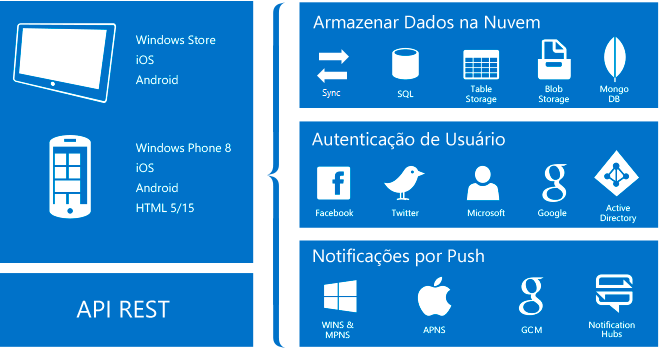

# O que são os Aplicativos Móveis?
O Serviço de Aplicativo do Azure é uma oferta de [plataforma como serviço](https://azure.microsoft.com/overview/what-is-paas/) (PaaS) totalmente gerenciada para desenvolvedores profissionais que traz um conjunto rico de recursos para cenários Web, móvel e de integração. Os *Aplicativos Móveis* no *Serviço de Aplicativo do Azure* oferecem uma plataforma de desenvolvimento de aplicativos móveis altamente escalonável, disponível globalmente para os desenvolvedores corporativos e integradores de sistema e que traz um conjunto rico de recursos para desenvolvedores de aplicativos móveis.

## Por que os aplicativos móveis?
Os *Aplicativos Móveis* no *Serviço de Aplicativo do Azure* oferecem uma plataforma de desenvolvimento de aplicativos móveis altamente escalonável, disponível globalmente para os desenvolvedores corporativos e integradores de sistema e que traz um conjunto rico de recursos para desenvolvedores de aplicativos móveis. Com Aplicativos Móveis, você pode:

* **Criar aplicativos nativos e multiplataforma** – quer você esteja criando aplicativos nativos iOS, Android e Windows ou aplicativos Xamarin ou Cordova (Phonegap) multiplataforma, você pode aproveitar o Serviço de Aplicativo usando SDKs nativos.
* **Conectar-se a seus sistemas corporativos** - com Aplicativos Móveis, você pode adicionar logon corporativo em minutos e conectar-se aos recursos locais ou de nuvem de sua empresa.
* **Criar aplicativos prontos para uso offline com sincronização de dados** – torne sua força de trabalho móvel produtiva por meio da criação de aplicativos que trabalham offline e use Aplicativos Móveis para sincronizar dados em segundo plano quando houver conectividade com qualquer uma das suas origens de dados corporativos ou APIs SaaS.
* **Notificações por push para milhões em segundos** - atraia seus clientes com notificações instantâneas de envio por push em qualquer dispositivo, personalizadas segundo suas necessidades e enviadas na hora certa.

## Recursos de aplicativo móvel
Os recursos a seguir são importantes para o desenvolvimento móvel habilitado para nuvem:

* **Autenticação e Autorização** – selecione em uma lista crescente de provedores de identidade, incluindo o Azure Active Directory para autenticação corporativa, além de provedores sociais, como o Facebook, o Google, o Twitter e a Conta da Microsoft.  Os Aplicativos Móveis do Azure fornecem um serviço OAuth 2.0 para cada provedor.  Você também pode integrar o SDK do provedor de identidade à funcionalidade específica do provedor.

  Descubra mais sobre os nossos [recursos de autenticação].
* **Acesso a Dados** – os Aplicativos Móveis do Azure fornecem uma fonte de dados OData v3 compatível com dispositivos móveis vinculada ao SQL Azure ou a um SQL Server local.  Esse serviço pode ser baseado no Entity Framework, permitindo que você integre facilmente com outros provedores de dados NoSQL e SQL, incluindo o [Armazenamento de Tabelas do Azure], o MongoDB, o [DocumentDB] e os provedores de API SaaS, como o Office 365 e o Salesforce.com.
* **Sincronização Offline** – nossos SDKs de Cliente facilitam a criação de aplicativos móveis robustos e responsivos que operem com um conjunto de dados offline que possam ser sincronizados automaticamente com os dados de back-end, incluindo o suporte à resolução de conflitos.

  Descubra mais sobre nossos [recursos de dados].
* **Notificações por Push** – nossos SDKs de Cliente se integram perfeitamente aos recursos de registro de Hubs de Notificação do Azure, permitindo que você envie notificações por push para milhões de usuários simultaneamente.

  Descubra mais sobre os nossos [recursos de notificação por push].
* **SDKs de Cliente** – fornecemos um conjunto completo de SDKs de Cliente que abrangem o desenvolvimento nativo ([iOS], [Android] e [Windows]), desenvolvimento de plataforma cruzada ([Xamarin para iOS e Android], [Formulários do Xamarin]) e o desenvolvimento de aplicativos híbridos ([Apache Cordova]).  Cada SDK de cliente está disponível com uma licença MIT e é software livre.

## Recursos do Serviço de Aplicativo do Azure.
Os seguintes recursos de plataforma são geralmente úteis para sites de produção móvel.

* **Dimensionamento automático** - o Serviço de Aplicativo permite que você redimensione rapidamente aumentando ou reduzindo para lidar com qualquer carga de cliente em entrada. Selecionar o número e o tamanho das VMs manualmente ou configurar o dimensionamento automático para dimensionar seu back-end de aplicativo móvel com base na carga ou a agenda.

  Descubra mais sobre o [dimensionamento automático].
* **Ambientes de Preparo** – o Serviço de Aplicativo pode executar várias versões do seu site, permitindo que você execute um teste A/B, um teste em produção como parte de um plano de DevOps maior e o preparo de um novo back-end.

  Descubra mais sobre [ambientes de preparo].
* **Implantação Contínua** – o Serviço de Aplicativo pode integrar sistemas SCM comuns, permitindo que você implante automaticamente uma nova versão do seu back-end por push para uma ramificação de seu sistema SCM.

  Descubra mais sobre [opções de implantação].
* **Rede Virtual** – o Serviço de Aplicativo pode se conectar a recursos locais usando a rede virtual, o ExpressRoute ou conexões híbridas.

  Descubra mais sobre as [conexões híbridas], as [redes virtuais] e o [ExpressRoute].
* **Ambientes Isolados/Dedicados** – o Serviço de Aplicativo pode ser executado em um ambiente totalmente isolado e dedicado para executar com segurança aplicativos do Serviço de Aplicativo do Azure em alta escala.  Isso é ideal para cargas de trabalho de aplicativos que exijam uma escala muito alta, isolamento ou acesso seguro à rede.

  Descubra mais sobre os [Ambientes do Serviço de Aplicativo].

## Introdução
Para começar com aplicativos móveis, siga o tutorial [Introdução] .  Isso abordará os conceitos básicos da produção de um back-end móvel e de um cliente à sua escolha, depois a integração de autenticação, da sincronização offline e de notificações por push.  Você pode seguir o tutorial [Introdução] várias vezes - uma vez para cada aplicativo cliente.

Para saber mais sobre aplicativos móveis do Azure, examine o nosso [mapa de aprendizagem].
Para obter mais informações a respeito da plataforma de Serviço de Aplicativo do Azure, confira [Serviço de Aplicativo do Azure].

> [!NOTE]
> Se você deseja começar com o Serviço de Aplicativo do Azure antes de se inscrever em uma conta do Azure, vá até [Experimentar o Serviço de Aplicativo](https://azure.microsoft.com/try/app-service/mobile/), em que você pode criar imediatamente um aplicativo Web inicial de curta duração no Serviço de Aplicativo. Nenhum cartão de crédito é exigido, sem compromissos.
>
>

<!-- URLs. -->
[Migrate your Mobile Service to App Service]: app-service-mobile-migrating-from-mobile-services.md
[Serviço de Aplicativo do Azure]: ../app-service/app-service-value-prop-what-is.md
[Introdução]: app-service-mobile-ios-get-started.md
[Armazenamento de Tabelas do Azure]: ../storage/storage-dotnet-how-to-use-tables.md
[DocumentDB]: ../documentdb/documentdb-get-started.md
[recursos de autenticação]: ./app-service-mobile-auth.md
[recursos de dados]: ./app-service-mobile-offline-data-sync.md
[recursos de notificação por push]: ../notification-hubs/notification-hubs-push-notification-overview.md
[iOS]: ./app-service-mobile-ios-how-to-use-client-library.md
[Android]: ./app-service-mobile-android-how-to-use-client-library.md
[Windows]: ./app-service-mobile-dotnet-how-to-use-client-library.md
[Xamarin para iOS e Android]: ./app-service-mobile-dotnet-how-to-use-client-library.md
[Formulários do Xamarin]: ./app-service-mobile-xamarin-forms-get-started.md
[Apache Cordova]: ./app-service-mobile-cordova-how-to-use-client-library.md
[dimensionamento automático]: ../app-service-web/web-sites-scale.md
[ambientes de preparo]: ../app-service-web/web-sites-staged-publishing.md
[opções de implantação]: ../app-service-web/web-sites-deploy.md
[conexões híbridas]: ../app-service-web/web-sites-hybrid-connection-get-started.md
[redes virtuais]: ../app-service-web/web-sites-integrate-with-vnet.md
[ExpressRoute]: ../app-service-web/app-service-app-service-environment-network-configuration-expressroute.md
[Ambientes do Serviço de Aplicativo]: ../app-service-web/app-service-app-service-environment-intro.md
[mapa de aprendizagem]: https://azure.microsoft.com/en-us/documentation/learning-paths/appservice-mobileapps/

