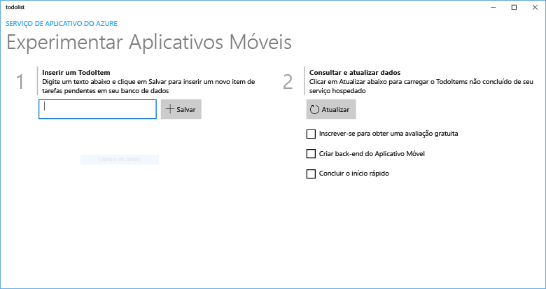

# Criar um aplicativo do Windows com um back-end do Azure

[!INCLUDE [app-service-mobile-selector-get-started](../../includes/app-service-mobile-selector-get-started.md)]

## Visão geral

Este tutorial mostra como adicionar um serviço de back-end baseado na nuvem a um aplicativo UWP (Plataforma Universal do Windows). Para saber mais, confira [O que são Aplicativos Móveis](app-service-mobile-value-prop.md). A seguir, há capturas de tela do aplicativo concluído:

A conclusão desse tutorial é um pré-requisito para todos os outros tutoriais de Aplicativos Móveis para aplicativos UWP.

## Pré-requisitos

Para concluir este tutorial, você precisará do seguinte:

* Uma conta ativa do Azure. Se você não tem uma conta, você pode se inscrever para uma avaliação do Azure e obter até 10 aplicativos móveis gratuitos que você pode continuar a usar mesmo após o fim do seu período de avaliação. Para obter detalhes, consulte [Avaliação gratuita do Azure](https://azure.microsoft.com/pricing/free-trial/).
* Windows 10.
* [Visual Studio Community 2017].
* Familiaridade com o desenvolvimento de aplicativos UWP. Visite a [documentação do UWP](https://docs.microsoft.com/windows/uwp/) para saber como [se preparar](https://docs.microsoft.com/windows/uwp/get-started/get-set-up) para criar aplicativos UWP.

## Criar um novo back-end de aplicativo móvel do Azure

Siga estas etapas para criar um novo back-end de aplicativo móvel.

[!INCLUDE [app-service-mobile-dotnet-backend-create-new-service](../../includes/app-service-mobile-dotnet-backend-create-new-service.md)]

Você acabou de provisionar um back-end do aplicativo móvel do Azure que pode ser usado pelos aplicativos móveis clientes. Em seguida, você baixará um projeto do servidor para um back-end simples da "lista de tarefas" e o publicará no Azure.

## Configurar o projeto de servidor

[!INCLUDE [app-service-mobile-configure-new-backend.md](../../includes/app-service-mobile-configure-new-backend.md)]

## Baixe e execute o projeto do cliente

Quando você tiver configurado o back-end do Aplicativo Móvel, poderá criar um novo aplicativo cliente ou modificar um aplicativo existente para se conectar ao Azure. Nesta seção, você faz o download de um exemplo de projeto de aplicativo UWP personalizado para se conectar ao back-end do Aplicativo Móvel.

1. De volta à folha **Início rápido** do back-end do Aplicativo Móvel, clique em **Criar um novo aplicativo** > **Baixar** e extraia os arquivos de projeto compactados para o computador local.

    

2. Abra o projeto UWP e pressione a tecla F5 para implantar e executar o aplicativo.
3. No aplicativo, digite um texto significativo, como *Concluir o tutorial*, na caixa de texto **Inserir um TodoItem** e clique em **Salvar**.

    

    Isso envia uma solicitação POST para o novo back-end de aplicativo móvel hospedado no Azure.

> [!TIP]
> Adicione o projeto de aplicativo UWP à mesma solução que o projeto de servidor, se você estiver usando o back-end .NET. Isso torna mais fácil depurar e testar o aplicativo e o back-end na mesma solução do Visual Studio. Para adicionar um projeto de aplicativo UWP à solução de back-end, você deve estar usando o Visual Studio 2017.

## Próximas etapas

* [Adicionar autenticação ao seu aplicativo](app-service-mobile-windows-store-dotnet-get-started-users.md)  
   Saiba como autenticar usuários de seu aplicativo com um provedor de identidade.
* [Adicionar notificações por push ao aplicativo](app-service-mobile-windows-store-dotnet-get-started-push.md)  
   Saiba como adicionar suporte a notificações por push ao aplicativo e configurar o back-end do Aplicativo Móvel para usar os Hubs de Notificação do Azure para enviar notificações por push.
* [Habilitar sincronização offline para seu aplicativo](app-service-mobile-windows-store-dotnet-get-started-offline-data.md)  
  Saiba como adicionar suporte offline ao seu aplicativo usando um back-end de Aplicativo Móvel. Sincronização offline permite que os usuários finais interajam com um aplicativo móvel, &mdash;exibindo, adicionando ou modificando dados&mdash;, mesmo quando não há conexão de rede.

<!-- Anchors. -->
<!-- Images. -->
<!-- URLs. -->
[Mobile App SDK]: https://go.microsoft.com/fwlink/?LinkId=257545
[Azure portal]: https://portal.azure.com/
[Visual Studio Community 2017]: https://go.microsoft.com/fwLink/p/?LinkID=534203
